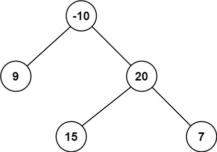
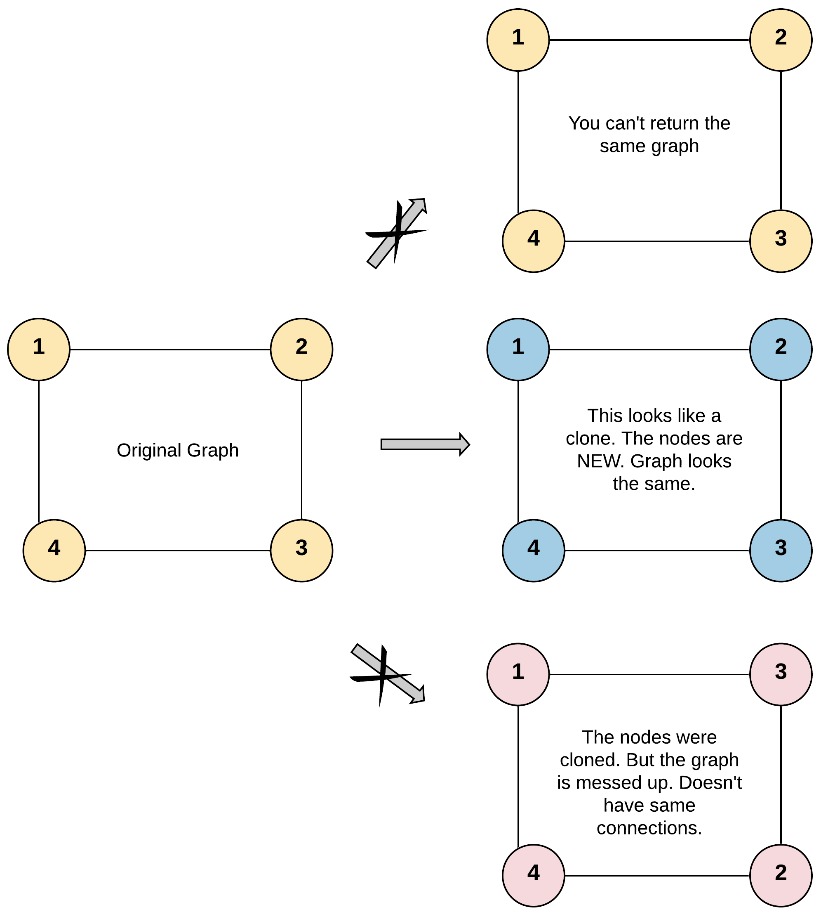
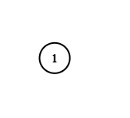
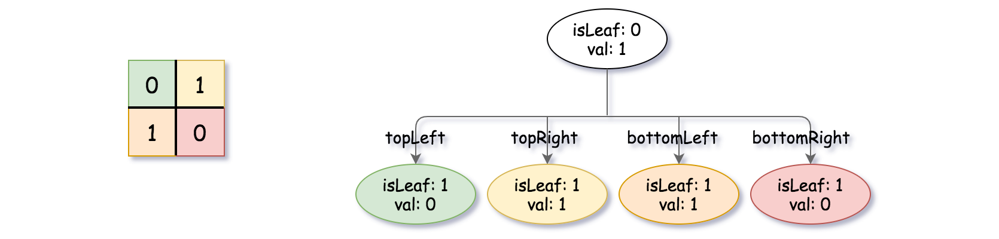

# 数组 / 字符串

## 88. 合并两个有序数组

https://leetcode.cn/problems/merge-sorted-array/description/?envType=study-plan-v2&envId=top-interview-150

给你两个按 非递减顺序 排列的整数数组 nums1 和 nums2，另有两个整数 m 和 n ，分别表示 nums1 和 nums2 中的元素数目。

请你 合并 nums2 到 nums1 中，使合并后的数组同样按 非递减顺序 排列。

注意：最终，合并后数组不应由函数返回，而是存储在数组 nums1 中。为了应对这种情况，nums1 的初始长度为 m + n，其中前 m
个元素表示应合并的元素，后 n 个元素为 0 ，应忽略。nums2 的长度为 n 。

示例 1：

输入：nums1 = [1,2,3,0,0,0], m = 3, nums2 = [2,5,6], n = 3

输出：[1,2,2,3,5,6]

解释：需要合并 [1,2,3] 和 [2,5,6] 。
合并结果是 [1,2,2,3,5,6] ，其中斜体加粗标注的为 nums1 中的元素。

示例 2：

输入：nums1 = [1], m = 1, nums2 = [], n = 0

输出：[1]

解释：需要合并 [1] 和 [] 。
合并结果是 [1] 。

示例 3：

输入：nums1 = [0], m = 0, nums2 = [1], n = 1

输出：[1]

解释：需要合并的数组是 [] 和 [1] 。
合并结果是 [1] 。
注意，因为 m = 0 ，所以 nums1 中没有元素。nums1 中仅存的 0 仅仅是为了确保合并结果可以顺利存放到 nums1 中。

提示：

- nums1.length == m + n
- nums2.length == n
- 0 <= m, n <= 200
- 1 <= m + n <= 200
- -109 <= nums1[i], nums2[j] <= 109

进阶：你可以设计实现一个时间复杂度为 O(m + n) 的算法解决此问题吗？


```java
class Solution {
    public void merge(int[] nums1, int m, int[] nums2, int n) {
        int i = m + n - 1;
        while (n > 0) {
            if (m > 0 && (nums1[m - 1] > nums2[n - 1])) {
                nums1[i] = nums1[m - 1];
                m--;
            } else {
                nums1[i] = nums2[n - 1];
                n--;
            }
            i--;
        }
    }
}
```

## 27. 移除元素

https://leetcode.cn/problems/remove-element/description/?envType=study-plan-v2&envId=top-interview-150

给你一个数组 nums 和一个值 val，你需要 原地 移除所有数值等于 val 的元素。元素的顺序可能发生改变。然后返回 nums 中与 val
不同的元素的数量。

假设 nums 中不等于 val 的元素数量为 k，要通过此题，您需要执行以下操作：

更改 nums 数组，使 nums 的前 k 个元素包含不等于 val 的元素。nums 的其余元素和 nums 的大小并不重要。
返回 k。

用户评测：

评测机将使用以下代码测试您的解决方案：

```java
int[] nums = [...]; // 输入数组
int val = ...; // 要移除的值
int[] expectedNums = [...]; // 长度正确的预期答案。
// 它以不等于 val 的值排序。

int k = removeElement(nums, val); // 调用你的实现

assert k ==expectedNums.length;

sort(nums, 0,k); // 排序 nums 的前 k 个元素
for(
int i = 0;
i<actualLength;i++){
        assert nums[i]==expectedNums[i];
        }
```

如果所有的断言都通过，你的解决方案将会 通过。

示例 1：

输入：nums = [3,2,2,3], val = 3

输出：2, nums = [2,2,_,_]

解释：你的函数函数应该返回 k = 2, 并且 nums 中的前两个元素均为 2。
你在返回的 k 个元素之外留下了什么并不重要（因此它们并不计入评测）。

示例 2：

输入：nums = [0,1,2,2,3,0,4,2], val = 2

输出：5, nums = [0,1,4,0,3,_,_,_]

解释：你的函数应该返回 k = 5，并且 nums 中的前五个元素为 0,0,1,3,4。
注意这五个元素可以任意顺序返回。
你在返回的 k 个元素之外留下了什么并不重要（因此它们并不计入评测）。

提示：

- 0 <= nums.length <= 100
- 0 <= nums[i] <= 50
- 0 <= val <= 100


```java
class Solution {
    public int removeElement(int[] nums, int val) {
        int left = 0;
        int right = nums.length;
        while (left < right) {
            if (nums[left] == val) {
                nums[left] = nums[right - 1];
                right--;
            } else {
                left++;
            }
        }
        return left;
    }
}
```

## 26. 删除有序数组中的重复项

https://leetcode.cn/problems/remove-duplicates-from-sorted-array/description/?envType=study-plan-v2&envId=top-interview-150

给你一个 非严格递增排列 的数组 nums ，请你 原地 删除重复出现的元素，使每个元素 只出现一次 ，返回删除后数组的新长度。元素的
相对顺序 应该保持 一致 。然后返回 nums 中唯一元素的个数。

考虑 nums 的唯一元素的数量为 k ，你需要做以下事情确保你的题解可以被通过：

更改数组 nums ，使 nums 的前 k 个元素包含唯一元素，并按照它们最初在 nums 中出现的顺序排列。nums 的其余元素与 nums 的大小不重要。
返回 k 。

判题标准:

系统会用下面的代码来测试你的题解:

```java
int[] nums = [...]; // 输入数组
int[] expectedNums = [...]; // 长度正确的期望答案

int k = removeDuplicates(nums); // 调用

assert k ==expectedNums.length;
for(
int i = 0;
i<k;i++){
        assert nums[i]==expectedNums[i];
        }
```

如果所有断言都通过，那么您的题解将被 通过。

示例 1：

输入：nums = [1,1,2]

输出：2, nums = [1,2,_]

解释：函数应该返回新的长度 2 ，并且原数组 nums 的前两个元素被修改为 1, 2 。不需要考虑数组中超出新长度后面的元素。

示例 2：

输入：nums = [0,0,1,1,1,2,2,3,3,4]

输出：5, nums = [0,1,2,3,4]

解释：函数应该返回新的长度 5 ， 并且原数组 nums 的前五个元素被修改为 0, 1, 2, 3, 4 。不需要考虑数组中超出新长度后面的元素。

提示：

- 1 <= nums.length <= 3 * 104
- -104 <= nums[i] <= 104
- nums 已按 非严格递增 排列

```java
class Solution {
    public int removeDuplicates(int[] nums) {
        if (nums.length == 0) {
            return 0;
        }
        int left = 0;
        int right = 1;
        while (right < nums.length) {
            if (nums[left] != nums[right]) {
                nums[left + 1] = nums[right];
                left++;
            }
            right++;
        }
        return left + 1;
    }
}
```

## 80. 删除有序数组中的重复项 II

https://leetcode.cn/problems/remove-duplicates-from-sorted-array-ii/description/?envType=study-plan-v2&envId=top-interview-150

给你一个有序数组 nums ，请你 原地 删除重复出现的元素，使得出现次数超过两次的元素只出现两次 ，返回删除后数组的新长度。

不要使用额外的数组空间，你必须在 原地 修改输入数组 并在使用 O(1) 额外空间的条件下完成。

说明：

为什么返回数值是整数，但输出的答案是数组呢？

请注意，输入数组是以「引用」方式传递的，这意味着在函数里修改输入数组对于调用者是可见的。

你可以想象内部操作如下:

```java
// nums 是以“引用”方式传递的。也就是说，不对实参做任何拷贝
int len = removeDuplicates(nums);

// 在函数里修改输入数组对于调用者是可见的。
// 根据你的函数返回的长度, 它会打印出数组中 该长度范围内 的所有元素。
for(
int i = 0;
i<len;i++){

print(nums[i]);
}
```

示例 1：

输入：nums = [1,1,1,2,2,3]

输出：5, nums = [1,1,2,2,3]

解释：函数应返回新长度 length = 5, 并且原数组的前五个元素被修改为 1, 1, 2, 2, 3。 不需要考虑数组中超出新长度后面的元素。

示例 2：

输入：nums = [0,0,1,1,1,1,2,3,3]

输出：7, nums = [0,0,1,1,2,3,3]

解释：函数应返回新长度 length = 7, 并且原数组的前七个元素被修改为 0, 0, 1, 1, 2, 3, 3。不需要考虑数组中超出新长度后面的元素。

提示：

- 1 <= nums.length <= 3 * 104
- -104 <= nums[i] <= 104
- nums 已按升序排列


```java
class Solution {
    public int removeDuplicates(int[] nums) {
        int len = nums.length;
        if (len <= 2) {
            return len;
        }
        int slow = 2, fast = 2;
        while (fast < len) {
            if (nums[slow - 2] != nums[fast]) {
                nums[slow] = nums[fast];
                ++slow;
            }
            ++fast;
        }
        return slow;
    }
}
```

## 169. 多数元素

https://leetcode.cn/problems/majority-element/description/?envType=study-plan-v2&envId=top-interview-150

给定一个大小为 n 的数组 nums ，返回其中的多数元素。多数元素是指在数组中出现次数 大于 ⌊ n/2 ⌋ 的元素。

你可以假设数组是非空的，并且给定的数组总是存在多数元素。

示例 1：

输入：nums = [3,2,3]

输出：3

示例 2：

输入：nums = [2,2,1,1,1,2,2]

输出：2

提示：

- n == nums.length
- 1 <= n <= 5 * 104
- -109 <= nums[i] <= 109

进阶：尝试设计时间复杂度为 O(n)、空间复杂度为 O(1) 的算法解决此问题。


```java
class Solution {
    public int majorityElement(int[] nums) {
        Integer last = null;
        int cnt = 0;
        for (int num : nums) {
            if (cnt == 0) {
                last = num;
            }
            cnt += last == num ? 1 : -1;
        }
        return last;
    }
}
```

## 189. 轮转数组

https://leetcode.cn/problems/rotate-array/description/?envType=study-plan-v2&envId=top-interview-150

给定一个整数数组 nums，将数组中的元素向右轮转 k 个位置，其中 k 是非负数。

示例 1:

输入: nums = [1,2,3,4,5,6,7], k = 3

输出: [5,6,7,1,2,3,4]

解释:
向右轮转 1 步: [7,1,2,3,4,5,6]
向右轮转 2 步: [6,7,1,2,3,4,5]
向右轮转 3 步: [5,6,7,1,2,3,4]

示例 2:

输入：nums = [-1,-100,3,99], k = 2

输出：[3,99,-1,-100]

解释:
向右轮转 1 步: [99,-1,-100,3]
向右轮转 2 步: [3,99,-1,-100]

提示：

- 1 <= nums.length <= 105
- -231 <= nums[i] <= 231 - 1
- 0 <= k <= 105


```java
class Solution {
    public void rotate(int[] nums, int k) {
        int len = nums.length;
        k %= len;
        reverse(nums, 0, len - 1);
        reverse(nums, 0, k - 1);
        reverse(nums, k, len - 1);
    }

    public void reverse(int[] nums, int start, int end) {
        while (start < end) {
            int tmp = nums[end];
            nums[end] = nums[start];
            nums[start] = tmp;
            start++;
            end--;
        }
    }
}
```

## 121. 买卖股票的最佳时机

https://leetcode.cn/problems/best-time-to-buy-and-sell-stock/description/?envType=study-plan-v2&envId=top-interview-150

给定一个数组 prices ，它的第 i 个元素 prices[i] 表示一支给定股票第 i 天的价格。

你只能选择 某一天 买入这只股票，并选择在 未来的某一个不同的日子 卖出该股票。设计一个算法来计算你所能获取的最大利润。

返回你可以从这笔交易中获取的最大利润。如果你不能获取任何利润，返回 0 。

示例 1：

输入：[7,1,5,3,6,4]

输出：5

解释：在第 2 天（股票价格 = 1）的时候买入，在第 5 天（股票价格 = 6）的时候卖出，最大利润 = 6-1 = 5 。
注意利润不能是 7-1 = 6, 因为卖出价格需要大于买入价格；同时，你不能在买入前卖出股票。

示例 2：

输入：prices = [7,6,4,3,1]

输出：0

解释：在这种情况下, 没有交易完成, 所以最大利润为 0。

提示：

- 1 <= prices.length <= 105
- 0 <= prices[i] <= 104


```java
class Solution {
    public int maxProfit(int[] prices) {
        if (prices == null || prices.length == 0) {
            return 0;
        }
        int max = 0;
        int min = prices[0];
        for (int i = 0; i < prices.length; i++) {
            max = Math.max(max, prices[i] - min);
            min = Math.min(min, prices[i]);
        }
        return max;
    }
}
```

## 122. 买卖股票的最佳时机 II

https://leetcode.cn/problems/best-time-to-buy-and-sell-stock-ii/description/?envType=study-plan-v2&envId=top-interview-150

给你一个整数数组 prices ，其中 prices[i] 表示某支股票第 i 天的价格。

在每一天，你可以决定是否购买和/或出售股票。你在任何时候 最多 只能持有 一股 股票。你也可以先购买，然后在 同一天 出售。

返回 你能获得的 最大 利润 。

示例 1：

输入：prices = [7,1,5,3,6,4]

输出：7

解释：在第 2 天（股票价格 = 1）的时候买入，在第 3 天（股票价格 = 5）的时候卖出, 这笔交易所能获得利润 = 5 - 1 = 4。
随后，在第 4 天（股票价格 = 3）的时候买入，在第 5 天（股票价格 = 6）的时候卖出, 这笔交易所能获得利润 = 6 - 3 = 3。
最大总利润为 4 + 3 = 7 。

示例 2：

输入：prices = [1,2,3,4,5]

输出：4

解释：在第 1 天（股票价格 = 1）的时候买入，在第 5 天 （股票价格 = 5）的时候卖出, 这笔交易所能获得利润 = 5 - 1 = 4。
最大总利润为 4 。

示例 3：

输入：prices = [7,6,4,3,1]

输出：0

解释：在这种情况下, 交易无法获得正利润，所以不参与交易可以获得最大利润，最大利润为 0。

提示：

- 1 <= prices.length <= 3 * 104
- 0 <= prices[i] <= 104


```java
class Solution {
    public int maxProfit(int[] prices) {
        if (prices.length <= 1) {
            return 0;
        }
        int max = 0;
        for (int i = 1; i < prices.length; i++) {
            if (prices[i] > prices[i - 1]) {
                max += prices[i] - prices[i - 1];
            }
        }
        return max;
    }
}
```

## 55. 跳跃游戏

https://leetcode.cn/problems/jump-game/description/?envType=study-plan-v2&envId=top-interview-150

给你一个非负整数数组 nums ，你最初位于数组的 第一个下标 。数组中的每个元素代表你在该位置可以跳跃的最大长度。

判断你是否能够到达最后一个下标，如果可以，返回 true ；否则，返回 false 。

示例 1：

输入：nums = [2,3,1,1,4]

输出：true

解释：可以先跳 1 步，从下标 0 到达下标 1, 然后再从下标 1 跳 3 步到达最后一个下标。

示例 2：

输入：nums = [3,2,1,0,4]

输出：false

解释：无论怎样，总会到达下标为 3 的位置。但该下标的最大跳跃长度是 0 ， 所以永远不可能到达最后一个下标。

提示：

- 1 <= nums.length <= 104
- 0 <= nums[i] <= 105


```java
class Solution {
    public boolean canJump(int[] nums) {
        int n = nums.length;
        int rightmost = 0;
        for (int i = 0; i < n; i++) {
            if (i <= rightmost) {
                rightmost = Math.max(rightmost, i + nums[i]);
                if (rightmost >= n - 1) {
                    return true;
                }
            }
        }
        return false;
    }
}
```

## 45. 跳跃游戏 II

https://leetcode.cn/problems/jump-game-ii/description/?envType=study-plan-v2&envId=top-interview-150

给定一个长度为 n 的 0 索引整数数组 nums。初始位置为 nums[0]。

每个元素 nums[i] 表示从索引 i 向前跳转的最大长度。换句话说，如果你在 nums[i] 处，你可以跳转到任意 nums[i + j] 处:

- 0 <= j <= nums[i]
- i + j < n

返回到达 nums[n - 1] 的最小跳跃次数。生成的测试用例可以到达 nums[n - 1]。

示例 1:

输入: nums = [2,3,1,1,4]

输出: 2

解释: 跳到最后一个位置的最小跳跃数是 2。
从下标为 0 跳到下标为 1 的位置，跳 1 步，然后跳 3 步到达数组的最后一个位置。

示例 2:

输入: nums = [2,3,0,1,4]

输出: 2

提示:

- 1 <= nums.length <= 104
- 0 <= nums[i] <= 1000
- 题目保证可以到达 nums[n-1]


```java
class Solution {
    public int jump(int[] nums) {
        int ans = 0;
        int max = 0;
        int end = 0;
        for (int i = 0; i < nums.length - 1; i++) {
            max = Math.max(max, i + nums[i]);
            if (i == end) {
                end = max;
                ans++;
            }
        }
        return ans;
    }
}
```

## 274. H 指数

https://leetcode.cn/problems/h-index/description/?envType=study-plan-v2&envId=top-interview-150

给你一个整数数组 citations ，其中 citations[i] 表示研究者的第 i 篇论文被引用的次数。计算并返回该研究者的 h 指数。

根据维基百科上 h 指数的定义：h 代表“高引用次数” ，一名科研人员的 h 指数 是指他（她）至少发表了 h 篇论文，并且 至少 有 h
篇论文被引用次数大于等于 h 。如果 h 有多种可能的值，h 指数 是其中最大的那个。

示例 1：

输入：citations = [3,0,6,1,5]

输出：3

解释：给定数组表示研究者总共有 5 篇论文，每篇论文相应的被引用了 3, 0, 6, 1, 5 次。
由于研究者有 3 篇论文每篇 至少 被引用了 3 次，其余两篇论文每篇被引用 不多于 3 次，所以她的 h 指数是 3。

示例 2：

输入：citations = [1,3,1]

输出：1

提示：

- n == citations.length
- 1 <= n <= 5000
- 0 <= citations[i] <= 1000


```java
class Solution {
    public int hIndex(int[] citations) {
        Arrays.sort(citations);
        int h = 0;
        int i = citations.length - 1;
        while (i >= 0 && citations[i] > h) {
            h++;
            i--;
        }
        return h;
    }
}
```

## 380. O(1) 时间插入、删除和获取随机元素

https://leetcode.cn/problems/insert-delete-getrandom-o1/description/?envType=study-plan-v2&envId=top-interview-150

实现RandomizedSet 类：

- RandomizedSet() 初始化 RandomizedSet 对象
- bool insert(int val) 当元素 val 不存在时，向集合中插入该项，并返回 true ；否则，返回 false 。
- bool remove(int val) 当元素 val 存在时，从集合中移除该项，并返回 true ；否则，返回 false 。
- int getRandom() 随机返回现有集合中的一项（测试用例保证调用此方法时集合中至少存在一个元素）。每个元素应该有 相同的概率
  被返回。

你必须实现类的所有函数，并满足每个函数的 平均 时间复杂度为 O(1) 。

示例：

输入

["RandomizedSet", "insert", "remove", "insert", "getRandom", "remove", "insert", "getRandom"]
[[], [1], [2], [2], [], [1], [2], []]

输出

[null, true, false, true, 2, true, false, 2]

解释

RandomizedSet randomizedSet = new RandomizedSet();

randomizedSet.insert(1); // 向集合中插入 1 。返回 true 表示 1 被成功地插入。

randomizedSet.remove(2); // 返回 false ，表示集合中不存在 2 。

randomizedSet.insert(2); // 向集合中插入 2 。返回 true 。集合现在包含 [1,2] 。

randomizedSet.getRandom(); // getRandom 应随机返回 1 或 2 。

randomizedSet.remove(1); // 从集合中移除 1 ，返回 true 。集合现在包含 [2] 。

randomizedSet.insert(2); // 2 已在集合中，所以返回 false 。

randomizedSet.getRandom(); // 由于 2 是集合中唯一的数字，getRandom 总是返回 2 。

提示：

- -231 <= val <= 231 - 1
- 最多调用 insert、remove 和 getRandom 函数 2 * 105 次
- 在调用 getRandom 方法时，数据结构中 至少存在一个 元素。


```java
class RandomizedSet {
    List<Integer> nums;
    Map<Integer, Integer> indices;
    Random random;

    public RandomizedSet() {
        nums = new ArrayList<Integer>();
        indices = new HashMap<Integer, Integer>();
        random = new Random();
    }

    public boolean insert(int val) {
        if (indices.containsKey(val)) {
            return false;
        }
        int index = nums.size();
        nums.add(val);
        indices.put(val, index);
        return true;
    }

    public boolean remove(int val) {
        if (!indices.containsKey(val)) {
            return false;
        }
        int index = indices.get(val);
        int last = nums.get(nums.size() - 1);
        nums.set(index, last);
        indices.put(last, index);
        nums.remove(nums.size() - 1);
        indices.remove(val);
        return true;
    }

    public int getRandom() {
        int randomIndex = random.nextInt(nums.size());
        return nums.get(randomIndex);
    }
}

```

## 238. 除自身以外数组的乘积

https://leetcode.cn/problems/product-of-array-except-self/description/?envType=study-plan-v2&envId=top-interview-150

给你一个整数数组 nums，返回 数组 answer ，其中 answer[i] 等于 nums 中除 nums[i] 之外其余各元素的乘积 。

题目数据 保证 数组 nums之中任意元素的全部前缀元素和后缀的乘积都在 32 位 整数范围内。

请 不要使用除法，且在 O(n) 时间复杂度内完成此题。

示例 1:

输入: nums = [1,2,3,4]

输出: [24,12,8,6]

示例 2:

输入: nums = [-1,1,0,-3,3]

输出: [0,0,9,0,0]

提示：

- 2 <= nums.length <= 105
- -30 <= nums[i] <= 30
- 保证 数组 nums之中任意元素的全部前缀元素和后缀的乘积都在 32 位 整数范围内


```java
class Solution {
    public int[] productExceptSelf(int[] nums) {
        int length = nums.length;

        // L 和 R 分别表示左右两侧的乘积列表
        int[] L = new int[length];
        int[] R = new int[length];

        int[] answer = new int[length];

        // L[i] 为索引 i 左侧所有元素的乘积
        // 对于索引为 '0' 的元素，因为左侧没有元素，所以 L[0] = 1
        L[0] = 1;
        for (int i = 1; i < length; i++) {
            L[i] = nums[i - 1] * L[i - 1];
        }

        // R[i] 为索引 i 右侧所有元素的乘积
        // 对于索引为 'length-1' 的元素，因为右侧没有元素，所以 R[length-1] = 1
        R[length - 1] = 1;
        for (int i = length - 2; i >= 0; i--) {
            R[i] = nums[i + 1] * R[i + 1];
        }

        // 对于索引 i，除 nums[i] 之外其余各元素的乘积就是左侧所有元素的乘积乘以右侧所有元素的乘积
        for (int i = 0; i < length; i++) {
            answer[i] = L[i] * R[i];
        }

        return answer;
    }
}
```

## 134. 加油站

https://leetcode.cn/problems/gas-station/description/?envType=study-plan-v2&envId=top-interview-150

在一条环路上有 n 个加油站，其中第 i 个加油站有汽油 gas[i] 升。

你有一辆油箱容量无限的的汽车，从第 i 个加油站开往第 i+1 个加油站需要消耗汽油 cost[i] 升。你从其中的一个加油站出发，开始时油箱为空。

给定两个整数数组 gas 和 cost ，如果你可以按顺序绕环路行驶一周，则返回出发时加油站的编号，否则返回 -1 。如果存在解，则 保证 它是
唯一 的。

示例 1:

输入: gas = [1,2,3,4,5], cost = [3,4,5,1,2]

输出: 3

解释:

从 3 号加油站(索引为 3 处)出发，可获得 4 升汽油。此时油箱有 = 0 + 4 = 4 升汽油

- 开往 4 号加油站，此时油箱有 4 - 1 + 5 = 8 升汽油
- 开往 0 号加油站，此时油箱有 8 - 2 + 1 = 7 升汽油
- 开往 1 号加油站，此时油箱有 7 - 3 + 2 = 6 升汽油
- 开往 2 号加油站，此时油箱有 6 - 4 + 3 = 5 升汽油
- 开往 3 号加油站，你需要消耗 5 升汽油，正好足够你返回到 3 号加油站。
- 因此，3 可为起始索引。

示例 2:

输入: gas = [2,3,4], cost = [3,4,3]

输出: -1

解释:

- 你不能从 0 号或 1 号加油站出发，因为没有足够的汽油可以让你行驶到下一个加油站。
- 我们从 2 号加油站出发，可以获得 4 升汽油。 此时油箱有 = 0 + 4 = 4 升汽油
- 开往 0 号加油站，此时油箱有 4 - 3 + 2 = 3 升汽油
- 开往 1 号加油站，此时油箱有 3 - 3 + 3 = 3 升汽油
- 你无法返回 2 号加油站，因为返程需要消耗 4 升汽油，但是你的油箱只有 3 升汽油。
- 因此，无论怎样，你都不可能绕环路行驶一周。

提示:

- gas.length == n
- cost.length == n
- 1 <= n <= 105
- 0 <= gas[i], cost[i] <= 104


```java
class Solution {
    public int canCompleteCircuit(int[] gas, int[] cost) {
        int n = gas.length;
        int i = 0;
        while (i < n) {
            int sumOfGas = 0, sumOfCost = 0;
            int cnt = 0;
            while (cnt < n) {
                int j = (i + cnt) % n;
                sumOfGas += gas[j];
                sumOfCost += cost[j];
                if (sumOfCost > sumOfGas) {
                    break;
                }
                cnt++;
            }
            if (cnt == n) {
                return i;
            } else {
                i = i + cnt + 1;
            }
        }
        return -1;
    }
}
```

## 135. 分发糖果

https://leetcode.cn/problems/candy/description/?envType=study-plan-v2&envId=top-interview-150

n 个孩子站成一排。给你一个整数数组 ratings 表示每个孩子的评分。

你需要按照以下要求，给这些孩子分发糖果：

- 每个孩子至少分配到 1 个糖果。
- 相邻两个孩子评分更高的孩子会获得更多的糖果。
- 请你给每个孩子分发糖果，计算并返回需要准备的 最少糖果数目 。

示例 1：

输入：ratings = [1,0,2]

输出：5

解释：你可以分别给第一个、第二个、第三个孩子分发 2、1、2 颗糖果。

示例 2：

输入：ratings = [1,2,2]

输出：4

解释：你可以分别给第一个、第二个、第三个孩子分发 1、2、1 颗糖果。
第三个孩子只得到 1 颗糖果，这满足题面中的两个条件。

提示：

- n == ratings.length
- 1 <= n <= 2 * 104
- 0 <= ratings[i] <= 2 * 104


```java
class Solution {
    public int candy(int[] ratings) {
        int n = ratings.length;
        int[] left = new int[n];
        for (int i = 0; i < n; i++) {
            if (i > 0 && ratings[i] > ratings[i - 1]) {
                left[i] = left[i - 1] + 1;
            } else {
                left[i] = 1;
            }
        }
        int right = 0, res = 0;
        for (int i = n - 1; i >= 0; i--) {
            if (i < n - 1 && ratings[i] > ratings[i + 1]) {
                right++;
            } else {
                right = 1;
            }
            res += Math.max(left[i], right);
        }
        return res;
    }
}
```

## 42. 接雨水

https://leetcode.cn/problems/trapping-rain-water/description/?envType=study-plan-v2&envId=top-interview-150

给定 n 个非负整数表示每个宽度为 1 的柱子的高度图，计算按此排列的柱子，下雨之后能接多少雨水。

示例 1：


输入：height = [0,1,0,2,1,0,1,3,2,1,2,1]

输出：6

解释：上面是由数组 [0,1,0,2,1,0,1,3,2,1,2,1] 表示的高度图，在这种情况下，可以接 6 个单位的雨水（蓝色部分表示雨水）。

示例 2：

输入：height = [4,2,0,3,2,5]

输出：9

提示：

- n == height.length
- 1 <= n <= 2 * 104
- 0 <= height[i] <= 105


```java
class Solution {
    public int trap(int[] height) {
        int len = height.length;
        int[] left = new int[len];
        int[] right = new int[len];

        for (int i = 1; i < len; i++) {
            left[i] = Math.max(left[i - 1], height[i - 1]);
        }
        for (int i = len - 2; i >= 0; i--) {
            right[i] = Math.max(right[i + 1], height[i + 1]);
        }
        int res = 0;
        for (int i = 0; i < len; i++) {
            int m = Math.min(left[i], right[i]);
            res += Math.max(0, m - height[i]);
        }
        return res;
    }
}
```

## 13. 罗马数字转整数

https://leetcode.cn/problems/roman-to-integer/description/?envType=study-plan-v2&envId=top-interview-150

罗马数字包含以下七种字符: I， V， X， L，C，D 和 M。

| 字符 | 数值   |
|----|------|
| I  | 1    |
| V  | 5    |
| X  | 10   |
| L  | 50   |
| C  | 100  |
| D  | 500  |
| M  | 1000 |

例如， 罗马数字 2 写做 II ，即为两个并列的 1 。12 写做 XII ，即为 X + II 。 27 写做 XXVII, 即为 XX + V + II 。

通常情况下，罗马数字中小的数字在大的数字的右边。但也存在特例，例如 4 不写做 IIII，而是 IV。数字 1 在数字 5 的左边，所表示的数等于大数
5 减小数 1 得到的数值 4 。同样地，数字 9 表示为 IX。这个特殊的规则只适用于以下六种情况：

- I 可以放在 V (5) 和 X (10) 的左边，来表示 4 和 9。
- X 可以放在 L (50) 和 C (100) 的左边，来表示 40 和 90。
- C 可以放在 D (500) 和 M (1000) 的左边，来表示 400 和 900。

给定一个罗马数字，将其转换成整数。

示例 1:

输入: s = "III"

输出: 3

示例 2:

输入: s = "IV"

输出: 4

示例 3:

输入: s = "IX"

输出: 9

示例 4:

输入: s = "LVIII"

输出: 58

解释: L = 50, V= 5, III = 3.

示例 5:

输入: s = "MCMXCIV"

输出: 1994

解释: M = 1000, CM = 900, XC = 90, IV = 4.

提示：

- 1 <= s.length <= 15
- s 仅含字符 ('I', 'V', 'X', 'L', 'C', 'D', 'M')
- 题目数据保证 s 是一个有效的罗马数字，且表示整数在范围 [1, 3999] 内
- 题目所给测试用例皆符合罗马数字书写规则，不会出现跨位等情况。
- IL 和 IM 这样的例子并不符合题目要求，49 应该写作 XLIX，999 应该写作 CMXCIX 。
- 关于罗马数字的详尽书写规则，可以参考 [罗马数字 - Mathematics](https://b2b.partcommunity.com/community/knowledge/zh_CN/detail/10753/%E7%BD%97%E9%A9%AC%E6%95%B0%E5%AD%97#knowledge_article) 。


```java
class Solution {
    
    public int romanToInt(String s) {
        HashMap<Character, Integer> map = new HashMap<>();
        map.put('I', 1);
        map.put('V', 5);
        map.put('X', 10);
        map.put('L', 50);
        map.put('C', 100);
        map.put('D', 500);
        map.put('M', 1000);
        int result = 0;
        char[] str = s.toCharArray();
        for (int i = 0; i < str.length-1; i++) {
            if (map.get(str[i]) >= map.get(str[i + 1])) {
                result += map.get(str[i]);
            } else {
                result -= map.get(str[i]);
            }
        }
        result += map.get(str[str.length-1]);
        return result;
    }
}
```

## 12. 整数转罗马数字
https://leetcode.cn/problems/integer-to-roman/description/?envType=study-plan-v2&envId=top-interview-150

七个不同的符号代表罗马数字，其值如下：

| 字符 | 数值   |
|----|------|
| I  | 1    |
| V  | 5    |
| X  | 10   |
| L  | 50   |
| C  | 100  |
| D  | 500  |
| M  | 1000 |

罗马数字是通过添加从最高到最低的小数位值的转换而形成的。将小数位值转换为罗马数字有以下规则：

- 如果该值不是以 4 或 9 开头，请选择可以从输入中减去的最大值的符号，将该符号附加到结果，减去其值，然后将其余部分转换为罗马数字。
- 如果该值以 4 或 9 开头，使用 减法形式，表示从以下符号中减去一个符号，例如 4 是 5 (V) 减 1 (I): IV ，9 是 10 (X) 减 1 (I)：IX。仅使用以下减法形式：4 (IV)，9 (IX)，40 (XL)，90 (XC)，400 (CD) 和 900 (CM)。
- 只有 10 的次方（I, X, C, M）最多可以连续附加 3 次以代表 10 的倍数。你不能多次附加 5 (V)，50 (L) 或 500 (D)。如果需要将符号附加4次，请使用 减法形式。

给定一个整数，将其转换为罗马数字。


示例 1：

输入：num = 3749

输出： "MMMDCCXLIX"

解释：

- 3000 = MMM 由于 1000 (M) + 1000 (M) + 1000 (M)
- 700 = DCC 由于 500 (D) + 100 (C) + 100 (C)
- 40 = XL 由于 50 (L) 减 10 (X)
- 9 = IX 由于 10 (X) 减 1 (I)

注意：49 不是 50 (L) 减 1 (I) 因为转换是基于小数位

示例 2：

输入：num = 58

输出："LVIII"

解释：

- 50 = L
- 8 = VIII

示例 3：

输入：num = 1994

输出："MCMXCIV"

解释：

- 1000 = M
- 900 = CM
- 90 = XC
- 4 = IV


提示：

- 1 <= num <= 3999


```java
class Solution {
    int[] values = {1000, 900, 500, 400, 100, 90, 50, 40, 10, 9, 5, 4, 1};
    String[] symbols = {"M", "CM", "D", "CD", "C", "XC", "L", "XL", "X", "IX", "V", "IV", "I"};

    public String intToRoman(int num) {
        StringBuffer roman = new StringBuffer();
        for (int i = 0; i < values.length; ++i) {
            int value = values[i];
            String symbol = symbols[i];
            while (num >= value) {
                num -= value;
                roman.append(symbol);
            }
            if (num == 0) {
                break;
            }
        }
        return roman.toString();
    }
}
```

## 58. 最后一个单词的长度
https://leetcode.cn/problems/length-of-last-word/description/?envType=study-plan-v2&envId=top-interview-150

给你一个字符串 s，由若干单词组成，单词前后用一些空格字符隔开。返回字符串中 最后一个 单词的长度。

单词 是指仅由字母组成、不包含任何空格字符的最大 子字符串 。

示例 1：

输入：s = "Hello World"

输出：5

解释：最后一个单词是“World”，长度为 5。

示例 2：

输入：s = "   fly me   to   the moon  "

输出：4

解释：最后一个单词是“moon”，长度为 4。

示例 3：

输入：s = "luffy is still joyboy"

输出：6

解释：最后一个单词是长度为 6 的“joyboy”。


提示：

- 1 <= s.length <= 104
- s 仅有英文字母和空格 ' ' 组成
- s 中至少存在一个单词


```java
class Solution {
    public int lengthOfLastWord(String s) {
        int index = s.length() - 1;
        while (s.charAt(index) == ' ') {
            index--;
        }
        int wordLength = 0;
        while (index >= 0 && s.charAt(index) != ' ') {
            wordLength++;
            index--;
        }
        return wordLength;
    }
}
```

## 14. 最长公共前缀
https://leetcode.cn/problems/longest-common-prefix/description/?envType=study-plan-v2&envId=top-interview-150

编写一个函数来查找字符串数组中的最长公共前缀。

如果不存在公共前缀，返回空字符串 ""。

示例 1：

输入：strs = ["flower","flow","flight"]

输出："fl"

示例 2：

输入：strs = ["dog","racecar","car"]

输出：""

解释：输入不存在公共前缀。


提示：

- 1 <= strs.length <= 200
- 0 <= strs[i].length <= 200
- strs[i] 仅由小写英文字母组成


```java
class Solution {
    public String longestCommonPrefix(String[] strs) {
        if(strs == null){
            return "";
        }
        String tmp = strs[0];
        for(String str:strs){
            while(!str.startsWith(tmp)){
                if(tmp.length() == 0){
                    return "";
                }
                tmp = tmp.substring(0,tmp.length()-1);
            }
        }
        return tmp;
    }
}
```
## 151. 反转字符串中的单词
https://leetcode.cn/problems/reverse-words-in-a-string/description/?envType=study-plan-v2&envId=top-interview-150

给你一个字符串 s ，请你反转字符串中 单词 的顺序。

单词 是由非空格字符组成的字符串。s 中使用至少一个空格将字符串中的 单词 分隔开。

返回 单词 顺序颠倒且 单词 之间用单个空格连接的结果字符串。

注意：输入字符串 s中可能会存在前导空格、尾随空格或者单词间的多个空格。返回的结果字符串中，单词间应当仅用单个空格分隔，且不包含任何额外的空格。


示例 1：

输入：s = "the sky is blue"

输出："blue is sky the"

示例 2：

输入：s = "  hello world  "

输出："world hello"

解释：反转后的字符串中不能存在前导空格和尾随空格。

示例 3：

输入：s = "a good   example"

输出："example good a"

解释：如果两个单词间有多余的空格，反转后的字符串需要将单词间的空格减少到仅有一个。


提示：

- 1 <= s.length <= 104
- s 包含英文大小写字母、数字和空格 ' '
- s 中 至少存在一个 单词


```java
class Solution {
    public String reverseWords(String s) {
        List<String> res = new ArrayList<>();
        StringBuilder sb = new StringBuilder();

        char[] arr = s.toCharArray();
        for(int i=0;i<=arr.length;i++){
            if(i == arr.length || arr[i]==' '){
                if(sb.length()!=0){
                    res.add(0,sb.toString());
                    sb = new StringBuilder();
                }
            }else{
                sb.append(arr[i]);
            }
        }
        return String.join(" ",res);
    }
}
```

## 6. Z 字形变换

https://leetcode.cn/problems/zigzag-conversion/description/?envType=study-plan-v2&envId=top-interview-150

将一个给定字符串 s 根据给定的行数 numRows ，以从上往下、从左到右进行 Z 字形排列。

比如输入字符串为 "PAYPALISHIRING" 行数为 3 时，排列如下：

P   A   H   N

A P L S I I G

Y   I   R

之后，你的输出需要从左往右逐行读取，产生出一个新的字符串，比如："PAHNAPLSIIGYIR"。

请你实现这个将字符串进行指定行数变换的函数：

string convert(string s, int numRows);


示例 1：

输入：s = "PAYPALISHIRING", numRows = 3

输出："PAHNAPLSIIGYIR"

示例 2：

输入：s = "PAYPALISHIRING", numRows = 4

输出："PINALSIGYAHRPI"

解释：

P     I    N

A   L S  I G

Y A   H R

P     I

示例 3：

输入：s = "A", numRows = 1

输出："A"


提示：

- 1 <= s.length <= 1000
- s 由英文字母（小写和大写）、',' 和 '.' 组成
- 1 <= numRows <= 1000


```java
class Solution {
    public String convert(String s, int numRows) {
        if(numRows==1){
            return s;
        }

        List<StringBuilder> res = new ArrayList<>();
        for(int i=0;i<Math.min(s.length(),numRows);i++){
            res.add(new StringBuilder());
        }

        int row = 0;
        boolean down = false;

        for(char c:s.toCharArray()){
            res.get(row).append(c);
            if(row==0|| row == numRows-1){
                down = !down;
            }
            row += down?1:-1;
        }

        StringBuilder fs = new StringBuilder(); 
        for(StringBuilder sb:res){
            fs.append(sb.toString());
        }
        return fs.toString();
    }
}
```

## 28. 找出字符串中第一个匹配项的下标
https://leetcode.cn/problems/find-the-index-of-the-first-occurrence-in-a-string/description/?envType=study-plan-v2&envId=top-interview-150

给你两个字符串 haystack 和 needle ，请你在 haystack 字符串中找出 needle 字符串的第一个匹配项的下标（下标从 0 开始）。如果 needle 不是 haystack 的一部分，则返回  -1 。


示例 1：

输入：haystack = "sadbutsad", needle = "sad"

输出：0

解释："sad" 在下标 0 和 6 处匹配。

第一个匹配项的下标是 0 ，所以返回 0 。

示例 2：

输入：haystack = "leetcode", needle = "leeto"

输出：-1

解释："leeto" 没有在 "leetcode" 中出现，所以返回 -1 。


提示：

- 1 <= haystack.length, needle.length <= 104
- haystack 和 needle 仅由小写英文字符组成


```java
class Solution {
    public int strStr(String haystack, String needle) {
        if (needle.isEmpty()) {
            return 0;
        }

        int m = haystack.length();
        int n = needle.length();

        for (int i = 0; i <= m - n; i++) {
            int j;
            for (j = 0; j < n; j++) {
                if (haystack.charAt(i + j) != needle.charAt(j)) {
                    break;
                }
            }
            if (j == n) {
                return i;  // 返回第一个匹配项的下标
            }
        }

        return -1;  // 如果没有找到匹配项，返回 -1
    }
}
```

## 68. 文本左右对齐
https://leetcode.cn/problems/text-justification/description/?envType=study-plan-v2&envId=top-interview-150

给定一个单词数组 words 和一个长度 maxWidth ，重新排版单词，使其成为每行恰好有 maxWidth 个字符，且左右两端对齐的文本。

你应该使用 “贪心算法” 来放置给定的单词；也就是说，尽可能多地往每行中放置单词。必要时可用空格 ' ' 填充，使得每行恰好有 maxWidth 个字符。

要求尽可能均匀分配单词间的空格数量。如果某一行单词间的空格不能均匀分配，则左侧放置的空格数要多于右侧的空格数。

文本的最后一行应为左对齐，且单词之间不插入额外的空格。

注意:

- 单词是指由非空格字符组成的字符序列。
- 每个单词的长度大于 0，小于等于 maxWidth。
- 输入单词数组 words 至少包含一个单词。


示例 1:

输入: words = ["This", "is", "an", "example", "of", "text", "justification."], maxWidth = 16

输出:

[
"This    is    an",

"example  of text",

"justification.  "

]

示例 2:

输入:words = ["What","must","be","acknowledgment","shall","be"], maxWidth = 16

输出:
[

"What   must   be",

"acknowledgment  ",

"shall be        "

]

解释: 注意最后一行的格式应为 "shall be    " 而不是 "shall     be",
因为最后一行应为左对齐，而不是左右两端对齐。       
第二行同样为左对齐，这是因为这行只包含一个单词。

示例 3:

输入:words = ["Science","is","what","we","understand","well","enough","to","explain","to","a","computer.","Art","is","everything","else","we","do"]，maxWidth = 20

输出:

[

"Science  is  what we",

"understand      well",

"enough to explain to",

"a  computer.  Art is",

"everything  else  we",

"do                  "

]


提示:

- 1 <= words.length <= 300
- 1 <= words[i].length <= 20
- words[i] 由小写英文字母和符号组成
- 1 <= maxWidth <= 100
- words[i].length <= maxWidth


```java
class Solution {
    public List<String> fullJustify(String[] words, int maxWidth) {
        List<String> ans = new ArrayList<String>();
        int right = 0, n = words.length;
        while (true) {
            int left = right; // 当前行的第一个单词在 words 的位置
            int sumLen = 0; // 统计这一行单词长度之和
            // 循环确定当前行可以放多少单词，注意单词之间应至少有一个空格
            while (right < n && sumLen + words[right].length() + right - left <= maxWidth) {
                sumLen += words[right++].length();
            }

            // 当前行是最后一行：单词左对齐，且单词之间应只有一个空格，在行末填充剩余空格
            if (right == n) {
                StringBuffer sb = join(words, left, n, " ");
                sb.append(blank(maxWidth - sb.length()));
                ans.add(sb.toString());
                return ans;
            }

            int numWords = right - left;
            int numSpaces = maxWidth - sumLen;

            // 当前行只有一个单词：该单词左对齐，在行末填充剩余空格
            if (numWords == 1) {
                StringBuffer sb = new StringBuffer(words[left]);
                sb.append(blank(numSpaces));
                ans.add(sb.toString());
                continue;
            }

            // 当前行不只一个单词
            int avgSpaces = numSpaces / (numWords - 1);
            int extraSpaces = numSpaces % (numWords - 1);
            StringBuffer sb = new StringBuffer();
            sb.append(join(words, left, left + extraSpaces + 1, blank(avgSpaces + 1))); // 拼接额外加一个空格的单词
            sb.append(blank(avgSpaces));
            sb.append(join(words, left + extraSpaces + 1, right, blank(avgSpaces))); // 拼接其余单词
            ans.add(sb.toString());
        }
    }

    // blank 返回长度为 n 的由空格组成的字符串
    public String blank(int n) {
        StringBuffer sb = new StringBuffer();
        for (int i = 0; i < n; ++i) {
            sb.append(' ');
        }
        return sb.toString();
    }

    // join 返回用 sep 拼接 [left, right) 范围内的 words 组成的字符串
    public StringBuffer join(String[] words, int left, int right, String sep) {
        StringBuffer sb = new StringBuffer(words[left]);
        for (int i = left + 1; i < right; ++i) {
            sb.append(sep);
            sb.append(words[i]);
        }
        return sb;
    }
}
```

# 双指针
## 125. 验证回文串
https://leetcode.cn/problems/valid-palindrome/description/?envType=study-plan-v2&envId=top-interview-150

如果在将所有大写字符转换为小写字符、并移除所有非字母数字字符之后，短语正着读和反着读都一样。则可以认为该短语是一个 回文串 。

字母和数字都属于字母数字字符。

给你一个字符串 s，如果它是 回文串 ，返回 true ；否则，返回 false 。


示例 1：

输入: s = "A man, a plan, a canal: Panama"

输出：true

解释："amanaplanacanalpanama" 是回文串。

示例 2：

输入：s = "race a car"

输出：false

解释："raceacar" 不是回文串。

示例 3：

输入：s = " "

输出：true

解释：在移除非字母数字字符之后，s 是一个空字符串 "" 。
由于空字符串正着反着读都一样，所以是回文串。


提示：

- 1 <= s.length <= 2 * 105
- s 仅由可打印的 ASCII 字符组成


```java
class Solution {
    public boolean isPalindrome(String s) {
        if(s == null){
            return false;
        }
        int length = s.length();
        int left = 0, right = length-1;
        while(left < right){
            while(left < right && !isValid(s.charAt(left))){
                left++;
            }
            while(left < right && !isValid(s.charAt(right))){
                right--;
            }
            if(left < right && !isEqual(s.charAt(left),s.charAt(right))){
                return false;
            }
            left++;
            right--;
        }
        return true;
    }

    public boolean isValid(char c){
        return Character.isLetter(c) || Character.isDigit(c);
    }

    public boolean isEqual(char a,char b){
        return Character.toLowerCase(a) == Character.toLowerCase(b);
    }
}
```

## 392. 判断子序列
https://leetcode.cn/problems/is-subsequence/description/?envType=study-plan-v2&envId=top-interview-150

给定字符串 s 和 t ，判断 s 是否为 t 的子序列。

字符串的一个子序列是原始字符串删除一些（也可以不删除）字符而不改变剩余字符相对位置形成的新字符串。（例如，"ace"是"abcde"的一个子序列，而"aec"不是）。

进阶：

如果有大量输入的 S，称作 S1, S2, ... , Sk 其中 k >= 10亿，你需要依次检查它们是否为 T 的子序列。在这种情况下，你会怎样改变代码？

致谢：

特别感谢 @pbrother 添加此问题并且创建所有测试用例。


示例 1：

输入：s = "abc", t = "ahbgdc"

输出：true

示例 2：

输入：s = "axc", t = "ahbgdc"

输出：false


提示：

- 0 <= s.length <= 100
- 0 <= t.length <= 10^4
- 两个字符串都只由小写字符组成。


```java
class Solution {
    public boolean isSubsequence(String s, String t) {

        int index = -1;
        for(char c:s.toCharArray()){
            index = t.indexOf(c,index+1);
            if(index == -1){
                return false;
            }
        }
        return true;

    }
}
```

## 167. 两数之和 II - 输入有序数组
https://leetcode.cn/problems/two-sum-ii-input-array-is-sorted/description/?envType=study-plan-v2&envId=top-interview-150

给你一个下标从 1 开始的整数数组 numbers ，该数组已按 非递减顺序排列  ，请你从数组中找出满足相加之和等于目标数 target 的两个数。如果设这两个数分别是 numbers[index1] 和 numbers[index2] ，则 1 <= index1 < index2 <= numbers.length 。

以长度为 2 的整数数组 [index1, index2] 的形式返回这两个整数的下标 index1 和 index2。

你可以假设每个输入 只对应唯一的答案 ，而且你 不可以 重复使用相同的元素。

你所设计的解决方案必须只使用常量级的额外空间。


示例 1：

输入：numbers = [2,7,11,15], target = 9

输出：[1,2]

解释：2 与 7 之和等于目标数 9 。因此 index1 = 1, index2 = 2 。返回 [1, 2] 。

示例 2：

输入：numbers = [2,3,4], target = 6

输出：[1,3]

解释：2 与 4 之和等于目标数 6 。因此 index1 = 1, index2 = 3 。返回 [1, 3] 。

示例 3：

输入：numbers = [-1,0], target = -1

输出：[1,2]

解释：-1 与 0 之和等于目标数 -1 。因此 index1 = 1, index2 = 2 。返回 [1, 2] 。


提示：

- 2 <= numbers.length <= 3 * 104
- -1000 <= numbers[i] <= 1000
- numbers 按 非递减顺序 排列
- -1000 <= target <= 1000
- 仅存在一个有效答案

```java
class Solution {
    public int[] twoSum(int[] numbers, int target) {
        int i = 0,j= numbers.length -1;
        while(i<j){
            int sum = numbers[i] + numbers[j];
            if(sum == target){
                return new int[]{i+1,j+1};
            }else if(sum > target){
                j--;
            }else{
                i++;
            }
        }
        return null;
    }
}
```
## 11. 盛最多水的容器
https://leetcode.cn/problems/container-with-most-water/description/?envType=study-plan-v2&envId=top-interview-150

给定一个长度为 n 的整数数组 height 。有 n 条垂线，第 i 条线的两个端点是 (i, 0) 和 (i, height[i]) 。

找出其中的两条线，使得它们与 x 轴共同构成的容器可以容纳最多的水。

返回容器可以储存的最大水量。

说明：你不能倾斜容器。


示例 1：


输入：[1,8,6,2,5,4,8,3,7]

输出：49

解释：图中垂直线代表输入数组 [1,8,6,2,5,4,8,3,7]。在此情况下，容器能够容纳水（表示为蓝色部分）的最大值为 49。

示例 2：

输入：height = [1,1]

输出：1


提示：

- n == height.length
- 2 <= n <= 105
- 0 <= height[i] <= 104

```java
class Solution {
    public int maxArea(int[] height) {
        int left = 0,right = height.length - 1;
        int res = 0;
        while(left < right){
            int h = Math.min(height[left],height[right]);
            res = Math.max(res,h * (right - left));
            if(height[right] <= height[left]){
                right--;
            }else{
                left++;
            }
        }
        return res;
    }
}
```

## 15. 三数之和

https://leetcode.cn/problems/3sum/description/?envType=study-plan-v2&envId=top-interview-150

给你一个整数数组 nums ，判断是否存在三元组 [nums[i], nums[j], nums[k]] 满足 i != j、i != k 且 j != k ，同时还满足 nums[i] + nums[j] + nums[k] == 0 。请

你返回所有和为 0 且不重复的三元组。

注意：答案中不可以包含重复的三元组。


示例 1：

输入：nums = [-1,0,1,2,-1,-4]

输出：[[-1,-1,2],[-1,0,1]]

解释：
- nums[0] + nums[1] + nums[2] = (-1) + 0 + 1 = 0 。
- nums[1] + nums[2] + nums[4] = 0 + 1 + (-1) = 0 。
- nums[0] + nums[3] + nums[4] = (-1) + 2 + (-1) = 0 。
- 不同的三元组是 [-1,0,1] 和 [-1,-1,2] 。

注意，输出的顺序和三元组的顺序并不重要。

示例 2：

输入：nums = [0,1,1]

输出：[]

解释：唯一可能的三元组和不为 0 。

示例 3：

输入：nums = [0,0,0]

输出：[[0,0,0]]

解释：唯一可能的三元组和为 0 。


提示：

- 3 <= nums.length <= 3000
- -105 <= nums[i] <= 105

```java
class Solution {
    public List<List<Integer>> threeSum(int[] nums) {
        List<List<Integer>>  res = new ArrayList<>();
        int n = nums.length;
        Arrays.sort(nums);

        for(int i=0;i<n;i++){
            if(nums[i] >0){
                return res;
            }
            if(i>0 && nums[i] == nums[i-1]){
                continue;
            }
            int left = i+1;
            int right = n-1;
            while(left<right){
                int sum = nums[i]+nums[left]+nums[right];
                if(sum <0){
                    left++;
                }else if(sum >0){
                    right--;
                }else{
                    res.add(Arrays.asList(nums[i],nums[left],nums[right]));
                    while(left<right && nums[right] == nums[right-1]){
                        right--;
                    }
                    while(left<right && nums[left] == nums[left+1]){
                        left++;
                    }
                    right--;
                    left++;
                }
            }
        }
        return res;
    }
}
```

# 滑动窗口
## 209. 长度最小的子数组
https://leetcode.cn/problems/minimum-size-subarray-sum/description/?envType=study-plan-v2&envId=top-interview-150

给定一个含有 n 个正整数的数组和一个正整数 target 。

找出该数组中满足其总和大于等于 target 的长度最小的 子数组
[numsl, numsl+1, ..., numsr-1, numsr] ，并返回其长度。如果不存在符合条件的子数组，返回 0 。


示例 1：

输入：target = 7, nums = [2,3,1,2,4,3]

输出：2

解释：子数组 [4,3] 是该条件下的长度最小的子数组。

示例 2：

输入：target = 4, nums = [1,4,4]

输出：1

示例 3：

输入：target = 11, nums = [1,1,1,1,1,1,1,1]

输出：0


提示：

- 1 <= target <= 109
- 1 <= nums.length <= 105
- 1 <= nums[i] <= 105

```java
class Solution {
    public int minSubArrayLen(int target, int[] nums) {
        //滑动窗口
         int left = 0;
         int sum = 0;
         int result = Integer.MAX_VALUE;

         for(int right=0;right<nums.length;right++){
             sum += nums[right];

             while(sum >= target){
                 result = Math.min(result,right-left+1);
                 sum -= nums[left++];
             }
         }
         return result == Integer.MAX_VALUE ? 0: result;
    }
}
```

## 3. 无重复字符的最长子串

https://leetcode.cn/problems/longest-substring-without-repeating-characters/description/?envType=study-plan-v2&envId=top-interview-150

给定一个字符串 s ，请你找出其中不含有重复字符的 最长 子串 的长度。


示例 1:

输入: s = "abcabcbb"

输出: 3

解释: 因为无重复字符的最长子串是 "abc"，所以其长度为 3。

示例 2:

输入: s = "bbbbb"

输出: 1

解释: 因为无重复字符的最长子串是 "b"，所以其长度为 1。

示例 3:

输入: s = "pwwkew"

输出: 3

解释: 因为无重复字符的最长子串是 "wke"，所以其长度为 3。

请注意，你的答案必须是 子串 的长度，"pwke" 是一个子序列，不是子串。


提示：

- 0 <= s.length <= 5 * 104
- s 由英文字母、数字、符号和空格组成

```java
class Solution {
    public int lengthOfLongestSubstring(String s) {
       Map<Character,Integer> map = new HashMap<>();
       int res = 0;
       for(int start =0,end =0;end < s.length();end++){
           char right = s.charAt(end);
           map.put(right,map.getOrDefault(right,0)+1);
           while(map.get(right) >1){
               char left = s.charAt(start);
               map.put(left,map.get(left)-1);
               start++;
           }
           res = Math.max(res,end-start+1);
       } 
       return res;
    }
}
```

## 30. 串联所有单词的子串
https://leetcode.cn/problems/substring-with-concatenation-of-all-words/description/?envType=study-plan-v2&envId=top-interview-150

给定一个字符串 s 和一个字符串数组 words。 words 中所有字符串 长度相同。

s 中的 串联子串 是指一个包含  words 中所有字符串以任意顺序排列连接起来的子串。

- 例如，如果 words = ["ab","cd","ef"]， 那么 "abcdef"， "abefcd"，"cdabef"， "cdefab"，"efabcd"， 和 "efcdab" 都是串联子串。 "acdbef" 不是串联子串，因为他不是任何 words 排列的连接。

返回所有串联子串在 s 中的开始索引。你可以以 任意顺序 返回答案。


示例 1：

输入：s = "barfoothefoobarman", words = ["foo","bar"]

输出：[0,9]

解释：因为 words.length == 2 同时 words[i].length == 3，连接的子字符串的长度必须为 6。
子串 "barfoo" 开始位置是 0。它是 words 中以 ["bar","foo"] 顺序排列的连接。
子串 "foobar" 开始位置是 9。它是 words 中以 ["foo","bar"] 顺序排列的连接。
输出顺序无关紧要。返回 [9,0] 也是可以的。

示例 2：

输入：s = "wordgoodgoodgoodbestword", words = ["word","good","best","word"]

输出：[]

解释：因为 words.length == 4 并且 words[i].length == 4，所以串联子串的长度必须为 16。
s 中没有子串长度为 16 并且等于 words 的任何顺序排列的连接。
所以我们返回一个空数组。

示例 3：

输入：s = "barfoofoobarthefoobarman", words = ["bar","foo","the"]

输出：[6,9,12]

解释：因为 words.length == 3 并且 words[i].length == 3，所以串联子串的长度必须为 9。
子串 "foobarthe" 开始位置是 6。它是 words 中以 ["foo","bar","the"] 顺序排列的连接。
子串 "barthefoo" 开始位置是 9。它是 words 中以 ["bar","the","foo"] 顺序排列的连接。
子串 "thefoobar" 开始位置是 12。它是 words 中以 ["the","foo","bar"] 顺序排列的连接。


提示：

- 1 <= s.length <= 104
- 1 <= words.length <= 5000
- 1 <= words[i].length <= 30
- words[i] 和 s 由小写英文字母组成

```java
class Solution {
    public List<Integer> findSubstring(String s, String[] words) {
        int n = s.length(), m = words.length, w = words[0].length();
        // 统计 words 中「每个目标单词」的出现次数
        Map<String, Integer> map = new HashMap<>();
        for (String str : words) map.put(str, map.getOrDefault(str, 0) + 1);
        List<Integer> ans = new ArrayList<>();
        for (int i = 0; i < w; i++) {
            // 构建一个当前子串对应的哈希表，统计当前子串中「每个目标单词」的出现次数
            Map<String, Integer> temp = new HashMap<>();
            // 滑动窗口的大小固定是 m * w，每次将下一个单词添加进 temp，上一个单词移出 temp
            for (int j = i; j + w <= n; j += w) {   
                String cur = s.substring(j, j + w);
                temp.put(cur, temp.getOrDefault(cur, 0) + 1);
                if (j >= i + (m * w)) {
                    int idx = j - m * w;
                    String prev = s.substring(idx, idx + w);
                    if (temp.get(prev) == 1) temp.remove(prev);
                    else temp.put(prev, temp.get(prev) - 1);
                    if (!temp.getOrDefault(prev, 0).equals(map.getOrDefault(prev, 0))) continue;
                }
                if (!temp.getOrDefault(cur, 0).equals(map.getOrDefault(cur, 0))) continue;
                // 上面两个 continue 可以减少 map 之间的 equals 操作
                if (temp.equals(map)) ans.add(j - (m - 1) * w);
            }
        }
        return ans;
    }
}
```

## 76. 最小覆盖子串
https://leetcode.cn/problems/minimum-window-substring/description/?envType=study-plan-v2&envId=top-interview-150

给你一个字符串 s 、一个字符串 t 。返回 s 中涵盖 t 所有字符的最小子串。如果 s 中不存在涵盖 t 所有字符的子串，则返回空字符串 "" 。


注意：

- 对于 t 中重复字符，我们寻找的子字符串中该字符数量必须不少于 t 中该字符数量。
- 如果 s 中存在这样的子串，我们保证它是唯一的答案。


示例 1：

输入：s = "ADOBECODEBANC", t = "ABC"

输出："BANC"

解释：最小覆盖子串 "BANC" 包含来自字符串 t 的 'A'、'B' 和 'C'。

示例 2：

输入：s = "a", t = "a"

输出："a"

解释：整个字符串 s 是最小覆盖子串。

示例 3:

输入: s = "a", t = "aa"

输出: ""

解释: t 中两个字符 'a' 均应包含在 s 的子串中，
因此没有符合条件的子字符串，返回空字符串。


提示：

- m == s.length
- n == t.length
- 1 <= m, n <= 105
- s 和 t 由英文字母组成

```java
class Solution {
    public String minWindow(String s, String t) {
        char[] cs = s.toCharArray();
        char[] ct = t.toCharArray();

        int[] count = new int[128];
        // 将字符串t中每个字母出现的次数统计出来，这里--可以理解为有这么多的坑要填
        for(char c: ct){
            count[c]--;
        }
        String res = "";
        //left=窗口左控制 right=窗口右控制
        for(int left=0,right=0,cnt=0;right<cs.length;right++){
            // 利用字符cs[right]去填count数组的坑
            count[cs[right]]++;
            // 如果填完坑之后发现，坑没有满或者刚好满，那么这个填坑是有效的，否则如果坑本来就是满的，这次填坑是无效的
            // 注意其他非t中出现的字符，count数组的值是0，原来坑就是满的，那么填入count数组中，count[cs[right]]肯定大于0
            if(count[cs[right]] <= 0){
                cnt++;
            }
            // 如果cnt等于ct.length，那么说明窗口内已经包含t了，这时就要考虑移动左指针了，只有当左指针指向的字符是冗余的情况下，即count[cs[right]]>0，才能保证去掉该字符后，窗口中仍然包含t
            // 注意cnt达到字符串t的长度后，它的值就不会再变化了，因为窗口内包含t之后，就会一直包含
            while(cnt == ct.length && count[cs[left]] >0 ){
                count[cs[left]]--;
                left++;
            }
            // 当窗口内包含t后，计算此时窗口内字符串的长度，更新res
            if(cnt == ct.length){
                if(res.equals("") || res.length() > (right-left+1)){
                    res = s.substring(left,right+1);
                }
            }
        }
        return res;
    }
}
```
# 矩阵
## 36. 有效的数独
https://leetcode.cn/problems/valid-sudoku/description/?envType=study-plan-v2&envId=top-interview-150

请你判断一个 9 x 9 的数独是否有效。只需要 根据以下规则 ，验证已经填入的数字是否有效即可。

- 数字 1-9 在每一行只能出现一次。
- 数字 1-9 在每一列只能出现一次。
- 数字 1-9 在每一个以粗实线分隔的 3x3 宫内只能出现一次。（请参考示例图）


注意：

- 一个有效的数独（部分已被填充）不一定是可解的。
- 只需要根据以上规则，验证已经填入的数字是否有效即可。
- 空白格用 '.' 表示。


示例 1：


输入：board =

[["5","3",".",".","7",".",".",".","."]

,["6",".",".","1","9","5",".",".","."]

,[".","9","8",".",".",".",".","6","."]

,["8",".",".",".","6",".",".",".","3"]

,["4",".",".","8",".","3",".",".","1"]

,["7",".",".",".","2",".",".",".","6"]

,[".","6",".",".",".",".","2","8","."]

,[".",".",".","4","1","9",".",".","5"]

,[".",".",".",".","8",".",".","7","9"]]

输出：true

示例 2：

输入：board =

[["8","3",".",".","7",".",".",".","."]

,["6",".",".","1","9","5",".",".","."]

,[".","9","8",".",".",".",".","6","."]

,["8",".",".",".","6",".",".",".","3"]

,["4",".",".","8",".","3",".",".","1"]

,["7",".",".",".","2",".",".",".","6"]

,[".","6",".",".",".",".","2","8","."]

,[".",".",".","4","1","9",".",".","5"]

,[".",".",".",".","8",".",".","7","9"]]

输出：false

解释：除了第一行的第一个数字从 5 改为 8 以外，空格内其他数字均与 示例1 相同。 但由于位于左上角的 3x3 宫内有两个 8 存在, 因此这个数独是无效的。


提示：

- board.length == 9
- board[i].length == 9
- board[i][j] 是一位数字（1-9）或者 '.'

```java
class Solution {
    public boolean isValidSudoku(char[][] board) {
        boolean[][] row = new boolean[10][10];
        boolean[][] col = new boolean[10][10];
        boolean[][] area = new boolean[10][10];

        for(int i = 0;i< 9;i++){
            for(int j=0;j<9;j++){
                char c = board[i][j];
                if(c == '.'){
                    continue;
                }
                int idx = i /3 * 3 + j/3;
                int n = c - '0';
                if(row[i][n] || col[j][n] || area[idx][n]){
                    return false;
                }
                row[i][n] = col[j][n] = area[idx][n] = true;
            }
        }
        return true;
    }
}
```

## 54. 螺旋矩阵
https://leetcode.cn/problems/spiral-matrix/description/?envType=study-plan-v2&envId=top-interview-150

给你一个 m 行 n 列的矩阵 matrix ，请按照 顺时针螺旋顺序 ，返回矩阵中的所有元素。


示例 1：


输入：matrix = [[1,2,3],[4,5,6],[7,8,9]]

输出：[1,2,3,6,9,8,7,4,5]

示例 2：


输入：matrix = [[1,2,3,4],[5,6,7,8],[9,10,11,12]]

输出：[1,2,3,4,8,12,11,10,9,5,6,7]


提示：

- m == matrix.length
- n == matrix[i].length
- 1 <= m, n <= 10
- -100 <= matrix[i][j] <= 100

```java
class Solution {
    public List<Integer> spiralOrder(int[][] matrix) {
        List<Integer> res = new ArrayList<>();
        int m =matrix.length;
        int n = matrix[0].length;
        int left = 0,right = n-1,top = 0,boom = m-1;
        int cnt = m*n;
        while(cnt>=1){
            for(int i=left;i<=right && cnt>=1;i++){
                res.add(matrix[top][i]);
                cnt--;
            }
            top++;
            for(int i=top;i<=boom&& cnt>=1;i++){
                res.add(matrix[i][right]);
                cnt--;
            }
            right--;
            for(int i=right;i>=left&& cnt>=1;i--){
                res.add(matrix[boom][i]);
                cnt--;
            }
            boom--;
            for(int i=boom;i>=top&& cnt>=1;i--){
                res.add(matrix[i][left]);
                cnt--;
            }
            left++;
        }
        return res; 
    }
}
```

## 48. 旋转图像
https://leetcode.cn/problems/rotate-image/description/?envType=study-plan-v2&envId=top-interview-150

给定一个 n × n 的二维矩阵 matrix 表示一个图像。请你将图像顺时针旋转 90 度。

你必须在 原地 旋转图像，这意味着你需要直接修改输入的二维矩阵。请不要 使用另一个矩阵来旋转图像。

示例 1：


输入：matrix = [[1,2,3],[4,5,6],[7,8,9]]

输出：[[7,4,1],[8,5,2],[9,6,3]]

示例 2：


输入：matrix = [[5,1,9,11],[2,4,8,10],[13,3,6,7],[15,14,12,16]]

输出：[[15,13,2,5],[14,3,4,1],[12,6,8,9],[16,7,10,11]]


提示：

- n == matrix.length == matrix[i].length
- 1 <= n <= 20
- -1000 <= matrix[i][j] <= 1000

```java
class Solution {
    public void rotate(int[][] matrix) {
        int len = matrix.length;

        for(int i=0;i<len;i++){
            for(int j=0;j<i;j++){
                int temp = matrix[j][i];
                matrix[j][i] = matrix[i][j];
                matrix[i][j] = temp;
            }
        }

        for(int i=0;i<len;i++){
            for(int j=0;j<len/2;j++){
                int temp = matrix[i][len-j-1];
                matrix[i][len-j-1] = matrix[i][j];
                matrix[i][j] = temp;
            }
        }
    }
}
```

## 73. 矩阵置零
https://leetcode.cn/problems/set-matrix-zeroes/description/?envType=study-plan-v2&envId=top-interview-150

给定一个 m x n 的矩阵，如果一个元素为 0 ，则将其所在行和列的所有元素都设为 0 。请使用 原地 算法。

示例 1：


输入：matrix = [[1,1,1],[1,0,1],[1,1,1]]

输出：[[1,0,1],[0,0,0],[1,0,1]]

示例 2：


输入：matrix = [[0,1,2,0],[3,4,5,2],[1,3,1,5]]

输出：[[0,0,0,0],[0,4,5,0],[0,3,1,0]]


提示：

- m == matrix.length
- n == matrix[0].length
- 1 <= m, n <= 200
- -231 <= matrix[i][j] <= 231 - 1

```java
我们可以用两个标记数组分别记录每一行和每一列是否有零出现。

具体地，我们首先遍历该数组一次，如果某个元素为 000，那么就将该元素所在的行和列所对应标记数组的位置置为 true。最后我们再次遍历该数组，用标记数组更新原数组即可。

class Solution {
  public void setZeroes(int[][] matrix) {
    int m = matrix.length, n = matrix[0].length;
    boolean[] row = new boolean[m];
    boolean[] col = new boolean[n];
    for (int i = 0; i < m; i++) {
      for (int j = 0; j < n; j++) {
        if (matrix[i][j] == 0) {
          row[i] = col[j] = true;
        }
      }
    }
    for (int i = 0; i < m; i++) {
      for (int j = 0; j < n; j++) {
        if (row[i] || col[j]) {
          matrix[i][j] = 0;
        }
      }
    }
  }
}

```

## 289. 生命游戏
https://leetcode.cn/problems/game-of-life/description/?envType=study-plan-v2&envId=top-interview-150

根据 百度百科 ， 生命游戏 ，简称为 生命 ，是英国数学家约翰·何顿·康威在 1970 年发明的细胞自动机。

给定一个包含 m × n 个格子的面板，每一个格子都可以看成是一个细胞。每个细胞都具有一个初始状态： 1 即为 活细胞 （live），或 0 即为 死细胞 （dead）。每个细胞与其八个相邻位置（水平，垂直，对角线）的细胞都遵循以下四条生存定律：

1. 如果活细胞周围八个位置的活细胞数少于两个，则该位置活细胞死亡；
1. 如果活细胞周围八个位置有两个或三个活细胞，则该位置活细胞仍然存活；
1. 如果活细胞周围八个位置有超过三个活细胞，则该位置活细胞死亡；
1. 如果死细胞周围正好有三个活细胞，则该位置死细胞复活；

下一个状态是通过将上述规则同时应用于当前状态下的每个细胞所形成的，其中细胞的出生和死亡是同时发生的。给你 m x n 网格面板 board 的当前状态，返回下一个状态。


示例 1：


输入：board = [[0,1,0],[0,0,1],[1,1,1],[0,0,0]]

输出：[[0,0,0],[1,0,1],[0,1,1],[0,1,0]]

示例 2：


输入：board = [[1,1],[1,0]]

输出：[[1,1],[1,1]]


提示：

- m == board.length
- n == board[i].length
- 1 <= m, n <= 25
- board[i][j] 为 0 或 1

```java
class Solution {
    public void gameOfLife(int[][] board) {
        int[] neighbors = {0, 1, -1};

        int rows = board.length;
        int cols = board[0].length;

        // 遍历面板每一个格子里的细胞
        for (int row = 0; row < rows; row++) {
            for (int col = 0; col < cols; col++) {

                // 对于每一个细胞统计其八个相邻位置里的活细胞数量
                int liveNeighbors = 0;

                for (int i = 0; i < 3; i++) {
                    for (int j = 0; j < 3; j++) {

                        if (!(neighbors[i] == 0 && neighbors[j] == 0)) {
                            // 相邻位置的坐标
                            int r = (row + neighbors[i]);
                            int c = (col + neighbors[j]);

                            // 查看相邻的细胞是否是活细胞
                            if ((r < rows && r >= 0) && (c < cols && c >= 0) && (Math.abs(board[r][c]) == 1)) {
                                liveNeighbors += 1;
                            }
                        }
                    }
                }

                // 规则 1 或规则 3 
                if ((board[row][col] == 1) && (liveNeighbors < 2 || liveNeighbors > 3)) {
                    // -1 代表这个细胞过去是活的现在死了
                    board[row][col] = -1;
                }
                // 规则 4
                if (board[row][col] == 0 && liveNeighbors == 3) {
                    // 2 代表这个细胞过去是死的现在活了
                    board[row][col] = 2;
                }
            }
        }

        // 遍历 board 得到一次更新后的状态
        for (int row = 0; row < rows; row++) {
            for (int col = 0; col < cols; col++) {
                if (board[row][col] > 0) {
                    board[row][col] = 1;
                } else {
                    board[row][col] = 0;
                }
            }
        }
    }
}
```

# 哈希表
## 383. 赎金信
https://leetcode.cn/problems/ransom-note/description/?envType=study-plan-v2&envId=top-interview-150

给你两个字符串：ransomNote 和 magazine ，判断 ransomNote 能不能由 magazine 里面的字符构成。

如果可以，返回 true ；否则返回 false 。

magazine 中的每个字符只能在 ransomNote 中使用一次。


示例 1：

输入：ransomNote = "a", magazine = "b"

输出：false

示例 2：

输入：ransomNote = "aa", magazine = "ab"

输出：false

示例 3：

输入：ransomNote = "aa", magazine = "aab"

输出：true


提示：

- 1 <= ransomNote.length, magazine.length <= 105
- ransomNote 和 magazine 由小写英文字母组成

```java
class Solution {
    public boolean canConstruct(String ransomNote, String magazine) {
        if (ransomNote.length() > magazine.length()) {
            return false;
        }
        int[] cnt = new int[26];
        for (char c : magazine.toCharArray()) {
            cnt[c - 'a']++;
        }
        for (char c : ransomNote.toCharArray()) {
            cnt[c - 'a']--;
            if(cnt[c - 'a'] < 0) {
                return false;
            }
        }
        return true;
    }
}
```

## 205. 同构字符串
https://leetcode.cn/problems/isomorphic-strings/description/?envType=study-plan-v2&envId=top-interview-150

给定两个字符串 s 和 t ，判断它们是否是同构的。

如果 s 中的字符可以按某种映射关系替换得到 t ，那么这两个字符串是同构的。

每个出现的字符都应当映射到另一个字符，同时不改变字符的顺序。不同字符不能映射到同一个字符上，相同字符只能映射到同一个字符上，字符可以映射到自己本身。


示例 1:

输入：s = "egg", t = "add"

输出：true

示例 2：

输入：s = "foo", t = "bar"

输出：false

示例 3：

输入：s = "paper", t = "title"

输出：true


提示：

- 1 <= s.length <= 5 * 104
- t.length == s.length
- s 和 t 由任意有效的 ASCII 字符组成

```java
class Solution {
    public boolean isIsomorphic(String s, String t) {
        Map<Character, Character> s2t = new HashMap<Character, Character>();
        Map<Character, Character> t2s = new HashMap<Character, Character>();
        int len = s.length();
        for (int i = 0; i < len; ++i) {
            char x = s.charAt(i), y = t.charAt(i);
            if ((s2t.containsKey(x) && s2t.get(x) != y) || (t2s.containsKey(y) && t2s.get(y) != x)) {
                return false;
            }
            s2t.put(x, y);
            t2s.put(y, x);
        }
        return true;
    }
}
```

## 290. 单词规律
https://leetcode.cn/problems/word-pattern/description/?envType=study-plan-v2&envId=top-interview-150

给定一种规律 pattern 和一个字符串 s ，判断 s 是否遵循相同的规律。

这里的 遵循 指完全匹配，例如， pattern 里的每个字母和字符串 s 中的每个非空单词之间存在着双向连接的对应规律。


示例1:

输入: pattern = "abba", s = "dog cat cat dog"

输出: true

示例 2:

输入:pattern = "abba", s = "dog cat cat fish"

输出: false

示例 3:

输入: pattern = "aaaa", s = "dog cat cat dog"

输出: false


提示:

- 1 <= pattern.length <= 300
- pattern 只包含小写英文字母
- 1 <= s.length <= 3000
- s 只包含小写英文字母和 ' '
- s 不包含 任何前导或尾随对空格
- s 中每个单词都被 单个空格 分隔

```java
class Solution {
    public boolean wordPattern(String pattern, String str) {
        Map<String, Character> str2ch = new HashMap<String, Character>();
        Map<Character, String> ch2str = new HashMap<Character, String>();
        int m = str.length();
        int i = 0;
        for (int p = 0; p < pattern.length(); ++p) {
            char ch = pattern.charAt(p);
            if (i >= m) {
                return false;
            }
            int j = i;
            while (j < m && str.charAt(j) != ' ') {
                j++;
            }
            String tmp = str.substring(i, j);
            if (str2ch.containsKey(tmp) && str2ch.get(tmp) != ch) {
                return false;
            }
            if (ch2str.containsKey(ch) && !tmp.equals(ch2str.get(ch))) {
                return false;
            }
            str2ch.put(tmp, ch);
            ch2str.put(ch, tmp);
            i = j + 1;
        }
        return i >= m;
    }
}
```

## 242. 有效的字母异位词
https://leetcode.cn/problems/valid-anagram/description/?envType=study-plan-v2&envId=top-interview-150

给定两个字符串 s 和 t ，编写一个函数来判断 t 是否是 s 的字母异位词。

注意：若 s 和 t 中每个字符出现的次数都相同，则称 s 和 t 互为字母异位词。


示例 1:

输入: s = "anagram", t = "nagaram"

输出: true

示例 2:

输入: s = "rat", t = "car"

输出: false


提示:

- 1 <= s.length, t.length <= 5 * 104
- s 和 t 仅包含小写字母

```java
class Solution {
    public boolean isAnagram(String s, String t) {
        if (s.length() != t.length()) {
            return false;
        }
        int[] table = new int[26];
        for (int i = 0; i < s.length(); i++) {
            table[s.charAt(i) - 'a']++;
        }
        for (int i = 0; i < t.length(); i++) {
            table[t.charAt(i) - 'a']--;
            if (table[t.charAt(i) - 'a'] < 0) {
                return false;
            }
        }
        return true;
    }
}
```

## 49. 字母异位词分组
https://leetcode.cn/problems/group-anagrams/description/?envType=study-plan-v2&envId=top-interview-150

给你一个字符串数组，请你将 字母异位词 组合在一起。可以按任意顺序返回结果列表。

字母异位词 是由重新排列源单词的所有字母得到的一个新单词。


示例 1:

输入: strs = ["eat", "tea", "tan", "ate", "nat", "bat"]

输出: [["bat"],["nat","tan"],["ate","eat","tea"]]

示例 2:

输入: strs = [""]

输出: [[""]]

示例 3:

输入: strs = ["a"]

输出: [["a"]]


提示：

- 1 <= strs.length <= 104
- 0 <= strs[i].length <= 100
- strs[i] 仅包含小写字母

```java
class Solution {
    public List<List<String>> groupAnagrams(String[] strs) {
        Map<String, List<String>> map = new HashMap<String, List<String>>();
        for (String str : strs) {
            char[] array = str.toCharArray();
            Arrays.sort(array);
            String key = new String(array);
            List<String> list = map.getOrDefault(key, new ArrayList<String>());
            list.add(str);
            map.put(key, list);
        }
        return new ArrayList<List<String>>(map.values());
    }
}
```

## 1. 两数之和
https://leetcode.cn/problems/two-sum/description/?envType=study-plan-v2&envId=top-interview-150

给定一个整数数组 nums 和一个整数目标值 target，请你在该数组中找出 和为目标值 target  的那 两个 整数，并返回它们的数组下标。

你可以假设每种输入只会对应一个答案。但是，数组中同一个元素在答案里不能重复出现。

你可以按任意顺序返回答案。


示例 1：

输入：nums = [2,7,11,15], target = 9

输出：[0,1]

解释：因为 nums[0] + nums[1] == 9 ，返回 [0, 1] 。

示例 2：

输入：nums = [3,2,4], target = 6

输出：[1,2]

示例 3：

输入：nums = [3,3], target = 6

输出：[0,1]

```java
class Solution {
    public int[] twoSum(int[] nums, int target) {
        Map<Integer,Integer> map =new HashMap<>();
        for(int i=0;i<nums.length;i++){
            if(map.containsKey(nums[i])){
                return new int[]{i,map.get(nums[i])};
            }else{
                map.put(target-nums[i],i);
            }
        }
        return new int[]{};
    }
}
```

## 202. 快乐数
https://leetcode.cn/problems/happy-number/description/?envType=study-plan-v2&envId=top-interview-150

编写一个算法来判断一个数 n 是不是快乐数。

「快乐数」 定义为：

- 对于一个正整数，每一次将该数替换为它每个位置上的数字的平方和。
- 然后重复这个过程直到这个数变为 1，也可能是 无限循环 但始终变不到 1。
- 如果这个过程 结果为 1，那么这个数就是快乐数。

如果 n 是 快乐数 就返回 true ；不是，则返回 false 。


示例 1：

输入：n = 19

输出：true

解释：

12 + 92 = 82

82 + 22 = 68

62 + 82 = 100

12 + 02 + 02 = 1

示例 2：

输入：n = 2

输出：false


提示：

- 1 <= n <= 231 - 1

```java
//快慢指针法

class Solution {

     public int getNext(int n) {
        int totalSum = 0;
        while (n > 0) {
            int d = n % 10;
            n = n / 10;
            totalSum += d * d;
        }
        return totalSum;
    }

    public boolean isHappy(int n) {
        int slowRunner = n;
        int fastRunner = getNext(n);
        while (fastRunner != 1 && slowRunner != fastRunner) {
            slowRunner = getNext(slowRunner);
            fastRunner = getNext(getNext(fastRunner));
        }
        return fastRunner == 1;
    }
}
```

## 219. 存在重复元素 II
https://leetcode.cn/problems/contains-duplicate-ii/description/?envType=study-plan-v2&envId=top-interview-150

给你一个整数数组 nums 和一个整数 k ，判断数组中是否存在两个 不同的索引 i 和 j ，满足 nums[i] == nums[j] 且 abs(i - j) <= k 。如果存在，返回 true ；否则，返回 false 。


示例 1：

输入：nums = [1,2,3,1], k = 3

输出：true

示例 2：

输入：nums = [1,0,1,1], k = 1

输出：true

示例 3：

输入：nums = [1,2,3,1,2,3], k = 2

输出：false


提示：

- 1 <= nums.length <= 105
- -109 <= nums[i] <= 109
- 0 <= k <= 105

```java
//滑动窗口
class Solution {
  public boolean containsNearbyDuplicate(int[] nums, int k) {
    Set<Integer> set = new HashSet<Integer>();
    int length = nums.length;
    for (int i = 0; i < length; i++) {
      if (i > k) {
        set.remove(nums[i - k - 1]);
      }
      if (!set.add(nums[i])) {
        return true;
      }
    }
    return false;
  }
}
```

## 128. 最长连续序列
https://leetcode.cn/problems/longest-consecutive-sequence/description/?envType=study-plan-v2&envId=top-interview-150

给定一个未排序的整数数组 nums ，找出数字连续的最长序列（不要求序列元素在原数组中连续）的长度。

请你设计并实现时间复杂度为 O(n) 的算法解决此问题。


示例 1：

输入：nums = [100,4,200,1,3,2]

输出：4

解释：最长数字连续序列是 [1, 2, 3, 4]。它的长度为 4。

示例 2：

输入：nums = [0,3,7,2,5,8,4,6,0,1]

输出：9


提示：

- 0 <= nums.length <= 105
- -109 <= nums[i] <= 109

```java
class Solution {
    public int longestConsecutive(int[] nums) {
        Set<Integer> set = new HashSet<>();
        for(int n:nums){
            set.add(n);
        }
        int max=0;
        for(int n:nums){
            if(!set.contains(n-1)){
                int cnt = 1;
                int cur = n;
                while(set.contains(cur+1)){
                    cur+=1;
                    cnt+=1;
                }
                max = Math.max(max,cnt);
            }
        }
        return max;
    }
}   
```
# 区间
## 228. 汇总区间
https://leetcode.cn/problems/summary-ranges/description/?envType=study-plan-v2&envId=top-interview-150

给定一个  无重复元素 的 有序 整数数组 nums 。

返回 恰好覆盖数组中所有数字 的 最小有序 区间范围列表 。也就是说，nums 的每个元素都恰好被某个区间范围所覆盖，并且不存在属于某个范围但不属于 nums 的数字 x 。

列表中的每个区间范围 [a,b] 应该按如下格式输出：

- "a->b" ，如果 a != b
- "a" ，如果 a == b


示例 1：

输入：nums = [0,1,2,4,5,7]

输出：["0->2","4->5","7"]

解释：区间范围是：

[0,2] --> "0->2"

[4,5] --> "4->5"

[7,7] --> "7"

示例 2：

输入：nums = [0,2,3,4,6,8,9]

输出：["0","2->4","6","8->9"]

解释：区间范围是：

[0,0] --> "0"

[2,4] --> "2->4"

[6,6] --> "6"

[8,9] --> "8->9"


提示：

- 0 <= nums.length <= 20
- -231 <= nums[i] <= 231 - 1
- nums 中的所有值都 互不相同
- nums 按升序排列

```java
class Solution {
    public List<String> summaryRanges(int[] nums) {
        List<String> ret = new ArrayList<String>();
        int i = 0;
        int n = nums.length;
        while (i < n) {
            int low = i;
            i++;
            while (i < n && nums[i] == nums[i - 1] + 1) {
                i++;
            }
            int high = i - 1;
            StringBuffer temp = new StringBuffer(Integer.toString(nums[low]));
            if (low < high) {
                temp.append("->");
                temp.append(Integer.toString(nums[high]));
            }
            ret.add(temp.toString());
        }
        return ret;
    }
}
```

## 56. 合并区间
https://leetcode.cn/problems/merge-intervals/description/?envType=study-plan-v2&envId=top-interview-150

以数组 intervals 表示若干个区间的集合，其中单个区间为 intervals[i] = [starti, endi] 。请你合并所有重叠的区间，并返回 一个不重叠的区间数组，该数组需恰好覆盖输入中的所有区间 。


示例 1：

输入：intervals = [[1,3],[2,6],[8,10],[15,18]]

输出：[[1,6],[8,10],[15,18]]

解释：区间 [1,3] 和 [2,6] 重叠, 将它们合并为 [1,6].

示例 2：

输入：intervals = [[1,4],[4,5]]

输出：[[1,5]]

解释：区间 [1,4] 和 [4,5] 可被视为重叠区间。


提示：

- 1 <= intervals.length <= 104
- intervals[i].length == 2
- 0 <= starti <= endi <= 104

```java
class Solution {
    public int[][] merge(int[][] intervals) {
        Arrays.sort(intervals,(o1,o2)->Integer.compare(o1[0],o2[0]));
        List<int[]> res = new ArrayList<>();
        for(int i=0;i< intervals.length;i++){
            int left = intervals[i][0],right = intervals[i][1];
            int size = res.size();
            if(size==0 || res.get(size-1)[1] < left){
                res.add(new int[]{left,right});
            }else{
                res.get(size-1)[1] = Math.max(res.get(size-1)[1],right); 
            }
        }
        return res.toArray(new int[res.size()][]);
    }
}
```
## 57. 插入区间
https://leetcode.cn/problems/insert-interval/description/?envType=study-plan-v2&envId=top-interview-150

给你一个 无重叠的 ，按照区间起始端点排序的区间列表 intervals，其中 intervals[i] = [starti, endi] 表示第 i 个区间的开始和结束，并且 intervals 按照 starti 升序排列。同样给定一个区间 newInterval = [start, end] 表示另一个区间的开始和结束。

在 intervals 中插入区间 newInterval，使得 intervals 依然按照 starti 升序排列，且区间之间不重叠（如果有必要的话，可以合并区间）。

返回插入之后的 intervals。

注意 你不需要原地修改 intervals。你可以创建一个新数组然后返回它。


示例 1：

输入：intervals = [[1,3],[6,9]], newInterval = [2,5]

输出：[[1,5],[6,9]]

示例 2：

输入：intervals = [[1,2],[3,5],[6,7],[8,10],[12,16]], newInterval = [4,8]

输出：[[1,2],[3,10],[12,16]]

解释：这是因为新的区间 [4,8] 与 [3,5],[6,7],[8,10] 重叠。


提示：

- 0 <= intervals.length <= 104
- intervals[i].length == 2
- 0 <= starti <= endi <= 105
- intervals 根据 starti 按 升序 排列
- newInterval.length == 2
- 0 <= start <= end <= 105

```java
class Solution {
    public int[][] insert(int[][] intervals, int[] newInterval) {
        int left = newInterval[0];
        int right = newInterval[1];
        boolean placed = false;
        List<int[]> ansList = new ArrayList<int[]>();
        for (int[] interval : intervals) {
            if (interval[0] > right) {
                // 在插入区间的右侧且无交集
                if (!placed) {
                    ansList.add(new int[]{left, right});
                    placed = true;                    
                }
                ansList.add(interval);
            } else if (interval[1] < left) {
                // 在插入区间的左侧且无交集
                ansList.add(interval);
            } else {
                // 与插入区间有交集，计算它们的并集
                left = Math.min(left, interval[0]);
                right = Math.max(right, interval[1]);
            }
        }
        if (!placed) {
            ansList.add(new int[]{left, right});
        }
        int[][] ans = new int[ansList.size()][2];
        for (int i = 0; i < ansList.size(); ++i) {
            ans[i] = ansList.get(i);
        }
        return ans;
    }
}
```

## 452. 用最少数量的箭引爆气球
https://leetcode.cn/problems/minimum-number-of-arrows-to-burst-balloons/description/?envType=study-plan-v2&envId=top-interview-150

有一些球形气球贴在一堵用 XY 平面表示的墙面上。墙面上的气球记录在整数数组 points ，其中points[i] = [xstart, xend] 表示水平直径在 xstart 和 xend之间的气球。你不知道气球的确切 y 坐标。

一支弓箭可以沿着 x 轴从不同点 完全垂直 地射出。在坐标 x 处射出一支箭，若有一个气球的直径的开始和结束坐标为 xstart，xend， 且满足  xstart ≤ x ≤ xend，则该气球会被 引爆 。可以射出的弓箭的数量 没有限制 。 弓箭一旦被射出之后，可以无限地前进。

给你一个数组 points ，返回引爆所有气球所必须射出的 最小 弓箭数 。


示例 1：

输入：points = [[10,16],[2,8],[1,6],[7,12]]

输出：2

解释：气球可以用2支箭来爆破:

-在x = 6处射出箭，击破气球[2,8]和[1,6]。

-在x = 11处发射箭，击破气球[10,16]和[7,12]。

示例 2：

输入：points = [[1,2],[3,4],[5,6],[7,8]]

输出：4

解释：每个气球需要射出一支箭，总共需要4支箭。

示例 3：

输入：points = [[1,2],[2,3],[3,4],[4,5]]

输出：2

解释：气球可以用2支箭来爆破:
- 在x = 2处发射箭，击破气球[1,2]和[2,3]。
- 在x = 4处射出箭，击破气球[3,4]和[4,5]。


提示:

- 1 <= points.length <= 105
- points[i].length == 2
- -231 <= xstart < xend <= 231 - 1

```java
class Solution {
    public int findMinArrowShots(int[][] points) {
        if(points.length ==0){
            return 0;
        }
        Arrays.sort(points,Comparator.comparingInt(o->o[1]));
        int cnt=1;
        int end = points[0][1];
        for(int i=1;i<points.length;i++){
            if(points[i][0]<=end){
                continue;
            }
            cnt++;
            end = points[i][1];
        }
        return cnt;
    }
}
```

# 栈
## 20. 有效的括号
https://leetcode.cn/problems/valid-parentheses/description/?envType=study-plan-v2&envId=top-interview-150

给定一个只包括 '('，')'，'{'，'}'，'['，']' 的字符串 s ，判断字符串是否有效。

有效字符串需满足：

- 左括号必须用相同类型的右括号闭合。
- 左括号必须以正确的顺序闭合。
- 每个右括号都有一个对应的相同类型的左括号。


示例 1：

输入：s = "()"

输出：true

示例 2：

输入：s = "()[]{}"

输出：true

示例 3：

输入：s = "(]"

输出：false


提示：

- 1 <= s.length <= 104
- s 仅由括号 '()[]{}' 组成

```java
class Solution {
  public boolean isValid(String s) {
    if(s == null || s.length()%2!=0){
      return false;
    }
    Map<Character,Character> map = new HashMap<>(){
      {
        put(')','(');
        put('}','{');
        put(']','[');
      }
    };
    Deque<Character> dq = new LinkedList<>();
    for(int i=0;i<s.length();i++){
      char c = s.charAt(i);
      if(map.containsKey(c)){
        if(dq.isEmpty() || map.get(c) != dq.peek()){
          return false;
        }
        dq.pop();
      }else{
        dq.push(c);
      }
    }
    return dq.isEmpty();
  }
}
```

## 71. 简化路径
https://leetcode.cn/problems/simplify-path/description/?envType=study-plan-v2&envId=top-interview-150

给你一个字符串 path ，表示指向某一文件或目录的 Unix 风格 绝对路径 （以 '/' 开头），请你将其转化为更加简洁的规范路径。

在 Unix 风格的文件系统中，一个点（.）表示当前目录本身；此外，两个点 （..） 表示将目录切换到上一级（指向父目录）；两者都可以是复杂相对路径的组成部分。任意多个连续的斜杠（即，'//'）都被视为单个斜杠 '/' 。 对于此问题，任何其他格式的点（例如，'...'）均被视为文件/目录名称。

请注意，返回的 规范路径 必须遵循下述格式：

- 始终以斜杠 '/' 开头。
- 两个目录名之间必须只有一个斜杠 '/' 。
- 最后一个目录名（如果存在）不能 以 '/' 结尾。
- 此外，路径仅包含从根目录到目标文件或目录的路径上的目录（即，不含 '.' 或 '..'）。

返回简化后得到的 规范路径 。


示例 1：

输入：path = "/home/"

输出："/home"

解释：注意，最后一个目录名后面没有斜杠。

示例 2：

输入：path = "/../"

输出："/"

解释：从根目录向上一级是不可行的，因为根目录是你可以到达的最高级。

示例 3：

输入：path = "/home//foo/"

输出："/home/foo"

解释：在规范路径中，多个连续斜杠需要用一个斜杠替换。

示例 4：

输入：path = "/a/./b/../../c/"

输出："/c"


提示：

- 1 <= path.length <= 3000
- path 由英文字母，数字，'.'，'/' 或 '_' 组成。
- path 是一个有效的 Unix 风格绝对路径。

```java
class Solution {
    public String simplifyPath(String path) {
        String[] names = path.split("/");
        Deque<String> stack = new ArrayDeque<String>();
        for (String name : names) {
            if ("..".equals(name)) {
                if (!stack.isEmpty()) {
                    stack.pollLast();
                }
            } else if (name.length() > 0 && !".".equals(name)) {
                stack.offerLast(name);
            }
        }
        StringBuffer ans = new StringBuffer();
        if (stack.isEmpty()) {
            ans.append('/');
        } else {
            while (!stack.isEmpty()) {
                ans.append('/');
                ans.append(stack.pollFirst());
            }
        }
        return ans.toString();
    }
}
```

## 155. 最小栈
https://leetcode.cn/problems/min-stack/description/?envType=study-plan-v2&envId=top-interview-150

设计一个支持 push ，pop ，top 操作，并能在常数时间内检索到最小元素的栈。

实现 MinStack 类:

- MinStack() 初始化堆栈对象。
- void push(int val) 将元素val推入堆栈。
- void pop() 删除堆栈顶部的元素。
- int top() 获取堆栈顶部的元素。
- int getMin() 获取堆栈中的最小元素。


示例 1:

输入：

["MinStack","push","push","push","getMin","pop","top","getMin"]

[[],[-2],[0],[-3],[],[],[],[]]

输出：

[null,null,null,null,-3,null,0,-2]

解释：
- MinStack minStack = new MinStack();
- minStack.push(-2);
- minStack.push(0);
- minStack.push(-3);
- minStack.getMin();   --> 返回 -3.
- minStack.pop();
- minStack.top();      --> 返回 0.
- minStack.getMin();   --> 返回 -2.


提示：

- -231 <= val <= 231 - 1
- pop、top 和 getMin 操作总是在 非空栈 上调用
- push, pop, top, and getMin最多被调用 3 * 104 次

```java
class MinStack {
    public static class Node{
        int val;
        int min;
        Node next;

        public Node(int val,int min,Node next){
            this.val = val;
            this.min = min;
            this.next = next;
        }

    }

    Node head;
    public MinStack() {

    }
    
    public void push(int val) {
        if(head == null){
            head = new Node(val,val,null);
        }else{
            head = new Node(val,Math.min(head.min,val),head);
        }
    }
    
    public void pop() {
        head = head.next;
    }
    
    public int top() {
        return head.val;
    }
    
    public int getMin() {
        return head.min;
    }
}

/**
 * Your MinStack object will be instantiated and called as such:
 * MinStack obj = new MinStack();
 * obj.push(val);
 * obj.pop();
 * int param_3 = obj.top();
 * int param_4 = obj.getMin();
 */
```

## 150. 逆波兰表达式求值
https://leetcode.cn/problems/evaluate-reverse-polish-notation/description/?envType=study-plan-v2&envId=top-interview-150

给你一个字符串数组 tokens ，表示一个根据 逆波兰表示法 表示的算术表达式。

请你计算该表达式。返回一个表示表达式值的整数。

注意：

- 有效的算符为 '+'、'-'、'*' 和 '/' 。
- 每个操作数（运算对象）都可以是一个整数或者另一个表达式。
- 两个整数之间的除法总是 向零截断 。
- 表达式中不含除零运算。
- 输入是一个根据逆波兰表示法表示的算术表达式。
- 答案及所有中间计算结果可以用 32 位 整数表示。


示例 1：

输入：tokens = ["2","1","+","3","*"]

输出：9

解释：该算式转化为常见的中缀算术表达式为：((2 + 1) * 3) = 9

示例 2：

输入：tokens = ["4","13","5","/","+"]

输出：6

解释：该算式转化为常见的中缀算术表达式为：(4 + (13 / 5)) = 6

示例 3：

输入：tokens = ["10","6","9","3","+","-11","*","/","*","17","+","5","+"]

输出：22

解释：该算式转化为常见的中缀算术表达式为：

((10 * (6 / ((9 + 3) * -11))) + 17) + 5

= ((10 * (6 / (12 * -11))) + 17) + 5

= ((10 * (6 / -132)) + 17) + 5

= ((10 * 0) + 17) + 5

= (0 + 17) + 5

= 17 + 5

= 22


提示：

- 1 <= tokens.length <= 104
- tokens[i] 是一个算符（"+"、"-"、"*" 或 "/"），或是在范围 [-200, 200] 内的一个整数


逆波兰表达式：
逆波兰表达式是一种后缀表达式，所谓后缀就是指算符写在后面。

- 平常使用的算式则是一种中缀表达式，如 ( 1 + 2 ) * ( 3 + 4 ) 。
- 该算式的逆波兰表达式写法为 ( ( 1 2 + ) ( 3 4 + ) * ) 。

逆波兰表达式主要有以下两个优点：

- 去掉括号后表达式无歧义，上式即便写成 1 2 + 3 4 + * 也可以依据次序计算出正确结果。
- 适合用栈操作运算：遇到数字则入栈；遇到算符则取出栈顶两个数字进行计算，并将结果压入栈中

```java
class Solution {
    public int evalRPN(String[] tokens) {
        Deque<Integer> stack = new LinkedList<Integer>();
        int n = tokens.length;
        for (int i = 0; i < n; i++) {
            String token = tokens[i];
            if (isNumber(token)) {
                stack.push(Integer.parseInt(token));
            } else {
                int num2 = stack.pop();
                int num1 = stack.pop();
                switch (token) {
                    case "+":
                        stack.push(num1 + num2);
                        break;
                    case "-":
                        stack.push(num1 - num2);
                        break;
                    case "*":
                        stack.push(num1 * num2);
                        break;
                    case "/":
                        stack.push(num1 / num2);
                        break;
                    default:
                }
            }
        }
        return stack.pop();
    }

    public boolean isNumber(String token) {
        return !("+".equals(token) || "-".equals(token) || "*".equals(token) || "/".equals(token));
    }
}
```

## 224. 基本计算器
https://leetcode.cn/problems/basic-calculator/description/?envType=study-plan-v2&envId=top-interview-150

给你一个字符串表达式 s ，请你实现一个基本计算器来计算并返回它的值。

注意:不允许使用任何将字符串作为数学表达式计算的内置函数，比如 eval() 。


示例 1：

输入：s = "1 + 1"

输出：2

示例 2：

输入：s = " 2-1 + 2 "

输出：3

示例 3：

输入：s = "(1+(4+5+2)-3)+(6+8)"

输出：23


提示：

- 1 <= s.length <= 3 * 105
- s 由数字、'+'、'-'、'('、')'、和 ' ' 组成
- s 表示一个有效的表达式
- '+' 不能用作一元运算(例如， "+1" 和 "+(2 + 3)" 无效)
- '-' 可以用作一元运算(即 "-1" 和 "-(2 + 3)" 是有效的)
- 输入中不存在两个连续的操作符
- 每个数字和运行的计算将适合于一个有符号的 32位 整数

```java
class Solution {
    public int calculate(String s) {
        Deque<Integer> nums = new LinkedList<>();
        nums.addLast(0);
        Deque<Character> ops = new LinkedList<>();
        s = s.replaceAll(" ","");
        char[] arr = s.toCharArray();
        int len = arr.length;
        for(int i=0;i < len;i++){
            char c = arr[i];
            //(
            if(c == '('){
                ops.addLast(c);
              //)   
            }else if(c == ')'){
                while(!ops.isEmpty()){
                    char op = ops.peekLast();
                    if(op != '('){
                        calc(nums,ops);
                    }else{
                        ops.pollLast();
                        break;
                    }
                }
            }else{
                //数字
                if(Character.isDigit(c)){
                    int sum = 0;
                    int j = i;
                    while(j < len && Character.isDigit(arr[j])){
                        sum = sum * 10 + (arr[j++] - '0');
                    }
                    nums.addLast(sum);
                    i = j - 1;
                }else{
                    //计算符号
                    if(i>0 && ( arr[i-1] == '(' || arr[i-1] == '+' ||arr[i-1] == '-')){
                        nums.addLast(0);
                    }
                    while(!ops.isEmpty() && ops.peekLast() != '('){
                        calc(nums,ops);
                    }
                    ops.addLast(c);
                }
            }
        }
        while(!ops.isEmpty()){
            calc(nums,ops);
        }
        return nums.peekLast();
    }

    public void calc(Deque<Integer> nums,Deque<Character> ops){
        if(nums.isEmpty() || nums.size() < 2){
            return;
        }
        if(ops.isEmpty()){
            return;
        }
        int b = nums.pollLast();
        int a = nums.pollLast();
        char op = ops.pollLast();
        int res  = op == '+' ? a+b : a - b;
        nums.addLast(res);
    }
}
```

# 链表

# 链表
## 141. 环形链表
https://leetcode.cn/problems/linked-list-cycle/description/?envType=study-plan-v2&envId=top-interview-150

给你一个链表的头节点 head ，判断链表中是否有环。

如果链表中有某个节点，可以通过连续跟踪 next 指针再次到达，则链表中存在环。 为了表示给定链表中的环，评测系统内部使用整数 pos 来表示链表尾连接到链表中的位置（索引从 0 开始）。注意：pos 不作为参数进行传递 。仅仅是为了标识链表的实际情况。

如果链表中存在环 ，则返回 true 。 否则，返回 false 。


示例 1：


输入：head = [3,2,0,-4], pos = 1

输出：true

解释：链表中有一个环，其尾部连接到第二个节点。

示例 2：


输入：head = [1,2], pos = 0

输出：true

解释：链表中有一个环，其尾部连接到第一个节点。

示例 3：


输入：head = [1], pos = -1
输出：false
解释：链表中没有环。


提示：

- 链表中节点的数目范围是 [0, 104]
- -105 <= Node.val <= 105
- pos 为 -1 或者链表中的一个 有效索引 。


进阶：你能用 O(1)（即，常量）内存解决此问题吗？

```java
/**
 * Definition for singly-linked list.
 * class ListNode {
 *     int val;
 *     ListNode next;
 *     ListNode(int x) {
 *         val = x;
 *         next = null;
 *     }
 * }
 */
public class Solution {
    public boolean hasCycle(ListNode head) {
        if(head == null || head.next == null){
            return false;
        }
        ListNode fast = head.next;
        ListNode slow = head;
        while(fast != slow){
            if(fast == null || fast.next == null){
                return false;
            }
            fast = fast.next.next;
            slow = slow.next;
        }
        return true;
    }
}
```
## 2. 两数相加
https://leetcode.cn/problems/add-two-numbers/description/?envType=study-plan-v2&envId=top-interview-150

给你两个 非空 的链表，表示两个非负的整数。它们每位数字都是按照 逆序 的方式存储的，并且每个节点只能存储 一位 数字。

请你将两个数相加，并以相同形式返回一个表示和的链表。

你可以假设除了数字 0 之外，这两个数都不会以 0 开头。


示例 1：


输入：l1 = [2,4,3], l2 = [5,6,4]

输出：[7,0,8]

解释：342 + 465 = 807.

示例 2：

输入：l1 = [0], l2 = [0]

输出：[0]

示例 3：

输入：l1 = [9,9,9,9,9,9,9], l2 = [9,9,9,9]

输出：[8,9,9,9,0,0,0,1]


提示：

- 每个链表中的节点数在范围 [1, 100] 内
- 0 <= Node.val <= 9
- 题目数据保证列表表示的数字不含前导零

```java
/**
 * Definition for singly-linked list.
 * public class ListNode {
 *     int val;
 *     ListNode next;
 *     ListNode() {}
 *     ListNode(int val) { this.val = val; }
 *     ListNode(int val, ListNode next) { this.val = val; this.next = next; }
 * }
 */
class Solution {
    public ListNode addTwoNumbers(ListNode l1, ListNode l2) {
        ListNode dummy = new ListNode();
        ListNode head = dummy;

        int add = 0;
        while(l1 != null || l2 != null || add!=0){
            int x = l1==null?0:l1.val;
            int y = l2==null?0:l2.val;
            int result = x+y+add;
            head.next = new ListNode(result%10);
            add = result/10;
            l1 = l1==null?null:l1.next;
            l2 = l2==null?null:l2.next;
            head = head.next;
        }
        return dummy.next;
    }
}
```

## 21. 合并两个有序链表
https://leetcode.cn/problems/merge-two-sorted-lists/description/?envType=study-plan-v2&envId=top-interview-150

将两个升序链表合并为一个新的 升序 链表并返回。新链表是通过拼接给定的两个链表的所有节点组成的。


示例 1：


输入：l1 = [1,2,4], l2 = [1,3,4]

输出：[1,1,2,3,4,4]

示例 2：

输入：l1 = [], l2 = []

输出：[]

示例 3：

输入：l1 = [], l2 = [0]

输出：[0]


提示：

- 两个链表的节点数目范围是 [0, 50]
- -100 <= Node.val <= 100
- l1 和 l2 均按 非递减顺序 排列

```java
/**
 * Definition for singly-linked list.
 * public class ListNode {
 *     int val;
 *     ListNode next;
 *     ListNode() {}
 *     ListNode(int val) { this.val = val; }
 *     ListNode(int val, ListNode next) { this.val = val; this.next = next; }
 * }
 */
class Solution {
    public ListNode mergeTwoLists(ListNode list1, ListNode list2) {
        if(list1 == null){
            return list2;
        }
        if(list2 == null){
            return list1;
        }
        ListNode n = null;
        if(list1.val > list2.val){
            n = list2;
            n.next = mergeTwoLists(list1,list2.next);
        }else{
            n = list1;
            n.next = mergeTwoLists(list1.next,list2);
        }
        return n;
    }
}
```

## 138. 随机链表的复制
https://leetcode.cn/problems/copy-list-with-random-pointer/description/?envType=study-plan-v2&envId=top-interview-150

给你一个长度为 n 的链表，每个节点包含一个额外增加的随机指针 random ，该指针可以指向链表中的任何节点或空节点。

构造这个链表的 深拷贝。 深拷贝应该正好由 n 个 全新 节点组成，其中每个新节点的值都设为其对应的原节点的值。新节点的 next 指针和 random 指针也都应指向复制链表中的新节点，并使原链表和复制链表中的这些指针能够表示相同的链表状态。复制链表中的指针都不应指向原链表中的节点 。

例如，如果原链表中有 X 和 Y 两个节点，其中 X.random --> Y 。那么在复制链表中对应的两个节点 x 和 y ，同样有 x.random --> y 。

返回复制链表的头节点。

用一个由 n 个节点组成的链表来表示输入/输出中的链表。每个节点用一个 [val, random_index] 表示：

- val：一个表示 Node.val 的整数。
- random_index：随机指针指向的节点索引（范围从 0 到 n-1）；如果不指向任何节点，则为  null 。

你的代码 只 接受原链表的头节点 head 作为传入参数。


示例 1：


输入：head = [[7,null],[13,0],[11,4],[10,2],[1,0]]

输出：[[7,null],[13,0],[11,4],[10,2],[1,0]]

示例 2：


输入：head = [[1,1],[2,1]]

输出：[[1,1],[2,1]]

示例 3：


输入：head = [[3,null],[3,0],[3,null]]

输出：[[3,null],[3,0],[3,null]]


提示：

- 0 <= n <= 1000
- -104 <= Node.val <= 104
- Node.random 为 null 或指向链表中的节点。

```java
/*
// Definition for a Node.
class Node {
    int val;
    Node next;
    Node random;

    public Node(int val) {
        this.val = val;
        this.next = null;
        this.random = null;
    }
}
*/

class Solution {
    public Node copyRandomList(Node head) {
        if(head == null){
            return head;
        }
        Node node = head;
        Map<Node,Node> map  = new HashMap<>();
        while(node != null){
            Node clone  = new Node(node.val);
            map.put(node,clone);
            node = node.next;
        }
        node = head;
        while(node != null){
            map.get(node).next = map.get(node.next);
            map.get(node).random = map.get(node.random);
            node = node.next;
        }
        return map.get(head);
    }
}
```

## 92. 反转链表 II
https://leetcode.cn/problems/reverse-linked-list-ii/description/?envType=study-plan-v2&envId=top-interview-150

给你单链表的头指针 head 和两个整数 left 和 right ，其中 left <= right 。请你反转从位置 left 到位置 right 的链表节点，返回 反转后的链表 。


示例 1：


输入：head = [1,2,3,4,5], left = 2, right = 4

输出：[1,4,3,2,5]

示例 2：

输入：head = [5], left = 1, right = 1

输出：[5]


提示：

- 链表中节点数目为 n
- 1 <= n <= 500
- -500 <= Node.val <= 500
- 1 <= left <= right <= n

```java
/**
 * Definition for singly-linked list.
 * public class ListNode {
 *     int val;
 *     ListNode next;
 *     ListNode() {}
 *     ListNode(int val) { this.val = val; }
 *     ListNode(int val, ListNode next) { this.val = val; this.next = next; }
 * }
 */
class Solution {
    public ListNode reverseBetween(ListNode head, int left, int right) {
        ListNode dummy = new ListNode();
        dummy.next = head;
        ListNode pre = dummy;
        for(int i=1;i<left;i++){
            pre = pre.next;
        }
        ListNode cur = pre.next;
        ListNode next = null;
        //1-2-3-4
        for(int i = left;i<right;i++){
            next = cur.next;
            //1-2-4 3-4
            cur.next = next.next;
            //1-2-4 3-2
            next.next = pre.next;
            //1-3-2-4
            pre.next = next;
        }
        return dummy.next;
    }
}
```

## 25. K 个一组翻转链表
https://leetcode.cn/problems/reverse-nodes-in-k-group/description/?envType=study-plan-v2&envId=top-interview-150

给你链表的头节点 head ，每 k 个节点一组进行翻转，请你返回修改后的链表。

k 是一个正整数，它的值小于或等于链表的长度。如果节点总数不是 k 的整数倍，那么请将最后剩余的节点保持原有顺序。

你不能只是单纯的改变节点内部的值，而是需要实际进行节点交换。


示例 1：


输入：head = [1,2,3,4,5], k = 2

输出：[2,1,4,3,5]

示例 2：


输入：head = [1,2,3,4,5], k = 3

输出：[3,2,1,4,5]


提示：
- 链表中的节点数目为 n
- 1 <= k <= n <= 5000
- 0 <= Node.val <= 1000

```java
/**
 * Definition for singly-linked list.
 * public class ListNode {
 *     int val;
 *     ListNode next;
 *     ListNode() {}
 *     ListNode(int val) { this.val = val; }
 *     ListNode(int val, ListNode next) { this.val = val; this.next = next; }
 * }
 */
class Solution {
    public ListNode reverseKGroup(ListNode head, int k) {
        ListNode tail = head;
        for(int i =0;i<k;i++){
            if(tail == null){
                return head;
            }
            tail = tail.next;
        }
        ListNode newHead = reverse(head,tail);
        head.next= reverseKGroup(tail,k);
        return newHead;
    }

    public ListNode reverse(ListNode head,ListNode tail){
        ListNode pre = null,next = null;
        while(head != tail){
            next = head.next;
            head.next = pre;
            pre = head;
            head = next;
        }
        return pre;
    }
}
```

## 19. 删除链表的倒数第 N 个结点
https://leetcode.cn/problems/remove-nth-node-from-end-of-list/description/?envType=study-plan-v2&envId=top-interview-150

给你一个链表，删除链表的倒数第 n 个结点，并且返回链表的头结点。


示例 1：


输入：head = [1,2,3,4,5], n = 2

输出：[1,2,3,5]

示例 2：

输入：head = [1], n = 1

输出：[]

示例 3：

输入：head = [1,2], n = 1

输出：[1]


提示：

- 链表中结点的数目为 sz
- 1 <= sz <= 30
- 0 <= Node.val <= 100
- 1 <= n <= sz

```java
/**
 * Definition for singly-linked list.
 * public class ListNode {
 *     int val;
 *     ListNode next;
 *     ListNode() {}
 *     ListNode(int val) { this.val = val; }
 *     ListNode(int val, ListNode next) { this.val = val; this.next = next; }
 * }
 */
class Solution {
    public ListNode removeNthFromEnd(ListNode head, int n) {
        ListNode dummy = new ListNode();
        dummy.next = head;

        ListNode fast = head;
        ListNode slow = head;
        while(fast!=null && n-->0){
            fast = fast.next;
        }
        ListNode pre = dummy;
        while(fast!=null){
            pre = slow;
            fast = fast.next;
            slow = slow.next;
        }
        pre.next = slow.next;
        return dummy.next;
    }
}
```

## 82. 删除排序链表中的重复元素 II
https://leetcode.cn/problems/remove-duplicates-from-sorted-list-ii/description/?envType=study-plan-v2&envId=top-interview-150

给定一个已排序的链表的头 head ， 删除原始链表中所有重复数字的节点，只留下不同的数字 。返回 已排序的链表 。


示例 1：


输入：head = [1,2,3,3,4,4,5]

输出：[1,2,5]

示例 2：


输入：head = [1,1,1,2,3]

输出：[2,3]


提示：

- 链表中节点数目在范围 [0, 300] 内
- -100 <= Node.val <= 100
- 题目数据保证链表已经按升序 排列

```java
/**
 * Definition for singly-linked list.
 * public class ListNode {
 *     int val;
 *     ListNode next;
 *     ListNode() {}
 *     ListNode(int val) { this.val = val; }
 *     ListNode(int val, ListNode next) { this.val = val; this.next = next; }
 * }
 */
class Solution {
    public ListNode deleteDuplicates(ListNode head) {
        if(head == null){
            return null;
        }
        ListNode dummy = new ListNode();
        dummy.next = head;
        ListNode pre = dummy;
        ListNode cur = head;

        while(cur!= null && cur.next != null){
            if(cur.val == cur.next.val){
                int v = cur.val;
                while(cur!= null && cur.val == v){
                    cur = cur.next;
                }
                pre.next = cur;
            }else{
                pre = cur;
                cur = cur.next;
            }
        }
        return dummy.next;
    }
}
```

## 61. 旋转链表
https://leetcode.cn/problems/rotate-list/description/?envType=study-plan-v2&envId=top-interview-150

给你一个链表的头节点 head ，旋转链表，将链表每个节点向右移动 k 个位置。


示例 1：


输入：head = [1,2,3,4,5], k = 2

输出：[4,5,1,2,3]

示例 2：


输入：head = [0,1,2], k = 4

输出：[2,0,1]


提示：

- 链表中节点的数目在范围 [0, 500] 内
- -100 <= Node.val <= 100
- 0 <= k <= 2 * 109

```java
class Solution {
    public ListNode rotateRight(ListNode head, int k) {
        // 如果k为0或者链表为空或者链表只有一个节点，直接返回原始链表
        if (k == 0 || head == null || head.next == null) {
            return head;
        }

        int n = 1; // 链表中节点的个数
        ListNode iter = head;

        // 遍历链表，找到链表长度n
        while (iter.next != null) {
            iter = iter.next;
            n++;
        }

        // 计算需要移动的步数
        int add = n - k % n;
        
        // 如果移动的步数等于链表长度，说明不需要移动，直接返回原始链表
        if (add == n) {
            return head;
        }

        // 将链表连接成环形
        iter.next = head;

        // 找到新的链表头节点的位置
        while (add-- > 0) {
            iter = iter.next;
        }
        
        // 分割链表，得到新的头节点
        ListNode ret = iter.next;
        iter.next = null;
        
        return ret;
    }
}
```

## 86. 分隔链表
https://leetcode.cn/problems/partition-list/description/?envType=study-plan-v2&envId=top-interview-150

给你一个链表的头节点 head 和一个特定值 x ，请你对链表进行分隔，使得所有 小于 x 的节点都出现在 大于或等于 x 的节点之前。

你应当 保留 两个分区中每个节点的初始相对位置。


示例 1：


输入：head = [1,4,3,2,5,2], x = 3

输出：[1,2,2,4,3,5]

示例 2：

输入：head = [2,1], x = 2

输出：[1,2]


提示：

- 链表中节点的数目在范围 [0, 200] 内
- -100 <= Node.val <= 100
- -200 <= x <= 200

```java
class Solution {
    public ListNode partition(ListNode head, int x) {
        // 创建两个虚拟节点，用来存储小于 x 和大于等于 x 的节点
        ListNode small = new ListNode(0); // 小于 x 的节点
        ListNode smallHead = small; // 小节点的头部
        ListNode large = new ListNode(0); // 大于等于 x 的节点
        ListNode largeHead = large; // 大节点的头部
        
        // 遍历原始链表
        while (head != null) {
            if (head.val < x) {
                // 将小于 x 的节点放入 small 链表中
                small.next = head;
                small = small.next;
            } else {
                // 将大于等于 x 的节点放入 large 链表中
                large.next = head;
                large = large.next;
            }
            // 移动原始链表指针
            head = head.next;
        }
        
        // 将large链表结尾指向null，避免循环
        large.next = null;
        
        // 将小节点链表和大节点链表连接起来
        small.next = largeHead.next;
        
        // 返回新链表的头部（小节点链表的头部）
        return smallHead.next;
    }
}

这段代码将根据给定值 x 将链表分为两部分，一部分是小于 x 的节点，另一部分是大于等于 x 的节点。最后将这两部分重新连接起来并返回新链表的头部。
```

## 146. LRU 缓存

https://leetcode.cn/problems/lru-cache/description/?envType=study-plan-v2&envId=top-interview-150

请你设计并实现一个满足  LRU (最近最少使用) 缓存 约束的数据结构。

实现 LRUCache 类：
- LRUCache(int capacity) 以 正整数 作为容量 capacity 初始化 LRU 缓存
- int get(int key) 如果关键字 key 存在于缓存中，则返回关键字的值，否则返回 -1 。
- void put(int key, int value) 如果关键字 key 已经存在，则变更其数据值 value ；如果不存在，则向缓存中插入该组 key-value 。如果插入操作导致关键字数量超过 capacity ，则应该 逐出 最久未使用的关键字。

函数 get 和 put 必须以 O(1) 的平均时间复杂度运行。


示例：

输入

["LRUCache", "put", "put", "get", "put", "get", "put", "get", "get", "get"]

[[2], [1, 1], [2, 2], [1], [3, 3], [2], [4, 4], [1], [3], [4]]

输出

[null, null, null, 1, null, -1, null, -1, 3, 4]

解释

LRUCache lRUCache = new LRUCache(2);

lRUCache.put(1, 1); // 缓存是 {1=1}

lRUCache.put(2, 2); // 缓存是 {1=1, 2=2}

lRUCache.get(1);    // 返回 1

lRUCache.put(3, 3); // 该操作会使得关键字 2 作废，缓存是 {1=1, 3=3}

lRUCache.get(2);    // 返回 -1 (未找到)

lRUCache.put(4, 4); // 该操作会使得关键字 1 作废，缓存是 {4=4, 3=3}

lRUCache.get(1);    // 返回 -1 (未找到)

lRUCache.get(3);    // 返回 3

lRUCache.get(4);    // 返回 4


提示：

- 1 <= capacity <= 3000
- 0 <= key <= 10000
- 0 <= value <= 105
- 最多调用 2 * 105 次 get 和 put

```java
class LRUCache {

    static class Node{
        int key;
        int value;
        Node pre;
        Node next;

        public Node(){

        }
        public Node(int key,int value){
            this.key = key;
            this.value = value;
        }
    }

    Map<Integer,Node> map = new HashMap<>();
    Node head,tail;
    int size;
    int cap;

    public LRUCache(int capacity) {
        this.cap = capacity;
        head = new Node();
        tail = new Node();
        head.next = tail;
        tail.pre = head;
    }
    
    public int get(int key) {
        Node n = map.get(key);
        if(n == null){
            return -1;
        }
        moveToHead(n);
        return n.value;
    }
    
    public void put(int key, int value) {
        Node n = map.get(key);
        if(n == null){
            Node node = new Node(key,value);
            map.put(key,node);
            addToHead(node);
            if(++size > cap){
                Node re = removeTail();
                map.remove(re.key);
            }
        }else{
            n.value = value;
            moveToHead(n);
        }
    }

    public Node remove(Node n){
        n.next.pre = n.pre;
        n.pre.next = n.next;
        return n;
    }

    public Node removeTail(){
        Node n = tail.pre;
        remove(n);
        return n;
    }

    public void addToHead(Node n){
        n.next = head.next;
        n.pre = head;
        head.next.pre = n;
        head.next = n;
        
    }

    public void moveToHead(Node n){
        remove(n);
        addToHead(n);
    }
}

/**
 * Your LRUCache object will be instantiated and called as such:
 * LRUCache obj = new LRUCache(capacity);
 * int param_1 = obj.get(key);
 * obj.put(key,value);
 */
```

# 二叉树
## 104. 二叉树的最大深度
https://leetcode.cn/problems/maximum-depth-of-binary-tree/description/?envType=study-plan-v2&envId=top-interview-150

给定一个二叉树 root ，返回其最大深度。

二叉树的 最大深度 是指从根节点到最远叶子节点的最长路径上的节点数。


示例 1：


输入：root = [3,9,20,null,null,15,7]

输出：3

示例 2：

输入：root = [1,null,2]

输出：2


提示：

- 树中节点的数量在 [0, 104] 区间内。
- -100 <= Node.val <= 100

```java
/**
 * Definition for a binary tree node.
 * public class TreeNode {
 *     int val;
 *     TreeNode left;
 *     TreeNode right;
 *     TreeNode() {}
 *     TreeNode(int val) { this.val = val; }
 *     TreeNode(int val, TreeNode left, TreeNode right) {
 *         this.val = val;
 *         this.left = left;
 *         this.right = right;
 *     }
 * }
 */
class Solution {
    public int maxDepth(TreeNode root) {
        if(root==null){
            return 0;
        }
        int left = maxDepth(root.left);
        int right = maxDepth(root.right);
        return Math.max(left,right)+1;
    }
}
```

## 100. 相同的树
https://leetcode.cn/problems/same-tree/description/?envType=study-plan-v2&envId=top-interview-150

给你两棵二叉树的根节点 p 和 q ，编写一个函数来检验这两棵树是否相同。

如果两个树在结构上相同，并且节点具有相同的值，则认为它们是相同的。


示例 1：


输入：p = [1,2,3], q = [1,2,3]

输出：true

示例 2：


输入：p = [1,2], q = [1,null,2]

输出：false

示例 3：


输入：p = [1,2,1], q = [1,1,2]

输出：false


提示：

- 两棵树上的节点数目都在范围 [0, 100] 内
- -104 <= Node.val <= 104

```java
/**
 * Definition for a binary tree node.
 * public class TreeNode {
 *     int val;
 *     TreeNode left;
 *     TreeNode right;
 *     TreeNode() {}
 *     TreeNode(int val) { this.val = val; }
 *     TreeNode(int val, TreeNode left, TreeNode right) {
 *         this.val = val;
 *         this.left = left;
 *         this.right = right;
 *     }
 * }
 */
class Solution {
    public boolean isSameTree(TreeNode p, TreeNode q) {
        if(p == null && q==null){
            return true;
        }
        if(p == null || q==null){
            return false;
        }
        return p.val == q.val && isSameTree(p.left,q.left) && isSameTree(p.right,q.right);
    }
}
```

## 226. 翻转二叉树
https://leetcode.cn/problems/invert-binary-tree/description/?envType=study-plan-v2&envId=top-interview-150

给你一棵二叉树的根节点 root ，翻转这棵二叉树，并返回其根节点。


示例 1：


输入：root = [4,2,7,1,3,6,9]

输出：[4,7,2,9,6,3,1]

示例 2：


输入：root = [2,1,3]

输出：[2,3,1]

示例 3：

输入：root = []

输出：[]


提示：

- 树中节点数目范围在 [0, 100] 内
- -100 <= Node.val <= 100

```java
/**
 * Definition for a binary tree node.
 * public class TreeNode {
 *     int val;
 *     TreeNode left;
 *     TreeNode right;
 *     TreeNode() {}
 *     TreeNode(int val) { this.val = val; }
 *     TreeNode(int val, TreeNode left, TreeNode right) {
 *         this.val = val;
 *         this.left = left;
 *         this.right = right;
 *     }
 * }
 */
class Solution {
    public TreeNode invertTree(TreeNode root) {
        if(root == null || (root.left==null && root.right==null)){
            return root;
        }
        TreeNode temp  = root.left;
        root.left = root.right;
        root.right = temp;
        invertTree(root.left);
        invertTree(root.right);
        return root;
    }
}
```

## 101. 对称二叉树
https://leetcode.cn/problems/symmetric-tree/description/?envType=study-plan-v2&envId=top-interview-150


给你一个二叉树的根节点 root ， 检查它是否轴对称。


示例 1：


输入：root = [1,2,2,3,4,4,3]

输出：true

示例 2：


输入：root = [1,2,2,null,3,null,3]

输出：false


提示：

- 树中节点数目在范围 [1, 1000] 内
- -100 <= Node.val <= 100

```java
/**
 * Definition for a binary tree node.
 * public class TreeNode {
 *     int val;
 *     TreeNode left;
 *     TreeNode right;
 *     TreeNode() {}
 *     TreeNode(int val) { this.val = val; }
 *     TreeNode(int val, TreeNode left, TreeNode right) {
 *         this.val = val;
 *         this.left = left;
 *         this.right = right;
 *     }
 * }
 */
class Solution {
    public boolean isSymmetric(TreeNode root) {
        if(root==null){
            return true;
        }
        return help(root.left,root.right);
    }

    public boolean help(TreeNode left,TreeNode right){
        if(left == null && right == null){
            return true;
        }
        if(left == null || right==null || left.val != right.val){
            return false;
        }
        return help(left.left,right.right) && help(left.right,right.left);
    }
}
```

## 105. 从前序与中序遍历序列构造二叉树
https://leetcode.cn/problems/construct-binary-tree-from-preorder-and-inorder-traversal/description/?envType=study-plan-v2&envId=top-interview-150

给定两个整数数组 preorder 和 inorder ，其中 preorder 是二叉树的先序遍历， inorder 是同一棵树的中序遍历，请构造二叉树并返回其根节点。


示例 1:


输入: preorder = [3,9,20,15,7], inorder = [9,3,15,20,7]

输出: [3,9,20,null,null,15,7]

示例 2:

输入: preorder = [-1], inorder = [-1]

输出: [-1]


提示:

- 1 <= preorder.length <= 3000
- inorder.length == preorder.length
- -3000 <= preorder[i], inorder[i] <= 3000
- preorder 和 inorder 均 无重复 元素
- inorder 均出现在 preorder
- preorder 保证 为二叉树的前序遍历序列
- inorder 保证 为二叉树的中序遍历序列

```java
/**
 * Definition for a binary tree node.
 * public class TreeNode {
 *     int val;
 *     TreeNode left;
 *     TreeNode right;
 *     TreeNode() {}
 *     TreeNode(int val) { this.val = val; }
 *     TreeNode(int val, TreeNode left, TreeNode right) {
 *         this.val = val;
 *         this.left = left;
 *         this.right = right;
 *     }
 * }
 */
class Solution {
    int rootIndex = 0;
    Map<Integer,Integer> map =new HashMap<>();
    public TreeNode buildTree(int[] preorder, int[] inorder) {
        for(int i=0;i<inorder.length;i++){
            map.put(inorder[i],i);
        }
        return build(0,preorder.length-1,preorder);
    }

    public TreeNode build(int left,int right,int[] preorder){
        if(left>right){
            return null;
        }
        int rootVal = preorder[rootIndex++];
        TreeNode root = new TreeNode(rootVal);

        root.left = build(left,map.get(rootVal)-1,preorder);
        root.right = build(map.get(rootVal)+1,right,preorder);

        return root;
    }
}
```

## 106. 从中序与后序遍历序列构造二叉树
https://leetcode.cn/problems/construct-binary-tree-from-inorder-and-postorder-traversal/description/?envType=study-plan-v2&envId=top-interview-150

给定两个整数数组 inorder 和 postorder ，其中 inorder 是二叉树的中序遍历， postorder 是同一棵树的后序遍历，请你构造并返回这颗 二叉树 。


示例 1:


输入：inorder = [9,3,15,20,7], postorder = [9,15,7,20,3]

输出：[3,9,20,null,null,15,7]

示例 2:

输入：inorder = [-1], postorder = [-1]

输出：[-1]


提示:

- 1 <= inorder.length <= 3000
- postorder.length == inorder.length
- -3000 <= inorder[i], postorder[i] <= 3000
- inorder 和 postorder 都由 不同 的值组成
- postorder 中每一个值都在 inorder 中
- inorder 保证是树的中序遍历
- postorder 保证是树的后序遍历

```java
/**
 * Definition for a binary tree node.
 * public class TreeNode {
 *     int val;
 *     TreeNode left;
 *     TreeNode right;
 *     TreeNode() {}
 *     TreeNode(int val) { this.val = val; }
 *     TreeNode(int val, TreeNode left, TreeNode right) {
 *         this.val = val;
 *         this.left = left;
 *         this.right = right;
 *     }
 * }
 */
class Solution {
    public TreeNode buildTree(int[] inorder, int[] postorder) {
        return build(inorder,0,inorder.length-1,postorder,0,postorder.length-1);
    }

    public TreeNode build(int[] inorder,int inStart,int inEnd,int[] postorder,int postStart,int postEnd){
        if(inStart>inEnd){
            return null;
        }
        int index = 0;
        int rootVal = postorder[postEnd];

        for(int i=inStart;i<=inEnd;i++){
            if(inorder[i]==rootVal){
                index = i;
                break;
            }
        }
        TreeNode root = new TreeNode(rootVal);
        int leftSize = index - inStart;
        root.left = build(inorder,inStart,index-1,postorder,postStart,postStart+leftSize-1);
        root.right = build(inorder,index+1,inEnd,postorder,postStart+leftSize,postEnd-1);

        return root;
    }
}
```

## 117. 填充每个节点的下一个右侧节点指针 II
https://leetcode.cn/problems/populating-next-right-pointers-in-each-node-ii/description/?envType=study-plan-v2&envId=top-interview-150

给定一个二叉树：

```java
struct Node {
int val;
Node *left;
Node *right;
Node *next;
}
```

填充它的每个 next 指针，让这个指针指向其下一个右侧节点。如果找不到下一个右侧节点，则将 next 指针设置为 NULL 。

初始状态下，所有 next 指针都被设置为 NULL 。


示例 1：

排序链表中的重复元素2-1.png](..%2Fimg%2F%E7%AE%97%E6%B3%95%2F%E5%88%A0%E9%99%A4%E6%8E%92%E5%BA%8F%E9%93%BE%E8%A1%A8%E4%B8%AD%E7%9A%84%E9%87%8D%E5%A4%8D%E5%85%83%E7%B4%A02-1.png)

输入：root = [1,2,3,4,5,null,7]

输出：[1,#,2,3,#,4,5,7,#]

解释：给定二叉树如图 A 所示，你的函数应该填充它的每个 next 指针，以指向其下一个右侧节点，如图 B 所示。序列化输出按层序遍历顺序（由 next 指针连接），'#' 表示每层的末尾。

示例 2：

输入：root = []

输出：[]


提示：

- 树中的节点数在范围 [0, 6000] 内
- -100 <= Node.val <= 100

```java
class Solution {
    public Node connect(Node root) {
        if (root == null) {
            return null;
        }

        Node head = root; // 当前层的头节点

        // 循环遍历每一层，从上至下
        while (head != null) {
            Node dummy = new Node(0); //下一层的虚拟头节点
            Node temp = dummy; //当前处理的节点
            
            // 遍历当前层，连接下一层的节点
            for (Node cur = head; cur != null; cur = cur.next) {
                if (cur.left != null) {
                    temp.next = cur.left;
                    temp = temp.next; //移动temp
                }
                if (cur.right != null) {
                    temp.next = cur.right;
                    temp = temp.next; //移动temp
                }
            }
            // 移动到下一层的实际头节点处
            head = dummy.next;
        }
        
        return root;
    }
}
```

## 114. 二叉树展开为链表

https://leetcode.cn/problems/flatten-binary-tree-to-linked-list/description/?envType=study-plan-v2&envId=top-interview-150


给你二叉树的根结点 root ，请你将它展开为一个单链表：

- 展开后的单链表应该同样使用 TreeNode ，其中 right 子指针指向链表中下一个结点，而左子指针始终为 null 。
- 展开后的单链表应该与二叉树 先序遍历 顺序相同。


示例 1：


输入：root = [1,2,5,3,4,null,6]

输出：[1,null,2,null,3,null,4,null,5,null,6]

示例 2：

输入：root = []

输出：[]

示例 3：

输入：root = [0]

输出：[0]


提示：

- 树中结点数在范围 [0, 2000] 内
- -100 <= Node.val <= 100

```java
class Solution {
    public void flatten(TreeNode root) {
        if (root == null) {
            return;
        }
        
        // 将左子树展开为链表
        flatten(root.left);
        // 将右子树展开为链表
        flatten(root.right);
        
        // 保存右子树
        TreeNode right = root.right;
        
        // 将左子树移到右子树上，连接起来
        root.right = root.left;
        root.left = null;
        
        // 找到现在链表的最后一个节点
        while (root.right != null) {
            root = root.right;
        }
        
        // 将原来的右子树接在链表最后
        root.right = right;
    }
}
```

## 112. 路径总和
https://leetcode.cn/problems/path-sum/description/?envType=study-plan-v2&envId=top-interview-150

给你二叉树的根节点 root 和一个表示目标和的整数 targetSum 。判断该树中是否存在 根节点到叶子节点 的路径，这条路径上所有节点值相加等于目标和 targetSum 。如果存在，返回 true ；否则，返回 false 。

叶子节点 是指没有子节点的节点。


示例 1：


输入：root = [5,4,8,11,null,13,4,7,2,null,null,null,1], targetSum = 22

输出：true

解释：等于目标和的根节点到叶节点路径如上图所示。

示例 2：


输入：root = [1,2,3], targetSum = 5

输出：false

解释：树中存在两条根节点到叶子节点的路径：
- (1 --> 2): 和为 3
- (1 --> 3): 和为 4
- 不存在 sum = 5 的根节点到叶子节点的路径。

示例 3：

输入：root = [], targetSum = 0

输出：false

解释：由于树是空的，所以不存在根节点到叶子节点的路径。


提示：

- 树中节点的数目在范围 [0, 5000] 内
- -1000 <= Node.val <= 1000
- -1000 <= targetSum <= 1000

```java
class Solution {
    // 递归函数，判断是否存在从当前节点到叶子节点的路径，使得节点值之和等于目标和
    public boolean hasPathSum(TreeNode root, int targetSum) {
        // 如果当前节点为空，则返回 false
        if(root == null){
            return false;
        }
        // 如果当前节点是叶子节点，判断当前节点值是否等于目标和
        if(root.left == null && root.right == null){
            return root.val == targetSum;
        }
        // 递归判断左子树和右子树，更新目标和为减去当前节点值后的值
        return hasPathSum(root.left,targetSum-root.val) || hasPathSum(root.right,targetSum-root.val);
    }
}
```

## 129. 求根节点到叶节点数字之和
https://leetcode.cn/problems/sum-root-to-leaf-numbers/description/?envType=study-plan-v2&envId=top-interview-150

给你一个二叉树的根节点 root ，树中每个节点都存放有一个 0 到 9 之间的数字。

每条从根节点到叶节点的路径都代表一个数字：

- 例如，从根节点到叶节点的路径 1 -> 2 -> 3 表示数字 123 。

计算从根节点到叶节点生成的 所有数字之和 。

叶节点 是指没有子节点的节点。


示例 1：


输入：root = [1,2,3]

输出：25

解释：
- 从根到叶子节点路径 1->2 代表数字 12
- 从根到叶子节点路径 1->3 代表数字 13
- 因此，数字总和 = 12 + 13 = 25

示例 2：


输入：root = [4,9,0,5,1]

输出：1026

解释：
- 从根到叶子节点路径 4->9->5 代表数字 495
- 从根到叶子节点路径 4->9->1 代表数字 491
- 从根到叶子节点路径 4->0 代表数字 40

因此，数字总和 = 495 + 491 + 40 = 1026


提示：

- 树中节点的数目在范围 [1, 1000] 内
- 0 <= Node.val <= 9
- 树的深度不超过 10

```java

/**
 * Definition for a binary tree node.
 * public class TreeNode {
 *     int val;
 *     TreeNode left;
 *     TreeNode right;
 *     TreeNode() {}
 *     TreeNode(int val) { this.val = val; }
 *     TreeNode(int val, TreeNode left, TreeNode right) {
 *         this.val = val;
 *         this.left = left;
 *         this.right = right;
 *     }
 * }
 */
/**
 * 定义 Solution 类，用于计算二叉树中从根到叶子节点路径所代表的数字之和。
 */
class Solution {
    int res = 0; // 初始化用于存储总和的变量

    /**
     * 计算二叉树中从根到叶子节点路径的数字总和。
     *
     * @param root 二叉树的根节点
     * @return 从根到叶子节点路径所代表的数字之和
     */
    public int sumNumbers(TreeNode root) {
        help(root, 0); // 调用辅助函数，初始累加值为0
        return res; // 返回最终结果
    }

    /**
     * 递归方法，用于计算从根到当前节点路径上的数字总和。
     *
     * @param root 当前二叉树节点
     * @param k 从根节点到当前节点的累加值
     */
    public void help(TreeNode root, int k) {
        if (root == null) {
            return; // 基本情况：如果当前节点为空，直接返回
        }
        
        int sum = k * 10 + root.val; // 计算从根到当前节点的累加值
        
        // 如果是叶子节点，将路径上的值累积到总和中
        if (root.left == null && root.right == null) {
            res += sum;
        }
        
        // 递归调用左右子节点，并传递更新后的累加值
        help(root.left, sum);
        help(root.right, sum);
    }
}
```

## 124. 二叉树中的最大路径和
https://leetcode.cn/problems/binary-tree-maximum-path-sum/description/?envType=study-plan-v2&envId=top-interview-150

二叉树中的 路径 被定义为一条节点序列，序列中每对相邻节点之间都存在一条边。同一个节点在一条路径序列中 至多出现一次 。该路径 至少包含一个 节点，且不一定经过根节点。

路径和 是路径中各节点值的总和。

给你一个二叉树的根节点 root ，返回其 最大路径和 。

 

示例 1：


输入：root = [1,2,3]

输出：6

解释：最优路径是 2 -> 1 -> 3 ，路径和为 2 + 1 + 3 = 6

示例 2：



输入：root = [-10,9,20,null,null,15,7]

输出：42

解释：最优路径是 15 -> 20 -> 7 ，路径和为 15 + 20 + 7 = 42
 

提示：

树中节点数目范围是 [1, 3 * 104]
-1000 <= Node.val <= 1000


```java
/**
 * Definition for a binary tree node.
 * public class TreeNode {
 *     int val;
 *     TreeNode left;
 *     TreeNode right;
 *     TreeNode() {}
 *     TreeNode(int val) { this.val = val; }
 *     TreeNode(int val, TreeNode left, TreeNode right) {
 *         this.val = val;
 *         this.left = left;
 *         this.right = right;
 *     }
 * }
 */
/**
 * 定义 Solution 类，用于计算二叉树中的最大路径和。
 */
class Solution {
    int sum = Integer.MIN_VALUE; // 初始化变量以存储最大路径和

    /**
     * 计算二叉树中的最大路径和。
     *
     * @param root 二叉树的根节点
     * @return 最大路径和
     */
    public int maxPathSum(TreeNode root) {
        getMax(root); // 获取最大路径和
        return sum; // 返回最大路径和
    }

    /**
     * 辅助方法，找出从特定节点开始的最大路径和。
     *
     * @param root 当前二叉树节点
     * @return 从当前节点开始的最大路径和
     */
    public int getMax(TreeNode root) {
        if (root == null) {
            return 0; // 如果当前节点为空，返回0
        }

        int left = Math.max(0, getMax(root.left)); // 计算左子树的最大路径和
        int right = Math.max(0, getMax(root.right)); // 计算右子树的最大路径和

        int n = left + right + root.val; // 计算包括当前节点在内的路径和

        sum = Math.max(sum, n); // 更新全局最大路径和

        return Math.max(left, right) + root.val; // 返回从当前节点开始的最大路径和
    }
}
```

## 173. 二叉搜索树迭代器
https://leetcode.cn/problems/binary-search-tree-iterator/description/?envType=study-plan-v2&envId=top-interview-150

实现一个二叉搜索树迭代器类BSTIterator ，表示一个按中序遍历二叉搜索树（BST）的迭代器：
- BSTIterator(TreeNode root) 初始化 BSTIterator 类的一个对象。BST 的根节点 root 会作为构造函数的一部分给出。指针应初始化为一个不存在于 BST 中的数字，且该数字小于 BST 中的任何元素。
- boolean hasNext() 如果向指针右侧遍历存在数字，则返回 true ；否则返回 false 。
- int next()将指针向右移动，然后返回指针处的数字。
注意，指针初始化为一个不存在于 BST 中的数字，所以对 next() 的首次调用将返回 BST 中的最小元素。

你可以假设 next() 调用总是有效的，也就是说，当调用 next() 时，BST 的中序遍历中至少存在一个下一个数字。

 

示例：


输入

["BSTIterator", "next", "next", "hasNext", "next", "hasNext", "next", "hasNext", "next", "hasNext"]

[[[7, 3, 15, null, null, 9, 20]], [], [], [], [], [], [], [], [], []]

输出

[null, 3, 7, true, 9, true, 15, true, 20, false]

解释

BSTIterator bSTIterator = new BSTIterator([7, 3, 15, null, null, 9, 20]);

bSTIterator.next();    // 返回 3

bSTIterator.next();    // 返回 7

bSTIterator.hasNext(); // 返回 True

bSTIterator.next();    // 返回 9

bSTIterator.hasNext(); // 返回 True

bSTIterator.next();    // 返回 15

bSTIterator.hasNext(); // 返回 True

bSTIterator.next();    // 返回 20

bSTIterator.hasNext(); // 返回 False
 

提示：

- 树中节点的数目在范围 [1, 105] 内
- 0 <= Node.val <= 106
- 最多调用 105 次 hasNext 和 next 操作
 

进阶：

你可以设计一个满足下述条件的解决方案吗？next() 和 hasNext() 操作均摊时间复杂度为 O(1) ，并使用 O(h) 内存。其中 h 是树的高度。

这段代码是一个用于二叉搜索树（BST）的迭代器实现。下面我会对代码的每一行添加注释来解释其功能。


```java
// 定义BSTIterator类，用于遍历二叉搜索树（BST）
class BSTIterator {
    // 当前遍历的节点指针
    private TreeNode cur;
    // 用于存储节点的栈，辅助中序遍历
    private Deque<TreeNode> stack;

    // 构造方法，初始化迭代器的当前节点为根节点，并创建一个空的栈
    public BSTIterator(TreeNode root) {
        cur = root;  // 设置当前节点为根节点
        stack = new LinkedList<TreeNode>();  // 创建一个新的链表作为栈来存储节点
    }
    
    // 返回下一个最小的节点值，实现迭代器的next方法
    public int next() {
        // 一直沿着当前节点的左子树走，将走过的节点压入栈中，直到当前节点为空
        while (cur != null) {
            stack.push(cur);  // 将当前节点压入栈中
            cur = cur.left;  // 移动到当前节点的左子节点上
        }
        // 取出栈顶元素作为下一个要返回的节点（此时cur指向null，因此下一个节点是栈顶元素）
        cur = stack.pop();  // 弹出栈顶元素作为当前节点
        int ret = cur.val;  // 获取当前节点的值并返回
        // 将当前节点移动到右子树上（准备处理下一个next请求时继续遍历右子树）
        cur = cur.right;  // 更新当前节点为其右子节点（如果有的话）
        return ret;  // 返回当前节点的值
    }
    
    // 判断是否还有下一个节点可以遍历，实现迭代器的hasNext方法
    public boolean hasNext() {
        // 如果当前节点不为空或者栈不为空（即还有未遍历的节点），则返回true表示还有下一个元素可以遍历
        return cur != null || !stack.isEmpty();  // 返回是否有下一个节点的标志位（true或false）
    }
}
```
这段代码的核心思想是利用一个栈来辅助实现中序遍历，从而能够在不知道BST结构的情况下按顺序访问所有节点。`next()`方法用于返回下一个最小的节点值，而`hasNext()`方法用于判断是否还有下一个节点可以遍历。

## 222. 完全二叉树的节点个数
https://leetcode.cn/problems/count-complete-tree-nodes/description/?envType=study-plan-v2&envId=top-interview-150

给你一棵 完全二叉树 的根节点 root ，求出该树的节点个数。

完全二叉树 的定义如下：在完全二叉树中，除了最底层节点可能没填满外，其余每层节点数都达到最大值，并且最下面一层的节点都集中在该层最左边的若干位置。若最底层为第 h 层，则该层包含 1~ 2h 个节点。

 

示例 1：


输入：root = [1,2,3,4,5,6]

输出：6

示例 2：

输入：root = []

输出：0

示例 3：

输入：root = [1]

输出：1
 

提示：

- 树中节点的数目范围是[0, 5 * 104]
- 0 <= Node.val <= 5 * 104
- 题目数据保证输入的树是 完全二叉树

```java
public class TreeNode {
    int val;
    TreeNode left;
    TreeNode right;
    TreeNode(int x) { val = x; }
}

public class Solution {
    public int countNodes(TreeNode root) {
        if (root == null) return 0;
        
        // 计算左子树高度
        int leftHeight = getHeight(root.left);
        // 计算右子树高度
        int rightHeight = getHeight(root.right);
        
        // 如果左右子树高度相等，说明最后一层未满，直接按照满二叉树计算节点数再加1（根节点）
        if (leftHeight == rightHeight) {
            return (1 << leftHeight) + countNodes(root.right); // 2^leftHeight 加上右子树的节点数
        } 
        // 如果左子树比右子树高1，说明右子树是满的，计算右子树节点数再加1（根节点）加上左子树最后一层的额外节点数
        else {
            return (1 << rightHeight) + countNodes(root.left); // 2^rightHeight 加上左子树的节点数
        }
    }

    private int getHeight(TreeNode node) {
        int height = 0;
        while (node != null) {
            height++;
            node = node.left;
        }
        return height;
    }
}
```

## 236. 二叉树的最近公共祖先
https://leetcode.cn/problems/lowest-common-ancestor-of-a-binary-tree/description/?envType=study-plan-v2&envId=top-interview-150

给定一个二叉树, 找到该树中两个指定节点的最近公共祖先。

百度百科中最近公共祖先的定义为：“对于有根树 T 的两个节点 p、q，最近公共祖先表示为一个节点 x，满足 x 是 p、q 的祖先且 x 的深度尽可能大（一个节点也可以是它自己的祖先）。”

 

示例 1：


输入：root = [3,5,1,6,2,0,8,null,null,7,4], p = 5, q = 1

输出：3

解释：节点 5 和节点 1 的最近公共祖先是节点 3 。

示例 2：


输入：root = [3,5,1,6,2,0,8,null,null,7,4], p = 5, q = 4

输出：5

解释：节点 5 和节点 4 的最近公共祖先是节点 5 。因为根据定义最近公共祖先节点可
以为节点本身。

示例 3：

输入：root = [1,2], p = 1, q = 2

输出：1
 

提示：

- 树中节点数目在范围 [2, 105] 内。
- -109 <= Node.val <= 109
- 所有 Node.val 互不相同 。
- p != q
- p 和 q 均存在于给定的二叉树中。

```java
class TreeNode {
    int val;
    TreeNode left;
    TreeNode right;
    TreeNode(int x) { val = x; }
}

public class Solution {
    public TreeNode lowestCommonAncestor(TreeNode root, TreeNode p, TreeNode q) {
        // 如果根节点为空或者已经找到了p或q，则返回当前节点
        if (root == null || root == p || root == q) {
            return root;
        }
        
        // 在左子树中查找p和q
        TreeNode left = lowestCommonAncestor(root.left, p, q);
        // 在右子树中查找p和q
        TreeNode right = lowestCommonAncestor(root.right, p, q);
        
        // 如果p和q分别位于当前节点的左右子树中，则当前节点即为最近公共祖先
        if (left != null && right != null) {
            return root;
        }
        
        // 如果p和q都在左子树中，则返回左子树查找到的结果
        if (left != null) {
            return left;
        }
        // 如果p和q都在右子树中，则返回右子树查找到的结果
        return right;
    }
}
```

# 二叉树层次遍历
## 199. 二叉树的右视图
https://leetcode.cn/problems/binary-tree-right-side-view/description/?envType=study-plan-v2&envId=top-interview-150

给定一个二叉树的 根节点 root，想象自己站在它的右侧，按照从顶部到底部的顺序，返回从右侧所能看到的节点值。

 

示例 1:


输入: [1,2,3,null,5,null,4]

输出: [1,3,4]

示例 2:

输入: [1,null,3]

输出: [1,3]

示例 3:

输入: []

输出: []
 

提示:

- 二叉树的节点个数的范围是 [0,100]
- -100 <= Node.val <= 100 

```java
import java.util.*;

class TreeNode {
    int val;
    TreeNode left;
    TreeNode right;
    TreeNode(int x) { val = x; }
}

public class Solution {
    public List<Integer> rightSideView(TreeNode root) {
        List<Integer> result = new ArrayList<>();
        if (root == null) return result;

        Queue<TreeNode> queue = new LinkedList<>();
        queue.offer(root);

        while (!queue.isEmpty()) {
            int levelSize = queue.size();
            for (int i = 0; i < levelSize; i++) {
                TreeNode current = queue.poll();
                // 每一层的最后一个节点添加到结果列表
                if (i == levelSize - 1) {
                    result.add(current.val);
                }
                
                // 将当前节点的左右子节点加入队列，以便下一轮遍历
                if (current.left != null) {
                    queue.offer(current.left);
                }
                if (current.right != null) {
                    queue.offer(current.right);
                }
            }
        }
        return result;
    }
}
```

## 637. 二叉树的层平均值
https://leetcode.cn/problems/average-of-levels-in-binary-tree/description/?envType=study-plan-v2&envId=top-interview-150

给定一个非空二叉树的根节点 root , 以数组的形式返回每一层节点的平均值。与实际答案相差 10-5 以内的答案可以被接受。

 

示例 1：


输入：root = [3,9,20,null,null,15,7]

输出：[3.00000,14.50000,11.00000]

解释：第 0 层的平均值为 3,第 1 层的平均值为 14.5,第 2 层的平均值为 11 。

因此返回 [3, 14.5, 11] 。

示例 2:


输入：root = [3,9,20,15,7]

输出：[3.00000,14.50000,11.00000]
 

提示：

- 树中节点数量在 [1, 104] 范围内
- -231 <= Node.val <= 231 - 1

```java
import java.util.*;

class TreeNode {
    int val;
    TreeNode left;
    TreeNode right;
    TreeNode(int x) { val = x; }
}

/**
 * 平均值计算类，用于计算二叉树各层的平均值。
 */
public class Solution {
    /**
     * 计算二叉树各层的平均值。
     * 
     * @param root 二叉树的根节点。
     * @return 各层的平均值列表。
     */
    public List<Double> averageOfLevels(TreeNode root) {
        List<Double> averages = new ArrayList<>();
        // 如果根节点为空，则直接返回空列表
        if (root == null) return averages;

        Queue<TreeNode> queue = new LinkedList<>();
        queue.offer(root);

        // 使用广度优先搜索遍历二叉树的每一层
        while (!queue.isEmpty()) {
            int levelSize = queue.size();
            double sum = 0;
            // 遍历当前层的节点，计算这一层的节点值总和
            for (int i = 0; i < levelSize; i++) {
                TreeNode currentNode = queue.poll();
                sum += currentNode.val;

                // 如果当前节点有左子节点，将左子节点加入队列
                if (currentNode.left != null) {
                    queue.offer(currentNode.left);
                }
                // 如果当前节点有右子节点，将右子节点加入队列
                if (currentNode.right != null) {
                    queue.offer(currentNode.right);
                }
            }
            // 计算当前层的平均值，并加入结果列表
            // 计算当前层的平均值并添加到结果列表中
            averages.add(sum / levelSize);
        }
        return averages;
    }
}

```

## 102. 二叉树的层序遍历
https://leetcode.cn/problems/binary-tree-level-order-traversal/description/?envType=study-plan-v2&envId=top-interview-150

给你二叉树的根节点 root ，返回其节点值的 层序遍历 。 （即逐层地，从左到右访问所有节点）。

 

示例 1：


输入：root = [3,9,20,null,null,15,7]

输出：[[3],[9,20],[15,7]]

示例 2：

输入：root = [1]

输出：[[1]]

示例 3：

输入：root = []

输出：[]
 

提示：

- 树中节点数目在范围 [0, 2000] 内
- -1000 <= Node.val <= 1000

```java
/**
 * 二叉树的层序遍历实现。
 * 
 * @param root 二叉树的根节点。
 * @return 层序遍历的结果，以二维列表表示。
 */
public List<List<Integer>> levelOrder(TreeNode root) {
    List<List<Integer>> result = new ArrayList<>();
    if (root == null) return result;

    Queue<TreeNode> queue = new LinkedList<>();
    queue.offer(root);

    while (!queue.isEmpty()) {
        int levelSize = queue.size();
        List<Integer> currentLevel = new ArrayList<>();
        // 遍历当前层的节点
        for (int i = 0; i < levelSize; i++) {
            TreeNode currentNode = queue.poll();
            currentLevel.add(currentNode.val);

            // 将当前节点的子节点加入队列，以便下一轮遍历
            if (currentNode.left != null) {
                queue.offer(currentNode.left);
            }
            if (currentNode.right != null) {
                queue.offer(currentNode.right);
            }
        }
        // 将当前层的节点值加入结果列表
        result.add(currentLevel);
    }
    return result;
}
```

## 103. 二叉树的锯齿形层序遍历
https://leetcode.cn/problems/binary-tree-zigzag-level-order-traversal/description/?envType=study-plan-v2&envId=top-interview-150

给你二叉树的根节点 root ，返回其节点值的 锯齿形层序遍历 。（即先从左往右，再从右往左进行下一层遍历，以此类推，层与层之间交替进行）。

 

示例 1：


输入：root = [3,9,20,null,null,15,7]

输出：[[3],[20,9],[15,7]]

示例 2：

输入：root = [1]

输出：[[1]]

示例 3：

输入：root = []

输出：[]
 

提示：

- 树中节点数目在范围 [0, 2000] 内
- -100 <= Node.val <= 100

```java
/**
 * Definition for a binary tree node.
 * public class TreeNode {
 *     int val;
 *     TreeNode left;
 *     TreeNode right;
 *     TreeNode() {}
 *     TreeNode(int val) { this.val = val; }
 *     TreeNode(int val, TreeNode left, TreeNode right) {
 *         this.val = val;
 *         this.left = left;
 *         this.right = right;
 *     }
 * }
 */
/**
 * 二叉树的锯齿形层序遍历实现。
 *
 * @param root 二叉树的根节点。
 * @return 锯齿形层序遍历的结果，以二维列表表示。
 */
public List<List<Integer>> zigzagLevelOrder(TreeNode root) {
    List<List<Integer>> result = new ArrayList<>();
    if (root == null) return result;

    Queue<TreeNode> queue = new LinkedList<>();
    queue.offer(root);
    boolean leftToRight = true; // 标记当前层的遍历方向

    while (!queue.isEmpty()) {
        int levelSize = queue.size();
        List<Integer> currentLevel = new ArrayList<>(levelSize);

        for (int i = 0; i < levelSize; i++) {
            TreeNode currentNode = queue.poll();
            // 根据当前层的遍历方向决定添加顺序
            if (leftToRight) {
                currentLevel.add(currentNode.val);
            } else {
                currentLevel.add(0, currentNode.val); // 在列表头部添加元素以实现从右向左
            }

            // 添加子节点到队列中，以便下一层的遍历
            if (currentNode.left != null) {
                queue.offer(currentNode.left);
            }
            if (currentNode.right != null) {
                queue.offer(currentNode.right);
            }
        }
        // 完成一层后，切换遍历方向
        leftToRight = !leftToRight;
        result.add(currentLevel);
    }
    return result;
}
```

# 二叉搜索树
## 530. 二叉搜索树的最小绝对差
https://leetcode.cn/problems/minimum-absolute-difference-in-bst/description/?envType=study-plan-v2&envId=top-interview-150

给你一个二叉搜索树的根节点 root ，返回 树中任意两不同节点值之间的最小差值 。

差值是一个正数，其数值等于两值之差的绝对值。

 

示例 1：


输入：root = [4,2,6,1,3]

输出：1

示例 2：


输入：root = [1,0,48,null,null,12,49]

输出：1
 

提示：

- 树中节点的数目范围是 [2, 104]
- 0 <= Node.val <= 105

```java
/**
 * Definition for a binary tree node.
 * public class TreeNode {
 *     int val;
 *     TreeNode left;
 *     TreeNode right;
 *     TreeNode(int x) { val = x; }
 * }
 */

public class Solution {
    private int minDiff = Integer.MAX_VALUE; // 初始化最小差值为最大整数
    private TreeNode prev = null; // 用于记录上一个访问的节点

    public int getMinimumDifference(TreeNode root) {
        inorderTraversal(root); // 进行中序遍历
        return minDiff;
    }

    /**
     * 中序遍历二叉搜索树，同时更新最小差值。
     * 
     * @param node 当前访问的节点。
     */
    private void inorderTraversal(TreeNode node) {
        if (node == null) return;

        inorderTraversal(node.left); // 先遍历左子树

        // 处理当前节点，如果prev不为空，则计算与prev的差值并更新minDiff
        if (prev != null) {
            minDiff = Math.min(minDiff, node.val - prev.val);
        }
        prev = node; // 更新prev为当前节点

        inorderTraversal(node.right); // 遍历右子树
    }
}
```

## 230. 二叉搜索树中第K小的元素
https://leetcode.cn/problems/kth-smallest-element-in-a-bst/description/?envType=study-plan-v2&envId=top-interview-150

给定一个二叉搜索树的根节点 root ，和一个整数 k ，请你设计一个算法查找其中第 k 小的元素（从 1 开始计数）。

 

示例 1：


输入：root = [3,1,4,null,2], k = 1

输出：1

示例 2：


输入：root = [5,3,6,2,4,null,null,1], k = 3

输出：3
 
提示：

- 树中的节点数为 n 。
- 1 <= k <= n <= 104
- 0 <= Node.val <= 104

```java
/**
 * Definition for a binary tree node.
 * public class TreeNode {
 *     int val;
 *     TreeNode left;
 *     TreeNode right;
 *     TreeNode(int x) { val = x; }
 * }
 */
class Solution {
    private int count = 0; // 计数器，用于记录已经遍历过的节点数量
    private int kthVal = -1; // 用于存储第k小的元素的值

    public int kthSmallest(TreeNode root, int k) {
        inorderTraversal(root, k); // 进行中序遍历
        return kthVal;
    }

    /**
     * 中序遍历二叉搜索树的递归辅助函数，同时寻找第k小的元素。
     * 
     * @param node 当前访问的节点。
     * @param k 目标是找到第k小的元素。
     */
    private void inorderTraversal(TreeNode node, int k) {
        if (node == null || count >= k) return;

        inorderTraversal(node.left, k); // 先遍历左子树

        // 访问当前节点，计数器加一
        count++;
        if (count == k) {
            kthVal = node.val; // 找到第k小的元素，将其值赋给kthVal
            return; // 已经找到，无需继续遍历
        }

        inorderTraversal(node.right, k); // 继续遍历右子树
    }
}
```

## 98. 验证二叉搜索树
https://leetcode.cn/problems/validate-binary-search-tree/description/?envType=study-plan-v2&envId=top-interview-150

给你一个二叉树的根节点 root ，判断其是否是一个有效的二叉搜索树。

有效 二叉搜索树定义如下：

- 节点的左子树只包含 小于 当前节点的数。
- 节点的右子树只包含 大于 当前节点的数。
- 所有左子树和右子树自身必须也是二叉搜索树。
 

示例 1：


输入：root = [2,1,3]

输出：true

示例 2：


输入：root = [5,1,4,null,null,3,6]

输出：false

解释：根节点的值是 5 ，但是右子节点的值是 4 。
 

提示：

- 树中节点数目范围在[1, 104] 内
- -231 <= Node.val <= 231 - 1

```java
/**
 * Definition for a binary tree node.
 * public class TreeNode {
 *     int val;
 *     TreeNode left;
 *     TreeNode right;
 *     TreeNode(int x) { val = x; }
 * }
 */
class Solution {
    private long pre = Long.MIN_VALUE; // 用于记录前一个遍历节点的值

    public boolean isValidBST(TreeNode root) {
        if (root == null) return true;

        // 首先检查左子树是否为二叉搜索树
        if (!isValidBST(root.left)) {
            return false;
        }

        // 检查当前节点的值是否大于前一个节点的值
        if (root.val <= pre) {
            return false;
        }
        pre = root.val; // 更新pre为当前节点的值，供后续节点比较使用

        // 最后检查右子树是否为二叉搜索树
        return isValidBST(root.right);
    }
}
```

# 图
## 200. 岛屿数量
https://leetcode.cn/problems/number-of-islands/description/?envType=study-plan-v2&envId=top-interview-150

给你一个由 '1'（陆地）和 '0'（水）组成的的二维网格，请你计算网格中岛屿的数量。

岛屿总是被水包围，并且每座岛屿只能由水平方向和/或竖直方向上相邻的陆地连接形成。

此外，你可以假设该网格的四条边均被水包围。

 

示例 1：

输入：grid = [
 
  ["1","1","1","1","0"],
 
  ["1","1","0","1","0"],
 
  ["1","1","0","0","0"],
 
  ["0","0","0","0","0"]

]
输出：1

示例 2：

输入：grid = [

  ["1","1","0","0","0"],

  ["1","1","0","0","0"],

  ["0","0","1","0","0"],

  ["0","0","0","1","1"]

]

输出：3
 

提示：

- m == grid.length
- n == grid[i].length
- 1 <= m, n <= 300
- grid[i][j] 的值为 '0' 或 '1'

```java
class Solution {
    private int[][] directions = {{1, 0}, {-1, 0}, {0, 1}, {0, -1}}; // 上下左右四个方向

    public int numIslands(char[][] grid) {
        if (grid == null || grid.length == 0) {
            return 0;
        }
        int m = grid.length;
        int n = grid[0].length;
        int islandCount = 0;

        for (int i = 0; i < m; i++) {
            for (int j = 0; j < n; j++) {
                if (grid[i][j] == '1') {
                    islandCount++; // 发现新的岛屿，计数加一
                    dfs(grid, i, j); // 深度优先遍历，将与之相连的所有陆地标记为水
                }
            }
        }
        return islandCount;
    }

    private void dfs(char[][] grid, int row, int col) {
        if (row < 0 || row >= grid.length || col < 0 || col >= grid[0].length || grid[row][col] == '0') {
            return; // 越界或者已经是水了，直接返回
        }
        
        grid[row][col] = '0'; // 将当前陆地标记为水，防止重复访问
        
        // 对当前陆地的上下左右四个方向进行深度优先搜索
        for (int[] direction : directions) {
            int newRow = row + direction[0];
            int newCol = col + direction[1];
            dfs(grid, newRow, newCol);
        }
    }
}
```

## 130. 被围绕的区域
https://leetcode.cn/problems/surrounded-regions/description/?envType=study-plan-v2&envId=top-interview-150

给你一个 m x n 的矩阵 board ，由若干字符 'X' 和 'O' 组成，捕获 所有 被围绕的区域：

- 连接：一个单元格与水平或垂直方向上相邻的单元格连接。
- 区域：连接所有 '0' 的单元格来形成一个区域。
- 围绕：如果您可以用 'X' 单元格 连接这个区域，并且区域中没有任何单元格位于 board 边缘，则该区域被 'X' 单元格围绕。

通过将输入矩阵 board 中的所有 'O' 替换为 'X' 来 捕获被围绕的区域。

 

示例 1：

输入：board = [["X","X","X","X"],["X","O","O","X"],["X","X","O","X"],["X","O","X","X"]]

输出：[["X","X","X","X"],["X","X","X","X"],["X","X","X","X"],["X","O","X","X"]]

解释：


在上图中，底部的区域没有被捕获，因为它在 board 的边缘并且不能被围绕。

示例 2：

输入：board = [["X"]]

输出：[["X"]]

 

提示：

- m == board.length
- n == board[i].length
- 1 <= m, n <= 200
- board[i][j] 为 'X' 或 'O'

```java
/**
 * 解决方案类，用于处理二维字符数组上的特定问题。
 */
class Solution {
    /**
     * 四个方向的移动数组，用于深度优先搜索。
     */
    int[][] dir = new int[][]{{0,1},{0,-1},{-1,0},{1,0}};
    int n;
    int m;

    /**
     * 对给定的二维字符数组进行处理。
     * 
     * @param board 二维字符数组，表示游戏板。
     */
    public void solve(char[][] board) {
        // 如果游戏板为空或长度为0，则直接返回。
        if (board == null || board.length == 0) {
            return;
        }
        // 初始化游戏板的行数和列数。
        m = board.length;
        n = board[0].length;

        // 从每一行的两端开始进行深度优先搜索。
        for(int i=0;i<m;i++){
            dfs(board,i,0);
            dfs(board,i,n-1);
        }
        // 从每一列的两端开始进行深度优先搜索。
        for(int j=0;j<n;j++){
            dfs(board,0,j);
            dfs(board,m-1,j);
        }

        // 将所有标记为'T'的恢复为'O'，将所有剩余的'O'标记为'X'。
        for(int i=0;i<m;i++){
            for(int j=0;j<n;j++){
                if(board[i][j]=='T'){
                    board[i][j]='O';
                }else if(board[i][j]=='O'){
                    board[i][j]='X';
                }
            }
        }
    }

    /**
     * 使用深度优先搜索标记相邻的'O'字符。
     * 
     * @param board 二维字符数组，表示游戏板。
     * @param i 当前行索引。
     * @param j 当前列索引。
     */
    public void dfs(char[][] board,int i,int j){
        // 如果当前位置超出边界或不是'O'字符，则返回。
        if(i<0 || i>=m||j<0||j>=n || board[i][j]!='O'){
            return;
        }
        // 将当前位置的字符标记为'T'，表示已经访问过。
        board[i][j] = 'T';
        // 遍历四个方向，对相邻的'O'字符进行深度优先搜索。
        for(int[] d:dir){
            dfs(board,i+d[0],j+d[1]);
        }
    }
}
```

## 133. 克隆图
https://leetcode.cn/problems/clone-graph/description/?envType=study-plan-v2&envId=top-interview-150

给你无向 连通 图中一个节点的引用，请你返回该图的 深拷贝（克隆）。

图中的每个节点都包含它的值 val（int） 和其邻居的列表（list[Node]）。
```java
class Node {
    public int val;
    public List<Node> neighbors;
}
```

测试用例格式：

简单起见，每个节点的值都和它的索引相同。例如，第一个节点值为 1（val = 1），第二个节点值为 2（val = 2），以此类推。该图在测试用例中使用邻接列表表示。

邻接列表 是用于表示有限图的无序列表的集合。每个列表都描述了图中节点的邻居集。

给定节点将始终是图中的第一个节点（值为 1）。你必须将 给定节点的拷贝 作为对克隆图的引用返回。

 

示例 1：



输入：adjList = [[2,4],[1,3],[2,4],[1,3]]

输出：[[2,4],[1,3],[2,4],[1,3]]

解释：

图中有 4 个节点。

节点 1 的值是 1，它有两个邻居：节点 2 和 4 。

节点 2 的值是 2，它有两个邻居：节点 1 和 3 。

节点 3 的值是 3，它有两个邻居：节点 2 和 4 。

节点 4 的值是 4，它有两个邻居：节点 1 和 3 。

示例 2：




输入：adjList = [[]]

输出：[[]]

解释：输入包含一个空列表。该图仅仅只有一个值为 1 的节点，它没有任何邻居。

示例 3：

输入：adjList = []

输出：[]

解释：这个图是空的，它不含任何节点。
 

提示：

- 这张图中的节点数在 [0, 100] 之间。
- 1 <= Node.val <= 100
- 每个节点值 Node.val 都是唯一的，
- 图中没有重复的边，也没有自环。
- 图是连通图，你可以从给定节点访问到所有节点。

```java
class Solution {
    private Map<Node, Node> hashMap;

    public Node cloneGraph(Node node) {
        if (node == null) {
            return null;
        }
        
        hashMap = new HashMap<>();
        
        // 使用 DFS 克隆图
        return dfs(node);
    }
    
    private Node dfs(Node node) {
        // 如果节点已访问过，直接从哈希表中返回其克隆节点
        if (hashMap.containsKey(node)) {
            return hashMap.get(node);
        }
        
        // 创建新节点并加入哈希表
        Node cloneNode = new Node(node.val, new ArrayList<>());
        hashMap.put(node, cloneNode);
        
        // 遍历原节点的邻居，克隆它们并添加到当前克隆节点的邻居列表
        for (Node neighbor : node.neighbors) {
            cloneNode.neighbors.add(dfs(neighbor));
        }
        
        return cloneNode;
    }
}
```

## 399. 除法求值
https://leetcode.cn/problems/evaluate-division/description/?envType=study-plan-v2&envId=top-interview-150

给你一个变量对数组 equations 和一个实数值数组 values 作为已知条件，其中 equations[i] = [Ai, Bi] 和 values[i] 共同表示等式 Ai / Bi = values[i] 。每个 Ai 或 Bi 是一个表示单个变量的字符串。

另有一些以数组 queries 表示的问题，其中 queries[j] = [Cj, Dj] 表示第 j 个问题，请你根据已知条件找出 Cj / Dj = ? 的结果作为答案。

返回 所有问题的答案 。如果存在某个无法确定的答案，则用 -1.0 替代这个答案。如果问题中出现了给定的已知条件中没有出现的字符串，也需要用 -1.0 替代这个答案。

注意：输入总是有效的。你可以假设除法运算中不会出现除数为 0 的情况，且不存在任何矛盾的结果。

注意：未在等式列表中出现的变量是未定义的，因此无法确定它们的答案。

 

示例 1：

输入：equations = [["a","b"],["b","c"]], values = [2.0,3.0], queries = [["a","c"],["b","a"],["a","e"],["a","a"],["x","x"]]

输出：[6.00000,0.50000,-1.00000,1.00000,-1.00000]

解释：

条件：a / b = 2.0, b / c = 3.0

问题：a / c = ?, b / a = ?, a / e = ?, a / a = ?, x / x = ?

结果：[6.0, 0.5, -1.0, 1.0, -1.0 ]

注意：x 是未定义的 => -1.0

示例 2：

输入：equations = [["a","b"],["b","c"],["bc","cd"]], values = [1.5,2.5,5.0], queries = [["a","c"],["c","b"],["bc","cd"],["cd","bc"]]

输出：[3.75000,0.40000,5.00000,0.20000]

示例 3：

输入：equations = [["a","b"]], values = [0.5], queries = [["a","b"],["b","a"],["a","c"],["x","y"]]

输出：[0.50000,2.00000,-1.00000,-1.00000]
 

提示：

- 1 <= equations.length <= 20
- equations[i].length == 2
- 1 <= Ai.length, Bi.length <= 5
- values.length == equations.length
- 0.0 < values[i] <= 20.0
- 1 <= queries.length <= 20
- queries[i].length == 2
- 1 <= Cj.length, Dj.length <= 5
- Ai, Bi, Cj, Dj 由小写英文字母与数字组成

要解决这个问题，我们可以使用图的数据结构来表示变量之间的关系，并利用广度优先搜索（BFS）来查询两个变量之间的除法结果。首先，我们需要构建一个邻接表来表示变量之间的关系及它们的除法值。然后，对于每个查询，我们尝试从源变量走到目标变量，计算路径上的除法结果乘积。

步骤概览：
- 构建图：遍历给定的等式，将每个变量作为节点，并根据等式关系和值构建有向带权图。
- 执行查询：对于每个查询，使用BFS尝试从源节点到达目标节点，同时累积路径上的权值乘积。如果不能到达，则返回-1.0。

下面是具体的Java实现代码：

```java
import java.util.*;

class Solution {
    /**
     * 计算给定方程组中各个查询的比值。
     * 
     * @param equations 方程组，每个方程由两个变量和一个等式组成。
     * @param values 方程组中每个方程的比值。
     * @param queries 查询列表，每个查询包含两个变量，用于求比值。
     * @return 每个查询的比值数组，如果无法计算则返回-1.0。
     */
    public double[] calcEquation(List<List<String>> equations, double[] values, List<List<String>> queries) {
        // 构建变量之间的图
        Map<String, Map<String, Double>> graph = buildGraph(equations, values);
        double[] results = new double[queries.size()];
        
        // 遍历查询，使用BFS算法计算比值
        for (int i = 0; i < queries.size(); ++i) {
            String src = queries.get(i).get(0);
            String dst = queries.get(i).get(1);
            results[i] = bfs(src, dst, graph);
        }
        
        return results;
    }

    /**
     * 构建变量之间的图。
     * 
     * @param equations 方程组。
     * @param values 方程组中每个方程的比值。
     * @return 图的表示，使用邻接表存储。
     */
    private Map<String, Map<String, Double>> buildGraph(List<List<String>> equations, double[] values) {
        Map<String, Map<String, Double>> graph = new HashMap<>();
        for (int i = 0; i < equations.size(); ++i) {
            String u = equations.get(i).get(0);
            String v = equations.get(i).get(1);
            double value = values[i];
            
            // 初始化变量u和v的邻接表
            graph.putIfAbsent(u, new HashMap<>());
            graph.putIfAbsent(v, new HashMap<>());
            // 添加边u->v和v->u，权重分别为value和1/value
            graph.get(u).put(v, value);
            graph.get(v).put(u, 1 / value); // 反向边，用于从v到u的查询
        }
        return graph;
    }

    /**
     * 使用BFS算法在图中寻找从start到end的路径比值。
     * 
     * @param start 起始变量。
     * @param end 目标变量。
     * @param graph 变量之间的图。
     * @return 从start到end的路径比值，如果不存在路径则返回-1.0。
     */
    private double bfs(String start, String end, Map<String, Map<String, Double>> graph) {
        // 检查起始和目标变量是否在图中
        if (!graph.containsKey(start) || !graph.containsKey(end)) {
            return -1.0;
        }
        
        Queue<String> queue = new LinkedList<>();
        queue.offer(start);
        Map<String, Boolean> visited = new HashMap<>();
        visited.put(start, true);
        Map<String, Double> weight = new HashMap<>();
        weight.put(start, 1.0);
        
        while (!queue.isEmpty()) {
            String curr = queue.poll();
            if (curr.equals(end)) {
                return weight.get(curr);
            }
            for (Map.Entry<String, Double> entry : graph.get(curr).entrySet()) {
                String next = entry.getKey();
                double nextWeight = entry.getValue() * weight.get(curr);
                // 如果next未被访问过，则加入队列并更新权重
                if (!visited.containsKey(next)) {
                    queue.offer(next);
                    visited.put(next, true);
                    weight.put(next, nextWeight);
                }
            }
        }
        
        return -1.0;
    }
}
```

这段代码首先通过buildGraph方法根据给定的等式和值构建图，然后对每个查询调用bfs方法进行广度优先搜索，寻找从源节点到目标节点的路径并计算结果。如果找不到路径，则返回-1.0。

## 207. 课程表
https://leetcode.cn/problems/course-schedule/description/?envType=study-plan-v2&envId=top-interview-150

你这个学期必须选修 numCourses 门课程，记为 0 到 numCourses - 1 。

在选修某些课程之前需要一些先修课程。 先修课程按数组 prerequisites 给出，其中 prerequisites[i] = [ai, bi] ，表示如果要学习课程 ai 则 必须 先学习课程  bi 。

例如，先修课程对 [0, 1] 表示：想要学习课程 0 ，你需要先完成课程 1 。
请你判断是否可能完成所有课程的学习？如果可以，返回 true ；否则，返回 false 。

 

示例 1：

输入：numCourses = 2, prerequisites = [[1,0]]

输出：true

解释：总共有 2 门课程。学习课程 1 之前，你需要完成课程 0 。这是可能的。

示例 2：

输入：numCourses = 2, prerequisites = [[1,0],[0,1]]

输出：false

解释：总共有 2 门课程。学习课程 1 之前，你需要先完成​课程 0 ；并且学习课程 0 之前，你还应先完成课程 1 。这是不可能的。
 

提示：

- 1 <= numCourses <= 2000
- 0 <= prerequisites.length <= 5000
- prerequisites[i].length == 2
- 0 <= ai, bi < numCourses
- prerequisites[i] 中的所有课程对 互不相同

```java
import java.util.*;

class Solution {
    /**
     * 判断是否能完成所有课程学习，根据先修课程关系。
     * 
     * @param numCourses 总课程数。
     * @param prerequisites 先修课程对列表。
     * @return 是否能完成所有课程学习。
     */
    public boolean canFinish(int numCourses, int[][] prerequisites) {
        // 构建邻接表表示课程的先修关系
        Map<Integer, List<Integer>> adj = new HashMap<>();
        for (int[] pair : prerequisites) {
            adj.computeIfAbsent(pair[1], k -> new ArrayList<>()).add(pair[0]);
        }
        
        // 记录每个课程的状态：0-未搜索，1-搜索中，2-已搜索完成
        int[] state = new int[numCourses];
        
        // 遍历所有课程，执行深度优先搜索检测环
        for (int i = 0; i < numCourses; ++i) {
            if (!dfs(i, adj, state)) {
                return false;
            }
        }
        
        return true;
    }

    /**
     * 深度优先搜索检测课程是否有环。
     * 
     * @param course 当前课程索引。
     * @param adj 邻接表，表示课程的先修关系。
     * @param state 各课程的状态记录。
     * @return 是否有环。
     */
    private boolean dfs(int course, Map<Integer, List<Integer>> adj, int[] state) {
        // 如果当前课程正在搜索中，说明有环
        if (state[course] == 1) {
            return false;
        }
        // 如果已经搜索完成，直接返回true
        if (state[course] == 2) {
            return true;
        }
        
        // 标记课程为搜索中
        state[course] = 1;
        // 遍历所有后续课程
        if (adj.containsKey(course)) {
            for (int nextCourse : adj.get(course)) {
                // 如果后续课程 DFS 后发现有环，返回false
                if (!dfs(nextCourse, adj, state)) {
                    return false;
                }
            }
        }
        
        // 课程及其后续课程均无环，标记为已搜索完成
        state[course] = 2;
        return true;
    }
}
```

## 210. 课程表 II
https://leetcode.cn/problems/course-schedule-ii/description/?envType=study-plan-v2&envId=top-interview-150

现在你总共有 numCourses 门课需要选，记为 0 到 numCourses - 1。给你一个数组 prerequisites ，其中 prerequisites[i] = [ai, bi] ，表示在选修课程 ai 前 必须 先选修 bi 。

例如，想要学习课程 0 ，你需要先完成课程 1 ，我们用一个匹配来表示：[0,1] 。
返回你为了学完所有课程所安排的学习顺序。可能会有多个正确的顺序，你只要返回 任意一种 就可以了。如果不可能完成所有课程，返回 一个空数组 。

 

示例 1：

输入：numCourses = 2, prerequisites = [[1,0]]

输出：[0,1]

解释：总共有 2 门课程。要学习课程 1，你需要先完成课程 0。因此，正确的课程顺序为 [0,1] 。

示例 2：

输入：numCourses = 4, prerequisites = [[1,0],[2,0],[3,1],[3,2]]

输出：[0,2,1,3]

解释：总共有 4 门课程。要学习课程 3，你应该先完成课程 1 和课程 2。并且课程 1 和课程 2 都应该排在课程 0 之后。

因此，一个正确的课程顺序是 [0,1,2,3] 。另一个正确的排序是 [0,2,1,3] 。

示例 3：

输入：numCourses = 1, prerequisites = []

输出：[0]
 

提示：
- 1 <= numCourses <= 2000
- 0 <= prerequisites.length <= numCourses * (numCourses - 1)
- prerequisites[i].length == 2
- 0 <= ai, bi < numCourses
- ai != bi
- 所有[ai, bi] 互不相同

```java
import java.util.*;

/**
 * 解决课程安排问题的类。
 * 通过拓扑排序找出可以按照一定顺序学习的课程。
 */
class Solution {
    /**
     * 寻找一个可能的课程学习顺序。
     * 
     * @param numCourses 课程总数。
     * @param prerequisites 课程的先决条件数组，每个元素是一个数组，其中包含两个课程编号，表示第二个课程是第一个课程的先决条件。
     * @return 如果存在一个学习顺序，则返回一个包含所有课程编号的数组；如果不存在这样的顺序，则返回一个空数组。
     */
    public int[] findOrder(int numCourses, int[][] prerequisites) {
        // 初始化邻接表，用于表示课程之间的依赖关系
        List<List<Integer>> adj = new ArrayList<>();
        for (int i = 0; i < numCourses; i++) {
            adj.add(new ArrayList<>());
        }
        
        // 初始化入度数组，用于记录每门课程的入度
        int[] inDegree = new int[numCourses];
        
        // 根据先决条件构建邻接表和入度数组
        // 建立邻接表和入度统计
        for (int[] pair : prerequisites) {
            adj.get(pair[1]).add(pair[0]);
            inDegree[pair[0]]++;
        }
        
        // 初始化队列，用于存储入度为0的课程
        Queue<Integer> queue = new LinkedList<>();
        for (int i = 0; i < numCourses; i++) {
            if (inDegree[i] == 0) {
                queue.offer(i);
            }
        }
        
        // 初始化结果数组，用于存放拓扑排序的结果
        int[] order = new int[numCourses];
        int index = 0;
        
        // 使用宽度优先搜索进行拓扑排序
        while (!queue.isEmpty()) {
            int currCourse = queue.poll();
            order[index++] = currCourse;
            
            for (int nextCourse : adj.get(currCourse)) {
                inDegree[nextCourse]--;
                if (inDegree[nextCourse] == 0) {
                    queue.offer(nextCourse);
                }
            }
        }
        
        // 检查是否所有课程都已被安排
        // 检查是否存在环，即是否所有课程都被安排
        if (index == numCourses) {
            return order;
        } else {
            return new int[0];
        }
    }
}
```

# 图的广度优先搜索

## 909. 蛇梯棋
https://leetcode.cn/problems/snakes-and-ladders/description/?envType=study-plan-v2&envId=top-interview-150

给你一个大小为 n x n 的整数矩阵 board ，方格按从 1 到 n2 编号，编号遵循 转行交替方式 ，从左下角开始 （即，从 board[n - 1][0] 开始）每一行交替方向。

玩家从棋盘上的方格 1 （总是在最后一行、第一列）开始出发。

每一回合，玩家需要从当前方格 curr 开始出发，按下述要求前进：


- 选定目标方格 next ，目标方格的编号符合范围 [curr + 1, min(curr + 6, n2)] 。

    - 该选择模拟了掷 六面体骰子 的情景，无论棋盘大小如何，玩家最多只能有 6 个目的地。

- 传送玩家：如果目标方格 next 处存在蛇或梯子，那么玩家会传送到蛇或梯子的目的地。否则，玩家传送到目标方格 next 。 

- 当玩家到达编号 n2 的方格时，游戏结束。

r 行 c 列的棋盘，按前述方法编号，棋盘格中可能存在 “蛇” 或 “梯子”；如果 board[r][c] != -1，那个蛇或梯子的目的地将会是 board[r][c]。编号为 1 和 n2 的方格上没有蛇或梯子。

注意，玩家在每回合的前进过程中最多只能爬过蛇或梯子一次：就算目的地是另一条蛇或梯子的起点，玩家也 不能 继续移动。

- 举个例子，假设棋盘是 [[-1,4],[-1,3]] ，第一次移动，玩家的目标方格是 2 。那么这个玩家将会顺着梯子到达方格 3 ，但 不能 顺着方格 3 上的梯子前往方格 4 。

返回达到编号为 n2 的方格所需的最少移动次数，如果不可能，则返回 -1。

 

示例 1：


输入：board = [[-1,-1,-1,-1,-1,-1],[-1,-1,-1,-1,-1,-1],[-1,-1,-1,-1,-1,-1],[-1,35,-1,-1,13,-1],[-1,-1,-1,-1,-1,-1],[-1,15,-1,-1,-1,-1]]

输出：4

解释：

首先，从方格 1 [第 5 行，第 0 列] 开始。 

先决定移动到方格 2 ，并必须爬过梯子移动到到方格 15 。

然后决定移动到方格 17 [第 3 行，第 4 列]，必须爬过蛇到方格 13 。

接着决定移动到方格 14 ，且必须通过梯子移动到方格 35 。 

最后决定移动到方格 36 , 游戏结束。 

可以证明需要至少 4 次移动才能到达最后一个方格，所以答案是 4 。 

示例 2：

输入：board = [[-1,-1],[-1,3]]

输出：1
 

提示：

- n == board.length == board[i].length
- 2 <= n <= 20
- grid[i][j] 的值是 -1 或在范围 [1, n2] 内
- 编号为 1 和 n2 的方格上没有蛇或梯子

```java
/**
 * 解决方案类，提供解决蛇梯棋游戏的函数。
 */
class Solution {
    /**
     * 计算玩蛇梯棋游戏所需的最小移动次数。
     * 
     * @param board 蛇梯棋盘的二维数组表示，-1 表示普通格子，其他正数表示可以跳转的格子。
     * @return 返回到达终点的最小移动次数，如果无法到达终点则返回 -1。
     */
    public int snakesAndLadders(int[][] board) {
        // 棋盘的边长
        int n = board.length;
        // 棋盘上所有格子的数量，加上起点和终点
        int m = n * n + 1;
        // 将二维棋盘转换为一维数组，方便处理
        int[] boardArr = new int[m];
        // 用于标记在遍历棋盘时的行方向
        boolean flag = true;
        // 将二维棋盘转换为一维数组
        int idx = 0;
        for (int i = n - 1; i >= 0; i--) {
            if (flag) {
                for (int j = 0; j < n; j++) {
                    boardArr[++idx] = board[i][j];
                }
            } else {
                for (int j = n - 1; j >= 0; j--) {
                    boardArr[++idx] = board[i][j];
                }
            }
            flag = !flag;
        }
        // 动态规划数组，dp[i] 表示到达棋盘上第 i 个格子所需的最小移动次数
        // 定义数组，dp[i]表示到达i点时，所耗费的最小移动次数。
        int[] dp = new int[m];
        // 使用双端队列来进行广度优先搜索
        Deque<Integer> deque = new LinkedList<>();
        // 从起点开始
        deque.addLast(1);
        // 遍历棋盘，直到队列为空
        while (!deque.isEmpty()) {
            // 取出队列头部的格子
            Integer node = deque.removeFirst();
            // 如果到达终点，则返回最小移动次数
            if (node == m - 1)
                return dp[m - 1];
            // 尝试从当前格子移动到周围的六个格子
            for (int i = 1; i <= 6 && i + node < m; i++) {
                int newIdx;
                // 如果当前格子有蛇或梯子，则直接跳转
                if (boardArr[node + i] != -1) {
                    newIdx = boardArr[node + i];
                } else {
                    newIdx = node + i;
                }
                // 如果新格子已经访问过或者无法到达，则跳过
                // 如果曾经访问过这个节点了。
                if (dp[newIdx] != 0 || newIdx == node) {
                    continue;
                }
                // 更新到达新格子的最小移动次数
                // 由于是BFS。因此一定是最小的步数。
                // dp[newIdx] = Math.min(dp[newIdx], dp[node] + 1);
                dp[newIdx] = dp[node] + 1;
                // 将新格子加入队列，继续搜索
                deque.addLast(newIdx);
            }
        }
        // 如果无法到达终点，则返回 -1
        if (dp[m - 1] == 0)
            return -1;
        // 返回到达终点的最小移动次数
        return dp[m - 1];
    }
}
```

## 433. 最小基因变化
https://leetcode.cn/problems/minimum-genetic-mutation/description/?envType=study-plan-v2&envId=top-interview-150

基因序列可以表示为一条由 8 个字符组成的字符串，其中每个字符都是 'A'、'C'、'G' 和 'T' 之一。

假设我们需要调查从基因序列 start 变为 end 所发生的基因变化。一次基因变化就意味着这个基因序列中的一个字符发生了变化。

例如，"AACCGGTT" --> "AACCGGTA" 就是一次基因变化。
另有一个基因库 bank 记录了所有有效的基因变化，只有基因库中的基因才是有效的基因序列。（变化后的基因必须位于基因库 bank 中）

给你两个基因序列 start 和 end ，以及一个基因库 bank ，请你找出并返回能够使 start 变化为 end 所需的最少变化次数。如果无法完成此基因变化，返回 -1 。

注意：起始基因序列 start 默认是有效的，但是它并不一定会出现在基因库中。

 

示例 1：

输入：start = "AACCGGTT", end = "AACCGGTA", bank = ["AACCGGTA"]

输出：1

示例 2：

输入：start = "AACCGGTT", end = "AAACGGTA", bank = ["AACCGGTA","AACCGCTA","AAACGGTA"]

输出：2

示例 3：

输入：start = "AAAAACCC", end = "AACCCCCC", bank = ["AAAACCCC","AAACCCCC","AACCCCCC"]

输出：3
 

提示：

- start.length == 8
- end.length == 8
- 0 <= bank.length <= 10
- bank[i].length == 8
- start、end 和 bank[i] 仅由字符 ['A', 'C', 'G', 'T'] 组成

```java
import java.util.*;

class Solution {
    public int minMutation(String start, String end, String[] bank) {
        Set<String> dict = new HashSet<>(Arrays.asList(bank));
        if (!dict.contains(end)) return -1;
        
        char[] genes = {'A', 'C', 'G', 'T'};
        Queue<Pair<String, Integer>> queue = new LinkedList<>();
        queue.offer(new Pair<>(start, 0));
        
        while (!queue.isEmpty()) {
            Pair<String, Integer> pair = queue.poll();
            String curStr = pair.getKey();
            int step = pair.getValue();
            
            if (curStr.equals(end)) return step;
            
            for (int i = 0; i < curStr.length(); i++) {
                char[] chars = curStr.toCharArray();
                for (char gene : genes) {
                    chars[i] = gene;
                    String nextStr = new String(chars);
                    
                    if (dict.contains(nextStr)) {
                        queue.offer(new Pair<>(nextStr, step + 1));
                        dict.remove(nextStr); // 防止重复访问
                    }
                }
            }
        }
        return -1;
    }
}

// 辅助类，用于存储基因序列及其对应步数
class Pair<K, V> {
    private K key;
    private V value;

    public Pair(K key, V value) {
        this.key = key;
        this.value = value;
    }

    public K getKey() {
        return key;
    }

    public V getValue() {
        return value;
    }
}
```

# 字典树
## 208. 实现 Trie (前缀树)
https://leetcode.cn/problems/implement-trie-prefix-tree/description/?envType=study-plan-v2&envId=top-interview-150

Trie（发音类似 "try"）或者说 前缀树 是一种树形数据结构，用于高效地存储和检索字符串数据集中的键。这一数据结构有相当多的应用情景，例如自动补完和拼写检查。

请你实现 Trie 类：

- Trie() 初始化前缀树对象。
- void insert(String word) 向前缀树中插入字符串 word 。
- boolean search(String word) 如果字符串 word 在前缀树中，返回 true（即，在检索之前已经插入）；否则，返回 - false 。
- boolean startsWith(String prefix) 如果之前已经插入的字符串 word 的前缀之一为 prefix ，返回 true ；否则，返回 false 。
 

示例：

输入
["Trie", "insert", "search", "search", "startsWith", "insert", "search"]

[[], ["apple"], ["apple"], ["app"], ["app"], ["app"], ["app"]]

输出

[null, null, true, false, true, null, true]

解释
- Trie trie = new Trie();
- trie.insert("apple");
- trie.search("apple");   // 返回 True
- trie.search("app");     // 返回 False
- trie.startsWith("app"); // 返回 True
- trie.insert("app");
- trie.search("app");     // 返回 True
 

提示：

- 1 <= word.length, prefix.length <= 2000
- word 和 prefix 仅由小写英文字母组成
- insert、search 和 startsWith 调用次数 总计 不超过 3 * 104 次

```java
/**
 * Trie树的节点类。
 * 用于存储字符串的前缀树结构，每个节点包含26个子节点，代表26个英文字母。
 * isEndOfWord标志位用于标记当前节点是否为一个单词的结束。
 */
class TrieNode {
    TrieNode[] children = new TrieNode[26];
    boolean isEndOfWord;

    /**
     * 节点的构造函数。
     * 初始化isEndOfWord为false，并将所有子节点设置为null。
     */
    TrieNode() {
        isEndOfWord = false;
        for (int i = 0; i < 26; i++) {
            children[i] = null;
        }
    }
}

/**
 * Trie树（前缀树）类。
 * 提供插入、搜索和判断前缀是否存在等操作。
 */
class Trie {
    private TrieNode root;

    /**
     * Trie树的构造函数。
     * 初始化前缀树的根节点。
     */
    public Trie() {
        root = new TrieNode();
    }

    /**
     * 插入一个单词到Trie树中。
     * 
     * @param word 要插入的单词。
     */
    public void insert(String word) {
        TrieNode node = root;
        for (char c : word.toCharArray()) {
            int index = c - 'a';
            if (node.children[index] == null) {
                node.children[index] = new TrieNode();
            }
            node = node.children[index];
        }
        node.isEndOfWord = true;
    }

    /**
     * 在Trie树中搜索一个单词。
     * 
     * @param word 要搜索的单词。
     * @return 如果单词存在，则返回true；否则返回false。
     */
    public boolean search(String word) {
        TrieNode node = root;
        for (char c : word.toCharArray()) {
            int index = c - 'a';
            if (node.children[index] == null) {
                return false;
            }
            node = node.children[index];
        }
        return node.isEndOfWord;
    }

    /**
     * 判断Trie树中是否包含指定的前缀。
     * 
     * @param prefix 要判断的前缀。
     * @return 如果前缀存在，则返回true；否则返回false。
     */
    public boolean startsWith(String prefix) {
        TrieNode node = root;
        for (char c : prefix.toCharArray()) {
            int index = c - 'a';
            if (node.children[index] == null) {
                return false;
            }
            node = node.children[index];
        }
        return true;
    }
}
```

## 211. 添加与搜索单词 - 数据结构设计
https://leetcode.cn/problems/design-add-and-search-words-data-structure/description/?envType=study-plan-v2&envId=top-interview-150

请你设计一个数据结构，支持 添加新单词 和 查找字符串是否与任何先前添加的字符串匹配 。

实现词典类 WordDictionary ：

- WordDictionary() 初始化词典对象
- void addWord(word) 将 word 添加到数据结构中，之后可以对它进行匹配
- bool search(word) 如果数据结构中存在字符串与 word 匹配，则返回 true ；否则，返回  false 。word 中可能包含一些 '.' ，每个 . 都可以表示任何一个字母。
 

示例：

输入：

["WordDictionary","addWord","addWord","addWord","search","search","search","search"]

[[],["bad"],["dad"],["mad"],["pad"],["bad"],[".ad"],["b.."]]

输出：

[null,null,null,null,false,true,true,true]

解释：
- WordDictionary wordDictionary = new WordDictionary();
- wordDictionary.addWord("bad");
- wordDictionary.addWord("dad");
- wordDictionary.addWord("mad");
- wordDictionary.search("pad"); // 返回 False
- wordDictionary.search("bad"); // 返回 True
- wordDictionary.search(".ad"); // 返回 True
- wordDictionary.search("b.."); // 返回 True
 

提示：

- 1 <= word.length <= 25
- addWord 中的 word 由小写英文字母组成
- search 中的 word 由 '.' 或小写英文字母组成
- 最多调用 104 次 addWord 和 search

```java
/**
 * 字典类，用于存储和查找单词。
 */
class WordDictionary {
    /**
     * Trie树的根节点。
     */
    private TrieNode root;

    /**
     * 构造函数，初始化字典。
     */
    public WordDictionary() {
        root = new TrieNode();
    }

    /**
     * 向字典中添加一个单词。
     * 
     * @param word 要添加的单词。
     */
    public void addWord(String word) {
        TrieNode node = root;
        for (char c : word.toCharArray()) {
            int index = c - 'a';
            if (node.children[index] == null) {
                node.children[index] = new TrieNode();
            }
            node = node.children[index];
        }
        node.isEndOfWord = true;
    }

    /**
     * 在字典中搜索一个单词是否存在。
     * 
     * @param word 要搜索的单词。
     * @return 如果单词存在则返回true，否则返回false。
     */
    public boolean search(String word) {
        return searchHelper(root, word, 0);
    }

    /**
     * 辅助搜索函数，用于递归搜索Trie树。
     * 
     * @param node 当前搜索的Trie节点。
     * @param word 要搜索的单词。
     * @param depth 当前搜索字的深度。
     * @return 如果单词存在则返回true，否则返回false。
     */
    private boolean searchHelper(TrieNode node, String word, int depth) {
        if (depth == word.length()) {
            return node.isEndOfWord;
        }
        char c = word.charAt(depth);
        if (c != '.') {
            int index = c - 'a';
            if (node.children[index] != null && searchHelper(node.children[index], word, depth + 1)) {
                return true;
            }
        } else {
            for (TrieNode child : node.children) {
                if (child != null && searchHelper(child, word, depth + 1)) {
                    return true;
                }
            }
        }
        return false;
    }

    /**
     * Trie节点类，用于构建Trie树。
     */
    private static class TrieNode {
        /**
         * 子节点数组，用于存储字母'a'到'z'的节点。
         */
        TrieNode[] children = new TrieNode[26];
        /**
         * 标记当前节点是否为一个单词的结尾。
         */
        boolean isEndOfWord;

        /**
         * 构造函数，初始化Trie节点。
         */
        TrieNode() {
            isEndOfWord = false;
            for (int i = 0; i < 26; i++) {
                children[i] = null;
            }
        }
    }
}
```

# 回溯
## 17. 电话号码的字母组合
https://leetcode.cn/problems/letter-combinations-of-a-phone-number/description/?envType=study-plan-v2&envId=top-interview-150

给定一个仅包含数字 2-9 的字符串，返回所有它能表示的字母组合。答案可以按 任意顺序 返回。

给出数字到字母的映射如下（与电话按键相同）。注意 1 不对应任何字母。


 

示例 1：

输入：digits = "23"

输出：["ad","ae","af","bd","be","bf","cd","ce","cf"]

示例 2：

输入：digits = ""

输出：[]

示例 3：

输入：digits = "2"

输出：["a","b","c"]
 

提示：

- 0 <= digits.length <= 4
- digits[i] 是范围 ['2', '9'] 的一个数字。

```java
import java.util.*;

class Solution {
    // 定义一个映射，将数字字符映射到其对应的字母集合
    private static final String[] KEYS = {"", "", "abc", "def", "ghi", "jkl", "mno", "pqrs", "tuv", "wxyz"};

    /**
     * 回溯算法生成所有可能的字母组合
     * @param digits 输入的数字字符串
     * @return 所有可能的字母组合列表
     */
    public List<String> letterCombinations(String digits) {
        List<String> combinations = new ArrayList<>();
        if (digits == null || digits.length() == 0) {
            return combinations;
        }
        
        backtrack(combinations, digits, new StringBuilder(), 0);
        return combinations;
    }

    /**
     * 回溯过程中的递归函数
     * @param combinations 结果列表，用于保存所有组合
     * @param digits 输入的数字字符串
     * @param sb 当前组合的StringBuilder对象
     * @param index 当前处理的数字字符在digits中的索引
     */
    private void backtrack(List<String> combinations, String digits, StringBuilder sb, int index) {
        // 基准情况：如果已经处理完digits中的所有字符，则将当前组合加入结果列表
        if (index == digits.length()) {
            combinations.add(sb.toString());
            return;
        }
        
        // 获取当前数字对应的字母集合
        String letters = KEYS[digits.charAt(index) - '0'];
        
        // 遍历当前数字对应的每一个字母
        for (char letter : letters.toCharArray()) {
            // 添加当前字母到组合中，并递归处理下一个数字字符
            sb.append(letter);
            backtrack(combinations, digits, sb, index + 1);
            
            // 回溯：移除刚刚添加的字母，尝试下一个字母
            sb.deleteCharAt(sb.length() - 1);
        }
    }
}
```

## 77. 组合
https://leetcode.cn/problems/combinations/description/?envType=study-plan-v2&envId=top-interview-150

给定两个整数 n 和 k，返回范围 [1, n] 中所有可能的 k 个数的组合。

你可以按 任何顺序 返回答案。

 

示例 1：

输入：n = 4, k = 2

输出：

[

  [2,4],

  [3,4],

  [2,3],

  [1,2],

  [1,3],

  [1,4],

]

示例 2：

输入：n = 1, k = 1

输出：[[1]]
 

提示：

- 1 <= n <= 20
- 1 <= k <= n

```java
import java.util.ArrayList;
import java.util.List;

public class Solution {
    public List<List<Integer>> combine(int n, int k) {
        // 定义结果列表，用来存储所有可能的组合
        List<List<Integer>> results = new ArrayList<>();

        // 定义回溯函数，用于生成组合
        backtrack(results, new ArrayList<>(), n, k, 1);

        return results;
    }

    private void backtrack(List<List<Integer>> results, List<Integer> combination, int n, int k, int start) {
        // 基准情况：如果组合的长度等于k，则将当前组合加入结果列表
        if (combination.size() == k) {
            results.add(new ArrayList<>(combination));
            return;
        }

        // 从start开始遍历，避免重复添加相同的元素
        for (int i = start; i <= n; i++) {
            // 将当前元素添加到组合中
            combination.add(i);
            // 递归生成下一个元素的组合，i+1表示下一个待选元素应从i+1开始
            backtrack(results, combination, n, k, i + 1);
            // 移除最后一个元素，回溯尝试下一个可能的元素
            combination.remove(combination.size() - 1);
        }
    }
}
```

## 46. 全排列
https://leetcode.cn/problems/permutations/description/?envType=study-plan-v2&envId=top-interview-150

给定一个不含重复数字的数组 nums ，返回其 所有可能的全排列 。你可以 按任意顺序 返回答案。

 

示例 1：

输入：nums = [1,2,3]

输出：[[1,2,3],[1,3,2],[2,1,3],[2,3,1],[3,1,2],[3,2,1]]

示例 2：

输入：nums = [0,1]

输出：[[0,1],[1,0]]

示例 3：

输入：nums = [1]

输出：[[1]]
 

提示：

- 1 <= nums.length <= 6
- -10 <= nums[i] <= 10
- nums 中的所有整数 互不相同

```java
import java.util.ArrayList;
import java.util.List;

public class Solution {
    public List<List<Integer>> permute(int[] nums) {
        List<List<Integer>> results = new ArrayList<>();
        backtrack(results, new ArrayList<>(), nums);
        return results;
    }

    private void backtrack(List<List<Integer>> results, List<Integer> currentPermutation, int[] nums) {
        // 基准情况：当当前排列的大小等于nums的长度时，将其添加到结果列表
        if (currentPermutation.size() == nums.length) {
            results.add(new ArrayList<>(currentPermutation));
            return;
        }

        // 遍历nums中的每个元素
        for (int num : nums) {
            // 如果当前元素还没有被使用过（即不在currentPermutation中）
            if (!currentPermutation.contains(num)) {
                // 将当前元素添加到排列中
                currentPermutation.add(num);
                // 递归生成剩余元素的排列
                backtrack(results, currentPermutation, nums);
                // 回溯：移除最后一个添加的元素，尝试下一个可能的元素
                currentPermutation.remove(currentPermutation.size() - 1);
            }
        }
    }
}
```

## 39. 组合总和
https://leetcode.cn/problems/combination-sum/description/?envType=study-plan-v2&envId=top-interview-150

给你一个 无重复元素 的整数数组 candidates 和一个目标整数 target ，找出 candidates 中可以使数字和为目标数 target 的 所有 不同组合 ，并以列表形式返回。你可以按 任意顺序 返回这些组合。

candidates 中的 同一个 数字可以 无限制重复被选取 。如果至少一个数字的被选数量不同，则两种组合是不同的。 

对于给定的输入，保证和为 target 的不同组合数少于 150 个。

 

示例 1：

输入：candidates = [2,3,6,7], target = 7

输出：[[2,2,3],[7]]

解释：

2 和 3 可以形成一组候选，2 + 2 + 3 = 7 。注意 2 可以使用多次。

7 也是一个候选， 7 = 7 。

仅有这两种组合。

示例 2：

输入: candidates = [2,3,5], target = 8

输出: [[2,2,2,2],[2,3,3],[3,5]]

示例 3：

输入: candidates = [2], target = 1

输出: []
 

提示：

- 1 <= candidates.length <= 30
- 2 <= candidates[i] <= 40
- candidates 的所有元素 互不相同
- 1 <= target <= 40

```java
class Solution {
    // 结果集合，用于存储所有满足条件的组合
    List<List<Integer>> res = new ArrayList<>();
    // 辅助栈，用于记录当前搜索路径上的元素
    Deque<Integer> list = new LinkedList<>();

    /**
     * 计算组合总和
     * @param candidates 无重复元素的整数数组候选人
     * @param target 目标整数和
     * @return 所有可能的组合列表
     */
    public List<List<Integer>> combinationSum(int[] candidates, int target) {
        // 获取候选人数组的长度
        int len = candidates.length;
        // 如果数组长度小于0，直接返回空结果（实际上此条件不会触发，仅为逻辑完整性考虑）
        if (len < 0) {
            return res;
        }
        // 对候选人数组进行排序，便于剪枝操作
        Arrays.sort(candidates);
        // 从第一个元素开始深度优先搜索
        dfs(candidates, target, 0);
        // 返回所有满足条件的组合
        return res;
    }

    /**
     * 深度优先搜索实现函数
     * @param candidates 候选人数组
     * @param target 剩余需要达到的目标和
     * @param index 当前搜索的起始下标，避免重复使用同一层级的元素
     */
    public void dfs(int[] candidates, int target, int index) {
        // 如果目标和为0，说明找到了一个合法组合
        if (target == 0) {
            // 将当前组合复制并添加到结果列表中
            res.add(new ArrayList<>(list));
            return;
        }
        // 遍历数组，从index开始搜索，允许重复使用元素但同一层级不重复选择
        for (int i = index; i < candidates.length; i++) {
            // 如果目标减去当前元素值小于0，说明此路不通，直接结束本次循环
            if (target - candidates[i] < 0) {
                break;
            }
            // 选择当前元素，将其添加到路径中
            list.addLast(candidates[i]);
            // 递归搜索剩余部分，由于可以重复使用元素，下一轮搜索仍然从i开始
            dfs(candidates, target - candidates[i], i);
            // 回溯，移除刚加入的元素，尝试下一个选择
            list.removeLast();
        }
    }
}
```

## 52. N 皇后 II
https://leetcode.cn/problems/n-queens-ii/description/?envType=study-plan-v2&envId=top-interview-150

n 皇后问题 研究的是如何将 n 个皇后放置在 n × n 的棋盘上，并且使皇后彼此之间不能相互攻击。

给你一个整数 n ，返回 n 皇后问题 不同的解决方案的数量。

 

示例 1：


输入：n = 4

输出：2

解释：如上图所示，4 皇后问题存在两个不同的解法。

示例 2：

输入：n = 1

输出：1
 

提示：

- 1 <= n <= 9

```java
public class Solution {
    private int count = 0; // 用于记录符合条件的解的数量

    public int totalNQueens(int n) {
        if (n <= 0) {
            return count;
        }
        int[] queens = new int[n]; // 用于记录每行皇后的列位置，初始化全为0
        placeQueens(queens, 0, n);
        return count;
    }

    private void placeQueens(int[] queens, int row, int n) {
        if (row == n) { // 已经在n行都放置了皇后，说明找到了一个解
            count++;
            return;
        }
        for (int col = 0; col < n; col++) {
            if (isValid(queens, row, col)) { // 检查当前位置是否可以放置皇后
                queens[row] = col; // 放置皇后
                placeQueens(queens, row + 1, n); // 在下一行尝试放置皇后
            }
        }
    }

    private boolean isValid(int[] queens, int row, int col) {
        // 检查列是否有冲突
        for (int i = 0; i < row; i++) {
            if (queens[i] == col) {
                return false;
            }
        }
        // 检查左对角线是否有冲突
        for (int i = row - 1, j = col - 1; i >= 0 && j >= 0; i--, j--) {
            if (queens[i] == j) {
                return false;
            }
        }
        // 检查右对角线是否有冲突
        for (int i = row - 1, j = col + 1; i >= 0 && j < queens.length; i--, j++) {
            if (queens[i] == j) {
                return false;
            }
        }
        return true;
    }
}
```

## 22. 括号生成
https://leetcode.cn/problems/generate-parentheses/description/?envType=study-plan-v2&envId=top-interview-150

数字 n 代表生成括号的对数，请你设计一个函数，用于能够生成所有可能的并且 有效的 括号组合。

 

示例 1：

输入：n = 3

输出：["((()))","(()())","(())()","()(())","()()()"]

示例 2：

输入：n = 1

输出：["()"]
 

提示：

- 1 <= n <= 8

```java
class Solution {
    public List<String> generateParenthesis(int n) {
        List<String> result = new ArrayList<>();
        generateCombinations(result, "", n, n);
        return result;
    }

    private void generateCombinations(List<String> result, String current, int left, int right) {
        // 基本情况：如果左右括号都用完了，将当前组合添加到结果列表中
        if (left == 0 && right == 0) {
            result.add(current);
            return;
        }
        
        // 如果还有左括号可用，可以放一个左括号
        if (left > 0) {
            generateCombinations(result, current + "(", left - 1, right);
        }
        
        // 只有在右括号比左括号多的情况下，才能放右括号，保证生成的括号序列是合法的
        if (right > left) {
            generateCombinations(result, current + ")", left, right - 1);
        }
    }
}
```

## 79. 单词搜索
https://leetcode.cn/problems/word-search/description/?envType=study-plan-v2&envId=top-interview-150

给定一个 m x n 二维字符网格 board 和一个字符串单词 word 。如果 word 存在于网格中，返回 true ；否则，返回 false 。

单词必须按照字母顺序，通过相邻的单元格内的字母构成，其中“相邻”单元格是那些水平相邻或垂直相邻的单元格。同一个单元格内的字母不允许被重复使用。

 

示例 1：


输入：board = [["A","B","C","E"],["S","F","C","S"],["A","D","E","E"]], word = "ABCCED"

输出：true

示例 2：


输入：board = [["A","B","C","E"],["S","F","C","S"],["A","D","E","E"]], word = "SEE"

输出：true

示例 3：


输入：board = [["A","B","C","E"],["S","F","C","S"],["A","D","E","E"]], word = "ABCB"

输出：false
 

提示：

- m == board.length
- n = board[i].length
- 1 <= m, n <= 6
- 1 <= word.length <= 15
- board 和 word 仅由大小写英文字母组成

```java
/**
 * Solution类用于解决检查单词是否可以在给定的二维字符板上找到的问题。
 * 它使用深度优先搜索（DFS）算法来遍历板上的字符，并尝试匹配给定的单词。
 */
class Solution {
    /**
     * 记录每个位置是否已被访问，以避免重复访问。
     */
    private boolean[][] visited;
    /**
     * m和n分别表示二维字符板的行数和列数。
     */
    private int m, n;
    /**
     * board存储二维字符板的内容。
     */
    private char[][] board;
    /**
     * word是要在字符板上查找的单词。
     */
    private String word;
    
    /**
     * 检查单词是否可以在字符板上找到。
     * 
     * @param board 二维字符板
     * @param word 要查找的单词
     * @return 如果单词可以在字符板上找到，则返回true；否则返回false。
     */
    public boolean exist(char[][] board, String word) {
        this.board = board;
        this.word = word;
        m = board.length;
        n = board[0].length;
        visited = new boolean[m][n];
        
        // 遍历字符板上的每个位置，尝试从每个位置开始匹配单词
        for (int i = 0; i < m; i++) {
            for (int j = 0; j < n; j++) {
                if (dfs(i, j, 0)) {
                    return true;
                }
            }
        }
        return false;
    }
    
    /**
     * 使用深度优先搜索（DFS）来尝试匹配单词。
     * 
     * @param i 当前行位置
     * @param j 当前列位置
     * @param k 当前单词中字符的索引
     * @return 如果从当前位置开始可以匹配到单词，则返回true；否则返回false。
     */
    private boolean dfs(int i, int j, int k) {
        // 如果已经匹配到单词的最后一个字符，则返回true
        if (k == word.length()) {
            return true;
        }
        // 如果当前位置无效或已被访问，或者当前位置的字符与目标字符不匹配，则返回false
        if (i < 0 || i >= m || j < 0 || j >= n || visited[i][j] || board[i][j] != word.charAt(k)) {
            return false;
        }
        
        visited[i][j] = true;
        // 尝试在上、下、左、右四个方向进行深度优先搜索
        // 上下左右四个方向搜索
        if (dfs(i - 1, j, k + 1) || dfs(i + 1, j, k + 1) || dfs(i, j - 1, k + 1) || dfs(i, j + 1, k + 1)) {
            return true;
        }
        
        // 如果当前路径无法匹配单词，则回溯，将当前位置的访问状态重置为未访问
        // 回溯
        visited[i][j] = false;
        return false;
    }
}
```

# 分治
## 108. 将有序数组转换为二叉搜索树
https://leetcode.cn/problems/convert-sorted-array-to-binary-search-tree/description/?envType=study-plan-v2&envId=top-interview-150

给你一个整数数组 nums ，其中元素已经按 升序 排列，请你将其转换为一棵 
平衡
 二叉搜索树。

 

示例 1：


输入：nums = [-10,-3,0,5,9]
输出：[0,-3,9,-10,null,5]
解释：[0,-10,5,null,-3,null,9] 也将被视为正确答案：


示例 2：


输入：nums = [1,3]
输出：[3,1]
解释：[1,null,3] 和 [3,1] 都是高度平衡二叉搜索树。
 

提示：

1 <= nums.length <= 104
-104 <= nums[i] <= 104
nums 按 严格递增 顺序排列

```java
/**
 * Definition for a binary tree node.
 * public class TreeNode {
 *     int val;
 *     TreeNode left;
 *     TreeNode right;
 *     TreeNode() {}
 *     TreeNode(int val) { this.val = val; }
 *     TreeNode(int val, TreeNode left, TreeNode right) {
 *         this.val = val;
 *         this.left = left;
 *         this.right = right;
 *     }
 * }
 */
class Solution {
    public TreeNode sortedArrayToBST(int[] nums) {
        return buildBST(nums, 0, nums.length - 1);
    }

    private TreeNode buildBST(int[] nums, int left, int right) {
        // 如果区间为空，返回空节点
        if (left > right) {
            return null;
        }
        
        // 选择中间位置的元素作为根节点
        int mid = left + (right - left) / 2;
        TreeNode root = new TreeNode(nums[mid]);
        
        // 递归构建左子树和右子树
        root.left = buildBST(nums, left, mid - 1);
        root.right = buildBST(nums, mid + 1, right);
        
        return root;
    }
}
```

## 148. 排序链表
https://leetcode.cn/problems/sort-list/description/?envType=study-plan-v2&envId=top-interview-150

给你链表的头结点 head ，请将其按 升序 排列并返回 排序后的链表 。

 

示例 1：


输入：head = [4,2,1,3]

输出：[1,2,3,4]

示例 2：


输入：head = [-1,5,3,4,0]

输出：[-1,0,3,4,5]

示例 3：

输入：head = []

输出：[]
 

提示：

- 链表中节点的数目在范围 [0, 5 * 104] 内
- -105 <= Node.val <= 105

```java
/**
 * Definition for singly-linked list.
 * public class ListNode {
 *     int val;
 *     ListNode next;
 *     ListNode() {}
 *     ListNode(int val) { this.val = val; }
 *     ListNode(int val, ListNode next) { this.val = val; this.next = next; }
 * }
 */
/**
 * Definition for singly-linked list.
 * public class ListNode {
 *     int val;
 *     ListNode next;
 *     ListNode() {}
 *     ListNode(int val) { this.val = val; }
 *     ListNode(int val, ListNode next) { this.val = val; this.next = next; }
 * }
 */
/**
 * Solution类提供了一个方法来对链表进行排序。
 * 它实现了归并排序算法，该算法是递归地将链表分割成更小的部分，然后将这些部分合并成一个排序好的链表。
 */
class Solution {
    /**
     * 对给定链表进行排序。
     * 
     * @param head 链表的头节点。
     * @return 排序后的链表的头节点。
     */
    public ListNode sortList(ListNode head) {
        return mergeSort(head);
    }

    /**
     * 归并排序的递归部分。
     * 它首先找到链表的中间点，然后将链表分割成两部分，分别对这两部分进行排序，最后将排序好的两部分合并。
     * 
     * @param head 链表的头节点。
     * @return 排序后的链表的头节点。
     */
    public ListNode mergeSort(ListNode head){
        // 如果链表为空或只有一个节点，无需排序，直接返回
        if(head == null || head.next==null){
            return head;
        }
        ListNode slow = head,fast = head.next;
        // 寻找链表的中间点
        while(fast!=null && fast.next!=null){
            slow = slow.next;
            fast = fast.next.next;
        }
        // 递归地对右半部分进行排序
        ListNode m = mergeSort(slow.next);
        slow.next = null;
        // 递归地对左半部分进行排序
        ListNode l = mergeSort(head);
        // 合并排序好的两部分
        return mergeTwo(m,l);
    }

    /**
     * 合并两个已排序的链表。
     * 
     * @param n1 第一个链表的头节点。
     * @param n2 第二个链表的头节点。
     * @return 合并后的链表的头节点。
     */
    public ListNode mergeTwo(ListNode n1,ListNode n2){
        // 如果其中一个链表为空，直接返回另一个链表
        if(n1 == null){
            return n2;
        }
        if(n2 == null){
            return n1;
        }
        ListNode newNode;
        // 比较两个链表的当前节点，将较小值作为新链表的节点，并递归地合并剩余部分
        if(n1.val < n2.val){
            newNode = n1;
            newNode.next = mergeTwo(n1.next,n2);
        }else{
            newNode = n2;
            newNode.next = mergeTwo(n1,n2.next);
        }
        return newNode;
    }
}
```

## 427. 建立四叉树
https://leetcode.cn/problems/construct-quad-tree/description/?envType=study-plan-v2&envId=top-interview-150

给你一个 n * n 矩阵 grid ，矩阵由若干 0 和 1 组成。请你用四叉树表示该矩阵 grid 。

你需要返回能表示矩阵 grid 的 四叉树 的根结点。

四叉树数据结构中，每个内部节点只有四个子节点。此外，每个节点都有两个属性：

- val：储存叶子结点所代表的区域的值。1 对应 True，0 对应 False。注意，当 isLeaf 为 False 时，你可以把 True 或者 False 赋值给节点，两种值都会被判题机制 接受 。

- isLeaf: 当这个节点是一个叶子结点时为 True，如果它有 4 个子节点则为 False 。

```java
class Node {
    public boolean val;
    public boolean isLeaf;
    public Node topLeft;
    public Node topRight;
    public Node bottomLeft;
    public Node bottomRight;
}
```

我们可以按以下步骤为二维区域构建四叉树：

1. 如果当前网格的值相同（即，全为 0 或者全为 1），将 isLeaf 设为 True ，将 val 设为网格相应的值，并将四个子节点都设为 Null 然后停止。
2. 如果当前网格的值不同，将 isLeaf 设为 False， 将 val 设为任意值，然后如下图所示，将当前网格划分为四个子网格。
3. 使用适当的子网格递归每个子节点。


如果你想了解更多关于四叉树的内容，可以参考 wiki 。

四叉树格式：

你不需要阅读本节来解决这个问题。只有当你想了解输出格式时才会这样做。输出为使用层序遍历后四叉树的序列化形式，其中 null 表示路径终止符，其下面不存在节点。

它与二叉树的序列化非常相似。唯一的区别是节点以列表形式表示 [isLeaf, val] 。

如果 isLeaf 或者 val 的值为 True ，则表示它在列表 [isLeaf, val] 中的值为 1 ；如果 isLeaf 或者 val 的值为 False ，则表示值为 0 。

 

示例 1：


输入：grid = [[0,1],[1,0]]

输出：[[0,1],[1,0],[1,1],[1,1],[1,0]]

解释：此示例的解释如下：

请注意，在下面四叉树的图示中，0 表示 false，1 表示 True 。



示例 2：


输入：grid = [[1,1,1,1,0,0,0,0],[1,1,1,1,0,0,0,0],[1,1,1,1,1,1,1,1],[1,1,1,1,1,1,1,1],[1,1,1,1,0,0,0,0],[1,1,1,1,0,0,0,0],[1,1,1,1,0,0,0,0],[1,1,1,1,0,0,0,0]]

输出：[[0,1],[1,1],[0,1],[1,1],[1,0],null,null,null,null,[1,0],[1,0],[1,1],[1,1]]

解释：网格中的所有值都不相同。我们将网格划分为四个子网格。

topLeft，bottomLeft 和 bottomRight 均具有相同的值。

topRight 具有不同的值，因此我们将其再分为 4 个子网格，这样每个子网格都具有相同的值。

解释如下图所示：


提示：

- n == grid.length == grid[i].length
- n == 2x 其中 0 <= x <= 6

```java
class Solution {
    /**
     * 构建四叉树的辅助函数，用于递归处理网格。
     *
     * @param grid 输入的n*n矩阵
     * @param row  当前处理网格的起始行
     * @param col  当前处理网格的起始列
     * @param length 当前处理网格的边长
     * @return 返回构建好的四叉树节点
     */
    private Node buildQuadTree(int[][] grid, int row, int col, int length) {
        // 如果当前网格大小为1，直接创建叶节点
        if (length == 1) {
            return new Node(grid[row][col] == 1, true, null, null, null, null);
        }
        
        // 递归划分四个子网格并构建子节点
        Node topLeft = buildQuadTree(grid, row, col, length / 2);
        Node topRight = buildQuadTree(grid, row, col + length / 2, length / 2);
        Node bottomLeft = buildQuadTree(grid, row + length / 2, col, length / 2);
        Node bottomRight = buildQuadTree(grid, row + length / 2, col + length / 2, length / 2);
        
        // 如果四个子节点都是叶子节点且值相同，合并为一个叶节点
        if (topLeft.isLeaf && topRight.isLeaf && bottomLeft.isLeaf && bottomRight.isLeaf
                && topLeft.val == topRight.val && topLeft.val == bottomLeft.val && topLeft.val == bottomRight.val) {
            return new Node(topLeft.val, true, null, null, null, null);
        } else {
            // 否则，创建一个内部节点指向四个子节点
            return new Node(false, false, topLeft, topRight, bottomLeft, bottomRight);
        }
    }

    public Node construct(int[][] grid) {
        /**
         * 主函数，接收一个n*n的矩阵grid，返回表示该矩阵的四叉树的根节点。
         *
         * @param grid n*n的二维矩阵，由0和1组成
         * @return 四叉树的根节点
         */
        return buildQuadTree(grid, 0, 0, grid.length);
    }
}
```

## 23. 合并 K 个升序链表
https://leetcode.cn/problems/merge-k-sorted-lists/description/?envType=study-plan-v2&envId=top-interview-150

给你一个链表数组，每个链表都已经按升序排列。

请你将所有链表合并到一个升序链表中，返回合并后的链表。

 

示例 1：

输入：lists = [[1,4,5],[1,3,4],[2,6]]

输出：[1,1,2,3,4,4,5,6]

解释：链表数组如下：

[

  1->4->5,

  1->3->4,

  2->6

]

将它们合并到一个有序链表中得到。

1->1->2->3->4->4->5->6

示例 2：

输入：lists = []

输出：[]

示例 3：

输入：lists = [[]]

输出：[]
 

提示：

- k == lists.length
- 0 <= k <= 10^4
- 0 <= lists[i].length <= 500
- -10^4 <= lists[i][j] <= 10^4
- lists[i] 按 升序 排列
- lists[i].length 的总和不超过 10^4

```java
/**
 * Definition for singly-linked list.
 * public class ListNode {
 *     int val;
 *     ListNode next;
 *     ListNode() {}
 *     ListNode(int val) { this.val = val; }
 *     ListNode(int val, ListNode next) { this.val = val; this.next = next; }
 * }
 */
/**
 * 解决方案类，提供方法以合并多个已排序的链表为一个有序链表。
 */
class Solution {

    /**
     * 主要方法：合并K个已排序的链表。
     * 
     * @param lists 一个数组，其中包含K个已排序的链表的头节点。
     * @return 返回一个新的已排序链表的头节点，该链表由输入的所有链表合并而成。
     */
    public ListNode mergeKLists(ListNode[] lists) {
        // 初始化结果链表为空
        ListNode res = null;

        // 遍历所有链表
        for (int i = 0; i < lists.length; i++) {
            // 将当前链表与结果链表合并
            res = mergeTwo(res, lists[i]);
        }

        // 返回最终合并后的链表头节点
        return res;
    }

    /**
     * 辅助方法：合并两个已排序的链表。
     * 
     * @param l1 第一个已排序链表的头节点。
     * @param l2 第二个已排序链表的头节点。
     * @return 返回合并后新链表的头节点。
     */
    public ListNode mergeTwo(ListNode l1, ListNode l2) {
        // 如果任一链表为空，直接返回非空链表的头节点
        if (l1 == null || l2 == null) {
            return l1 == null ? l2 : l1;
        }

        // 创建哑节点作为新链表的起点
        ListNode head = new ListNode(0);
        ListNode tail = head; // tail用于追踪新链表的最后一个节点

        // 分别用指针p1和p2遍历两个链表
        ListNode p1 = l1, p2 = l2;
        
        // 当两个链表都未遍历完时
        while (p1 != null && p2 != null) {
            // 比较两个链表当前节点的值，将较小值的节点加入新链表
            if (p1.val < p2.val) {
                tail.next = p1;
                p1 = p1.next;
            } else {
                tail.next = p2;
                p2 = p2.next;
            }
            
            // tail指针向后移动
            tail = tail.next;
        }
        
        // 合并剩余部分，哪个链表未结束就将其剩余部分接到新链表尾部
        tail.next = p1 == null ? p2 : p1;

        // 返回新链表的头节点（哑节点的下一个节点）
        return head.next;
    }
}
```

# Kadane 算法
## 53. 最大子数组和
给你一个整数数组 nums ，请你找出一个具有最大和的连续子数组（子数组最少包含一个元素），返回其最大和。

子数组
是数组中的一个连续部分。

 

示例 1：

输入：nums = [-2,1,-3,4,-1,2,1,-5,4]

输出：6

解释：连续子数组 [4,-1,2,1] 的和最大，为 6 。

示例 2：

输入：nums = [1]

输出：1

示例 3：

输入：nums = [5,4,-1,7,8]

输出：23
 

提示：

- 1 <= nums.length <= 105
- -104 <= nums[i] <= 104

```java
public class Solution {
    /**
     * 使用Kadane算法寻找最大子数组和。
     *
     * @param nums 包含整数的数组，表示输入的序列。
     * @return 数组nums中最大连续子数组的和。
     */
    public int maxSubArray(int[] nums) {
        // 初始化当前和以及最大和为数组的第一个元素
        int curSum = nums[0];
        int maxSum = nums[0];

        // 从数组的第二个元素开始遍历
        for (int i = 1; i < nums.length; i++) {
            // 更新当前和，要么加上当前数字，要么如果当前数字更大则从当前数字开始新的子数组
            curSum = Math.max(nums[i], curSum + nums[i]);

            // 如果当前和大于最大和，则更新最大和
            maxSum = Math.max(maxSum, curSum);
        }

        // 返回最大子数组和
        return maxSum;
    }
}
```