# 常考的算法题

## 3. 无重复字符的最长子串

https://leetcode.cn/problems/longest-substring-without-repeating-characters/description/?envType=study-plan-v2&envId=top-interview-150

给定一个字符串 s ，请你找出其中不含有重复字符的 最长 子串 的长度。


示例 1:

输入: s = "abcabcbb"

输出: 3

解释: 因为无重复字符的最长子串是 "abc"，所以其长度为 3。

示例 2:

输入: s = "bbbbb"

输出: 1

解释: 因为无重复字符的最长子串是 "b"，所以其长度为 1。

示例 3:

输入: s = "pwwkew"

输出: 3

解释: 因为无重复字符的最长子串是 "wke"，所以其长度为 3。

请注意，你的答案必须是 子串 的长度，"pwke" 是一个子序列，不是子串。


提示：

- 0 <= s.length <= 5 * 104
- s 由英文字母、数字、符号和空格组成

```java
/**
 * 计算给定字符串中最长无重复字符子串的长度
 *
 * @param s 输入的字符串，只包含小写字母
 * @return 返回最长无重复字符子串的长度
 */
class Solution {
    /**
     * 寻找字符串中最长无重复字符子串的长度
     *
     * 使用滑动窗口的方法，通过HashMap存储每个字符出现的次数
     * 遍历字符串，当遇到重复字符时，更新起始位置并移除重复字符
     * 记录当前子串的最大长度，并在遍历结束后返回结果
     *
     * @param s 输入的字符串
     * @return 最长无重复字符子串的长度
     */
    public int lengthOfLongestSubstring(String s) {
        // 创建一个HashMap用于存储字符及其出现次数
        Map<Character, Integer> map = new HashMap<>();
        int result = 0; // 初始化最长子串长度为0

        // 双指针，start表示子串的起始位置，end表示遍历的当前位置
        for (int start = 0, end = 0; end < s.length(); end++) {
            // 获取当前遍历到的字符
            char right = s.charAt(end);
            // 更新HashMap中字符的出现次数
            map.put(right, map.getOrDefault(right, 0) + 1);

            // 当遇到重复字符时，更新子串起始位置并减少对应字符计数
            while (map.get(right) > 1) {
                char left = s.charAt(start);
                map.put(left, map.get(left) - 1);
                start++;
            }

            // 更新最长子串长度
            result = Math.max(result, end - start + 1);
        }

        // 返回最长子串长度
        return result;
    }
}
```


## 206. 反转链表
https://leetcode.cn/problems/reverse-linked-list/description/

给你单链表的头节点 head ，请你反转链表，并返回反转后的链表。
 

示例 1：


输入：head = [1,2,3,4,5]

输出：[5,4,3,2,1]

示例 2：


输入：head = [1,2]

输出：[2,1]

示例 3：

输入：head = []

输出：[]
 

提示：

- 链表中节点的数目范围是 [0, 5000]
- -5000 <= Node.val <= 5000

迭代法
```java
public ListNode reverseList(ListNode head) {
    ListNode prev = null; // 前一个节点
    ListNode curr = head; // 当前节点
    while (curr != null) { // 当当前节点不为空时继续遍历
        ListNode nextTemp = curr.next; // 暂存当前节点的下一个节点
        curr.next = prev; // 当前节点指向前一个节点，实现反转
        prev = curr; // 将当前节点变成前一个节点，为下一轮循环做准备
        curr = nextTemp; // 移动到下一个节点
    }
    return prev; // 返回反转后的头节点
}
```

递归法
```java
public ListNode reverseList(ListNode head) {
    if (head == null || head.next == null) { // 递归终止条件：链表为空或只有一个节点，直接返回原链表或头节点自身
        return head;
    }
    ListNode p = reverseList(head.next); // 递归调用反转下一个子链表
    head.next.next = head; // 将当前节点的下一个节点的next指向当前节点，实现指针反转
    head.next = null; // 将当前节点的next置空，避免与原链表相连
    return p; // 返回反转后的头节点（原本是尾节点）
}
```

## 146. LRU缓存机制
https://leetcode.cn/problems/lru-cache/description/

请你设计并实现一个满足  LRU (最近最少使用) 缓存 约束的数据结构。

实现 LRUCache 类：

LRUCache(int capacity) 以 正整数 作为容量 capacity 初始化 LRU 缓存

int get(int key) 如果关键字 key 存在于缓存中，则返回关键字的值，否则返回 -1 。

void put(int key, int value) 如果关键字 key 已经存在，则变更其数据值 value ；如果不存在，则向缓存中插入该组 key-value 。如果插入操作导致关键字数量超过 capacity ，则应该 逐出 最久未使用的关键字。

函数 get 和 put 必须以 O(1) 的平均时间复杂度运行。

 

示例：

输入

["LRUCache", "put", "put", "get", "put", "get", "put", "get", "get", "get"]

[[2], [1, 1], [2, 2], [1], [3, 3], [2], [4, 4], [1], [3], [4]]

输出

[null, null, null, 1, null, -1, null, -1, 3, 4]

解释
- LRUCache lRUCache = new LRUCache(2);
- lRUCache.put(1, 1); // 缓存是 {1=1}
- lRUCache.put(2, 2); // 缓存是 {1=1, 2=2}
- lRUCache.get(1);    // 返回 1
- lRUCache.put(3, 3); // 该操作会使得关键字 2 作废，缓存是 {1=1, 3=3}
- lRUCache.get(2);    // 返回 -1 (未找到)
- lRUCache.put(4, 4); // 该操作会使得关键字 1 作废，缓存是 {4=4, 3=3}
- lRUCache.get(1);    // 返回 -1 (未找到)
- lRUCache.get(3);    // 返回 3
- lRUCache.get(4);    // 返回 4
 

提示：

- 1 <= capacity <= 3000
- 0 <= key <= 10000
- 0 <= value <= 10^5
- 最多调用 2 * 10^5 次 get 和 put

```java
class LRUCache {

    static class Node{
        int key;
        int value;
        Node pre;
        Node next;

        public Node(){

        }
        public Node(int key,int value){
            this.key = key;
            this.value = value;
        }
    }

    Map<Integer,Node> map = new HashMap<>();
    Node head,tail;
    int size;
    int cap;

    public LRUCache(int capacity) {
        this.cap = capacity;
        head = new Node();
        tail = new Node();
        head.next = tail;
        tail.pre = head;
    }
    
    public int get(int key) {
        Node n = map.get(key);
        if(n == null){
            return -1;
        }
        moveToHead(n);
        return n.value;
    }
    
    public void put(int key, int value) {
        Node n = map.get(key);
        if(n == null){
            Node node = new Node(key,value);
            map.put(key,node);
            addToHead(node);
            if(++size > cap){
                Node re = removeTail();
                map.remove(re.key);
            }
        }else{
            n.value = value;
            moveToHead(n);
        }
    }

    public Node remove(Node n){
        n.next.pre = n.pre;
        n.pre.next = n.next;
        return n;
    }

    public Node removeTail(){
        Node n = tail.pre;
        remove(n);
        return n;
    }

    public void addToHead(Node n){
        n.next = head.next;
        n.pre = head;
        head.next.pre = n;
        head.next = n;
        
    }

    public void moveToHead(Node n){
        remove(n);
        addToHead(n);
    }
}

/**
 * Your LRUCache object will be instantiated and called as such:
 * LRUCache obj = new LRUCache(capacity);
 * int param_1 = obj.get(key);
 * obj.put(key,value);
 */
```

## 215. 数组中的第K个最大元素
https://leetcode.cn/problems/kth-largest-element-in-an-array/description/?envType=study-plan-v2&envId=top-interview-150

给定整数数组 nums 和整数 k，请返回数组中第 k 个最大的元素。

请注意，你需要找的是数组排序后的第 k 个最大的元素，而不是第 k 个不同的元素。

你必须设计并实现时间复杂度为 O(n) 的算法解决此问题。

 

示例 1:

输入: [3,2,1,5,6,4], k = 2

输出: 5

示例 2:

输入: [3,2,3,1,2,4,5,5,6], k = 4

输出: 4
 

提示：

- 1 <= k <= nums.length <= 105
- -104 <= nums[i] <= 104

```java
class Solution {
    /**
     * 寻找第k大的元素。
     * 使用随机化快速选择算法，避免了完整排序的需要，提高了效率。
     * 
     * @param nums 输入的整数数组。
     * @param k 指定的第k大的元素。
     * @return 返回数组中第k大的元素。
     */
    public int findKthLargest(int[] nums, int k) {
        // 调用处理函数，初始化搜索范围为整个数组，寻找第k大的元素位置
        return handle(nums, 0, nums.length - 1, nums.length - k);
    }

    /**
     * 处理函数，用于寻找第k大的元素。
     * 通过随机化选择一个基准元素，并进行部分排序，逐步缩小搜索范围。
     * 
     * @param nums 输入的整数数组。
     * @param left 当前搜索范围的左边界。
     * @param right 当前搜索范围的右边界。
     * @param k 指定的第k大的元素。
     * @return 返回数组中第k大的元素。
     */
    public int handle(int[] nums, int left, int right, int k) {
        // 当左边界小于右边界时，继续搜索
        while (left < right) {
            // 通过随机选择基准元素，进行部分排序，返回基准元素的最终位置
            int p = sort(nums, left, right);
            // 如果基准元素位置等于k，搜索结束
            if (p == k) {
                break;
            } else if (p < k) {
                // 如果基准元素位置小于k，调整左边界
                left = p + 1;
            } else {
                // 如果基准元素位置大于k，调整右边界
                right = p - 1;
            }
        }
        // 返回第k大的元素
        return nums[k];
    }

    /**
     * 随机化选择基准元素并进行部分排序。
     * 使用随机选择的基准元素，将小于基准元素的元素放到基准元素的左边，大于基准元素的元素放到右边。
     * 
     * @param nums 输入的整数数组。
     * @param left 当前搜索范围的左边界。
     * @param right 当前搜索范围的右边界。
     * @return 返回基准元素的最终位置。
     */
    public int sort(int[] nums, int left, int right) {
        // 随机选择一个基准元素的位置
        int random = new Random().nextInt(right - left + 1) + left;
        swap(nums, left, random);
        int pd = nums[left];
        int lt = left;
        // 遍历数组，将小于基准元素的元素放到基准元素的左边
        for (int i = left + 1; i <= right; i++) {
            if (nums[i] < pd) {
                swap(nums, i, ++lt);
            }
        }
        // 将基准元素放到正确的位置
        swap(nums, left, lt);
        // 返回基准元素的最终位置
        return lt;
    }

    /**
     * 交换数组中两个位置的元素。
     * 
     * @param nums 输入的整数数组。
     * @param a 要交换的第一个位置。
     * @param b 要交换的第二个位置。
     */
    public void swap(int[] nums, int a, int b) {
        // 临时存储a位置的元素
        int temp = nums[a];
        // 将a位置的元素换成b位置的元素
        nums[a] = nums[b];
        // 将b位置的元素换成临时存储的元素
        nums[b] = temp;
    }
}
```

## 25. K 个一组翻转链表
https://leetcode.cn/problems/reverse-nodes-in-k-group/description/?envType=study-plan-v2&envId=top-interview-150

给你链表的头节点 head ，每 k 个节点一组进行翻转，请你返回修改后的链表。

k 是一个正整数，它的值小于或等于链表的长度。如果节点总数不是 k 的整数倍，那么请将最后剩余的节点保持原有顺序。

你不能只是单纯的改变节点内部的值，而是需要实际进行节点交换。


示例 1：


输入：head = [1,2,3,4,5], k = 2

输出：[2,1,4,3,5]

示例 2：


输入：head = [1,2,3,4,5], k = 3

输出：[3,2,1,4,5]


提示：
- 链表中的节点数目为 n
- 1 <= k <= n <= 5000
- 0 <= Node.val <= 1000

```java
/**
 * Definition for singly-linked list.
 * public class ListNode {
 *     int val;
 *     ListNode next;
 *     ListNode() {}
 *     ListNode(int val) { this.val = val; }
 *     ListNode(int val, ListNode next) { this.val = val; this.next = next; }
 * }
 */
class Solution {
    /**
     * 反转给定链表的连续k个节点，并返回修改后的链表头。
     * 
     * @param head 链表的头节点
     * @param k 需要反转的节点数
     * @return 反转后的链表头节点
     */
    public ListNode reverseKGroup(ListNode head, int k) {
        // 检查是否有足够的节点可以反转
        ListNode tail = head;
        for (int i = 0; i < k; i++) {
            if (tail == null) {
                return head;
            }
            tail = tail.next;
        }
        
        // 反转前k个节点
        ListNode newHead = reverse(head, tail);

        // 继续反转剩余的链表，并将结果连接到已反转部分的末尾
        head.next = reverseKGroup(tail, k);

        return newHead;
    }

    /**
     * 反转从head到tail之间的链表节点。
     * 
     * @param head 需要反转部分的起始节点
     * @param tail 需要反转部分的结束节点（不包括）
     * @return 反转后的起始节点
     */
    private ListNode reverse(ListNode head, ListNode tail) {
        ListNode pre = null, next = null;
        // 反转链表
        while (head != tail) {
            next = head.next;
            head.next = pre;
            pre = head;
            head = next;
        }
        return pre;
    }
}
```

## 15. 三数之和

https://leetcode.cn/problems/3sum/description/?envType=study-plan-v2&envId=top-interview-150

给你一个整数数组 nums ，判断是否存在三元组 [nums[i], nums[j], nums[k]] 满足 i != j、i != k 且 j != k ，同时还满足 nums[i] + nums[j] + nums[k] == 0 。请

你返回所有和为 0 且不重复的三元组。

注意：答案中不可以包含重复的三元组。


示例 1：

输入：nums = [-1,0,1,2,-1,-4]

输出：[[-1,-1,2],[-1,0,1]]

解释：
- nums[0] + nums[1] + nums[2] = (-1) + 0 + 1 = 0 。
- nums[1] + nums[2] + nums[4] = 0 + 1 + (-1) = 0 。
- nums[0] + nums[3] + nums[4] = (-1) + 2 + (-1) = 0 。
- 不同的三元组是 [-1,0,1] 和 [-1,-1,2] 。

注意，输出的顺序和三元组的顺序并不重要。

示例 2：

输入：nums = [0,1,1]

输出：[]

解释：唯一可能的三元组和不为 0 。

示例 3：

输入：nums = [0,0,0]

输出：[[0,0,0]]

解释：唯一可能的三元组和为 0 。


提示：

- 3 <= nums.length <= 3000
- -105 <= nums[i] <= 105

```java
class Solution {
    /**
     * 寻找数组中所有不重复的三元组，这些三元组的和为零。
     * 
     * @param nums 输入的整数数组
     * @return 返回一个列表，包含所有和为零的不重复三元组
     */
    public List<List<Integer>> threeSum(int[] nums) {
        List<List<Integer>> result = new ArrayList<>();
        int length = nums.length;
        
        // 对数组进行排序，以便后续使用双指针技术
        Arrays.sort(nums);

        // 遍历数组，寻找所有可能的三元组
        for (int i = 0; i < length; i++) {
            // 如果当前元素大于零，说明后续不会有和为零的三元组，直接返回结果
            if (nums[i] > 0) {
                return result;
            }
            // 跳过重复的元素，以避免重复的三元组
            if (i > 0 && nums[i] == nums[i - 1]) {
                continue;
            }
            int left = i + 1; // 左指针
            int right = length - 1; // 右指针
            while (left < right) {
                int sum = nums[i] + nums[left] + nums[right];
                // 如果和小于零，左指针向右移动
                if (sum < 0) {
                    left++;
                }
                // 如果和大于零，右指针向左移动
                else if (sum > 0) {
                    right--;
                }
                // 如果和等于零，找到一个符合条件的三元组
                else {
                    result.add(Arrays.asList(nums[i], nums[left], nums[right]));
                    // 移动右指针，跳过重复的元素
                    while (left < right && nums[right] == nums[right - 1]) {
                        right--;
                    }
                    while (left < right && nums[left] == nums[left + 1]) {
                        left++;
                    }
                    // 左指针向右移动，右指针向左移动，继续寻找下一个可能的三元组
                    right--;
                    left++;
                }
            }
        }
        return result;
    }
}
```

## 53. 最大子数组和
给你一个整数数组 nums ，请你找出一个具有最大和的连续子数组（子数组最少包含一个元素），返回其最大和。

子数组
是数组中的一个连续部分。

 

示例 1：

输入：nums = [-2,1,-3,4,-1,2,1,-5,4]

输出：6

解释：连续子数组 [4,-1,2,1] 的和最大，为 6 。

示例 2：

输入：nums = [1]

输出：1

示例 3：

输入：nums = [5,4,-1,7,8]

输出：23
 

提示：

- 1 <= nums.length <= 105
- -104 <= nums[i] <= 104

```java
public class Solution {
    /**
     * 使用Kadane算法寻找最大子数组和。
     *
     * @param nums 包含整数的数组，表示输入的序列。
     * @return 数组nums中最大连续子数组的和。
     */
    public int maxSubArray(int[] nums) {
        // 初始化当前和以及最大和为数组的第一个元素
        int curSum = nums[0];
        int maxSum = nums[0];

        // 从数组的第二个元素开始遍历
        for (int i = 1; i < nums.length; i++) {
            // 更新当前和，要么加上当前数字，要么如果当前数字更大则从当前数字开始新的子数组
            curSum = Math.max(nums[i], curSum + nums[i]);

            // 如果当前和大于最大和，则更新最大和
            maxSum = Math.max(maxSum, curSum);
        }

        // 返回最大子数组和
        return maxSum;
    }
}
```

## 补充题4. 手撕快速排序
https://leetcode.cn/problems/sort-an-array/description/

给你一个整数数组 nums，请你将该数组升序排列。

 

示例 1：

输入：nums = [5,2,3,1]

输出：[1,2,3,5]

示例 2：

输入：nums = [5,1,1,2,0,0]

输出：[0,0,1,1,2,5]
 

提示：

1 <= nums.length <= 5 * 10^4
-5 * 10^4 <= nums[i] <= 5 * 10^4

```java
/**
 * 此类提供了一个用于对整数数组进行排序的解决方案。
 */
class Solution {
    /**
     * 对给定的整数数组进行快速排序并返回排序后的数组。
     *
     * @param nums 输入的整数数组，可以为空或长度为0
     * @return 排序后的整数数组，如果输入数组为空则返回null
     */
    public int[] sortArray(int[] nums) {
        if(nums == null || nums.length ==0){
            return null;
        }
        quickSort(0, nums.length-1, nums);
        return nums;
    }

    /**
     * 私有辅助方法，实现快速排序算法。
     *
     * @param start 起始索引，包含
     * @param end 结束索引，不包含
     * @param nums 待排序的整数数组
     */
    private void quickSort(int start, int end, int[] nums){
        if(start >= end){
            return;
        }
        int left = start, right = end;
        int pivot = nums[(start+end)/2]; // 选择中间元素作为基准值

        // 分区操作，将小于基准值的元素移到左边，大于基准值的元素移到右边
        while(left <= right){
            while(left <= right && nums[left] < pivot){
                left++;
            }
            while(left <= right && nums[right] > pivot){
                right--;
            }
            if(left <= right){
                int temp = nums[left];
                nums[left] = nums[right];
                nums[right] = temp;
                left++;
                right--;
            }
        }

        // 递归地对左右两个子区间进行快速排序
        quickSort(start, right, nums);
        quickSort(left, end, nums);
    }
}
```

## 21. 合并两个有序链表
https://leetcode.cn/problems/merge-two-sorted-lists/description/?envType=study-plan-v2&envId=top-interview-150

将两个升序链表合并为一个新的 升序 链表并返回。新链表是通过拼接给定的两个链表的所有节点组成的。


示例 1：


输入：l1 = [1,2,4], l2 = [1,3,4]

输出：[1,1,2,3,4,4]

示例 2：

输入：l1 = [], l2 = []

输出：[]

示例 3：

输入：l1 = [], l2 = [0]

输出：[0]


提示：

- 两个链表的节点数目范围是 [0, 50]
- -100 <= Node.val <= 100
- l1 和 l2 均按 非递减顺序 排列

```java
/**
 * Definition for singly-linked list.
 * public class ListNode {
 *     int val;
 *     ListNode next;
 *     ListNode() {}
 *     ListNode(int val) { this.val = val; }
 *     ListNode(int val, ListNode next) { this.val = val; this.next = next; }
 * }
 */
class Solution {
    public ListNode mergeTwoLists(ListNode list1, ListNode list2) {
        if(list1 == null){
            return list2;
        }
        if(list2 == null){
            return list1;
        }
        ListNode n = null;
        if(list1.val > list2.val){
            n = list2;
            n.next = mergeTwoLists(list1,list2.next);
        }else{
            n = list1;
            n.next = mergeTwoLists(list1.next,list2);
        }
        return n;
    }
}
```

## 1. 两数之和
https://leetcode.cn/problems/two-sum/description/?envType=study-plan-v2&envId=top-interview-150

给定一个整数数组 nums 和一个整数目标值 target，请你在该数组中找出 和为目标值 target  的那 两个 整数，并返回它们的数组下标。

你可以假设每种输入只会对应一个答案。但是，数组中同一个元素在答案里不能重复出现。

你可以按任意顺序返回答案。


示例 1：

输入：nums = [2,7,11,15], target = 9

输出：[0,1]

解释：因为 nums[0] + nums[1] == 9 ，返回 [0, 1] 。

示例 2：

输入：nums = [3,2,4], target = 6

输出：[1,2]

示例 3：

输入：nums = [3,3], target = 6

输出：[0,1]

```java
class Solution {
    public int[] twoSum(int[] nums, int target) {
        Map<Integer,Integer> map =new HashMap<>();
        for(int i=0;i<nums.length;i++){
            if(map.containsKey(nums[i])){
                return new int[]{i,map.get(nums[i])};
            }else{
                map.put(target-nums[i],i);
            }
        }
        return new int[]{};
    }
}
```

## 5. 最长回文子串
https://leetcode.cn/problems/longest-palindromic-substring/description/?envType=study-plan-v2&envId=top-interview-150

给你一个字符串 s，找到 s 中最长的 回文子串。

 

示例 1：

输入：s = "babad"

输出："bab"

解释："aba" 同样是符合题意的答案。

示例 2：

输入：s = "cbbd"

输出："bb"
 

提示：

- 1 <= s.length <= 1000
- s 仅由数字和英文字母组成

```java
/**
 * Solution类用于解决寻找给定字符串中的最长回文子串的问题。
 */
class Solution {
    /**
     * 寻找并返回给定字符串s中的最长回文子串。
     * 
     * @param s 输入的字符串
     * @return 返回最长的回文子串
     */
    public String longestPalindrome(String s) {
        String res = ""; // 初始化结果字符串为空
        // 遍历字符串s中的每个字符，尝试以每个字符为中心扩展回文子串
        for (int i = 0; i < s.length(); i++) {
            // 尝试以当前字符为中心的奇数长度的回文子串
            String s1 = check(s, i, i);
            // 尝试以当前字符和下一个字符为中心的偶数长度的回文子串
            String s2 = check(s, i, i + 1);

            // 更新结果字符串为当前找到的较长的回文子串
            res = res.length() > s1.length() ? res : s1;
            res = res.length() > s2.length() ? res : s2;
        }
        return res; // 返回最终找到的最长回文子串
    }

    /**
     * 检查并返回以left和right为中心的回文子串。
     * 
     * @param s 输入的字符串
     * @param left 回文子串的左边界
     * @param right 回文子串的右边界
     * @return 返回找到的回文子串
     */
    public String check(String s, int left, int right) {
        while (left >= 0 && right < s.length()) {
            // 如果左右字符相等，回文串长度加2，分别向左右两边扩展
            if (s.charAt(left) == s.charAt(right)) {
                left--;
                right++;
            } else {
                // 如果左右字符不等，说明当前回文串以left和right为中心的尝试失败，退出循环
                break;
            }
        }
        // 返回找到的回文子串，注意需要从left+1开始，因为left和right在匹配过程中已经向中心移动了一步
        return s.substring(left + 1, right);
    }
}
```

## 102. 二叉树的层序遍历
https://leetcode.cn/problems/binary-tree-level-order-traversal/description/?envType=study-plan-v2&envId=top-interview-150

给你二叉树的根节点 root ，返回其节点值的 层序遍历 。 （即逐层地，从左到右访问所有节点）。

 

示例 1：


输入：root = [3,9,20,null,null,15,7]

输出：[[3],[9,20],[15,7]]

示例 2：

输入：root = [1]

输出：[[1]]

示例 3：

输入：root = []

输出：[]
 

提示：

- 树中节点数目在范围 [0, 2000] 内
- -1000 <= Node.val <= 1000

```java
/**
 * 二叉树的层序遍历实现。
 * 
 * @param root 二叉树的根节点。
 * @return 层序遍历的结果，以二维列表表示。
 */
public List<List<Integer>> levelOrder(TreeNode root) {
    List<List<Integer>> result = new ArrayList<>();
    if (root == null) return result;

    Queue<TreeNode> queue = new LinkedList<>();
    queue.offer(root);

    while (!queue.isEmpty()) {
        int levelSize = queue.size();
        List<Integer> currentLevel = new ArrayList<>();
        // 遍历当前层的节点
        for (int i = 0; i < levelSize; i++) {
            TreeNode currentNode = queue.poll();
            currentLevel.add(currentNode.val);

            // 将当前节点的子节点加入队列，以便下一轮遍历
            if (currentNode.left != null) {
                queue.offer(currentNode.left);
            }
            if (currentNode.right != null) {
                queue.offer(currentNode.right);
            }
        }
        // 将当前层的节点值加入结果列表
        result.add(currentLevel);
    }
    return result;
}
```

## 33. 搜索旋转排序数组
https://leetcode.cn/problems/search-in-rotated-sorted-array/description/?envType=study-plan-v2&envId=top-interview-150

整数数组 nums 按升序排列，数组中的值 互不相同 。

在传递给函数之前，nums 在预先未知的某个下标 k（0 <= k < nums.length）上进行了 旋转，使数组变为 [nums[k], nums[k+1], ..., nums[n-1], nums[0], nums[1], ..., nums[k-1]]（下标 从 0 开始 计数）。例如， [0,1,2,4,5,6,7] 在下标 3 处经旋转后可能变为 [4,5,6,7,0,1,2] 。

给你 旋转后 的数组 nums 和一个整数 target ，如果 nums 中存在这个目标值 target ，则返回它的下标，否则返回 -1 。

你必须设计一个时间复杂度为 O(log n) 的算法解决此问题。

 

示例 1：

输入：nums = [4,5,6,7,0,1,2], target = 0

输出：4

示例 2：

输入：nums = [4,5,6,7,0,1,2], target = 3

输出：-1

示例 3：

输入：nums = [1], target = 0

输出：-1
 

提示：

- 1 <= nums.length <= 5000
- -10^4 <= nums[i] <= 10^4
- nums 中的每个值都 独一无二
- 题目数据保证 nums 在预先未知的某个下标上进行了旋转
- -10^4 <= target <= 10^4

```java
public int search(int[] nums, int target) {
    if (nums == null || nums.length == 0) {
        return -1;
    }
    
    int left = 0, right = nums.length - 1;
    
    while (left <= right) {
        int mid = left + (right - left) / 2;
        if (nums[mid] == target) {
            return mid;
        }
        
        // 判断哪边是有序的
        if (nums[left] <= nums[mid]) { // 左边有序
            if (target >= nums[left] && target < nums[mid]) {
                right = mid - 1;
            } else {
                left = mid + 1;
            }
        } else { // 右边有序
            if (target > nums[mid] && target <= nums[right]) {
                left = mid + 1;
            } else {
                right = mid - 1;
            }
        }
    }
    
    return -1;
}
```

## 200. 岛屿数量
https://leetcode.cn/problems/number-of-islands/description/?envType=study-plan-v2&envId=top-interview-150

给你一个由 '1'（陆地）和 '0'（水）组成的的二维网格，请你计算网格中岛屿的数量。

岛屿总是被水包围，并且每座岛屿只能由水平方向和/或竖直方向上相邻的陆地连接形成。

此外，你可以假设该网格的四条边均被水包围。

 

示例 1：

输入：grid = [
 
  ["1","1","1","1","0"],
 
  ["1","1","0","1","0"],
 
  ["1","1","0","0","0"],
 
  ["0","0","0","0","0"]

]
输出：1

示例 2：

输入：grid = [

  ["1","1","0","0","0"],

  ["1","1","0","0","0"],

  ["0","0","1","0","0"],

  ["0","0","0","1","1"]

]

输出：3
 

提示：

- m == grid.length
- n == grid[i].length
- 1 <= m, n <= 300
- grid[i][j] 的值为 '0' 或 '1'

```java
class Solution {
    private int[][] directions = {{1, 0}, {-1, 0}, {0, 1}, {0, -1}}; // 上下左右四个方向

    public int numIslands(char[][] grid) {
        if (grid == null || grid.length == 0) {
            return 0;
        }
        int m = grid.length;
        int n = grid[0].length;
        int islandCount = 0;

        for (int i = 0; i < m; i++) {
            for (int j = 0; j < n; j++) {
                if (grid[i][j] == '1') {
                    islandCount++; // 发现新的岛屿，计数加一
                    dfs(grid, i, j); // 深度优先遍历，将与之相连的所有陆地标记为水
                }
            }
        }
        return islandCount;
    }

    private void dfs(char[][] grid, int row, int col) {
        if (row < 0 || row >= grid.length || col < 0 || col >= grid[0].length || grid[row][col] == '0') {
            return; // 越界或者已经是水了，直接返回
        }
        
        grid[row][col] = '0'; // 将当前陆地标记为水，防止重复访问
        
        // 对当前陆地的上下左右四个方向进行深度优先搜索
        for (int[] direction : directions) {
            int newRow = row + direction[0];
            int newCol = col + direction[1];
            dfs(grid, newRow, newCol);
        }
    }
}
```

## 20. 有效的括号
https://leetcode.cn/problems/valid-parentheses/description/?envType=study-plan-v2&envId=top-interview-150

给定一个只包括 '('，')'，'{'，'}'，'['，']' 的字符串 s ，判断字符串是否有效。

有效字符串需满足：

- 左括号必须用相同类型的右括号闭合。
- 左括号必须以正确的顺序闭合。
- 每个右括号都有一个对应的相同类型的左括号。


示例 1：

输入：s = "()"

输出：true

示例 2：

输入：s = "()[]{}"

输出：true

示例 3：

输入：s = "(]"

输出：false


提示：

- 1 <= s.length <= 104
- s 仅由括号 '()[]{}' 组成

```java
class Solution {
  public boolean isValid(String s) {
    if(s == null || s.length()%2!=0){
      return false;
    }
    Map<Character,Character> map = new HashMap<>(){
      {
        put(')','(');
        put('}','{');
        put(']','[');
      }
    };
    Deque<Character> dq = new LinkedList<>();
    for(int i=0;i<s.length();i++){
      char c = s.charAt(i);
      if(map.containsKey(c)){
        if(dq.isEmpty() || map.get(c) != dq.peek()){
          return false;
        }
        dq.pop();
      }else{
        dq.push(c);
      }
    }
    return dq.isEmpty();
  }
}
```

## 121. 买卖股票的最佳时机

https://leetcode.cn/problems/best-time-to-buy-and-sell-stock/description/?envType=study-plan-v2&envId=top-interview-150

给定一个数组 prices ，它的第 i 个元素 prices[i] 表示一支给定股票第 i 天的价格。

你只能选择 某一天 买入这只股票，并选择在 未来的某一个不同的日子 卖出该股票。设计一个算法来计算你所能获取的最大利润。

返回你可以从这笔交易中获取的最大利润。如果你不能获取任何利润，返回 0 。

示例 1：

输入：[7,1,5,3,6,4]

输出：5

解释：在第 2 天（股票价格 = 1）的时候买入，在第 5 天（股票价格 = 6）的时候卖出，最大利润 = 6-1 = 5 。
注意利润不能是 7-1 = 6, 因为卖出价格需要大于买入价格；同时，你不能在买入前卖出股票。

示例 2：

输入：prices = [7,6,4,3,1]

输出：0

解释：在这种情况下, 没有交易完成, 所以最大利润为 0。

提示：

- 1 <= prices.length <= 10^5
- 0 <= prices[i] <= 10^4


```java
/**
 * 计算股票中可获得的最大利润
 *
 * 给定一个整数数组 `prices`，其中第 `i` 个元素代表了第 `i` 天的股票价格，
 * 设计一个算法来找到最大的利润。你可以尽可能地完成更多的交易（多次买卖一支股票）。
 * 然而，你不能同时参与多笔交易（你必须在再次购买前出售掉之前的股票）。
 *
 * @param {number[]} prices - 一个整数数组，表示每天的股票价格
 * @return {number} - 返回最大可能的利润
 */
class Solution {
    public int maxProfit(int[] prices) {
        // 如果价格数组为空或长度为0，直接返回0，表示无法进行交易
        if (prices == null || prices.length == 0) {
            return 0;
        }
        
        // 初始化最大利润为0
        int max = 0;
        // 初始化最小价格为数组第一个元素
        int min = prices[0];

        // 遍历价格数组
        for (int i = 0; i < prices.length; i++) {
            // 更新最大利润，取当前利润（当天价格减去最小价格）与已知最大利润的较大值
            max = Math.max(max, prices[i] - min);
            // 更新最小价格，取当前价格与已知最小价格的较小值
            min = Math.min(min, prices[i]);
        }

        // 返回最大利润
        return max;
    }
}
```

## 88. 合并两个有序数组

https://leetcode.cn/problems/merge-sorted-array/description/?envType=study-plan-v2&envId=top-interview-150

给你两个按 非递减顺序 排列的整数数组 nums1 和 nums2，另有两个整数 m 和 n ，分别表示 nums1 和 nums2 中的元素数目。

请你 合并 nums2 到 nums1 中，使合并后的数组同样按 非递减顺序 排列。

注意：最终，合并后数组不应由函数返回，而是存储在数组 nums1 中。为了应对这种情况，nums1 的初始长度为 m + n，其中前 m
个元素表示应合并的元素，后 n 个元素为 0 ，应忽略。nums2 的长度为 n 。

示例 1：

输入：nums1 = [1,2,3,0,0,0], m = 3, nums2 = [2,5,6], n = 3

输出：[1,2,2,3,5,6]

解释：需要合并 [1,2,3] 和 [2,5,6] 。
合并结果是 [1,2,2,3,5,6] ，其中斜体加粗标注的为 nums1 中的元素。

示例 2：

输入：nums1 = [1], m = 1, nums2 = [], n = 0

输出：[1]

解释：需要合并 [1] 和 [] 。
合并结果是 [1] 。

示例 3：

输入：nums1 = [0], m = 0, nums2 = [1], n = 1

输出：[1]

解释：需要合并的数组是 [] 和 [1] 。
合并结果是 [1] 。
注意，因为 m = 0 ，所以 nums1 中没有元素。nums1 中仅存的 0 仅仅是为了确保合并结果可以顺利存放到 nums1 中。

提示：

- nums1.length == m + n
- nums2.length == n
- 0 <= m, n <= 200
- 1 <= m + n <= 200
- -10^9 <= nums1[i], nums2[j] <= 10^9

进阶：你可以设计实现一个时间复杂度为 O(m + n) 的算法解决此问题吗？


```java
/**
 * Solution类提供了一个方法来合并两个已排序的数组。
 * 它将nums2合并到nums1中，并确保合并后的nums1仍然是有序的。
 */
class Solution {
    /**
     * 合并两个已排序的数组。
     * 
     * @param nums1 第一个有序数组，合并后的元素将存储在这个数组中。
     * @param m nums1中原有的元素个数。
     * @param nums2 第二个有序数组，它的元素将被合并到nums1中。
     * @param n nums2中原有的元素个数。
     * 注意：参数m和n是原数组中已有的元素数量，而不是数组的长度。
     */
    public void merge(int[] nums1, int m, int[] nums2, int n) {
        /* 从nums1和nums2的末尾开始比较，并将较大的元素从后向前填充到nums1中 */
        int i = m + n - 1;
        while (n > 0) {
            /* 当nums1中还有元素，且nums1的最后一个元素大于nums2的最后一个元素时 */
            if (m > 0 && (nums1[m - 1] > nums2[n - 1])) {
                /* 将nums1的最后一个元素放入nums1的当前位置 */
                nums1[i] = nums1[m - 1];
                /* 移动nums1的指针 */
                m--;
            } else {
                /* 否则，将nums2的最后一个元素放入nums1的当前位置 */
                nums1[i] = nums2[n - 1];
                /* 移动nums2的指针 */
                n--;
            }
            /* 移动nums1的指针到前一个位置，准备下一次填充 */
            i--;
        }
    }
}
```

## 141. 环形链表
https://leetcode.cn/problems/linked-list-cycle/description/?envType=study-plan-v2&envId=top-interview-150

给你一个链表的头节点 head ，判断链表中是否有环。

如果链表中有某个节点，可以通过连续跟踪 next 指针再次到达，则链表中存在环。 为了表示给定链表中的环，评测系统内部使用整数 pos 来表示链表尾连接到链表中的位置（索引从 0 开始）。注意：pos 不作为参数进行传递 。仅仅是为了标识链表的实际情况。

如果链表中存在环 ，则返回 true 。 否则，返回 false 。


示例 1：


输入：head = [3,2,0,-4], pos = 1

输出：true

解释：链表中有一个环，其尾部连接到第二个节点。

示例 2：


输入：head = [1,2], pos = 0

输出：true

解释：链表中有一个环，其尾部连接到第一个节点。

示例 3：


输入：head = [1], pos = -1
输出：false
解释：链表中没有环。


提示：

- 链表中节点的数目范围是 [0, 10^4]
- -10^5 <= Node.val <= 10^5
- pos 为 -1 或者链表中的一个 有效索引 。


进阶：你能用 O(1)（即，常量）内存解决此问题吗？

```java
/**
 * Definition for singly-linked list.
 * class ListNode {
 *     int val;
 *     ListNode next;
 *     ListNode(int x) {
 *         val = x;
 *         next = null;
 *     }
 * }
 */
/**
 * Solution类用于检测链表中是否存在环。
 */
public class Solution {
    /**
     * 检测链表中是否存在环。
     * 
     * @param head 链表的头节点。
     * @return 如果链表中存在环，则返回true；否则返回false。
     */
    public boolean hasCycle(ListNode head) {
        // 如果链表为空或只有一个节点，则不存在环
        if(head == null || head.next == null){
            return false;
        }
        // 快指针初始化为头节点的下一个节点，慢指针初始化为头节点
        ListNode fast = head.next;
        ListNode slow = head;
        // 当快慢指针不相等时，继续移动
        while(fast != slow){
            // 如果快指针到达链表末尾，则不存在环
            if(fast == null || fast.next == null){
                return false;
            }
            // 快指针每次移动两步，慢指针每次移动一步
            fast = fast.next.next;
            slow = slow.next;
        }
        // 如果存在环，快慢指针最终会相遇
        return true;
    }
}
```

## 46. 全排列
https://leetcode.cn/problems/permutations/description/?envType=study-plan-v2&envId=top-interview-150

给定一个不含重复数字的数组 nums ，返回其 所有可能的全排列 。你可以 按任意顺序 返回答案。

 

示例 1：

输入：nums = [1,2,3]

输出：[[1,2,3],[1,3,2],[2,1,3],[2,3,1],[3,1,2],[3,2,1]]

示例 2：

输入：nums = [0,1]

输出：[[0,1],[1,0]]

示例 3：

输入：nums = [1]

输出：[[1]]
 

提示：

- 1 <= nums.length <= 6
- -10 <= nums[i] <= 10
- nums 中的所有整数 互不相同

```java
import java.util.ArrayList;
import java.util.List;

public class Solution {
    public List<List<Integer>> permute(int[] nums) {
        List<List<Integer>> results = new ArrayList<>();
        backtrack(results, new ArrayList<>(), nums);
        return results;
    }

    private void backtrack(List<List<Integer>> results, List<Integer> currentPermutation, int[] nums) {
        // 基准情况：当当前排列的大小等于nums的长度时，将其添加到结果列表
        if (currentPermutation.size() == nums.length) {
            results.add(new ArrayList<>(currentPermutation));
            return;
        }

        // 遍历nums中的每个元素
        for (int num : nums) {
            // 如果当前元素还没有被使用过（即不在currentPermutation中）
            if (!currentPermutation.contains(num)) {
                // 将当前元素添加到排列中
                currentPermutation.add(num);
                // 递归生成剩余元素的排列
                backtrack(results, currentPermutation, nums);
                // 回溯：移除最后一个添加的元素，尝试下一个可能的元素
                currentPermutation.remove(currentPermutation.size() - 1);
            }
        }
    }
}
```

## 236. 二叉树的最近公共祖先
https://leetcode.cn/problems/lowest-common-ancestor-of-a-binary-tree/description/?envType=study-plan-v2&envId=top-interview-150

给定一个二叉树, 找到该树中两个指定节点的最近公共祖先。

百度百科中最近公共祖先的定义为：“对于有根树 T 的两个节点 p、q，最近公共祖先表示为一个节点 x，满足 x 是 p、q 的祖先且 x 的深度尽可能大（一个节点也可以是它自己的祖先）。”

 

示例 1：


输入：root = [3,5,1,6,2,0,8,null,null,7,4], p = 5, q = 1

输出：3

解释：节点 5 和节点 1 的最近公共祖先是节点 3 。

示例 2：

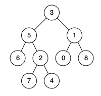

输入：root = [3,5,1,6,2,0,8,null,null,7,4], p = 5, q = 4

输出：5

解释：节点 5 和节点 4 的最近公共祖先是节点 5 。因为根据定义最近公共祖先节点可
以为节点本身。

示例 3：

输入：root = [1,2], p = 1, q = 2

输出：1
 

提示：

- 树中节点数目在范围 [2, 10^5] 内。
- -109 <= Node.val <= 109
- 所有 Node.val 互不相同 。
- p != q
- p 和 q 均存在于给定的二叉树中。

```java
class TreeNode {
    int val;
    TreeNode left;
    TreeNode right;
    TreeNode(int x) { val = x; }
}

public class Solution {
    public TreeNode lowestCommonAncestor(TreeNode root, TreeNode p, TreeNode q) {
        // 如果根节点为空或者已经找到了p或q，则返回当前节点
        if (root == null || root == p || root == q) {
            return root;
        }
        
        // 在左子树中查找p和q
        TreeNode left = lowestCommonAncestor(root.left, p, q);
        // 在右子树中查找p和q
        TreeNode right = lowestCommonAncestor(root.right, p, q);
        
        // 如果p和q分别位于当前节点的左右子树中，则当前节点即为最近公共祖先
        if (left != null && right != null) {
            return root;
        }
        
        // 如果p和q都在左子树中，则返回左子树查找到的结果
        if (left != null) {
            return left;
        }
        // 如果p和q都在右子树中，则返回右子树查找到的结果
        return right;
    }
}
```

## 103. 二叉树的锯齿形层序遍历
https://leetcode.cn/problems/binary-tree-zigzag-level-order-traversal/description/?envType=study-plan-v2&envId=top-interview-150

给你二叉树的根节点 root ，返回其节点值的 锯齿形层序遍历 。（即先从左往右，再从右往左进行下一层遍历，以此类推，层与层之间交替进行）。

 

示例 1：


输入：root = [3,9,20,null,null,15,7]

输出：[[3],[20,9],[15,7]]

示例 2：

输入：root = [1]

输出：[[1]]

示例 3：

输入：root = []

输出：[]
 

提示：

- 树中节点数目在范围 [0, 2000] 内
- -100 <= Node.val <= 100

```java
/**
 * Definition for a binary tree node.
 * public class TreeNode {
 *     int val;
 *     TreeNode left;
 *     TreeNode right;
 *     TreeNode() {}
 *     TreeNode(int val) { this.val = val; }
 *     TreeNode(int val, TreeNode left, TreeNode right) {
 *         this.val = val;
 *         this.left = left;
 *         this.right = right;
 *     }
 * }
 */
/**
 * 二叉树的锯齿形层序遍历实现。
 *
 * @param root 二叉树的根节点。
 * @return 锯齿形层序遍历的结果，以二维列表表示。
 */
public List<List<Integer>> zigzagLevelOrder(TreeNode root) {
    List<List<Integer>> result = new ArrayList<>();
    if (root == null) return result;

    Queue<TreeNode> queue = new LinkedList<>();
    queue.offer(root);
    boolean leftToRight = true; // 标记当前层的遍历方向

    while (!queue.isEmpty()) {
        int levelSize = queue.size();
        List<Integer> currentLevel = new ArrayList<>(levelSize);

        for (int i = 0; i < levelSize; i++) {
            TreeNode currentNode = queue.poll();
            // 根据当前层的遍历方向决定添加顺序
            if (leftToRight) {
                currentLevel.add(currentNode.val);
            } else {
                currentLevel.add(0, currentNode.val); // 在列表头部添加元素以实现从右向左
            }

            // 添加子节点到队列中，以便下一层的遍历
            if (currentNode.left != null) {
                queue.offer(currentNode.left);
            }
            if (currentNode.right != null) {
                queue.offer(currentNode.right);
            }
        }
        // 完成一层后，切换遍历方向
        leftToRight = !leftToRight;
        result.add(currentLevel);
    }
    return result;
}
```

## 92. 反转链表 II
https://leetcode.cn/problems/reverse-linked-list-ii/description/?envType=study-plan-v2&envId=top-interview-150

给你单链表的头指针 head 和两个整数 left 和 right ，其中 left <= right 。请你反转从位置 left 到位置 right 的链表节点，返回 反转后的链表 。


示例 1：


输入：head = [1,2,3,4,5], left = 2, right = 4

输出：[1,4,3,2,5]

示例 2：

输入：head = [5], left = 1, right = 1

输出：[5]


提示：

- 链表中节点数目为 n
- 1 <= n <= 500
- -500 <= Node.val <= 500
- 1 <= left <= right <= n

```java
/**
 * Definition for singly-linked list.
 * public class ListNode {
 *     int val;
 *     ListNode next;
 *     ListNode() {}
 *     ListNode(int val) { this.val = val; }
 *     ListNode(int val, ListNode next) { this.val = val; this.next = next; }
 * }
 */
class Solution {
    public ListNode reverseBetween(ListNode head, int left, int right) {
        ListNode dummy = new ListNode();
        dummy.next = head;
        ListNode pre = dummy;
        for(int i=1;i<left;i++){
            pre = pre.next;
        }
        ListNode cur = pre.next;
        ListNode next = null;
        //1-2-3-4
        for(int i = left;i<right;i++){
            next = cur.next;
            //1-2-4 3-4
            cur.next = next.next;
            //1-2-4 3-2
            next.next = pre.next;
            //1-3-2-4
            pre.next = next;
        }
        return dummy.next;
    }
}
```

## 54. 螺旋矩阵
https://leetcode.cn/problems/spiral-matrix/description/?envType=study-plan-v2&envId=top-interview-150

给你一个 m 行 n 列的矩阵 matrix ，请按照 顺时针螺旋顺序 ，返回矩阵中的所有元素。


示例 1：


输入：matrix = [[1,2,3],[4,5,6],[7,8,9]]

输出：[1,2,3,6,9,8,7,4,5]

示例 2：


输入：matrix = [[1,2,3,4],[5,6,7,8],[9,10,11,12]]

输出：[1,2,3,4,8,12,11,10,9,5,6,7]


提示：

- m == matrix.length
- n == matrix[i].length
- 1 <= m, n <= 10
- -100 <= matrix[i][j] <= 100

```java
class Solution {
    public List<Integer> spiralOrder(int[][] matrix) {
        List<Integer> res = new ArrayList<>();
        int m =matrix.length;
        int n = matrix[0].length;
        int left = 0,right = n-1,top = 0,boom = m-1;
        int cnt = m*n;
        while(cnt>=1){
            for(int i=left;i<=right && cnt>=1;i++){
                res.add(matrix[top][i]);
                cnt--;
            }
            top++;
            for(int i=top;i<=boom&& cnt>=1;i++){
                res.add(matrix[i][right]);
                cnt--;
            }
            right--;
            for(int i=right;i>=left&& cnt>=1;i--){
                res.add(matrix[boom][i]);
                cnt--;
            }
            boom--;
            for(int i=boom;i>=top&& cnt>=1;i--){
                res.add(matrix[i][left]);
                cnt--;
            }
            left++;
        }
        return res; 
    }
}
```

## 23. 合并 K 个升序链表
https://leetcode.cn/problems/merge-k-sorted-lists/description/?envType=study-plan-v2&envId=top-interview-150

给你一个链表数组，每个链表都已经按升序排列。

请你将所有链表合并到一个升序链表中，返回合并后的链表。

 

示例 1：

输入：lists = [[1,4,5],[1,3,4],[2,6]]

输出：[1,1,2,3,4,4,5,6]

解释：链表数组如下：

[

  1->4->5,

  1->3->4,

  2->6

]

将它们合并到一个有序链表中得到。

1->1->2->3->4->4->5->6

示例 2：

输入：lists = []

输出：[]

示例 3：

输入：lists = [[]]

输出：[]
 

提示：

- k == lists.length
- 0 <= k <= 10^4
- 0 <= lists[i].length <= 500
- -10^4 <= lists[i][j] <= 10^4
- lists[i] 按 升序 排列
- lists[i].length 的总和不超过 10^4

```java
/**
 * Definition for singly-linked list.
 * public class ListNode {
 *     int val;
 *     ListNode next;
 *     ListNode() {}
 *     ListNode(int val) { this.val = val; }
 *     ListNode(int val, ListNode next) { this.val = val; this.next = next; }
 * }
 */
/**
 * 解决方案类，提供方法以合并多个已排序的链表为一个有序链表。
 */
class Solution {

    /**
     * 主要方法：合并K个已排序的链表。
     * 
     * @param lists 一个数组，其中包含K个已排序的链表的头节点。
     * @return 返回一个新的已排序链表的头节点，该链表由输入的所有链表合并而成。
     */
    public ListNode mergeKLists(ListNode[] lists) {
        // 初始化结果链表为空
        ListNode res = null;

        // 遍历所有链表
        for (int i = 0; i < lists.length; i++) {
            // 将当前链表与结果链表合并
            res = mergeTwo(res, lists[i]);
        }

        // 返回最终合并后的链表头节点
        return res;
    }

    /**
     * 辅助方法：合并两个已排序的链表。
     * 
     * @param l1 第一个已排序链表的头节点。
     * @param l2 第二个已排序链表的头节点。
     * @return 返回合并后新链表的头节点。
     */
    public ListNode mergeTwo(ListNode l1, ListNode l2) {
        // 如果任一链表为空，直接返回非空链表的头节点
        if (l1 == null || l2 == null) {
            return l1 == null ? l2 : l1;
        }

        // 创建哑节点作为新链表的起点
        ListNode head = new ListNode(0);
        ListNode tail = head; // tail用于追踪新链表的最后一个节点

        // 分别用指针p1和p2遍历两个链表
        ListNode p1 = l1, p2 = l2;
        
        // 当两个链表都未遍历完时
        while (p1 != null && p2 != null) {
            // 比较两个链表当前节点的值，将较小值的节点加入新链表
            if (p1.val < p2.val) {
                tail.next = p1;
                p1 = p1.next;
            } else {
                tail.next = p2;
                p2 = p2.next;
            }
            
            // tail指针向后移动
            tail = tail.next;
        }
        
        // 合并剩余部分，哪个链表未结束就将其剩余部分接到新链表尾部
        tail.next = p1 == null ? p2 : p1;

        // 返回新链表的头节点（哑节点的下一个节点）
        return head.next;
    }
}
```

## 300. 最长递增子序列
https://leetcode.cn/problems/longest-increasing-subsequence/description/?envType=study-plan-v2&envId=top-interview-150

给你一个整数数组 nums ，找到其中最长严格递增子序列的长度。

子序列 是由数组派生而来的序列，删除（或不删除）数组中的元素而不改变其余元素的顺序。例如，[3,6,2,7] 是数组 [0,3,1,6,2,2,7] 的
子序列
。

 
示例 1：

输入：nums = [10,9,2,5,3,7,101,18]

输出：4

解释：最长递增子序列是 [2,3,7,101]，因此长度为 4 。

示例 2：

输入：nums = [0,1,0,3,2,3]

输出：4

示例 3：

输入：nums = [7,7,7,7,7,7,7]

输出：1
 

提示：

- 1 <= nums.length <= 2500
- -10^4 <= nums[i] <= 10^4

```java
public class Solution {
    public int lengthOfLIS(int[] nums) {
        // 创建一个与nums数组长度相同的dp数组，dp[i]表示以nums[i]结尾的最长递增子序列的长度
        int[] dp = new int[nums.length];
        int maxLength = 1;  // 最长递增子序列的初始长度至少为1（单个元素）
        
        for (int i = 0; i < nums.length; i++) {
            dp[i] = 1;  // 每个元素自身可以形成一个长度为1的递增子序列
            
            // 遍历之前的元素，寻找可以连接到当前元素的更长递增子序列
            for (int j = 0; j < i; j++) {
                if (nums[i] > nums[j]) {  // 如果当前元素大于前面的元素，说明可以连接形成一个更长的递增子序列
                    dp[i] = Math.max(dp[i], dp[j] + 1);  // 更新dp[i]的值
                }
            }
            
            // 更新最长递增子序列的长度
            maxLength = Math.max(maxLength, dp[i]);
        }
        
        return maxLength;  // 返回最长递增子序列的长度
    }
}
```

## 160. 相交链表
https://leetcode.cn/problems/intersection-of-two-linked-lists/description/

给你两个单链表的头节点 headA 和 headB ，请你找出并返回两个单链表相交的起始节点。如果两个链表不存在相交节点，返回 null 。

图示两个链表在节点 c1 开始相交：

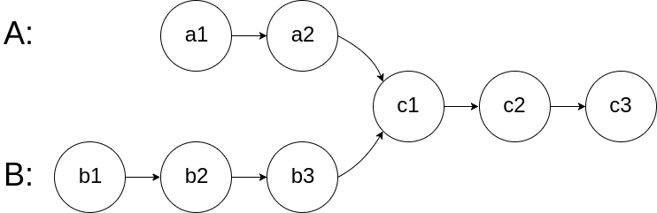

题目数据 保证 整个链式结构中不存在环。

注意，函数返回结果后，链表必须 保持其原始结构 。

自定义评测：

评测系统 的输入如下（你设计的程序 不适用 此输入）：

- intersectVal - 相交的起始节点的值。如果不存在相交节点，这一值为 0
- listA - 第一个链表
- listB - 第二个链表
- skipA - 在 listA 中（从头节点开始）跳到交叉节点的节点数
- skipB - 在 listB 中（从头节点开始）跳到交叉节点的节点数

评测系统将根据这些输入创建链式数据结构，并将两个头节点 headA 和 headB 传递给你的程序。如果程序能够正确返回相交节点，那么你的解决方案将被 视作正确答案 。

 

示例 1：

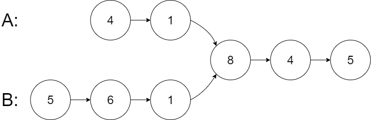

输入：intersectVal = 8, listA = [4,1,8,4,5], listB = [5,6,1,8,4,5], skipA = 2, skipB = 3

输出：Intersected at '8'

解释：相交节点的值为 8 （注意，如果两个链表相交则不能为 0）。

从各自的表头开始算起，链表 A 为 [4,1,8,4,5]，链表 B 为 [5,6,1,8,4,5]。

在 A 中，相交节点前有 2 个节点；在 B 中，相交节点前有 3 个节点。

— 请注意相交节点的值不为 1，因为在链表 A 和链表 B 之中值为 1 的节点 (A 中第二个节点和 B 中第三个节点) 是不同的节点。换句话说，它们在内存中指向两个不同的位置，而链表 A 和链表 B 中值为 8 的节点 (A 中第三个节点，B 中第四个节点) 在内存中指向相同的位置。
 

示例 2：

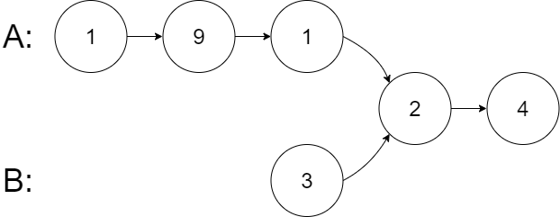

输入：intersectVal = 2, listA = [1,9,1,2,4], listB = [3,2,4], skipA = 3, skipB = 1

输出：Intersected at '2'

解释：相交节点的值为 2 （注意，如果两个链表相交则不能为 0）。

从各自的表头开始算起，链表 A 为 [1,9,1,2,4]，链表 B 为 [3,2,4]。

在 A 中，相交节点前有 3 个节点；在 B 中，相交节点前有 1 个节点。

示例 3：

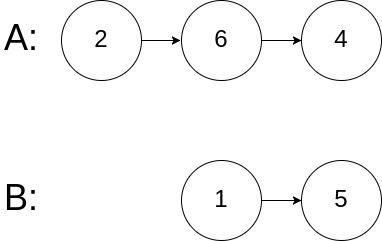

输入：intersectVal = 0, listA = [2,6,4], listB = [1,5], skipA = 3, skipB = 2

输出：null

解释：从各自的表头开始算起，链表 A 为 [2,6,4]，链表 B 为 [1,5]。

由于这两个链表不相交，所以 intersectVal 必须为 0，而 skipA 和 skipB 可以是任意值。

这两个链表不相交，因此返回 null 。
 

提示：

- listA 中节点数目为 m
- listB 中节点数目为 n
- 1 <= m, n <= 3 * 104
- 1 <= Node.val <= 105
- 0 <= skipA <= m
- 0 <= skipB <= n
- 如果 listA 和 listB 没有交点，intersectVal 为 0
- 如果 listA 和 listB 有交点，intersectVal == listA[skipA] == listB[skipB]

```java
/**
 * Definition for singly-linked list.
 * public class ListNode {
 *     int val;
 *     ListNode next;
 *     ListNode(int x) {
 *         val = x;
 *         next = null;
 *     }
 * }
 */
public class Solution {
    public ListNode getIntersectionNode(ListNode headA, ListNode headB) {
        if(headA == null || headB == null){
            return null;
        }
        ListNode pa = headA,pb = headB;
        while(pa != pb){
            pa = pa == null? headB:pa.next;
            pb = pb == null? headA:pb.next;
        }
        return pa;
    }
}
```

## 415. 字符串相加
https://leetcode.cn/problems/add-strings/description/

给定两个字符串形式的非负整数 num1 和num2 ，计算它们的和并同样以字符串形式返回。

你不能使用任何內建的用于处理大整数的库（比如 BigInteger）， 也不能直接将输入的字符串转换为整数形式。

 

示例 1：

输入：num1 = "11", num2 = "123"

输出："134"

示例 2：

输入：num1 = "456", num2 = "77"

输出："533"

示例 3：

输入：num1 = "0", num2 = "0"

输出："0"
 

提示：

- 1 <= num1.length, num2.length <= 10^4
- num1 和num2 都只包含数字 0-9
- num1 和num2 都不包含任何前导零

```java
/**
 * Solution类提供了一个方法来将两个非负整数字符串相加。
 * 它不使用整数转换，而是直接对字符串中的数字字符进行操作，模拟手动加法的过程。
 */
class Solution {
    /**
     * 将两个非负整数字符串相加。
     * 
     * @param num1 第一个非负整数字符串。
     * @param num2 第二个非负整数字符串。
     * @return 返回两个字符串表示的整数相加的结果。
     */
    public String addStrings(String num1, String num2) {
        // 初始化两个指针，分别指向两个字符串的末尾
        int i = num1.length() - 1;
        int j = num2.length() - 1;
        
        // 用于进位的变量
        int add = 0;
        // 使用StringBuilder来构建结果字符串
        StringBuilder sb = new StringBuilder();
        
        // 循环直到两个字符串都遍历完且没有进位
        while (i >= 0 || j >= 0 || add != 0) {
            // 获取num1当前位的数字，如果已经遍历完则为0
            int x = i >= 0 ? num1.charAt(i--) - '0' : 0;
            // 获取num2当前位的数字，如果已经遍历完则为0
            int y = j >= 0 ? num2.charAt(j--) - '0' : 0;
            // 计算当前位的和，包括进位
            int result = x + y + add;
            // 将当前位的和添加到StringBuilder中
            sb.append(result % 10);
            // 更新进位值
            add = result / 10;
        }
        
        // 将StringBuilder中的数字反转并转换为字符串返回，模拟加法结果的读取顺序
        return sb.reverse().toString();
    }
}
```

## 143. 重排链表
https://leetcode.cn/problems/reorder-list/description/


给定一个单链表 L 的头节点 head ，单链表 L 表示为：

L0 → L1 → … → Ln - 1 → Ln

请将其重新排列后变为：

L0 → Ln → L1 → Ln - 1 → L2 → Ln - 2 → …

不能只是单纯的改变节点内部的值，而是需要实际的进行节点交换。

 

示例 1：

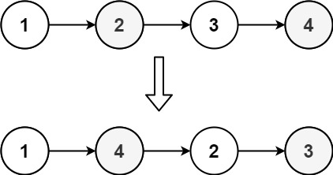

输入：head = [1,2,3,4]

输出：[1,4,2,3]

示例 2：

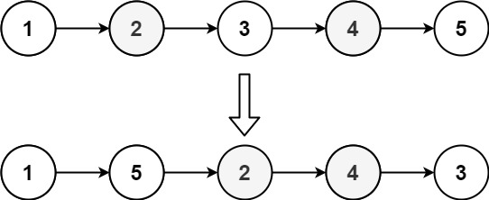

输入：head = [1,2,3,4,5]

输出：[1,5,2,4,3]
 

提示：

- 链表的长度范围为 [1, 5 * 104]
- 1 <= node.val <= 1000

```java
/**
 * Definition for singly-linked list.
 * public class ListNode {
 *     int val;
 *     ListNode next;
 *     ListNode() {}
 *     ListNode(int val) { this.val = val; }
 *     ListNode(int val, ListNode next) { this.val = val; this.next = next; }
 * }
 */
class Solution {
    public void reorderList(ListNode head) {
        if(head==null){
            return;
        }
        ListNode mid = findMid(head);
        ListNode head1 = head;
        ListNode head2 = mid.next;
        head2 = reverse(head2);
        mid.next = null;
        mergeTwo(head1,head2);
    }

    public ListNode findMid(ListNode head){
        ListNode fast = head.next;
        ListNode slow = head;
        while(fast != null && fast.next !=null){
            fast = fast.next.next;
            slow = slow.next;
        }
        return slow;
    }

    public ListNode reverse(ListNode head){
        ListNode pre = null,next = null,cur = head;
        while(cur!=null){
            next = cur.next;
            cur.next = pre;
            pre = cur;
            cur = next;
        }
        return pre;
    }

    public void mergeTwo(ListNode head1,ListNode head2){
        ListNode l1 = null,l2=null;
        while(head1!=null && head2!=null){
            l1 = head1.next;
            l2 = head2.next;
            head1.next = head2;
            head2.next = l1;
            head1 = l1;
            head2 = l2;
        }
    }
}
```

## 42. 接雨水

https://leetcode.cn/problems/trapping-rain-water/description/?envType=study-plan-v2&envId=top-interview-150

给定 n 个非负整数表示每个宽度为 1 的柱子的高度图，计算按此排列的柱子，下雨之后能接多少雨水。

示例 1：


输入：height = [0,1,0,2,1,0,1,3,2,1,2,1]

输出：6

解释：上面是由数组 [0,1,0,2,1,0,1,3,2,1,2,1] 表示的高度图，在这种情况下，可以接 6 个单位的雨水（蓝色部分表示雨水）。

示例 2：

输入：height = [4,2,0,3,2,5]

输出：9

提示：

- n == height.length
- 1 <= n <= 2 * 10^4
- 0 <= height[i] <= 10^5


```java
class Solution {
      /**
     * 计算一个数组中可以容纳的雨水总量。
     * 该方法通过构建左右两个辅助数组，分别记录每个位置左侧和右侧的最大高度，以此来确定每个位置可以形成水槽的最大高度。
     * 最终，通过遍历数组，计算每个位置可以容纳的水量，并累加得到总水量。
     *
     * @param height 表示每个位置的高度的数组。
     * @return 返回可以容纳的雨水总量。
     */
    public int trap(int[] height) {
        // 数组长度
        int len = height.length;
        // 初始化左侧最大高度数组
        int[] left = new int[len];
        // 初始化右侧最大高度数组
        int[] right = new int[len];

        // 从左向右遍历数组，填充左侧最大高度数组
        for (int i = 1; i < len; i++) {
            left[i] = Math.max(left[i - 1], height[i - 1]);
        }
        // 从右向左遍历数组，填充右侧最大高度数组
        for (int i = len - 2; i >= 0; i--) {
            right[i] = Math.max(right[i + 1], height[i + 1]);
        }

        // 初始化结果变量，用于累计可以容纳的雨水总量
        int res = 0;

        // 遍历数组，计算每个位置可以容纳的水量，并累加到结果变量中
        for (int i = 0; i < len; i++) {
            // 计算当前位置可以形成水槽的最大高度
            int m = Math.min(left[i], right[i]);
            // 累加实际可以容纳的水量，如果当前位置的高度大于等于最大高度，则该位置不能容纳水，累加0
            res += Math.max(0, m - height[i]);
        }

        // 返回可以容纳的雨水总量
        return res;
    }
}
```

## 142. 环形链表 II
https://leetcode.cn/problems/linked-list-cycle-ii/description/

给定一个链表的头节点  head ，返回链表开始入环的第一个节点。 如果链表无环，则返回 null。

如果链表中有某个节点，可以通过连续跟踪 next 指针再次到达，则链表中存在环。 为了表示给定链表中的环，评测系统内部使用整数 pos 来表示链表尾连接到链表中的位置（索引从 0 开始）。如果 pos 是 -1，则在该链表中没有环。注意：pos 不作为参数进行传递，仅仅是为了标识链表的实际情况。

不允许修改 链表。

 

示例 1：


输入：head = [3,2,0,-4], pos = 1

输出：返回索引为 1 的链表节点

解释：链表中有一个环，其尾部连接到第二个节点。

示例 2：

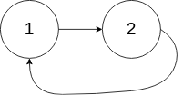

输入：head = [1,2], pos = 0

输出：返回索引为 0 的链表节点

解释：链表中有一个环，其尾部连接到第一个节点。

示例 3：


输入：head = [1], pos = -1

输出：返回 null

解释：链表中没有环。
 

提示：

- 链表中节点的数目范围在范围 [0, 104] 内
- -10^5 <= Node.val <= 10^5
- pos 的值为 -1 或者链表中的一个有效索引


```java
/**
 * Definition for singly-linked list.
 * class ListNode {
 *     int val;
 *     ListNode next;
 *     ListNode(int x) {
 *         val = x;
 *         next = null;
 *     }
 * }
 */
public class Solution {
    public ListNode detectCycle(ListNode head) {
        if(head==null){
            return null;
        }
        ListNode fast = head;
        ListNode slow = head;
        ListNode root = head;
        while(fast!=null && fast.next !=null){
            fast = fast.next.next;
            slow = slow.next;
            if(slow==fast){
                while(root!=slow){
                    slow = slow.next;
                    root = root.next;
                }
                return root;
            }
        }
        return null;
    }
}
```

## 56. 合并区间
https://leetcode.cn/problems/merge-intervals/description/?envType=study-plan-v2&envId=top-interview-150

以数组 intervals 表示若干个区间的集合，其中单个区间为 intervals[i] = [starti, endi] 。请你合并所有重叠的区间，并返回 一个不重叠的区间数组，该数组需恰好覆盖输入中的所有区间 。


示例 1：

输入：intervals = [[1,3],[2,6],[8,10],[15,18]]

输出：[[1,6],[8,10],[15,18]]

解释：区间 [1,3] 和 [2,6] 重叠, 将它们合并为 [1,6].

示例 2：

输入：intervals = [[1,4],[4,5]]

输出：[[1,5]]

解释：区间 [1,4] 和 [4,5] 可被视为重叠区间。


提示：

- 1 <= intervals.length <= 10^4
- intervals[i].length == 2
- 0 <= starti <= endi <= 10^4

```java
class Solution {
       /**
     * 合并区间。
     * 给定一个区间列表，其中每个区间用包含两个整数的数组表示。返回一个新的区间列表，其中包含所有输入区间的所有元素，且新列表中的区间是按非递减顺序排列并且不相交的。
     * 
     * @param intervals 输入的区间数组，每个区间由一对整数表示。
     * @return 返回一个新的区间数组，包含所有输入区间的所有元素，且区间不相交。
     */
    public int[][] merge(int[][] intervals) {
        // 按区间的起始位置对区间进行排序，确保后续合并时总是处理起始位置较小的区间
        Arrays.sort(intervals,(o1,o2)->Integer.compare(o1[0],o2[0]));

        // 使用ArrayList来动态存储合并后的区间，以便在合并过程中灵活添加或修改区间
        List<int[]> res = new ArrayList<>();
        
        // 遍历排序后的区间数组
        for(int i=0;i< intervals.length;i++){
            // 提取当前区间的起始和结束位置
            int left = intervals[i][0],right = intervals[i][1];
            int size = res.size();
            
            // 如果当前结果列表为空，或当前区间与上一区间不相交，则直接添加当前区间到结果列表
            if(size==0 || res.get(size-1)[1] < left){
                res.add(new int[]{left,right});
            }else{
                // 如果当前区间与上一区间相交，则更新上一区间的结束位置为两区间结束位置的较大值
                res.get(size-1)[1] = Math.max(res.get(size-1)[1],right); 
            }
        }
        
        // 将结果列表转换为二维数组形式返回
        return res.toArray(new int[res.size()][]);
    }
}
```

## 124. 二叉树中的最大路径和
https://leetcode.cn/problems/binary-tree-maximum-path-sum/description/?envType=study-plan-v2&envId=top-interview-150

二叉树中的 路径 被定义为一条节点序列，序列中每对相邻节点之间都存在一条边。同一个节点在一条路径序列中 至多出现一次 。该路径 至少包含一个 节点，且不一定经过根节点。

路径和 是路径中各节点值的总和。

给你一个二叉树的根节点 root ，返回其 最大路径和 。

 

示例 1：

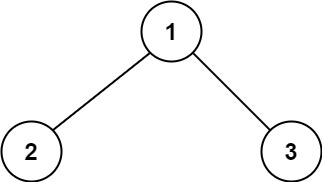


输入：root = [1,2,3]

输出：6

解释：最优路径是 2 -> 1 -> 3 ，路径和为 2 + 1 + 3 = 6

示例 2：

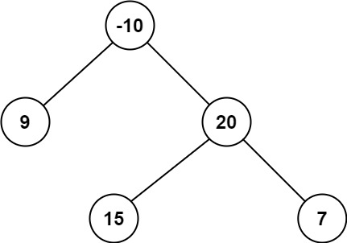

输入：root = [-10,9,20,null,null,15,7]

输出：42

解释：最优路径是 15 -> 20 -> 7 ，路径和为 15 + 20 + 7 = 42
 

提示：

树中节点数目范围是 [1, 3 * 10^4]
-1000 <= Node.val <= 1000


```java
/**
 * Definition for a binary tree node.
 * public class TreeNode {
 *     int val;
 *     TreeNode left;
 *     TreeNode right;
 *     TreeNode() {}
 *     TreeNode(int val) { this.val = val; }
 *     TreeNode(int val, TreeNode left, TreeNode right) {
 *         this.val = val;
 *         this.left = left;
 *         this.right = right;
 *     }
 * }
 */
/**
 * 定义 Solution 类，用于计算二叉树中的最大路径和。
 */
class Solution {
    int sum = Integer.MIN_VALUE; // 初始化变量以存储最大路径和

    /**
     * 计算二叉树中的最大路径和。
     *
     * @param root 二叉树的根节点
     * @return 最大路径和
     */
    public int maxPathSum(TreeNode root) {
        getMax(root); // 获取最大路径和
        return sum; // 返回最大路径和
    }

    /**
     * 辅助方法，找出从特定节点开始的最大路径和。
     *
     * @param root 当前二叉树节点
     * @return 从当前节点开始的最大路径和
     */
    public int getMax(TreeNode root) {
        if (root == null) {
            return 0; // 如果当前节点为空，返回0
        }

        int left = Math.max(0, getMax(root.left)); // 计算左子树的最大路径和
        int right = Math.max(0, getMax(root.right)); // 计算右子树的最大路径和

        int n = left + right + root.val; // 计算包括当前节点在内的路径和

        sum = Math.max(sum, n); // 更新全局最大路径和

        return Math.max(left, right) + root.val; // 返回从当前节点开始的最大路径和
    }
}
```

## 72. 编辑距离
https://leetcode.cn/problems/edit-distance/description/?envType=study-plan-v2&envId=top-interview-150

给你两个单词 word1 和 word2， 请返回将 word1 转换成 word2 所使用的最少操作数  。

你可以对一个单词进行如下三种操作：

- 插入一个字符
- 删除一个字符
- 替换一个字符
 

示例 1：

输入：word1 = "horse", word2 = "ros"

输出：3

解释：

horse -> rorse (将 'h' 替换为 'r')

rorse -> rose (删除 'r')

rose -> ros (删除 'e')

示例 2：

输入：word1 = "intention", word2 = "execution"

输出：5

解释：
- intention -> inention (删除 't')
- inention -> enention (将 'i' 替换为 'e')
- enention -> exention (将 'n' 替换为 'x')
- exention -> exection (将 'n' 替换为 'c')
- exection -> execution (插入 'u')
 

提示：

- 0 <= word1.length, word2.length <= 500
- word1 和 word2 由小写英文字母组成

```java
/**
 * Solution类提供了一个方法来计算两个字符串之间的最小编辑距离。
 * 编辑距离指的是将一个字符串转换成另一个字符串所需的最少操作次数，操作包括插入、删除和替换字符。
 */
class Solution {
    /**
     * 计算两个字符串之间的最小编辑距离。
     * 
     * @param word1 第一个字符串
     * @param word2 第二个字符串
     * @return 两个字符串之间的最小编辑距离
     */
    public int minDistance(String word1, String word2) {
        // 获取两个字符串的长度
        int m = word1.length();
        int n = word2.length();

        // 如果其中一个字符串为空，则最小编辑距离为另一个字符串的长度
        if(m*n==0){
            return m+n;
        }

        // 初始化动态规划表格，dp[i][j]表示word1的前i个字符和word2的前j个字符之间的最小编辑距离
        int[][] dp = new int[m+1][n+1];

        // 初始化表格的第一列和第一行，分别表示将word1的前i个字符转换为空字符串和将空字符串转换为word2的前j个字符的最小编辑距离
        for(int i=0;i<=m;i++){
            dp[i][0] = i;
        }
        for(int i=0;i<=n;i++){
            dp[0][i] = i;
        }

        // 填充动态规划表格，计算所有dp[i][j]的值
        for(int i=1;i<=m;i++){
            for(int j=1;j<=n;j++){
                // 计算三种操作（插入、删除、替换）对应的编辑距离
                int left = dp[i-1][j]+1;
                int down = dp[i][j-1]+1;
                int left_down = dp[i-1][j-1];
                // 如果当前字符不相同，则需要进行替换操作，因此编辑距离加1
                if (word1.charAt(i - 1) != word2.charAt(j - 1)) {
                    left_down += 1;
                }
                // 取三种操作中的最小值作为dp[i][j]的值
                dp[i][j] = Math.min(left,Math.min(down,left_down));   
            }
        }

        // 返回整个表格的最后一个值，即为两个字符串之间的最小编辑距离
        return dp[m][n];
    }
}
```

## 19. 删除链表的倒数第 N 个结点
https://leetcode.cn/problems/remove-nth-node-from-end-of-list/description/?envType=study-plan-v2&envId=top-interview-150

给你一个链表，删除链表的倒数第 n 个结点，并且返回链表的头结点。


示例 1：


输入：head = [1,2,3,4,5], n = 2

输出：[1,2,3,5]

示例 2：

输入：head = [1], n = 1

输出：[]

示例 3：

输入：head = [1,2], n = 1

输出：[1]


提示：

- 链表中结点的数目为 sz
- 1 <= sz <= 30
- 0 <= Node.val <= 100
- 1 <= n <= sz

```java
/**
 * Definition for singly-linked list.
 * public class ListNode {
 *     int val;
 *     ListNode next;
 *     ListNode() {}
 *     ListNode(int val) { this.val = val; }
 *     ListNode(int val, ListNode next) { this.val = val; this.next = next; }
 * }
 */
class Solution {
    /**
     * 删除链表中倒数第n个节点
     * @param head 链表的头节点
     * @param n 要删除的节点距离末尾的索引，n为1时删除最后一个节点
     * @return 处理后的链表头节点
     */
    public ListNode removeNthFromEnd(ListNode head, int n) {
        // 创建一个虚拟头节点，方便处理边界情况
        ListNode dummy = new ListNode();
        dummy.next = head;

        // 使用快慢指针，快指针先走n步，然后同时移动，直到快指针到达末尾
        ListNode fast = head;
        ListNode slow = head;
        while(fast != null && n-- > 0) {
            fast = fast.next;
        }
        
        // 此时慢指针指向要删除节点的前一个节点
        ListNode pre = dummy;
        while(fast != null) {
            pre = slow;
            fast = fast.next;
            slow = slow.next;
        }

        // 删除节点，将前一个节点的next指向要删除节点的下一个节点
        pre.next = slow.next;

        // 返回处理后的链表头节点
        return dummy.next;
    }
}
```

## 93. 复原IP地址
https://leetcode.cn/problems/restore-ip-addresses/description/

有效 IP 地址 正好由四个整数（每个整数位于 0 到 255 之间组成，且不能含有前导 0），整数之间用 '.' 分隔。

例如："0.1.2.201" 和 "192.168.1.1" 是 有效 IP 地址，但是 "0.011.255.245"、"192.168.1.312" 和 "192.168@1.1" 是 无效 IP 地址。

给定一个只包含数字的字符串 s ，用以表示一个 IP 地址，返回所有可能的有效 IP 地址，这些地址可以通过在 s 中插入 '.' 来形成。你 不能 重新排序或删除 s 中的任何数字。你可以按 任何 顺序返回答案。

 

示例 1：

输入：s = "25525511135"

输出：["255.255.11.135","255.255.111.35"]

示例 2：

输入：s = "0000"

输出：["0.0.0.0"]

示例 3：

输入：s = "101023"

输出：["1.0.10.23","1.0.102.3","10.1.0.23","10.10.2.3","101.0.2.3"]
 

提示：

- 1 <= s.length <= 20
- s 仅由数字组成

```java
/**
 * 用于恢复给定字符串s的所有可能的IP地址。
 */
public class Solution {

    // 存储所有可能的IP地址
    List<String> res = new ArrayList<>();
    // 用于构建和存储当前正在形成的IP地址
    StringBuilder sb = new StringBuilder();

    /**
     * 深度优先搜索（DFS）函数，用于尝试所有可能的IP地址组合。
     * @param cnt 当前已经构建的IP地址段数
     * @param s 剩余的字符串，用于构建剩下的IP地址段
     */
    public void dfs(int cnt, String s) {
        // 如果已经构建了4个IP地址段，或者没有剩余的字符串了
        if (cnt == 4 || s.length() == 0) {
            // 如果构建了4个IP地址段且没有剩余字符串，说明找到了一个有效的IP地址
            if (cnt == 4 && s.length() == 0) {
                res.add(sb.toString());
            }
            return;
        }

        // 尝试构建下一个IP地址段
        for (int i = 0; i < 3 && i < s.length(); i++) {
            // 如果当前段不是第一个段，但以0开头，则不符合IP地址规则，跳出循环
            if (i != 0 && s.charAt(0) == '0') {
                break;
            }
            // 提取当前尝试的IP地址段
            String sub = s.substring(0, i + 1);
            // 如果当前段是一个有效的IP地址段（值小于等于255）
            if (Integer.valueOf(sub) <= 255) {
                // 如果已经有一个或多个段，则在当前段前加一个点号
                if (sb.length() > 0) {
                    sub = "." + sub;
                }
                // 将当前段添加到正在构建的IP地址中
                sb.append(sub);
                // 递归调用DFS，尝试构建下一个IP地址段
                dfs(cnt + 1, s.substring(i + 1));
                // 回溯，移除刚刚添加的当前段，以便尝试其他可能的组合
                sb.delete(sb.length() - sub.length(), sb.length());
            }
        }
    }

    /**
     * 主函数，启动深度优先搜索以恢复所有可能的IP地址。
     * @param s 输入的字符串，用于恢复IP地址
     * @return 所有可能的IP地址列表
     */
    public List<String> restoreIpAddresses(String s) {
        dfs(0, s);
        return res;
    }
}
```

## 1143. 最长公共子序列
https://leetcode.cn/problems/longest-common-subsequence/description/

给定两个字符串 text1 和 text2，返回这两个字符串的最长 公共子序列 的长度。如果不存在 公共子序列 ，返回 0 。

一个字符串的 子序列 是指这样一个新的字符串：它是由原字符串在不改变字符的相对顺序的情况下删除某些字符（也可以不删除任何字符）后组成的新字符串。

例如，"ace" 是 "abcde" 的子序列，但 "aec" 不是 "abcde" 的子序列。
两个字符串的 公共子序列 是这两个字符串所共同拥有的子序列。

 

示例 1：

输入：text1 = "abcde", text2 = "ace" 

输出：3  

解释：最长公共子序列是 "ace" ，它的长度为 3 。

示例 2：

输入：text1 = "abc", text2 = "abc"

输出：3

解释：最长公共子序列是 "abc" ，它的长度为 3 。

示例 3：

输入：text1 = "abc", text2 = "def"

输出：0

解释：两个字符串没有公共子序列，返回 0 。
 

提示：

- 1 <= text1.length, text2.length <= 1000
- text1 和 text2 仅由小写英文字符组成。

```java
class Solution {
        /**
     * 计算两个字符串的最长公共子序列的长度。
     * 最长公共子序列是一个字符串中，同时出现在两个字符串中的最长的子序列（不一定连续）。
     * 
     * @param text1 第一个字符串
     * @param text2 第二个字符串
     * @return 返回两个字符串的最长公共子序列的长度
     */
    public int longestCommonSubsequence(String text1, String text2) {
        // 获取两个字符串的长度
        int len1 = text1.length();
        int len2 = text2.length();

        // 初始化动态规划数组，dp[i][j]表示text1的前i个字符和text2的前j个字符的最长公共子序列的长度
        int[][] dp = new int[len1+1][len2+1];

        // 遍历两个字符串的所有字符
        for(int i=1;i<=len1;i++){
            for(int j=1;j<=len2;j++){
                // 当两个字符相等时，当前的最长公共子序列长度是在前一个长度基础上加1
                if(text1.charAt(i-1) == text2.charAt(j-1)){
                    dp[i][j] = dp[i-1][j-1]+1;
                }else{
                    // 当两个字符不相等时，当前的最长公共子序列长度是取两种情况的较大值
                    dp[i][j] = Math.max(dp[i-1][j], dp[i][j-1]);
                }
            }
        }

        // 返回整个字符串的最长公共子序列的长度
        return dp[len1][len2];
    }
}
```

## 94. 二叉树的中序遍历
https://leetcode.cn/problems/binary-tree-inorder-traversal/

给定一个二叉树的根节点 root ，返回 它的 中序 遍历 。

 

示例 1：


输入：root = [1,null,2,3]

输出：[1,3,2]

示例 2：

输入：root = []

输出：[]

示例 3：


输入：root = [1]

输出：[1]
 

提示：

- 树中节点数目在范围 [0, 100] 内
- -100 <= Node.val <= 100

```java
/**
 * Definition for a binary tree node.
 * public class TreeNode {
 *     int val;
 *     TreeNode left;
 *     TreeNode right;
 *     TreeNode() {}
 *     TreeNode(int val) { this.val = val; }
 *     TreeNode(int val, TreeNode left, TreeNode right) {
 *         this.val = val;
 *         this.left = left;
 *         this.right = right;
 *     }
 * }
 */
class Solution {
    /**
     * 对二叉树进行中序遍历，并返回遍历结果的列表。
     *
     * @param root 二叉树的根节点，类型为 TreeNode
     * @return 一个整数列表，包含了中序遍历的结果。如果树为空，返回空列表
     */
    public List<Integer> inorderTraversal(TreeNode root) {
        // 初始化结果列表和双端队列
        LinkedList<Integer> res = new LinkedList<>();
        Deque<Object> dq = new LinkedList<>();

        // 如果根节点为空，直接返回空列表
        if (root == null) {
            return res;
        }

        // 将根节点入队
        dq.push(root);

        // 当双端队列不为空时，进行遍历
        while (!dq.isEmpty()) {
            // 弹出队首元素
            Object o = dq.pop();

            // 如果元素是整数，将其添加到结果列表的末尾
            if (o instanceof Integer) {
                res.addLast((int) o);
            } else {
                // 否则，元素为 TreeNode，处理左右子节点
                TreeNode n = (TreeNode) o;
                // 先处理右子节点
                if (n.right != null) {
                    dq.push(n.right);
                }
                // 将节点值入队
                dq.push(n.val);
                // 再处理左子节点
                if (n.left != null) {
                    dq.push(n.left);
                }
            }
        }

        // 返回遍历结果
        return res;
    }
}
```

## 82. 删除排序链表中的重复元素 II
https://leetcode.cn/problems/remove-duplicates-from-sorted-list-ii/description/?envType=study-plan-v2&envId=top-interview-150

给定一个已排序的链表的头 head ， 删除原始链表中所有重复数字的节点，只留下不同的数字 。返回 已排序的链表 。


示例 1：


输入：head = [1,2,3,3,4,4,5]

输出：[1,2,5]

示例 2：


输入：head = [1,1,1,2,3]

输出：[2,3]


提示：

- 链表中节点数目在范围 [0, 300] 内
- -100 <= Node.val <= 100
- 题目数据保证链表已经按升序 排列

```java
/**
 * Definition for singly-linked list.
 * public class ListNode {
 *     int val;
 *     ListNode next;
 *     ListNode() {}
 *     ListNode(int val) { this.val = val; }
 *     ListNode(int val, ListNode next) { this.val = val; this.next = next; }
 * }
 */
/**
 * Solution类用于解决删除链表中所有重复元素的问题，使每个元素只出现一次。
 */
class Solution {
    /**
     * 删除链表中所有重复元素。
     * 
     * @param head 链表的头节点。
     * @return 返回删除重复元素后的链表头节点。
     */
    public ListNode deleteDuplicates(ListNode head) {
        // 如果链表为空，则直接返回null。
        if(head == null){
            return null;
        }
        // 使用哑节点dummy来简化链表操作，避免处理头节点的特殊情况。
        ListNode dummy = new ListNode();
        dummy.next = head;
        ListNode pre = dummy;
        ListNode cur = head;

        // 遍历链表，直到cur或cur的下一个节点为空。
        while(cur!= null && cur.next != null){
            // 如果当前节点的值和下一个节点的值相同，说明有重复。
            if(cur.val == cur.next.val){
                int v = cur.val;
                // 移动cur直到不再有重复的值，这一步是为了找到重复序列的末尾。
                while(cur!= null && cur.val == v){
                    cur = cur.next;
                }
                // 将pre的下一个节点指向cur，从而跳过重复的序列。
                pre.next = cur;
            }else{
                // 如果当前节点和下一个节点的值不同，更新pre和cur的位置。
                pre = cur;
                cur = cur.next;
            }
        }
        // 返回更新后的链表头节点，即dummy的下一个节点。
        return dummy.next;
    }
}
```

## 704. 二分查找
https://leetcode.cn/problems/binary-search/description/

给定一个 n 个元素有序的（升序）整型数组 nums 和一个目标值 target  ，写一个函数搜索 nums 中的 target，如果目标值存在返回下标，否则返回 -1。


示例 1:

输入: nums = [-1,0,3,5,9,12], target = 9

输出: 4

解释: 9 出现在 nums 中并且下标为 4

示例 2:

输入: nums = [-1,0,3,5,9,12], target = 2

输出: -1

解释: 2 不存在 nums 中因此返回 -1
 

提示：

- 你可以假设 nums 中的所有元素是不重复的。
- n 将在 [1, 10000]之间。
- nums 的每个元素都将在 [-9999, 9999]之间。

```java
/**
 * 在排序数组中查找特定目标值的索引。
 * 该类提供了一个方法来执行二分查找，以高效地找到目标值的索引。
 */
class Solution {
    /**
     * 在排序数组中搜索目标值。
     * 使用二分查找算法来提高搜索效率。
     * 
     * @param nums 排序后的整数数组，不为空且至少包含一个元素。
     * @param target 需要查找的目标整数。
     * @return 目标值在数组中的索引；如果不存在，则返回-1。
     */
    public int search(int[] nums, int target) {
        /* 初始化左右指针 */
        int left = 0, right = nums.length - 1;
        /* 当左指针不大于右指针时，执行循环 */
        while (left <= right) {
            /* 计算中间索引，避免整数溢出 */
            int mid = left + (right - left) / 2;
            /* 如果中间值等于目标值，返回中间索引 */
            if (nums[mid] == target) {
                return mid;
            }
            /* 如果中间值小于目标值，移动左指针到中间索引的右边 */
            else if (nums[mid] < target) {
                left = mid + 1;
            }
            /* 如果中间值大于目标值，移动右指针到中间索引的左边 */
            else {
                right = mid - 1;
            }
        }
        /* 如果没有找到目标值，返回-1 */
        return -1;
    }
}
```

## 199. 二叉树的右视图
https://leetcode.cn/problems/binary-tree-right-side-view/description/?envType=study-plan-v2&envId=top-interview-150

给定一个二叉树的 根节点 root，想象自己站在它的右侧，按照从顶部到底部的顺序，返回从右侧所能看到的节点值。

 

示例 1:

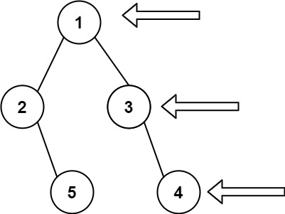

输入: [1,2,3,null,5,null,4]

输出: [1,3,4]

示例 2:

输入: [1,null,3]

输出: [1,3]

示例 3:

输入: []

输出: []
 

提示:

- 二叉树的节点个数的范围是 [0,100]
- -100 <= Node.val <= 100 

```java
import java.util.*;

class TreeNode {
    int val;
    TreeNode left;
    TreeNode right;
    TreeNode(int x) { val = x; }
}

public class Solution {
    public List<Integer> rightSideView(TreeNode root) {
        List<Integer> result = new ArrayList<>();
        if (root == null) return result;

        Queue<TreeNode> queue = new LinkedList<>();
        queue.offer(root);

        while (!queue.isEmpty()) {
            int levelSize = queue.size();
            for (int i = 0; i < levelSize; i++) {
                TreeNode current = queue.poll();
                // 每一层的最后一个节点添加到结果列表
                if (i == levelSize - 1) {
                    result.add(current.val);
                }
                
                // 将当前节点的左右子节点加入队列，以便下一轮遍历
                if (current.left != null) {
                    queue.offer(current.left);
                }
                if (current.right != null) {
                    queue.offer(current.right);
                }
            }
        }
        return result;
    }
}
```

## 31. 下一个排列
https://leetcode.cn/problems/next-permutation/description/

整数数组的一个 排列  就是将其所有成员以序列或线性顺序排列。

例如，arr = [1,2,3] ，以下这些都可以视作 arr 的排列：[1,2,3]、[1,3,2]、[3,1,2]、[2,3,1] 。

整数数组的 下一个排列 是指其整数的下一个字典序更大的排列。更正式地，如果数组的所有排列根据其字典顺序从小到大排列在一个

容器中，那么数组的 下一个排列 就是在这个有序容器中排在它后面的那个排列。如果不存在下一个更大的排列，那么这个数组必须重排为字典序最小的排列（即，其元素按升序排列）。

例如，arr = [1,2,3] 的下一个排列是 [1,3,2] 。

类似地，arr = [2,3,1] 的下一个排列是 [3,1,2] 。

而 arr = [3,2,1] 的下一个排列是 [1,2,3] ，因为 [3,2,1] 不存在一个字典序更大的排列。

给你一个整数数组 nums ，找出 nums 的下一个排列。

必须 原地 修改，只允许使用额外常数空间。

 

示例 1：

输入：nums = [1,2,3]

输出：[1,3,2]

示例 2：

输入：nums = [3,2,1]

输出：[1,2,3]

示例 3：

输入：nums = [1,1,5]

输出：[1,5,1]
 

提示：

- 1 <= nums.length <= 100
- 0 <= nums[i] <= 100

```java
/**
 * 解决方案类，提供排列算法的功能。
 */
class Solution {
    /**
     * 获取下一个排列。
     * 
     * @param nums 输入的整数数组，将对其进行就地修改以得到下一个排列。
     */
    public void nextPermutation(int[] nums) {
        // 从倒数第二个元素开始向前搜索，寻找第一个相邻升序对(i, i+1)，满足nums[i] < nums[i+1]
        //123465
        int i = nums.length - 2;
        while (i >= 0 && nums[i] >= nums[i + 1]) {
            i--;
        }
        
        // 如果找到了这样的i，那么再从后向前搜索，寻找第一个大于nums[i]的元素nums[j]
        if (i >= 0) {
            int j = nums.length - 1;
            while (j >= 0 && nums[i] >= nums[j]) {
                j--;
            }
            
            // 交换nums[i]和nums[j]，以确保之后的反转操作能产生正确的下一个排列
            swap(nums, i, j);
        }
        
        // 将i之后的元素反转，得到下一个排列
        reverse(nums, i + 1);
    }

    /**
     * 交换数组中两个位置的元素。
     * 
     * @param nums 输入的整数数组。
     * @param i    要交换的元素的第一个位置。
     * @param j    要交换的元素的第二个位置。
     */
    public void swap(int[] nums, int i, int j) {
        int temp = nums[i];
        nums[i] = nums[j];
        nums[j] = temp;
    }

    /**
     * 反转数组中指定范围的元素。
     * 
     * @param nums 输入的整数数组。
     * @param start 要反转的元素的起始位置。
     */
    public void reverse(int[] nums, int start) {
        int left = start, right = nums.length - 1;
        while (left < right) {
            swap(nums, left, right);
            left++;
            right--;
        }
    }
}
```

## 4. 寻找两个正序数组的中位数
https://leetcode.cn/problems/median-of-two-sorted-arrays/description/?envType=study-plan-v2&envId=top-interview-150

给定两个大小分别为 m 和 n 的正序（从小到大）数组 nums1 和 nums2。请你找出并返回这两个正序数组的 中位数 。

算法的时间复杂度应该为 O(log (m+n)) 。

 

示例 1：

输入：nums1 = [1,3], nums2 = [2]

输出：2.00000

解释：合并数组 = [1,2,3] ，中位数 2

示例 2：

输入：nums1 = [1,2], nums2 = [3,4]

输出：2.50000

解释：合并数组 = [1,2,3,4] ，中位数 (2 + 3) / 2 = 2.5
 

 

提示：

- nums1.length == m
- nums2.length == n
- 0 <= m <= 1000
- 0 <= n <= 1000
- 1 <= m + n <= 2000
- -106 <= nums1[i], nums2[i] <= 106

```java
class Solution {
    /**
     * 寻找两个正序数组的中位数。
     * 使用二分查找法降低时间复杂度至O(log(min(m, n)))，其中m和n分别是两个数组的长度。
     *
     * @param nums1 第一个正序数组
     * @param nums2 第二个正序数组
     * @return 两个数组合并后的中位数
     */
    public double findMedianSortedArrays(int[] nums1, int[] nums2) {
        // 确保nums1是较短的数组，优化二分查找过程
        if (nums1.length > nums2.length) {
            int[] temp = nums1;
            nums1 = nums2;
            nums2 = temp;
        }

        int x = nums1.length;
        int y = nums2.length;
        int low = 0;
        int high = x;

        while (low <= high) {
            int partitionX = (low + high) / 2;
            int partitionY = (x + y + 1) / 2 - partitionX;

            // 寻找左右两侧边界值，注意处理边界情况
            int maxLeftX = (partitionX == 0) ? Integer.MIN_VALUE : nums1[partitionX - 1];
            int minRightX = (partitionX == x) ? Integer.MAX_VALUE : nums1[partitionX];

            int maxLeftY = (partitionY == 0) ? Integer.MIN_VALUE : nums2[partitionY - 1];
            int minRightY = (partitionY == y) ? Integer.MAX_VALUE : nums2[partitionY];

            // 检查划分是否满足条件
            if (maxLeftX <= minRightY && maxLeftY <= minRightX) {
                // 找到正确的划分，计算中位数
                if ((x + y) % 2 == 0) {
                    return ((double)Math.max(maxLeftX, maxLeftY) + Math.min(minRightX, minRightY)) / 2;
                } else {
                    return (double)Math.max(maxLeftX, maxLeftY);
                }
            } else if (maxLeftX > minRightY) {
                // 缩小nums1的查找范围
                high = partitionX - 1;
            } else {
                // 扩大nums1的查找范围
                low = partitionX + 1;
            }
        }

        throw new IllegalArgumentException("Input arrays are not sorted or not valid.");
    }
}
```

## 232. 用栈实现队列
https://leetcode.cn/problems/implement-queue-using-stacks/description/

请你仅使用两个栈实现先入先出队列。队列应当支持一般队列支持的所有操作（push、pop、peek、empty）：

实现 MyQueue 类：

- void push(int x) 将元素 x 推到队列的末尾
- int pop() 从队列的开头移除并返回元素
- int peek() 返回队列开头的元素
- boolean empty() 如果队列为空，返回 true ；否则，返回 false

说明：

- 你 只能 使用标准的栈操作 —— 也就是只有 push to top, peek/pop from top, size, 和 is empty 操作是合法的。
- 你所使用的语言也许不支持栈。你可以使用 list 或者 deque（双端队列）来模拟一个栈，只要是标准的栈操作即可。
 

示例 1：

输入：

["MyQueue", "push", "push", "peek", "pop", "empty"]

[[], [1], [2], [], [], []]

输出：

[null, null, null, 1, 1, false]

解释：
- MyQueue myQueue = new MyQueue();
- myQueue.push(1); // queue is: [1]
- myQueue.push(2); // queue is: [1, 2] (leftmost is front of the queue)
- myQueue.peek(); // return 1
- myQueue.pop(); // return 1, queue is [2]
- myQueue.empty(); // return false
 

提示：

- 1 <= x <= 9
- 最多调用 100 次 push、pop、peek 和 empty
- 假设所有操作都是有效的 （例如，一个空的队列不会调用 pop 或者 peek 操作）

```java
class MyQueue {
    Deque<Integer> in;
    Deque<Integer> out;
    public MyQueue() {
        in = new LinkedList<>();
        out = new LinkedList<>();
    }
    
    public void push(int x) {
        in.push(x);
    }
    
    public int pop() {
        if(out.isEmpty()){
            pushToOut();
        }
        return out.pop();
    }
    
    public int peek() {
        if(out.isEmpty()){
            pushToOut();
        }
        return out.peek();
    }
    
    public boolean empty() {
        return in.isEmpty() && out.isEmpty();
    }

    public void pushToOut(){
        while(!in.isEmpty()){
            out.push(in.pop());
        }
    }
}

/**
 * Your MyQueue object will be instantiated and called as such:
 * MyQueue obj = new MyQueue();
 * obj.push(x);
 * int param_2 = obj.pop();
 * int param_3 = obj.peek();
 * boolean param_4 = obj.empty();
 */
```

## 148. 排序链表
https://leetcode.cn/problems/sort-list/description/?envType=study-plan-v2&envId=top-interview-150

给你链表的头结点 head ，请将其按 升序 排列并返回 排序后的链表 。

 

示例 1：

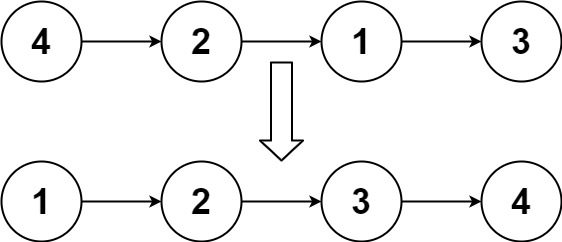

输入：head = [4,2,1,3]

输出：[1,2,3,4]

示例 2：

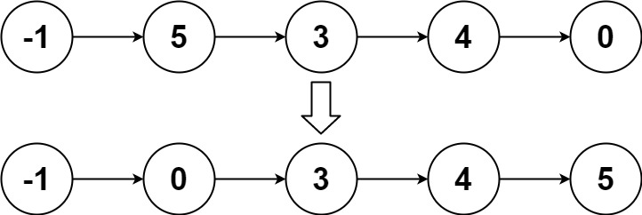

输入：head = [-1,5,3,4,0]

输出：[-1,0,3,4,5]

示例 3：

输入：head = []

输出：[]
 

提示：

- 链表中节点的数目在范围 [0, 5 * 10^4] 内
- -10^5 <= Node.val <= 10^5

```java
/**
 * Definition for singly-linked list.
 * public class ListNode {
 *     int val;
 *     ListNode next;
 *     ListNode() {}
 *     ListNode(int val) { this.val = val; }
 *     ListNode(int val, ListNode next) { this.val = val; this.next = next; }
 * }
 */
/**
 * Definition for singly-linked list.
 * public class ListNode {
 *     int val;
 *     ListNode next;
 *     ListNode() {}
 *     ListNode(int val) { this.val = val; }
 *     ListNode(int val, ListNode next) { this.val = val; this.next = next; }
 * }
 */
/**
 * Solution类提供了一个方法来对链表进行排序。
 * 它实现了归并排序算法，该算法是递归地将链表分割成更小的部分，然后将这些部分合并成一个排序好的链表。
 */
class Solution {
    /**
     * 对给定链表进行排序。
     * 
     * @param head 链表的头节点。
     * @return 排序后的链表的头节点。
     */
    public ListNode sortList(ListNode head) {
        return mergeSort(head);
    }

    /**
     * 归并排序的递归部分。
     * 它首先找到链表的中间点，然后将链表分割成两部分，分别对这两部分进行排序，最后将排序好的两部分合并。
     * 
     * @param head 链表的头节点。
     * @return 排序后的链表的头节点。
     */
    public ListNode mergeSort(ListNode head){
        // 如果链表为空或只有一个节点，无需排序，直接返回
        if(head == null || head.next==null){
            return head;
        }
        ListNode slow = head,fast = head.next;
        // 寻找链表的中间点
        while(fast!=null && fast.next!=null){
            slow = slow.next;
            fast = fast.next.next;
        }
        // 递归地对右半部分进行排序
        ListNode m = mergeSort(slow.next);
        slow.next = null;
        // 递归地对左半部分进行排序
        ListNode l = mergeSort(head);
        // 合并排序好的两部分
        return mergeTwo(m,l);
    }

    /**
     * 合并两个已排序的链表。
     * 
     * @param n1 第一个链表的头节点。
     * @param n2 第二个链表的头节点。
     * @return 合并后的链表的头节点。
     */
    public ListNode mergeTwo(ListNode n1,ListNode n2){
        // 如果其中一个链表为空，直接返回另一个链表
        if(n1 == null){
            return n2;
        }
        if(n2 == null){
            return n1;
        }
        ListNode newNode;
        // 比较两个链表的当前节点，将较小值作为新链表的节点，并递归地合并剩余部分
        if(n1.val < n2.val){
            newNode = n1;
            newNode.next = mergeTwo(n1.next,n2);
        }else{
            newNode = n2;
            newNode.next = mergeTwo(n1,n2.next);
        }
        return newNode;
    }
}
```

## 69. x 的平方根 
https://leetcode.cn/problems/sqrtx/description/?envType=study-plan-v2&envId=top-interview-150

给你一个非负整数 x ，计算并返回 x 的 算术平方根 。

由于返回类型是整数，结果只保留 整数部分 ，小数部分将被 舍去 。

注意：不允许使用任何内置指数函数和算符，例如 pow(x, 0.5) 或者 x ** 0.5 。

 

示例 1：

输入：x = 4

输出：2

示例 2：

输入：x = 8

输出：2

解释：8 的算术平方根是 2.82842..., 由于返回类型是整数，小数部分将被舍去。
 

提示：

- 0 <= x <= 2^31 - 1


```java
class Solution {
    public int mySqrt(int x) {
        // 初始化左右边界和结果
        int left = 0;
        int right = x;
        int res = -1;

        // 二分查找
        while (left <= right) {
            // 计算中间值
            int mid = left + (right - left) / 2;

            // 如果中间值的平方小于等于 x，则更新结果为当前中间值，并将左边界向右移动一位
            if ((long) mid * mid <= x) {
                res = mid;
                left = mid + 1;
            } else {
                // 如果中间值的平方大于 x，则将右边界向左移动一位
                right = mid - 1;
            }
        }

        return res; // 返回结果
    }
}
```

## 8. 字符串转换整数 (atoi)
https://leetcode.cn/problems/string-to-integer-atoi/description/

请你来实现一个 myAtoi(string s) 函数，使其能将字符串转换成一个 32 位有符号整数。

函数 myAtoi(string s) 的算法如下：

- 空格：读入字符串并丢弃无用的前导空格（" "）
- 符号：检查下一个字符（假设还未到字符末尾）为 '-' 还是 '+'。如果两者都不存在，则假定结果为正。
- 转换：通过跳过前置零来读取该整数，直到遇到非数字字符或到达字符串的结尾。如果没有读取数字，则结果为0。
- 舍入：如果整数数超过 32 位有符号整数范围 [−231,  231 − 1] ，需要截断这个整数，使其保持在这个范围内。具体来说，小于 −231 的整数应该被舍入为 −231 ，大于 231 − 1 的整数应该被舍入为 231 − 1 。

返回整数作为最终结果。

 

示例 1：

输入：s = "42"

输出：42

解释：加粗的字符串为已经读入的字符，插入符号是当前读取的字符。

带下划线线的字符是所读的内容，插入符号是当前读入位置。
第 1 步："42"（当前没有读入字符，因为没有前导空格）
         ^
第 2 步："42"（当前没有读入字符，因为这里不存在 '-' 或者 '+'）
         ^
第 3 步："42"（读入 "42"）
           ^
示例 2：

输入：s = " -042"

输出：-42

解释：

第 1 步："   -042"（读入前导空格，但忽视掉）
            ^
第 2 步："   -042"（读入 '-' 字符，所以结果应该是负数）
             ^
第 3 步："   -042"（读入 "042"，在结果中忽略前导零）
               ^
示例 3：

输入：s = "1337c0d3"

输出：1337

解释：

第 1 步："1337c0d3"（当前没有读入字符，因为没有前导空格）
         ^
第 2 步："1337c0d3"（当前没有读入字符，因为这里不存在 '-' 或者 '+'）
         ^
第 3 步："1337c0d3"（读入 "1337"；由于下一个字符不是一个数字，所以读入停止）
             ^
示例 4：

输入：s = "0-1"

输出：0

解释：

第 1 步："0-1" (当前没有读入字符，因为没有前导空格)
         ^
第 2 步："0-1" (当前没有读入字符，因为这里不存在 '-' 或者 '+')
         ^
第 3 步："0-1" (读入 "0"；由于下一个字符不是一个数字，所以读入停止)
          ^
示例 5：

输入：s = "words and 987"

输出：0

解释：

读取在第一个非数字字符“w”处停止。

 

提示：

- 0 <= s.length <= 200
- s 由英文字母（大写和小写）、数字（0-9）、' '、'+'、'-' 和 '.' 组成

```java
/**
 * Solution类提供了一个方法来将字符串转换为整数。
 * 它模拟了标准的atoi（字符串转换为整数）功能，处理了空格、符号位和数字的边界情况。
 */
class Solution {
    /**
     * 将字符串s转换为一个整数。
     * 
     * @param s 输入的字符串，可能包含空格、正负号和数字。
     * @return 返回转换后的整数。如果字符串不能转换为有效的整数，或者结果超出了int类型的范围，则返回特定的值。
     */
    public int myAtoi(String s) {
        // 初始化索引为0，用于遍历字符串
        int index = 0;

        // 如果字符串为空，则直接返回0
        if(s == null){
            return index;
        }

        // 获取字符串的长度
        int len = s.length();

        // 跳过字符串开头的所有空格
        while(index < len && s.charAt(index) == ' '){
            index++;
        }

        // 如果字符串全是空格，则返回0
        if(index==len){
            return 0;
        }

        // 初始化符号位为1，表示正数
        int symbol = 1;

        // 获取第一个非空格字符
        char cc = s.charAt(index);
        // 如果是正号，则跳过它
        if(cc == '+'){
            index++;
        }

        // 如果是负号，则更新符号位为-1，并跳过它
        if(cc == '-'){
            index++;
            symbol=-1;
        }

        // 初始化结果值为0
        int res = 0;
        // 遍历剩余的字符串，将数字转换为整数
        while(index<len){
            // 获取当前字符减去'0'后的数字值
            int a = s.charAt(index) - '0';
            // 如果字符不是数字，则退出循环
            if(a>9 || a<0){
                break;
            }
            // 检查结果是否超出int类型的上限
            if(res > Integer.MAX_VALUE/10 || (res == Integer.MAX_VALUE/10 && a > Integer.MAX_VALUE%10)){
                return Integer.MAX_VALUE;
            }
            // 检查结果是否低于int类型的下限
            if(res < Integer.MIN_VALUE/10 || (res == Integer.MIN_VALUE/10 && a > -(Integer.MIN_VALUE%10))){
                return Integer.MIN_VALUE;
            }
            // 更新结果值
            res = res*10 + a*symbol;
            // 移动到下一个字符
            index++;
        }
        // 返回最终的转换结果
        return res;

    }
}
```

## 22. 括号生成
https://leetcode.cn/problems/generate-parentheses/description/?envType=study-plan-v2&envId=top-interview-150

数字 n 代表生成括号的对数，请你设计一个函数，用于能够生成所有可能的并且 有效的 括号组合。

 

示例 1：

输入：n = 3

输出：["((()))","(()())","(())()","()(())","()()()"]

示例 2：

输入：n = 1

输出：["()"]
 

提示：

- 1 <= n <= 8

```java
class Solution {
    public List<String> generateParenthesis(int n) {
        List<String> result = new ArrayList<>();
        generateCombinations(result, "", n, n);
        return result;
    }

    private void generateCombinations(List<String> result, String current, int left, int right) {
        // 基本情况：如果左右括号都用完了，将当前组合添加到结果列表中
        if (left == 0 && right == 0) {
            result.add(current);
            return;
        }
        
        // 如果还有左括号可用，可以放一个左括号
        if (left > 0) {
            generateCombinations(result, current + "(", left - 1, right);
        }
        
        // 只有在右括号比左括号多的情况下，才能放右括号，保证生成的括号序列是合法的
        if (right > left) {
            generateCombinations(result, current + ")", left, right - 1);
        }
    }
}
```

## 70. 爬楼梯
https://leetcode.cn/problems/climbing-stairs/description/?envType=study-plan-v2&envId=top-interview-150

假设你正在爬楼梯。需要 n 阶你才能到达楼顶。

每次你可以爬 1 或 2 个台阶。你有多少种不同的方法可以爬到楼顶呢？

 

示例 1：

输入：n = 2

输出：2

解释：有两种方法可以爬到楼顶。
1. 1 阶 + 1 阶
2. 2 阶

示例 2：

输入：n = 3

输出：3

解释：有三种方法可以爬到楼顶。
1. 1 阶 + 1 阶 + 1 阶
2. 1 阶 + 2 阶
3. 2 阶 + 1 阶
 

提示：

- 1 <= n <= 45

```java
class Solution {
    public int climbStairs(int n) {
        if (n == 1) {
            return 1; // 如果只有1阶台阶，只有一种方法可以到达楼顶
        }

        int[] dp = new int[n + 1]; // 创建一个数组来存储到每个台阶的方法数
        dp[1] = 1; // 到第一阶台阶只有1种方法
        dp[2] = 2; // 到第二阶台阶有两种方法

        for (int i = 3; i <= n; i++) {
            dp[i] = dp[i - 1] + dp[i - 2]; // 当前台阶的方法数是前两个台阶之和
        }

        return dp[n]; // 返回到达第n阶台阶的方法数
    }

    public static void main(String[] args) {
        Solution solution = new Solution();

        // Test Cases
        int n1 = 2;
        System.out.println(solution.climbStairs(n1)); // Output: 2

        int n2 = 3;
        System.out.println(solution.climbStairs(n2)); // Output: 3
    }
}
```

## 2. 两数相加
https://leetcode.cn/problems/add-two-numbers/description/?envType=study-plan-v2&envId=top-interview-150

给你两个 非空 的链表，表示两个非负的整数。它们每位数字都是按照 逆序 的方式存储的，并且每个节点只能存储 一位 数字。

请你将两个数相加，并以相同形式返回一个表示和的链表。

你可以假设除了数字 0 之外，这两个数都不会以 0 开头。


示例 1：


输入：l1 = [2,4,3], l2 = [5,6,4]

输出：[7,0,8]

解释：342 + 465 = 807.

示例 2：

输入：l1 = [0], l2 = [0]

输出：[0]

示例 3：

输入：l1 = [9,9,9,9,9,9,9], l2 = [9,9,9,9]

输出：[8,9,9,9,0,0,0,1]


提示：

- 每个链表中的节点数在范围 [1, 100] 内
- 0 <= Node.val <= 9
- 题目数据保证列表表示的数字不含前导零

```java
/**
 * Definition for singly-linked list.
 * public class ListNode {
 *     int val;
 *     ListNode next;
 *     ListNode() {}
 *     ListNode(int val) { this.val = val; }
 *     ListNode(int val, ListNode next) { this.val = val; this.next = next; }
 * }
 */
/**
 * 解决方案类，用于处理两个链表表示的数字相加的问题。
 */
class Solution {
    /**
     * 添加两个由链表表示的数字。
     * 
     * @param l1 第一个链表的头节点，表示一个非负整数。
     * @param l2 第二个链表的头节点，表示一个非负整数。
     * @return 返回一个新的链表，表示两个输入链表表示的数字之和。
     */
    public ListNode addTwoNumbers(ListNode l1, ListNode l2) {
        // 哑节点用于简化链表操作，避免处理空链表的特殊情况
        ListNode dummy = new ListNode();
        ListNode head = dummy;

        // 用于处理进位的变量
        int add = 0;

        // 循环直到两个链表都遍历完且没有进位
        while (l1 != null || l2 != null || add != 0) {
            // 获取当前节点值，如果节点为null则默认值为0
            int x = l1 == null ? 0 : l1.val;
            int y = l2 == null ? 0 : l2.val;

            // 计算当前位的和，包括进位
            int result = x + y + add;

            // 创建新节点，值为当前位的和对10取余
            head.next = new ListNode(result % 10);

            // 更新进位值，为当前位和除以10的商
            add = result / 10;

            // 移动到下一个节点
            l1 = l1 == null ? null : l1.next;
            l2 = l2 == null ? null : l2.next;

            // 移动head指针到新创建的节点
            head = head.next;
        }

        // 返回新链表的头节点，即哑节点的下一个节点
        return dummy.next;
    }
}
```

## 165. 比较版本号
https://leetcode.cn/problems/compare-version-numbers/description/

给你两个 版本号字符串 version1 和 version2 ，请你比较它们。版本号由被点 '.' 分开的修订号组成。修订号的值 是它 转换为整数 并忽略前导零。

比较版本号时，请按 从左到右的顺序 依次比较它们的修订号。如果其中一个版本字符串的修订号较少，则将缺失的修订号视为 0。

返回规则如下：

- 如果 version1 < version2 返回 -1，
- 如果 version1 > version2 返回 1，
- 除此之外返回 0。
 

示例 1：

输入：version1 = "1.2", version2 = "1.10"

输出：-1

解释：

version1 的第二个修订号为 "2"，version2 的第二个修订号为 "10"：2 < 10，所以 version1 < version2。

示例 2：

输入：version1 = "1.01", version2 = "1.001"

输出：0

解释：

忽略前导零，"01" 和 "001" 都代表相同的整数 "1"。

示例 3：

输入：version1 = "1.0", version2 = "1.0.0.0"

输出：0

解释：

version1 有更少的修订号，每个缺失的修订号按 "0" 处理。

 

提示：

- 1 <= version1.length, version2.length <= 500
- version1 和 version2 仅包含数字和 '.'
- version1 和 version2 都是 有效版本号
- version1 和 version2 的所有修订号都可以存储在 32 位整数 中

```java
class Solution {
    /**
     * 比较两个版本号的大小。
     * 版本号由数字和点号组成，例如"1.1"或"2.2.1"。
     * 比较规则是按照从左到右的顺序比较每个数字部分，如果某个数字部分大于对方，则这个版本号大于对方；
     * 如果某个数字部分小于对方，则这个版本号小于对方；如果所有数字部分都相等，则两个版本号相等。
     * 
     * @param version1 第一个版本号字符串
     * @param version2 第二个版本号字符串
     * @return 返回比较结果，如果version1大于version2返回1，如果version1小于version2返回-1，如果两个版本号相等返回0。
     */
    public int compareVersion(String version1, String version2) {
        int v1Len = version1.length(); // 获取第一个版本号字符串的长度
        int v2Len = version2.length(); // 获取第二个版本号字符串的长度

        int i = 0, j = 0; // 初始化两个指针i和j，分别用于遍历两个版本号字符串

        while (i < v1Len || j < v2Len) {
            int x = 0; // 用于存储当前遍历到的第一个版本号的数字部分
            // 遍历第一个版本号字符串，直到遇到点号或到达字符串末尾，将数字字符转换为整数
            for (; i < v1Len && version1.charAt(i) != '.'; i++) {
                x = x * 10 + version1.charAt(i) - '0';
            }
            i++; // 跳过点号

            int y = 0; // 用于存储当前遍历到的第二个版本号的数字部分
            // 遍历第二个版本号字符串，直到遇到点号或到达字符串末尾，将数字字符转换为整数
            for (; j < v2Len && version2.charAt(j) != '.'; j++) {
                y = y * 10 + version2.charAt(j) - '0';
            }
            j++; // 跳过点号

            // 如果当前数字部分不相等，则返回比较结果（大于返回1，小于返回-1）
            if (x != y) {
                return x > y ? 1 : -1;
            }
        }

        // 如果所有数字部分都比较完毕，且没有不相等的情况，则版本号相等，返回0
        return 0;
    }
}
```

## 239. 滑动窗口最大值
https://leetcode.cn/problems/sliding-window-maximum/description/

给你一个整数数组 nums，有一个大小为 k 的滑动窗口从数组的最左侧移动到数组的最右侧。你只可以看到在滑动窗口内的 k 个数字。滑动窗口每次只向右移动一位。

返回 滑动窗口中的最大值 。

 

示例 1：

输入：nums = [1,3,-1,-3,5,3,6,7], k = 3

输出：[3,3,5,5,6,7]

解释：

滑动窗口的位置                最大值

---------------               -----

[1  3  -1] -3  5  3  6  7       3

 1 [3  -1  -3] 5  3  6  7       3

 1  3 [-1  -3  5] 3  6  7       5

 1  3  -1 [-3  5  3] 6  7       5

 1  3  -1  -3 [5  3  6] 7       6

 1  3  -1  -3  5 [3  6  7]      7

示例 2：

输入：nums = [1], k = 1

输出：[1]
 

提示：

- 1 <= nums.length <= 10^5
- -10^4 <= nums[i] <= 10^4
- 1 <= k <= nums.length

```java
/**
 * 解决最大滑动窗口问题的类。
 * 该类提供了一个方法来找出给定数组中每个滑动窗口内的最大元素。
 */
class Solution {
    /**
     * 计算给定数组的每个滑动窗口内的最大元素。
     * 
     * @param nums 原始整数数组
     * @param k 滑动窗口的大小
     * @return 包含每个滑动窗口最大元素的数组
     */
    public int[] maxSlidingWindow(int[] nums, int k) {
        // 初始化结果数组，长度为原始数组长度减去窗口大小加一
        int[] res = new int[nums.length - k + 1];
        // 使用双端队列来维护当前窗口内的元素，队列中的元素按降序排列
        Deque<Integer> dq = new LinkedList<>();
        for (int i = 0; i < nums.length; i++) {
            // 维护队列的顺序，如果当前元素大于队列尾部元素，则移除队列尾部元素
            while (!dq.isEmpty() && nums[i] > dq.peekLast()) {
                dq.removeLast();
            }
            // 将当前元素加入队列尾部
            dq.offerLast(nums[i]);
            // 如果当前索引大于等于窗口大小，且队列头部元素等于窗口前一个元素，则移除队列头部元素
            // 窗口移动后移除队首
            if (i >= k && nums[i - k] == dq.peekFirst()) {
                dq.removeFirst();
            }
            // 当当前索引大于等于窗口大小减一时，将队列头部元素（即当前窗口内的最大元素）记录到结果数组中
            if (i >= k - 1) {
                res[i - k + 1] = dq.peekFirst();
            }
        }
        // 返回结果数组
        return res;
    }
}
```

## 41. 缺失的第一个正数
https://leetcode.cn/problems/first-missing-positive/description/

给你一个未排序的整数数组 nums ，请你找出其中没有出现的最小的正整数。

请你实现时间复杂度为 O(n) 并且只使用常数级别额外空间的解决方案。
 

示例 1：

输入：nums = [1,2,0]

输出：3

解释：范围 [1,2] 中的数字都在数组中。

示例 2：

输入：nums = [3,4,-1,1]

输出：2

解释：1 在数组中，但 2 没有。

示例 3：

输入：nums = [7,8,9,11,12]

输出：1

解释：最小的正数 1 没有出现。
 

提示：

- 1 <= nums.length <= 10^5
- -2^31 <= nums[i] <= 2^31 - 1

```java
class Solution {
        /**
     * 寻找缺失的第一个正整数。
     * 在给定的数组中，找到第一个缺失的正整数。数组中可能包含重复的数字，也可能是负数或零。
     * 
     * @param nums 输入的整数数组，可能包含负数、零和重复的正整数。
     * @return 返回第一个缺失的正整数，如果所有正整数均存在，则返回数组长度加一。
     */
    public int firstMissingPositive(int[] nums) {
        int len = nums.length;
        
        // 遍历数组，通过交换元素使其处于正确的位置上
        for (int i = 0; i < len; i++) {
            // 当前元素是正整数且在有效范围内，并且它不在正确的位置上
            while (nums[i] > 0 && nums[i] <= len && nums[i] != nums[nums[i] - 1]) {
                // 交换当前元素与其正确位置上的元素
                int temp = nums[nums[i] - 1];
                nums[nums[i] - 1] = nums[i];
                nums[i] = temp;
            }
        }
        
        // 再次遍历数组，寻找第一个缺失的正整数
        for (int i = 0; i < len; i++) {
            // 如果当前元素不等于其应该在的位置上的数字，则返回该位置加一
            if (nums[i] != i + 1) {
                return i + 1;
            }
        }
        
        // 如果所有正整数均在数组中，则返回数组长度加一
        return len + 1;
    }
}
```

## LCR 140. 训练计划 II
https://leetcode.cn/problems/lian-biao-zhong-dao-shu-di-kge-jie-dian-lcof/description/

给定一个头节点为 head 的链表用于记录一系列核心肌群训练项目编号，请查找并返回倒数第 cnt 个训练项目编号。

 

示例 1：

输入：head = [2,4,7,8], cnt = 1

输出：8
 

提示：

- 1 <= head.length <= 100
- 0 <= head[i] <= 100
- 1 <= cnt <= head.length

```java
/**
 * Definition for singly-linked list.
 * public class ListNode {
 *     int val;
 *     ListNode next;
 *     ListNode(int x) { val = x; }
 * }
 */
class Solution {
    /**
     * 此函数用于获取链表中距离尾部指定距离的节点。
     *
     * @param head 链表的头节点，类型为ListNode
     * @param k    距离尾部的节点数，整型数值
     * @return     返回链表中第k个从尾部开始的节点，类型为ListNode
     *
     * 此函数通过双指针法实现，首先快指针移动k步，然后两个指针同时移动，
     * 当快指针到达链表末尾时，慢指针正好位于目标位置。
     */
    public ListNode getKthFromEnd(ListNode head, int k) {
        ListNode fast = head; // 初始化快指针
        ListNode slow = head; // 初始化慢指针

        // 快指针先移动k步
        while (k-- > 0) {
            fast = fast.next;
        }

        // 双指针同时移动，直到快指针到达链表末尾
        while (fast != null) {
            fast = fast.next;
            slow = slow.next;
        }

        // 返回目标节点
        return slow;
    }
}
```

## 322. 零钱兑换
https://leetcode.cn/problems/coin-change/description/?envType=study-plan-v2&envId=top-interview-150

给你一个整数数组 coins ，表示不同面额的硬币；以及一个整数 amount ，表示总金额。

计算并返回可以凑成总金额所需的 最少的硬币个数 。如果没有任何一种硬币组合能组成总金额，返回 -1 。

你可以认为每种硬币的数量是无限的。

 

示例 1：

输入：coins = [1, 2, 5], amount = 11

输出：3 

解释：11 = 5 + 5 + 1

示例 2：

输入：coins = [2], amount = 3

输出：-1

示例 3：

输入：coins = [1], amount = 0

输出：0
 

提示：

- 1 <= coins.length <= 12
- 1 <= coins[i] <= 2^31 - 1
- 0 <= amount <= 10^4

```java
public class Solution {
    public int coinChange(int[] coins, int amount) {
        // 创建一个数组dp，dp[i]表示凑成金额i所需的最少硬币数
        int[] dp = new int[amount + 1];
        // 初始时，凑成金额为0需要0个硬币，其他金额需要的硬币数初始化为amount+1表示不可达
        Arrays.fill(dp, amount + 1);
        dp[0] = 0; // 金额为0时，不需要硬币

        // 动态规划过程，遍历金额从1到amount
        for (int i = 1; i <= amount; i++) {
            // 对于每个金额i，遍历硬币面额
            for (int coin : coins) {
                // 如果当前硬币面额小于等于金额i，并且使用该硬币可以减少所需的硬币数，则更新dp[i]的值
                if (coin <= i) {
                    dp[i] = Math.min(dp[i], dp[i - coin] + 1);
                }
            }
        }

        // 如果dp[amount]仍然为初始值amount+1，表示无法凑成总金额，返回-1；否则返回dp[amount]，即最少硬币数
        return dp[amount] == amount + 1 ? -1 : dp[amount];
    }
}
```

# 来源统计
- https://codetop.cc/home