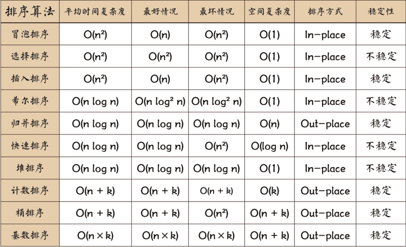
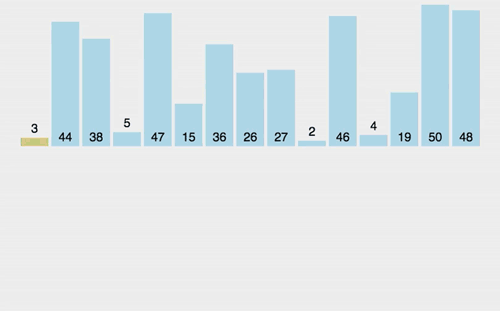
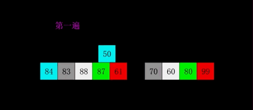
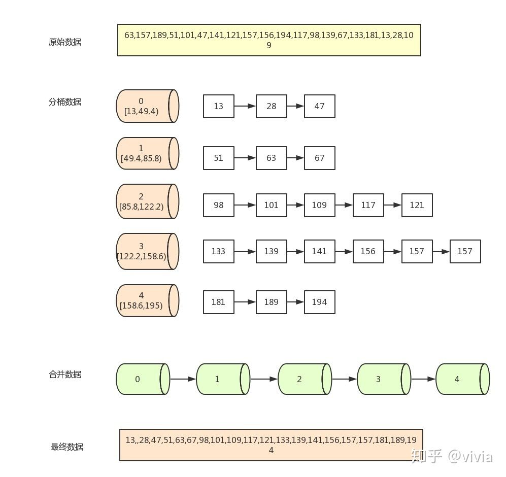

* [排序算法](#排序算法)
  * [冒泡排序](#冒泡排序)
  * [选择排序](#选择排序)
  * [插入排序](#插入排序)
  * [希尔排序](#希尔排序)
  * [归并排序<g-emoji class="g-emoji" alias="exclamation" fallback-src="https://github.githubassets.com/images/icons/emoji/unicode/2757.png">❗</g-emoji>](#归并排序exclamation)
  * [快速排序<g-emoji class="g-emoji" alias="exclamation" fallback-src="https://github.githubassets.com/images/icons/emoji/unicode/2757.png">❗</g-emoji>](#快速排序exclamation)
  * [堆排序<g-emoji class="g-emoji" alias="exclamation" fallback-src="https://github.githubassets.com/images/icons/emoji/unicode/2757.png">❗</g-emoji>](#堆排序exclamation)
  * [计数排序](#计数排序)
  * [桶排序](#桶排序)
  * [基数排序](#基数排序)
* [参考文章](#参考文章)


# 排序算法


### 冒泡排序
冒泡排序要对一个列表多次重复遍历。它要比较相邻的两项，并且交换顺序排错的项。每对 列表实行一次遍历，就有一个最大项排在了正确的位置。大体上讲，列表的每一个数据项都会在 其相应的位置“冒泡”。如果列表有n项，第一次遍历就要比较n-1对数据。需要注意，一旦列 表中最大(按照规定的原则定义大小)的数据是所比较的数据对中的一个，它就会沿着列表一直 后移，直到这次遍历结束。


```java
public class BubbleSort {
    public static void bubbleSort(int[] arr) {
        int temp = 0;
        boolean swap;
        // 每次需要排序的长度
        for (int i = arr.length - 1; i > 0; i--) {
            swap = false;
            // 从第一个元素到第i个元素
            for (int j = 0; j < i; j++) {
                if (arr[j] > arr[j + 1]) {
                    temp = arr[j];
                    arr[j] = arr[j + 1];
                    arr[j + 1] = temp;
                    swap = true;
                }
            }
            if (!swap) {
                break;
            }
        }
    }
}
```
### 选择排序
选择排序提高了冒泡排序的性能，它每遍历一次列表只交换一次数据，即进行一次遍历时找 到最大的项，完成遍历后，再把它换到正确的位置。和冒泡排序一样，第一次遍历后，最大的数 据项就已归位，第二次遍历使次大项归位。这个过程持续进行，一共需要n-1次遍历来排好n个数 据，因为最后一个数据必须在第n-1次遍历之后才能归位。


```java
public class SelectSort {
    // 选择排序：每一轮选择最小元素交换到未排定部分的开头

    public int[] sortArray(int[] nums) {
        int len = nums.length;
        // 循环不变量：[0, i) 有序，且该区间里所有元素就是最终排定的样子
        for (int i = 0; i < len - 1; i++) {
            // 选择区间 [i, len - 1] 里最小的元素的索引，交换到下标 i
            int minIndex = i;
            for (int j = i + 1; j < len; j++) {
                if (nums[j] < nums[minIndex]) {
                    minIndex = j;
                }
            }
            swap(nums, i, minIndex);
        }
        return nums;
    }

    private void swap(int[] nums, int index1, int index2) {
        int temp = nums[index1];
        nums[index1] = nums[index2];
        nums[index2] = temp;
    }
}
```
### 插入排序
插入排序的算法复杂度仍然是O(n2)，但其工作原理稍有不同。它总是保持一个位置靠前的 已排好的子表，然后每一个新的数据项被“插入”到前边的子表里，排好的子表增加一项。我们认为只含有一个数据项的列表是已经排好的。每排后面一个数据(从1开始到n-1)，这 个的数据会和已排好子表中的数据比较。比较时，我们把之前已经排好的列表中比这个数据大的移到它的右边。当子表数据小于当前数据，或者当前数据已经和子表的所有数据比较了时，就可 以在此处插入当前数据项。



```java
public class InsertSort {
    public static void insertionSort(int[] arr) {
        for (int i = 1; i < arr.length; ++i) {
            int value = arr[i];
            int position = i;
            while (position > 0 && arr[position - 1] > value) {
                arr[position] = arr[position - 1];
                position--;
            }
            arr[position] = value;
        }
    }
}
```
### 希尔排序
希尔排序有时又叫做“缩小间隔排序”，它以插入排序为基础，将原来要排序的列表划分为一些子列表，再对每一个子列表执行插入排序，从而实现对插入排序性能的改进。划分子列的特定方法是希尔排序的关键。我们并不是将原始列表分成含有连续元素的子列，而是确定一个划分列表的增量“i”，这个i更准确地说，是划分的间隔。然后把每间隔为i的所有元素选出来组成子列表，然后对每个子序列进行插入排序，最后当i=1时，对整体进行一次直接插入排序



```java
public class Solution {

    // 希尔排序

    public int[] sortArray(int[] nums) {
        int len = nums.length;
        int h = 1;

        // 使用 Knuth 增量序列
        // 找增量的最大值
        while (3 * h + 1 < len) {
            h = 3 * h + 1;
        }

        while (h >= 1) {
            // insertion sort
            for (int i = h; i < len; i++) {
                insertionForDelta(nums, h, i);
            }
            h = h / 3;
        }
        return nums;
    }

    /**
     * 将 nums[i] 插入到对应分组的正确位置上，其实就是将原来 1 的部分改成 gap
     */
    private void insertionForDelta(int[] nums, int gap, int i) {
        int temp = nums[i];
        int j = i;
        // 注意：这里 j >= deta 的原因
        while (j >= gap && nums[j - gap] > temp) {
            nums[j] = nums[j - gap];
            j -= gap;
        }
        nums[j] = temp;
    }
}
```
### 归并排序:exclamation:
归并排序是一种递归算法，它持续地将一个列表分成两半。如果列表是空的或者 只有一个元素，那么根据定义，它就被排序好了(最基本的情况)。如果列表里的元素超过一个，我们就把列表拆分，然后分别对两个部分调用递归排序。一旦这两个部分被排序好了，然后就可以对这两部分数列进行归并了。归并是这样一个过程:把两个排序好了的列表结合在一起组合成一个单一的有序的新列表。有自顶向下（递归法）和自底向上的两种实现方法。


```java
public class MergeSort {
    public static void mergeSort(int[] arr) {
        int[] temp = new int[arr.length];
        internalMergeSort(arr, temp, 0, arr.length - 1);
    }

    private static void internalMergeSort(int[] arr, int[] temp, int left, int right) {
        //当left==right的时，已经不需要再划分了
        if (left < right) {
            int middle = (left + right) / 2;
            //左子数组
            internalMergeSort(arr, temp, left, middle);
            //右子数组
            internalMergeSort(arr, temp, middle + 1, right);
            //合并两个子数组
            mergeSortedArray(arr, temp, left, middle, right);
        }
    }

    /**
     * 合并两个有序子序列
     */
    private static void mergeSortedArray(int[] arr, int[] temp, int left, int middle, int right) {
        int i = left;
        int j = middle + 1;
        int k = 0;
        while (i <= middle && j <= right) {
            temp[k++] = arr[i] <= arr[j] ? arr[i++] : arr[j++];
        }
        while (i <= middle) {
            temp[k++] = arr[i++];
        }
        while (j <= right) {
            temp[k++] = arr[j++];
        }
        //把数据复制回原数组
        for (i = 0; i < k; ++i) {
            arr[left + i] = temp[i];
        }
    }
}
```
### 快速排序:exclamation:
快速排序由C. A. R. Hoare在1962年提出。它的基本思想是：通过一趟排序将要排序的数据分割成独立的两部分，其中一部分的所有数据都比另外一部分的所有数据都要小，然后再按此方法对这两部分数据分别进行快速排序，整个排序过程可以递归进行，以此达到整个数据变成有序序列。

**算法步骤**
- 从数列中挑出一个元素，称为"基准"（pivot），
- 重新排序数列，所有比基准值小的元素摆放在基准前面，所有比基准值大的元素摆在基准后面（相同的数可以到任何一边）。在这个分区结束之后，该基准就处于数列的中间位置。这个称为分区（partition）操作。
- 递归地（recursively）把小于基准值元素的子数列和大于基准值元素的子数列排序。


```java
public class QuickSort {
    public int[] sortArray(int[] nums) {
        quickSort(nums, 0, nums.length - 1);
        return nums;
    }

    public void quickSort(int[] nums, int left, int right) {
        if (left < right) {
            int pIndex = part(nums, left, right);
            quickSort(nums, left, pIndex - 1);
            quickSort(nums, pIndex + 1, right);
        }
    }

    public int part(int[] nums, int left, int right) {
        int p = new Random().nextInt(right - left + 1) + left;
        swap(nums, left, p);

        int pData = nums[left];
        int lt = left;
        for (int i = left + 1; i <= right; i++) {
            if (nums[i] < pData) {
                lt++;
                swap(nums, i, lt);
            }
        }
        swap(nums, left, lt);
        return lt;
    }

    public void swap(int[] nums, int a, int b) {
        int tmp = nums[a];
        nums[a] = nums[b];
        nums[b] = tmp;
    }
}
```
### 堆排序:exclamation:
堆排序就是把最大堆堆顶的最大数取出，将剩余的堆继续调整为最大堆，再次将堆顶的最大数取出，这个过程持续到剩余数只有一个时结束。在堆中定义以下几种操作：


```java
public class Solution {

    public int[] sortArray(int[] nums) {
        int len = nums.length;
        // 将数组整理成堆
        heapify(nums);

        // 循环不变量：区间 [0, i] 堆有序
        for (int i = len - 1; i >= 1; ) {
            // 把堆顶元素（当前最大）交换到数组末尾
            swap(nums, 0, i);
            // 逐步减少堆有序的部分
            i--;
            // 下标 0 位置下沉操作，使得区间 [0, i] 堆有序
            siftDown(nums, 0, i);
        }
        return nums;
    }

    /**
     * 将数组整理成堆（堆有序）
     */
    private void heapify(int[] nums) {
        int len = nums.length;
        // 只需要从 i = (len - 1) / 2 这个位置开始逐层下移
        for (int i = (len - 1) / 2; i >= 0; i--) {
            siftDown(nums, i, len - 1);
        }
    }

    /**
     * @param nums
     * @param k    当前下沉元素的下标
     * @param end  [0, end] 是 nums 的有效部分
     */
    private void siftDown(int[] nums, int k, int end) {
        while (2 * k + 1 <= end) {
            int j = 2 * k + 1;
            if (j + 1 <= end && nums[j + 1] > nums[j]) {
                j++;
            }
            if (nums[j] > nums[k]) {
                swap(nums, j, k);
            } else {
                break;
            }
            k = j;
        }
    }

    private void swap(int[] nums, int index1, int index2) {
        int temp = nums[index1];
        nums[index1] = nums[index2];
        nums[index2] = temp;
    }
}
```
### 计数排序
计数排序的核心在于将输入的数据值转化为键存储在额外开辟的数组空间中。作为一种线性时间复杂度的排序，计数排序要求输入的数据必须是有确定范围的整数。

步骤
1. 找出待排序的数组中最大和最小的元素
2. 统计数组中每个值为i的元素出现的次数，存入数组C的第i项
3. 对所有的计数累加（从C中的第一个元素开始，每一项和前一项相加）
4. 反向填充目标数组：将每个元素i放在新数组的第C(i)项，每放一个元素就将C(i)减去1


```java
public class Solution {

    // 计数排序

    private static final int OFFSET = 50000;

    public int[] sortArray(int[] nums) {
        int len = nums.length;
        // 由于 -50000 <= A[i] <= 50000
        // 因此"桶" 的大小为 50000 - (-50000) = 10_0000
        // 并且设置偏移 OFFSET = 50000，目的是让每一个数都能够大于等于 0
        // 这样就可以作为 count 数组的下标，查询这个数的计数
        int size = 10_0000;

        // 计数数组
        int[] count = new int[size];
        // 计算计数数组
        for (int num : nums) {
            count[num + OFFSET]++;
        }

        // 把 count 数组变成前缀和数组
        for (int i = 1; i < size; i++) {
            count[i] += count[i - 1];
        }

        // 先把原始数组赋值到一个临时数组里，然后回写数据
        int[] temp = new int[len];
        System.arraycopy(nums, 0, temp, 0, len);

        // 为了保证稳定性，从后向前赋值
        for (int i = len - 1; i >= 0; i--) {
            int index = count[temp[i] + OFFSET] - 1;
            nums[index] = temp[i];
            count[temp[i] + OFFSET]--;
        }
        return nums;
    }
}
```
### 桶排序
桶排序是计数排序的升级版。它利用了函数的映射关系，高效与否的关键就在于这个映射函数的确定。为了使桶排序更加高效，我们需要做到这两点：
- 在额外空间充足的情况下，尽量增大桶的数量
- 使用的映射函数能够将输入的 N 个数据均匀的分配到 K 个桶中



```java
public class Solution {

    // 桶排序
    // 1 <= A.length <= 10000
    // -50000 <= A[i] <= 50000

    // 10_0000

    private static final int OFFSET = 50000;

    public int[] sortArray(int[] nums) {
        int len = nums.length;
        // 第 1 步：将数据转换为 [0, 10_0000] 区间里的数
        for (int i = 0; i < len; i++) {
            nums[i] += OFFSET;
        }

        // 第 2 步：观察数据，设置桶的个数
        // 步长：步长如果设置成 10 会超出内存限制
        int step = 1000;
        // 桶的个数
        int bucketLen = 10_0000 / step;

        int[][] temp = new int[bucketLen + 1][len];
        int[] next = new int[bucketLen + 1];

        // 第 3 步：分桶
        for (int num : nums) {
            int bucketIndex = num / step;
            temp[bucketIndex][next[bucketIndex]] = num;
            next[bucketIndex]++;
        }

        // 第 4 步：对于每个桶执行插入排序
        for (int i = 0; i < bucketLen + 1; i++) {
            insertionSort(temp[i], next[i] - 1);
        }

        // 第 5 步：从桶里依次取出来
        int[] res = new int[len];
        int index = 0;
        for (int i = 0; i < bucketLen + 1; i++) {
            int curLen = next[i];
            for (int j = 0; j < curLen; j++) {
                res[index] = temp[i][j] - OFFSET;
                index++;
            }
        }
        return res;
    }

    private void insertionSort(int[] arr, int endIndex) {
        for (int i = 1; i <= endIndex; i++) {
            int temp = arr[i];
            int j = i;
            while (j > 0 && arr[j - 1] > temp) {
                arr[j] = arr[j - 1];
                j--;
            }
            arr[j] = temp;
        }
    }
}
```
### 基数排序
基数排序(Radix Sort)是桶排序的扩展，它的基本思想是：将整数按位数切割成不同的数字，然后按每个位数分别比较。
- 排序过程：将所有待比较数值（正整数）统一为同样的数位长度，数位较短的数前面补零。然后，从最低位开始，依次进行一次排序。这样从最低位排序一直到最高位排序完成以后, 数列就变成一个有序序列。


```java
public class Solution {

    // 基数排序：低位优先

    private static final int OFFSET = 50000;

    public int[] sortArray(int[] nums) {
        int len = nums.length;

        // 预处理，让所有的数都大于等于 0，这样才可以使用基数排序
        for (int i = 0; i < len; i++) {
            nums[i] += OFFSET;
        }

        // 第 1 步：找出最大的数字
        int max = nums[0];
        for (int num : nums) {
            if (num > max) {
                max = num;
            }
        }

        // 第 2 步：计算出最大的数字有几位，这个数值决定了我们要将整个数组看几遍
        int maxLen = getMaxLen(max);

        // 计数排序需要使用的计数数组和临时数组
        int[] count = new int[10];
        int[] temp = new int[len];

        // 表征关键字的量：除数
        // 1 表示按照个位关键字排序
        // 10 表示按照十位关键字排序
        // 100 表示按照百位关键字排序
        // 1000 表示按照千位关键字排序
        int divisor = 1;
        // 有几位数，外层循环就得执行几次
        for (int i = 0; i < maxLen; i++) {

            // 每一步都使用计数排序，保证排序结果是稳定的
            // 这一步需要额外空间保存结果集，因此把结果保存在 temp 中
            countingSort(nums, temp, divisor, len, count);

            // 交换 nums 和 temp 的引用，下一轮还是按照 nums 做计数排序
            int[] t = nums;
            nums = temp;
            temp = t;

            // divisor 自增，表示采用低位优先的基数排序
            divisor *= 10;
        }

        int[] res = new int[len];
        for (int i = 0; i < len; i++) {
            res[i] = nums[i] - OFFSET;
        }
        return res;
    }

    private void countingSort(int[] nums, int[] res, int divisor, int len, int[] count) {
        // 1、计算计数数组
        for (int i = 0; i < len; i++) {
            // 计算数位上的数是几，先取个位，再十位、百位
            int remainder = (nums[i] / divisor) % 10;
            count[remainder]++;
        }

        // 2、变成前缀和数组
        for (int i = 1; i < 10; i++) {
            count[i] += count[i - 1];
        }

        // 3、从后向前赋值
        for (int i = len - 1; i >= 0; i--) {
            int remainder = (nums[i] / divisor) % 10;
            int index = count[remainder] - 1;
            res[index] = nums[i];
            count[remainder]--;
        }

        // 4、count 数组需要设置为 0 ，以免干扰下一次排序使用
        for (int i = 0; i < 10; i++) {
            count[i] = 0;
        }
    }

    /**
     * 获取一个整数的最大位数
     */
    private int getMaxLen(int num) {
        int maxLen = 0;
        while (num > 0) {
            num /= 10;
            maxLen++;
        }
        return maxLen;
    }
}
```

---

# 参考文章
- https://www.runoob.com/w3cnote/ten-sorting-algorithm.html
- https://zhuanlan.zhihu.com/p/42586566
- https://leetcode-cn.com/problems/sort-an-array/solution/fu-xi-ji-chu-pai-xu-suan-fa-java-by-liweiwei1419/
- https://mp.weixin.qq.com/s/VX9LwTK77RUPLBFHPS1Z1A