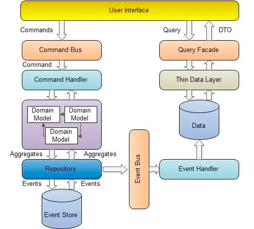

# MVC设计
MVC（Model-View-Controller）是一种软件设计模式，将应用程序划分为三个主要组成部分，分别是模型、视图和控制器。下面是每个组件的详细介绍：

1. 模型（Model）：模型是应用程序中数据和业务逻辑的表示。它包含数据、状态以及操作数据的方法。在MVC中，模型通常是独立于用户界面和控制器的，因此可以被多个视图和控制器共享。
2. 视图（View）：视图是应用程序中用户界面的表示。它负责显示模型中的数据，并与用户进行交互。在MVC中，视图通常是被控制器调用的，控制器通过视图来向用户呈现模型中的数据。
3. 控制器（Controller）：控制器负责处理用户输入，并更新模型和视图。它接收来自用户的请求，将其转换为模型操作，并更新视图以反映模型中的更改。在MVC中，控制器是模型和视图之间的中介，它将它们联系在一起。

MVC的主要目的是将应用程序的不同组成部分分离开来，以便它们可以独立开发、测试和维护。通过将模型、视图和控制器分离开来，可以使应用程序更加灵活、可扩展和可维护。另外，MVC还可以使应用程序的用户界面更加清晰和易于使用，因为它将界面逻辑与业务逻辑分离开来。

总之，MVC是一种常见的软件设计模式，它将应用程序划分为模型、视图和控制器三个组成部分，以实现代码的分离和复用，从而提高系统的可维护性、可扩展性和可靠性。

# SOA

SOA（Service-Oriented Architecture，面向服务的架构）是一种设计和组织软件系统的方法，其中系统中的各个功能被组织成独立的服务，这些服务通过网络相互通信，实现系统的功能。

SOA架构的核心概念是“服务”，即可被其他应用程序或服务调用的功能单元。服务可以根据其功能和领域进行分类和组织，以形成一个完整的应用程序。下面是SOA架构的一些特点和优势：

1. 面向服务：SOA架构是一种面向服务的架构，系统中的各个功能被组织成独立的服务。这样可以提高系统的灵活性和可扩展性，可以方便地增加、删除或替换服务。
2. 松耦合：SOA架构通过使用松耦合的通信方式，降低了系统组件之间的耦合度，可以使系统更加灵活、可维护和可扩展。
3. 可重用性：SOA架构的服务可以被多个应用程序或服务共享和重用，可以提高开发效率和代码复用性。
4. 分布式：SOA架构中的服务可以分布在不同的物理位置上，可以提高系统的可用性和可靠性。
5. 与技术无关：SOA架构可以与特定的技术无关，可以使用不同的编程语言和平台来实现服务。

# OOAP设计

OOAP（Object-Oriented Analysis and Design）是一种基于对象的分析和设计方法，它强调软件系统中的对象、类和关系，并将它们组织成一个可重用、可维护和可扩展的系统。

下面是一个简单的OOAP设计过程：

1. 需求分析：对系统的需求进行分析和收集，确定系统的功能和约束条件。
2. 概念建模：将系统中的对象抽象出来，将其组织成一个概念模型，用于描述系统的基本结构和行为。
3. 行为建模：根据系统的需求和概念模型，定义系统中的对象的行为和交互方式。
4. 设计模式：根据系统的需求和行为模型，选择适当的设计模式，以便实现系统的功能和优化系统的性能。
5. 类设计：根据设计模式，设计系统中的类和对象，并确定它们的属性、方法和关系。
6. 接口设计：定义系统的接口，以实现系统内部和外部的通信和交互。
7. 数据库设计：设计系统的数据结构和数据库，以便存储和管理系统中的数据。
8. 系统测试：测试系统的功能和性能，并确定系统是否满足需求。
9. 系统部署：部署和实施系统，确保系统能够正确运行并满足用户的需求。

总之，OOAP是一种结构化的方法，它强调对象的重用性、可维护性和可扩展性。通过OOAP设计，可以设计出高效、可靠和易于维护的软件系统。

# DDD设计
DDD（Domain-Driven Design）是一种基于领域模型的软件设计方法，强调通过深入领域的了解，来构建更贴近实际业务需求的软件系统。

下面是一个简单的DDD设计过程：

1. 洞察领域：通过与领域专家交流，深入了解业务领域的概念、术语和规则，并确定系统中的核心领域模型。
2. 模型驱动设计：将领域模型转换为软件模型，设计并实现系统中的领域对象和领域服务。
3. 上下文边界：将系统划分为多个上下文，每个上下文都有自己的领域模型和边界。
4. 领域服务：在每个上下文中设计并实现领域服务，提供对领域对象的操作和查询。
5. 聚合根：在领域模型中标识出聚合根，以便管理聚合内的对象。
6. 限界上下文：在每个上下文中定义限界上下文，用于限制领域模型的适用范围。
7. 事件驱动架构：采用事件驱动架构，以支持系统中的异步通信和领域事件处理。
8. 领域事件：定义和实现领域事件，以便在系统中广播领域模型中的变化。
9. 实现模式：根据实际情况，选择适当的实现模式，以支持系统的扩展和性能优化。

总之，DDD是一种基于领域模型的软件设计方法，通过深入领域的了解，来构建更贴近实际业务需求的软件系统。采用DDD设计可以帮助我们更好地理解业务领域，提高系统的可维护性和可扩展性。

# CQRS架构
CQRS（Command Query Responsibility Segregation，命令查询责任分离）是一种架构模式，它通过将系统中的读写操作分离，以提高系统的可扩展性、可维护性和可靠性。下面是CQRS架构的一些特点和优势：

1. 命令和查询分离：CQRS将系统中的读写操作分离，将查询操作和命令操作分别处理。这样可以有效地降低系统复杂度，提高系统的可维护性和可扩展性。
2. 高度可扩展：CQRS架构可以很容易地扩展，可以根据需求增加更多的读或写节点，或者通过水平扩展来提高系统性能。
3. 适应高并发：CQRS架构适用于高并发的场景，因为它可以有效地分离读写操作，避免了写操作的锁等待，从而提高了系统的并发性能。
4. 高度可定制：CQRS架构可以很容易地根据需求进行定制和扩展，可以根据业务需求选择合适的数据存储方式、缓存策略等。
5. 异步处理：CQRS架构可以采用异步处理方式，例如使用消息队列来实现命令的异步处理，以提高系统的可靠性和性能。

# 高内聚低耦合
高内聚低耦合是软件工程中常用的一个原则，它是指在系统设计和开发中，模块内部的各个元素之间应该紧密地联系在一起（高内聚），而模块之间的联系应该尽可能地减少（低耦合）。下面分别介绍一下这两个概念：

1. 高内聚：高内聚是指一个模块内部的各个元素之间联系紧密，它们共同实现一个单一的目标或者职责。高内聚的模块通常具有以下特点：
   1. 模块内部的元素彼此之间互相依赖，共同完成某个单一的任务；
   2. 模块内部的元素之间的耦合度较高，因此模块内的变化对其他模块的影响比较小；
   3. 模块的功能和职责比较单一，易于测试、维护和扩展。

2. 低耦合：低耦合是指一个模块与其他模块之间的联系尽可能地少，模块之间的依赖性较小。低耦合的模块通常具有以下特点：
   1. 模块之间的依赖关系比较少，模块之间的联系比较松散；
   2. 模块之间的通信采用松散耦合的方式，例如通过接口、消息队列、事件等方式；
   3. 模块之间的变化对其他模块的影响较小，系统更容易维护和扩展。

通过高内聚低耦合的原则，可以将系统划分为相对独立的模块，每个模块负责完成一个单一的任务或者职责。这样可以使得系统的各个模块更加灵活、可重用、易于维护和扩展。另外，高内聚低耦合的原则还可以提高系统的可靠性、安全性和性能。

# 参考文章
- http://www.uml.org.cn/qiyezjjs/202104302.asp
- https://tech.meituan.com/2017/12/22/ddd-in-practice.html