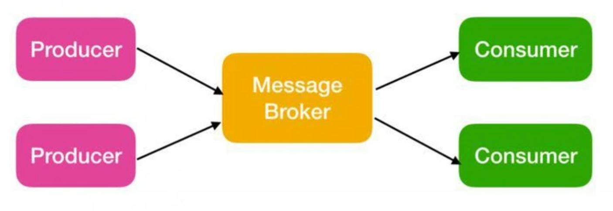
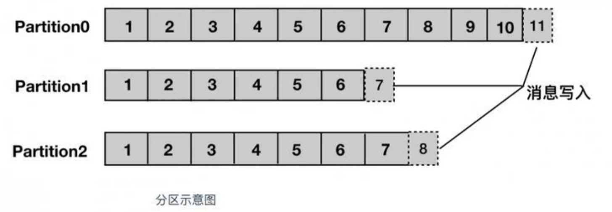
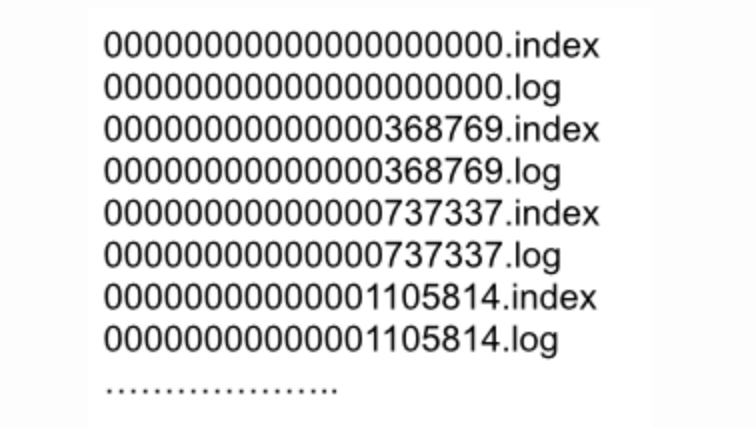
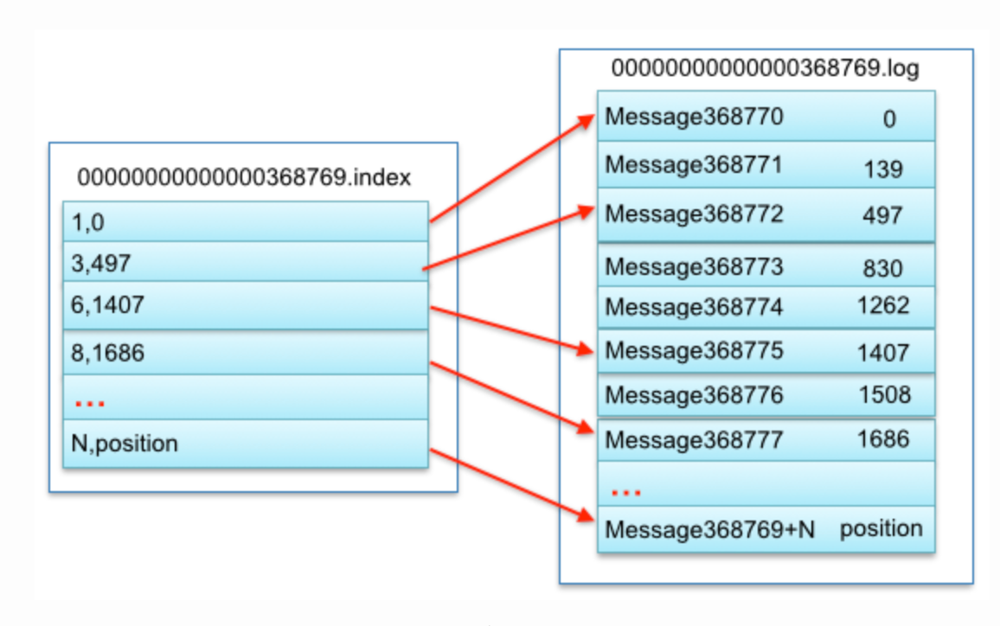
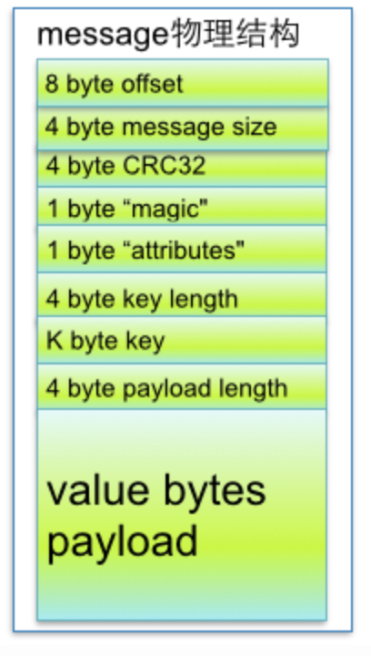
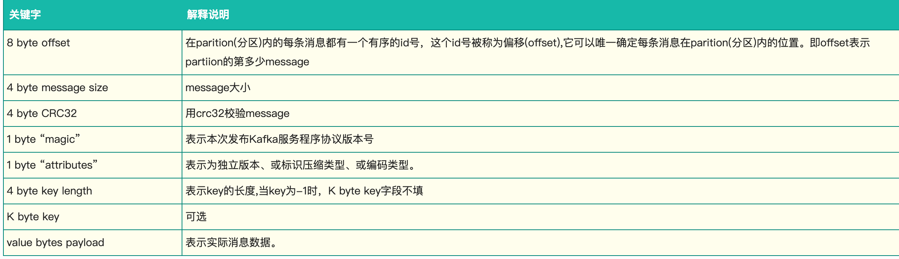
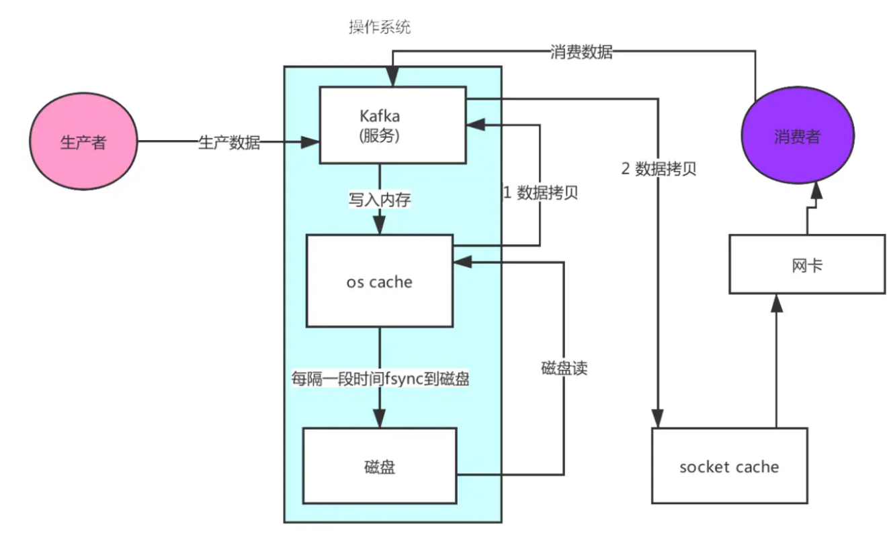
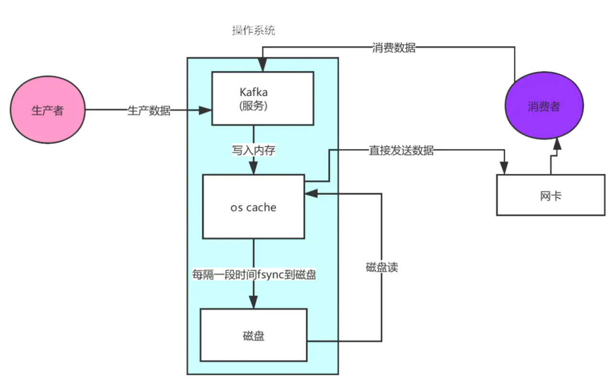

* [Kafka](#kafka)
    * [架构图](#架构图)
    * [概念](#概念)
        * [topic](#topic)
        * [partition](#partition)
            * [partiton命名规则](#partiton命名规则)
            * [kafka 为什么要将 Topic 进行分区？](#kafka-为什么要将-topic-进行分区)
        * [segment](#segment)
            * [index对应log关系](#index对应log关系)
        * [offset](#offset)
        * [broker](#broker)
        * [producer](#producer)
        * [consumer](#consumer)
    * [Kafka零拷贝](#kafka零拷贝)
    * [常见问题](#常见问题)
    * [kafka中zookeeper的作用](#kafka中zookeeper的作用)


# Kafka
## 架构图

- Producer : 发布消息的客户端
- Broker：一个从生产者接受并存储消息的客户端
- Consumer : 消费者从 Broker 中读取消息
- ZooKeeper：Kafka 通过 ZooKeeper 来存储集群的 meta 信息等
## 概念
### topic 
Topic 被称为主题，在 kafka 中，使用一个类别属性来划分消息的所属类，划分消息的这个类称为 topic。topic 相当于消息的分配标签，是一个逻辑概念。主题好比是数据库的表，或者文件系统中的文件夹。 
### partition

partition 译为分区，topic 中的消息被分割为一个或多个的 partition，它是一个物理概念，对应到系统上的就是一个或若干个目录，一个分区就是一个 提交日志。消息以追加的形式写入分区，先后以顺序的方式读取。
#### partiton命名规则
- 为topic名称+有序序号，第一个partiton序号从0开始，序号最大值为partitions数量减1
- 例如
    - topic：report_push
        - partitions数量都为partitions=4
          ```shell
          |--report_push-0
          |--report_push-1
          |--report_push-2
          |--report_push-3
          ```
#### kafka 为什么要将 Topic 进行分区？
如果 Topic 不进行分区，而将 Topic 内的消息存储于一个 broker，那么关于该 Topic 的所有读写请求都将由这一个 broker 处理，吞吐量很容易陷入瓶颈，这显然是不符合高吞吐量应用场景的。有了 Partition 概念以后，假设一个 Topic 被分为 10 个 Partitions，Kafka 会根据一定的算法将 10 个 Partition 尽可能均匀的分布到不同的 broker（服务器）上，当 producer 发布消息时，producer 客户端可以采用 random、key-hash 及 轮询 等算法选定目标 partition，若不指定，Kafka 也将根据一定算法将其置于某一分区上。Partiton 机制可以极大的提高吞吐量，并且使得系统具备良好的水平扩展能力
- 提高吞吐量
- 水平扩展
- 便于old segment快速删除，有效提高磁盘利用率
### segment 
Segment 被译为段，将 Partition 进一步细分为若干个 segment，每个 segment 文件的大小相等。

segment file组成：由2大部分组成，分别为index file和data file，此2个文件一一对应，成对出现，后缀”.index”和“.log”分别表示为segment索引文件、数据文件.
- 图2
  
  - 索引文件存储大量元数据
    - 数据文件存储大量消息
    - 索引文件中元数据指向对应数据文件中message的物理偏移地址
#### index对应log关系
  - 图
  
  - 其中以索引文件中元数据3,497为例，依次在数据文件中表示第3个message(在全局partiton表示第368772个message)、以及该消息的物理偏移地址为497。
  - 稀疏索引 segment index file采取稀疏索引存储方式，它减少索引文件大小，通过mmap可以直接内存操作，稀疏索引为数据文件的每个对应message设置一个元数据指针,它比稠密索引节省了更多的存储空间，但查找起来需要消耗更多的时间
  - .log文件
    - 由很多的message组成
      
      

    - 如果才能判断读取的这条消息读完了
    - 由上图message的物理结构定义，大致为message的size，定义了消息的长度
    - segment文件命名规则：partion全局的第一个segment从0开始，后续每个segment文件名为上一个segment文件最后一条消息的offset值。数值最大为64位long大小，19位数字字符长度，没有数字用0填充。
    - 在partition中如何通过offset查找message
        - 例如读取offset=368776的message
        - 第一步查找segment file 上述图2为例，其中00000000000000000000.index表示最开始的文件，起始偏移量(offset)为0.第二个文件00000000000000368769.index的消息量起始偏移量为368770 = 368769 + 1.同样，第三个文件00000000000000737337.index的起始偏移量为737338=737337 + 1，其他后续文件依次类推，以起始偏移量命名并排序这些文件，只要根据offset **二分查找**文件列表，就可以快速定位到具体文件。 当offset=368776时定位到00000000000000368769.index|log
        - 第二步通过segment file查找message 通过第一步定位到segment file，当offset=368776时，依次定位到00000000000000368769.index的元数据物理位置和00000000000000368769.log的物理偏移地址，然后再通过00000000000000368769.log顺序查找直到offset=368776为止。
        - 分段索引、稀疏存储
### offset
每个partition都由一系列有序的、不可变的消息组成，这些消息被连续的追加到partition中。partition中的每个消息都有一个连续的序列号叫做offset,用于partition唯一标识一条消息.
### broker
每个 Kafka 中服务器被称为 broker

broker 接收来自生产者的消息，为消息设置偏移量，并提交消息到磁盘保存。broker 为消费者提供服务，对读取分区的请求作出响应，返回已经提交到磁盘上的消息。

### producer 
生产者，即消息的发布者，其会将某 topic 的消息发布到相应的 partition 中。生产者在默认情况下把消息均衡地分布到主题的所有分区上，而并不关心特定消息会被写到哪个分区。不过，在某些情况下，生产者会把消息直接写到指定的分区
### consumer
消费者，即消息的使用者，一个消费者可以消费多个 topic 的消息，对于某一个 topic 的消息，其只会消费同一个 partition 中的消息
## Kafka零拷贝

第一次：将磁盘文件，读取到操作系统内核缓冲区；

第二次：将内核缓冲区的数据，copy到application应用程序的buffer；

第三步：将application应用程序buffer中的数据，copy到socket网络发送缓冲区(属于操作系统内核的缓冲区)；

第四次：将socket buffer的数据，copy到网卡，由网卡进行网络传输。

传统方式，读取磁盘文件并进行网络发送，经过的四次数据copy是非常繁琐的。实际IO读写，需要进行IO中断，需要CPU响应中断(带来上下文切换)，尽管后来引入DMA来接管CPU的中断请求，但四次copy是存在“不必要的拷贝”的。



Kafka使用的zero-copy的应用程序要求内核直接将数据从磁盘文件拷贝到套接字，而无需通过应用程序。零拷贝不仅大大地提高了应用程序的性能，而且还减少了内核与用户模式间的上下文切换。

## 常见问题
多个partition对应一个消费者组，消费者的数量应小于等于partition的数量
## kafka中zookeeper的作用
首先最新的提议表示将在未来取消依赖zookeeper，在2.8版本将使用self-managed quorum来取代

作用
- broker 注册
- topic 注册
- producer 和 consumer 负载均衡
- 维护 partition 与 consumer 的关系
- 记录消息消费的进度以及 consumer 注册