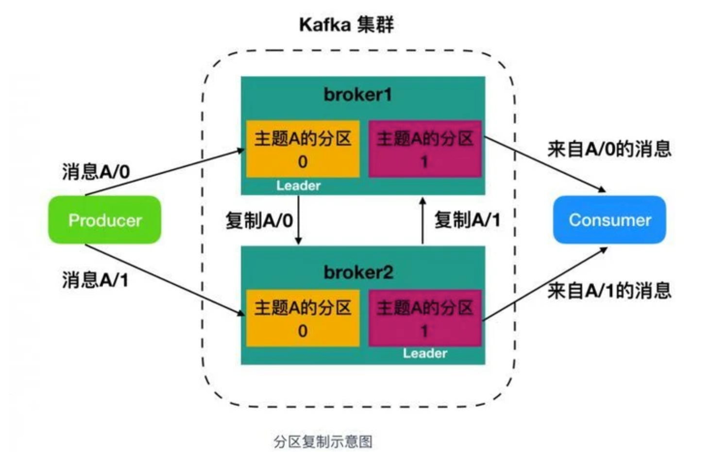

# Kafka
## 架构图

- Producer : 发布消息的客户端
- Broker：一个从生产者接受并存储消息的客户端
- Consumer : 消费者从 Broker 中读取消息
- ZooKeeper：Kafka 通过 ZooKeeper 来存储集群的 meta 信息等
## 概念
### topic 
Topic 被称为主题，在 kafka 中，使用一个类别属性来划分消息的所属类，划分消息的这个类称为 topic。topic 相当于消息的分配标签，是一个逻辑概念。主题好比是数据库的表，或者文件系统中的文件夹。 
### partition

partition 译为分区，topic 中的消息被分割为一个或多个的 partition，它是一个物理概念，对应到系统上的就是一个或若干个目录，一个分区就是一个 提交日志。消息以追加的形式写入分区，先后以顺序的方式读取。
#### partiton命名规则
- 为topic名称+有序序号，第一个partiton序号从0开始，序号最大值为partitions数量减1
- 例如
    - topic：report_push
        - partitions数量都为partitions=4
          ```shell
          |--report_push-0
          |--report_push-1
          |--report_push-2
          |--report_push-3
          ```
#### kafka 为什么要将 Topic 进行分区？
如果 Topic 不进行分区，而将 Topic 内的消息存储于一个 broker，那么关于该 Topic 的所有读写请求都将由这一个 broker 处理，吞吐量很容易陷入瓶颈，这显然是不符合高吞吐量应用场景的。有了 Partition 概念以后，假设一个 Topic 被分为 10 个 Partitions，Kafka 会根据一定的算法将 10 个 Partition 尽可能均匀的分布到不同的 broker（服务器）上，当 producer 发布消息时，producer 客户端可以采用 random、key-hash 及 轮询 等算法选定目标 partition，若不指定，Kafka 也将根据一定算法将其置于某一分区上。Partiton 机制可以极大的提高吞吐量，并且使得系统具备良好的水平扩展能力
- 提高吞吐量
- 水平扩展
- 便于old segment快速删除，有效提高磁盘利用率
### segment 
Segment 被译为段，将 Partition 进一步细分为若干个 segment，每个 segment 文件的大小相等。

segment file组成：由2大部分组成，分别为index file和data file，此2个文件一一对应，成对出现，后缀”.index”和“.log”分别表示为segment索引文件、数据文件.

图2


 
- 索引文件存储大量元数据
- 数据文件存储大量消息
- 索引文件中元数据指向对应数据文件中message的物理偏移地址
#### index对应log关系

- 其中以索引文件中元数据3,497为例，依次在数据文件中表示第3个message(在全局partiton表示第368772个message)、以及该消息的物理偏移地址为497。
- 稀疏索引 segment index file采取稀疏索引存储方式，它减少索引文件大小，通过mmap可以直接内存操作，稀疏索引为数据文件的每个对应message设置一个元数据指针,它比稠密索引节省了更多的存储空间，但查找起来需要消耗更多的时间

.log文件
- 由很多的message组成


如何才能判断读取的这条消息读完了
  - 由上图message的物理结构定义，大致为message的size，定义了消息的长度

segment文件命名规则：partion全局的第一个segment从0开始，后续每个segment文件名为上一个segment文件最后一条消息的offset值。数值最大为64位long大小，19位数字字符长度，没有数字用0填充。

在partition中如何通过offset查找message
- 例如读取offset=368776的message
- 第一步查找segment file 上述图2为例，其中00000000000000000000.index表示最开始的文件，起始偏移量(offset)为0.第二个文件00000000000000368769.index的消息量起始偏移量为368770 = 368769 + 1.同样，第三个文件00000000000000737337.index的起始偏移量为737338=737337 + 1，其他后续文件依次类推，以起始偏移量命名并排序这些文件，只要根据offset **二分查找**文件列表，就可以快速定位到具体文件。 当offset=368776时定位到00000000000000368769.index|log
- 第二步通过segment file查找message 通过第一步定位到segment file，当offset=368776时，依次定位到00000000000000368769.index的元数据物理位置和00000000000000368769.log的物理偏移地址，然后再通过00000000000000368769.log顺序查找直到offset=368776为止。
- 分段索引、稀疏存储
### offset
每个partition都由一系列有序的、不可变的消息组成，这些消息被连续的追加到partition中。partition中的每个消息都有一个连续的序列号叫做offset,用于partition唯一标识一条消息.
### broker
每个 Kafka 中服务器被称为 broker

broker 接收来自生产者的消息，为消息设置偏移量，并提交消息到磁盘保存。broker 为消费者提供服务，对读取分区的请求作出响应，返回已经提交到磁盘上的消息。

### producer 
生产者，即消息的发布者，其会将某 topic 的消息发布到相应的 partition 中。生产者在默认情况下把消息均衡地分布到主题的所有分区上，而并不关心特定消息会被写到哪个分区。不过，在某些情况下，生产者会把消息直接写到指定的分区
### consumer
消费者，即消息的使用者，一个消费者可以消费多个 topic 的消息，对于某一个 topic 的消息，其只会消费同一个 partition 中的消息
## Kafka零拷贝

第一次：将磁盘文件，读取到操作系统内核缓冲区；

第二次：将内核缓冲区的数据，copy到application应用程序的buffer；

第三步：将application应用程序buffer中的数据，copy到socket网络发送缓冲区(属于操作系统内核的缓冲区)；

第四次：将socket buffer的数据，copy到网卡，由网卡进行网络传输。

传统方式，读取磁盘文件并进行网络发送，经过的四次数据copy是非常繁琐的。实际IO读写，需要进行IO中断，需要CPU响应中断(带来上下文切换)，尽管后来引入DMA来接管CPU的中断请求，但四次copy是存在“不必要的拷贝”的。


Kafka使用的zero-copy的应用程序要求内核直接将数据从磁盘文件拷贝到套接字，而无需通过应用程序。零拷贝不仅大大地提高了应用程序的性能，而且还减少了内核与用户模式间的上下文切换。

# 常见问题
多个partition对应一个消费者组，消费者的数量应小于等于partition的数量
## kafka中zookeeper的作用
首先最新的提议表示将在未来取消依赖zookeeper，在2.8版本将使用self-managed quorum来取代

作用
- broker 注册
- topic 注册
- producer 和 consumer 负载均衡
- 维护 partition 与 consumer 的关系
- 记录消息消费的进度以及 consumer 注册

## kafka的consumer是拉模式还是推模式
producer将消息推送到broker，consumer从broker拉取消息。

push模式的缺点：

由broker决定消息推送的速率，对于不同消费速率的consumer就不太好处理了。消息系统都致力于让consumer以最大的速率最快速的消费消息，但不幸的是，push模式下，当broker推送的速率远大于consumer消费的速率时，consumer恐怕就要崩溃了

pull模式的缺点：

- broker需要在数据为空时阻塞
- broker需要储存数据
## kafka生产者丢消息情况
当producer向leader发送数据时，可以通过request.required.acks参数来设置数据可靠性的级别：

- acks=0： 表示producer不需要等待任何broker确认收到消息的回复，就可以继续发送下一条消息。性能最高，但是最容易丢消息。大数据统计报表场景，对性能要求很高，对数据丢失不敏感的情况可以用这种。
- acks=1： 至少要等待leader已经成功将数据写入本地log，但是不需要等待所有follower是否成功写入。就可以继续发送下一条消息。这种情况下，如果follower没有成功备份数据，而此时leader又挂掉，则消息会丢失。
- acks=-1或all： 这意味着leader需要等待所有备份(min.insync.replicas配置的备份个数)都成功写入日志，这种策略会保证只要有一个备份存活就不会丢失数据。这是最强的数据保证。一般除非是金融级别，或跟钱打交道的场景才会使用这种配置。当然了如果min.insync.replicas配置的是1则也可能丢消息，跟acks=1情况类似。

## kafka消费者丢消息情况
如果消费这边配置的是自动提交，万一消费到数据还没处理完，就自动提交offset了，但是此时你consumer直接宕机了，未处理完的数据丢失了，下次也消费不到了。

## Kafka如何保证高可用性
- `数据的冗余备份`：Kafka 采用分布式的方式存储数据，并将数据分布在多个 Broker 节点上，因此在某个节点出现故障时，其他节点上的数据仍然可用。Kafka 还支持数据副本机制，即每个 Partition 中的数据都会有多个备份，保证了数据的冗余备份。
- `ZooKeeper 协调机制`：Kafka 使用 ZooKeeper 来实现分布式协调，包括集群中的 Broker 选举、Topic 的元数据管理、Consumer Group 的协调等。ZooKeeper 自身就是一个高可用的分布式协调服务，保证了 Kafka 在运行过程中的高可用性。
- `消费者的偏移量管理`：Kafka 的 Consumer Group 采用了偏移量（offset）机制来管理消息的消费进度。消费者组中的每个 Consumer 都会记录自己已经消费的消息的偏移量，这个偏移量被保存在 Kafka 的 Topic 中。当某个 Consumer 挂掉后，其他 Consumer 可以接替它继续消费，并从上一个 Consumer 留下的偏移量处继续消费，从而保证了消息的高可靠性。
- `Controller 选举机制`：Kafka 集群中有一个 Controller，负责管理 Broker 的生命周期和 Topic 的元数据信息，以及一些集群级别的操作。当 Controller 出现故障时，Kafka 会自动进行选举，选出新的 Controller，从而保证了 Kafka 集群的高可用性。

## Kafka的消息保存在哪里？Kafka的消息是如何分区的？

Kafka的消息保存在Kafka的broker节点上，以topic为单位进行分区存储。每个topic可以分成多个partition，每个partition是一个有序的、不可变的消息序列，每条消息在被写入之后就不可修改，也不会被删除，只有在过期或者被清理的情况下才会被删除。

Kafka使用分区来实现消息的并行处理和负载均衡。一个topic的消息可以分散存储在多个broker节点的多个partition中，每个partition只由一个broker节点负责读写，保证了消息的有序性。在同一个partition中，消息的顺序是有序的，不同partition之间的消息并不保证有序。

Kafka使用了一种基于一致性hash算法的分区器来决定将消息发送到哪个partition中，它根据消息的key值计算hash值，然后根据hash值对partition数取模，从而确定该消息属于哪个partition。如果消息没有key值，则使用轮询的方式将消息平均分配到各个partition中。为了避免消息不均衡的情况，可以通过设置partition数目和指定key值来控制消息的分布。

## Kafka是如何处理流量峰值的？
Kafka是一个高吞吐量、低延迟的分布式消息系统，可以处理海量数据的传输。Kafka可以通过多个方式处理流量峰值，以下是一些常见的方法：

- `增加分区数量`：Kafka中，每个主题都可以分为多个分区，增加分区数量可以增加Kafka集群的并行处理能力，从而提高吞吐量。
- `增加副本数量`：Kafka中，每个分区都有多个副本，增加副本数量可以提高数据的可靠性，并且在发生故障时可以实现快速的恢复。另外，副本也可以在多个Broker之间进行复制，从而增加整个集群的吞吐量。
- `增加Broker数量`：增加Kafka集群的Broker数量可以提高集群的并行处理能力，从而更好地处理流量峰值。
- `调整Kafka参数`：Kafka提供了一系列参数，可以通过调整这些参数来优化Kafka的性能，例如调整发送和接收的缓冲区大小、批量处理的数量、消息压缩方式等。

## Kafka消息压缩方式
Kafka支持多种消息压缩方式，可以在生产者和消费者端进行配置。以下是Kafka支持的压缩方式：

- `Gzip压缩`：这种压缩方式可以获得较好的压缩比，但会对CPU有一定的消耗。
- `Snappy压缩`：这种压缩方式速度较快，但压缩比相对较低，对CPU的消耗也比较小。
- `LZ4压缩`：这种压缩方式压缩和解压缩的速度都很快，而且不会对CPU造成过大的负担。
- `Zstandard压缩`：这种压缩方式是在LZ4的基础上进行改进，压缩比和解压速度都比LZ4更好。

## Kafka的重平衡机制是什么？
Kafka的重平衡机制是指在Kafka集群中，当有新的Consumer加入或者已有Consumer从Consumer Group中退出时，Kafka会自动对Consumer Group中的Consumer进行重新分配分区（Partition），以保证每个Consumer所处理的分区数尽可能平均。

具体地，当有新的Consumer加入或者已有Consumer从Consumer Group中退出时，Kafka Controller会触发重平衡操作。重平衡的过程包括以下步骤：

1. 暂停所有的消费者（consumer）并且计算出所有的消费者需要重新分配的 partition
2. 如果有新的 consumer 加入，Controller 会将该 consumer 加入到 Consumer Group 中，并分配该 consumer 需要消费的 partition
3. 如果有已经存在的 consumer 退出，Controller 会将该 consumer 对应的 partition 从该 consumer 分配的 partition 中移除，并将该 partition 分配给其他的 consumer
4. Controller 将新的分配方案发送给每个消费者，并恢复消费者的消费。

需要注意的是，重平衡机制会在消费者感知到消费分区变化之前先暂停所有消费者。因此，如果在 Consumer Group 中的消费者数量比较多，或者 Consumer Group 中的消费者数量变化频繁，重平衡的过程可能会影响消息的消费。因此，在实际应用中，需要合理配置 Consumer Group 的数量和每个 Consumer 所消费的 Partition 数量，以减少重平衡的频率和影响。

## Kafka中的生产者和消费者是什么？Kafka是如何确保数据的顺序性和一致性的？
在 Kafka 中，生产者（Producer）是指将数据发布到 Kafka 主题的应用程序，而消费者（Consumer）则是从 Kafka 主题中读取数据的应用程序。

Kafka 通过分区（Partition）机制来保证数据的顺序性和一致性。每个主题（Topic）可以划分为多个分区，每个分区只由一个消费者组（Consumer Group）中的一个消费者进行消费。在一个分区中，Kafka 保证消息的顺序是有序的，即使有多个生产者向同一个分区发送消息也是如此。当一个消费者从一个分区中读取消息时，Kafka 会返回已经提交（Committed）的最大偏移量（Offset），确保该消费者能够接收到正确的消息。

在 Kafka 中，多个消费者可以组成一个消费者组，消费者组可以协同消费主题中的所有分区，从而实现更高的消费吞吐量。当一个消费者组中的消费者数量发生变化（如新增消费者或消费者退出），Kafka 会触发一次重新平衡（Rebalance）操作，重新分配分区给各个消费者。在重新平衡的过程中，Kafka 会确保每个分区只由一个消费者进行消费，从而保证消费的一致性和顺序性。

## kafka消费组怎么消费一个topic的数据
消费组可以通过订阅（subscribe）或者手动分配（assign）的方式消费一个topic的数据。

当消费组订阅一个topic时，Kafka会自动为消费者组中的每个消费者分配一个或多个分区，然后每个消费者就可以独立地消费自己被分配的分区中的消息。消费者组中的消费者可以动态地加入或者退出，Kafka会自动重新分配分区。

当消费者组手动分配分区时，消费者可以通过assign()方法指定要消费的分区。在这种情况下，消费者组无法自动地进行分区重新分配，也就是说，消费者加入或者退出时，需要手动重新分配分区。

无论是订阅还是手动分配，消费组可以通过poll()方法从分配给它的分区中拉取数据。Kafka保证在同一个分区内消息的顺序和一致性，但不保证不同分区之间的顺序和一致性。

## Kafka有哪些优缺点？
Kafka是一种分布式的流处理平台，具有以下优点：

优点：

- 高吞吐量和低延迟：Kafka通过分布式存储和基于磁盘的批量操作实现了高吞吐量和低延迟的数据传输。
- 可伸缩性：Kafka支持横向扩展，可以通过增加Broker节点来扩展集群的吞吐量和存储容量。
- 可靠性：Kafka采用副本机制实现数据的备份和恢复，确保了数据的可靠性和高可用性。
- 灵活性：Kafka可以与各种数据处理框架（如Hadoop、Spark等）无缝集成，适用于多种数据处理场景。
- 消息保留机制：Kafka支持基于时间和大小的消息保留机制，可以设置消息的保存时间和存储大小，避免了消息堆积和数据浪费。

缺点：

- 相对复杂：相比于其他消息队列，Kafka的配置和部署相对复杂。
- 学习成本高：Kafka的设计思想和内部机制相对复杂，需要较长的学习周期。
- 硬盘依赖：Kafka将消息持久化到硬盘上，因此对硬件的要求较高。
- 消息过期：Kafka采用基于时间的消息过期机制，一些过期的消息可能会被误删。

## Kafka的API是什么？如何使用Kafka API实现生产和消费？
Kafka的API主要是基于Java语言的，包括生产者API、消费者API和管理API。

下面简单介绍一下使用Kafka API实现生产和消费的步骤：

引入Kafka客户端依赖
```xml
<dependency>
    <groupId>org.apache.kafka</groupId>
    <artifactId>kafka-clients</artifactId>
    <version>{kafka-version}</version>
</dependency>
```
创建生产者实例
```java
Properties props = new Properties();
props.put("bootstrap.servers", "localhost:9092");
props.put("key.serializer", "org.apache.kafka.common.serialization.StringSerializer");
props.put("value.serializer", "org.apache.kafka.common.serialization.StringSerializer");

Producer<String, String> producer = new KafkaProducer<>(props);
```
在创建生产者实例时，需要指定Kafka集群的地址、键和值的序列化器。

发送消息
```java
ProducerRecord<String, String> record = new ProducerRecord<>("test_topic", "key", "value");

producer.send(record);

```
创建一个ProducerRecord对象，包括要发送的主题、键和值，然后使用生产者实例的send()方法将其发送到Kafka集群中。

创建消费者实例
```java
Properties props = new Properties();
props.put("bootstrap.servers", "localhost:9092");
props.put("group.id", "test_group");
props.put("key.deserializer", "org.apache.kafka.common.serialization.StringDeserializer");
props.put("value.deserializer", "org.apache.kafka.common.serialization.StringDeserializer");

Consumer<String, String> consumer = new KafkaConsumer<>(props);

```
在创建消费者实例时，需要指定Kafka集群的地址、消费者组ID以及键和值的反序列化器。

订阅主题并消费消息
```java
consumer.subscribe(Collections.singletonList("test_topic"));

while (true) {
    ConsumerRecords<String, String> records = consumer.poll(Duration.ofMillis(100));

    for (ConsumerRecord<String, String> record : records) {
        System.out.println(record.value());
    }
}

```
使用消费者实例的subscribe()方法订阅要消费的主题，然后在一个循环中使用poll()方法从Kafka集群中获取消息，并遍历处理每条消息。

## 如何部署和扩展Kafka集群？
Kafka集群的部署和扩展可以参考以下步骤：

1. 启动多个Kafka Broker：在每个节点上都要启动一个Kafka Broker，每个Broker都要配置成相同的Cluster Name。
2. 配置Kafka集群：在每个节点上修改Kafka的server.properties配置文件，将以下参数设置为相同的值：
```bash
broker.id=1 # 每个节点的id不能重复
listeners=PLAINTEXT://hostname:9092 # 监听地址和端口
log.dirs=/tmp/kafka-logs # 消息数据存储目录
zookeeper.connect=zk1:2181,zk2:2181,zk3:2181 # Zookeeper集群地址
```
3. 创建Topic：创建Topic时，需要指定多个Partition，让消息在多个节点上进行分布式存储。
4. 生产和消费消息：使用相同的方式生产和消费消息，Kafka会根据Partition的配置，将消息在多个节点上进行分布式存储和处理。
5. 扩展Kafka集群：如果需要扩展Kafka集群，可以在新节点上启动一个Kafka Broker，并修改server.properties配置文件中的broker.id和listeners参数。然后在Topic中增加Partition，Kafka会自动将消息在新节点上进行分布式存储和处理。

在集群部署过程中，需要注意以下几点：

- 每个节点的配置文件需要保持一致。
- 集群中的每个节点都需要设置唯一的broker.id。
- Zookeeper集合中的每个节点都需要知道集群中的所有节点信息。
- 新节点加入后，需要等待一段时间进行重平衡，期间可能会影响到消费者的消费速度。
- 当节点数量增加时，需要注意调整Kafka的配置，以保证高吞吐量和高可用性。

## Kafka 的分区策略有哪些？
所谓分区策略就是决定生产者将消息发送到哪个分区的算法。

- RoundRobinPartitioner：轮询分区策略，按照分区编号依次将消息分配到不同的分区。
- HashedPartitioner：哈希分区策略，将消息的key进行哈希计算，然后将哈希结果对分区数取余，得到消息所在的分区。
- RangePartitioner：范围分区策略，根据消息key的范围将消息分配到不同的分区。需要在创建主题时指定分区边界。
- StickyPartitioner：粘性分区策略，将消息发送到同一个分区，直到该分区的消息数量超过阈值，才会将消息发送到下一个分区。这个策略可以用来保证消息的顺序性。
- CustomPartitioner：自定义分区策略，用户可以根据自己的业务逻辑自定义分区策略。

## kafka怎么顺序消费
Kafka 的顺序消费保证基于 Partition。如果你希望严格保证消息的顺序，应该：

- 将相关消息发送到同一个 Partition（通过设置相同的 key）。
- 确保消费者线程对单个 Partition 进行消费。
- 合理设置生产者和消费者的配置。

# 参考文章
- https://blog.51cto.com/u_15239532/2858247
- https://www.daimajiaoliu.com/series/kafka/479991a51900405
- https://chat.openai.com/
