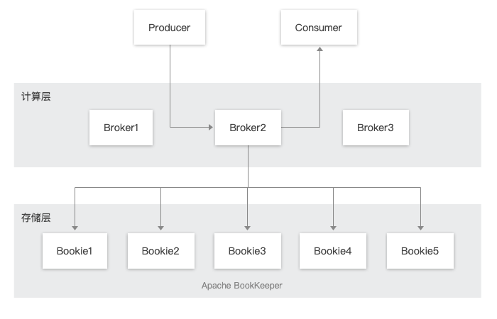
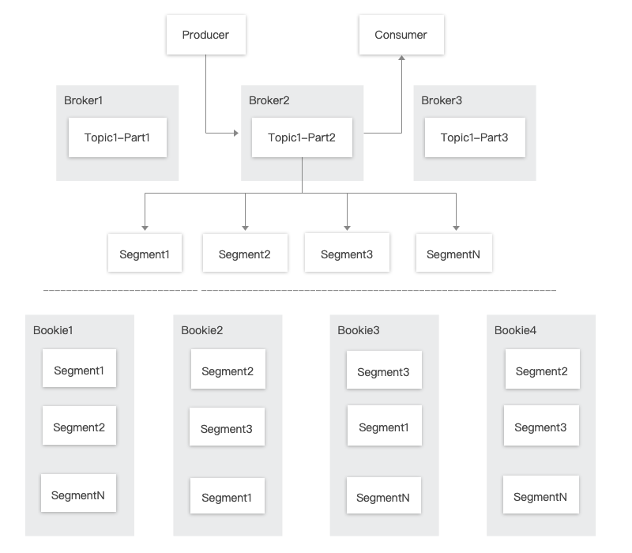
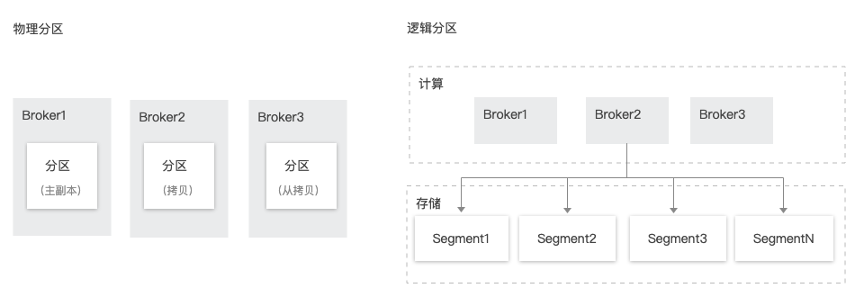
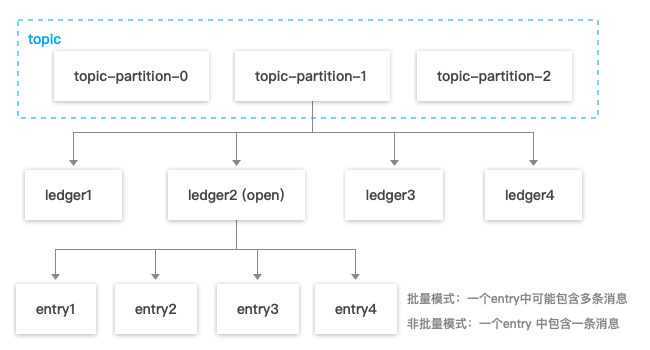
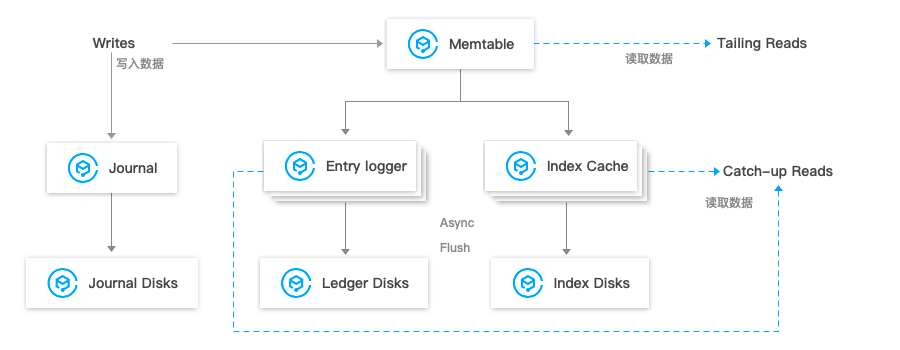
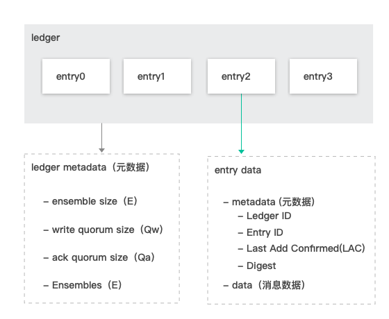
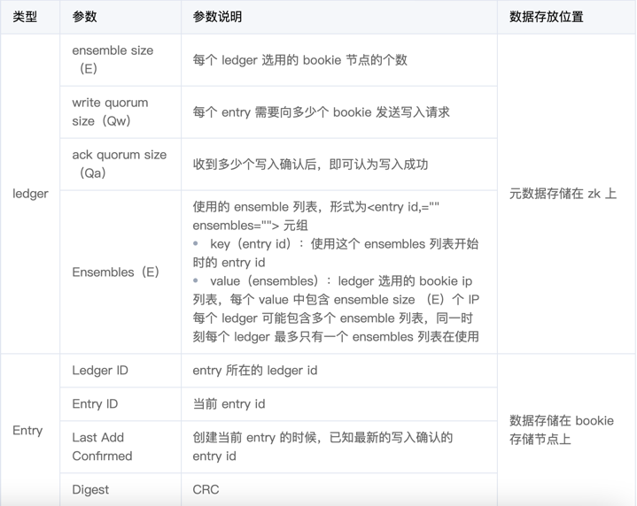
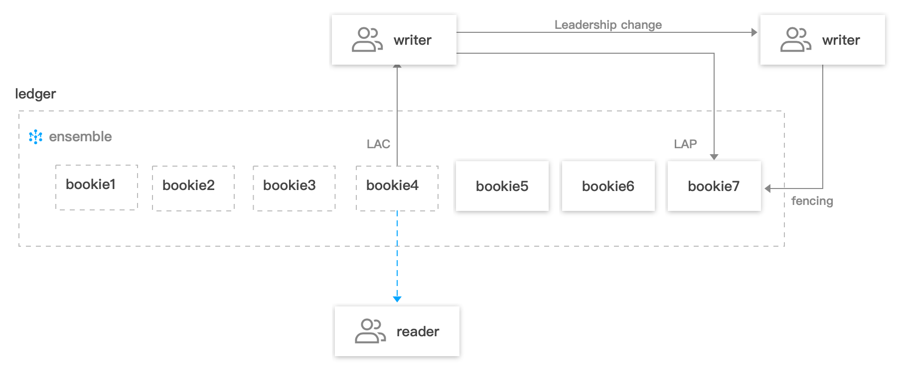
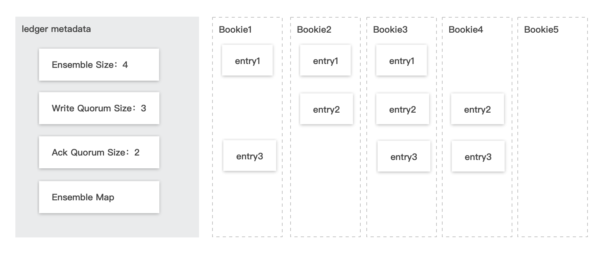
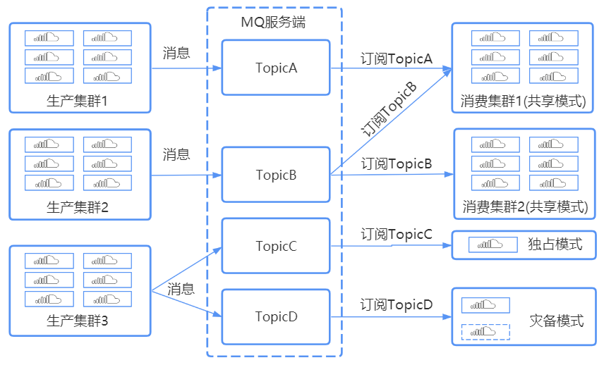

* [Pulsar](#pulsar)
    * [pulsar的优势](#pulsar的优势)
* [Apache Pulsar 架构](#apache-pulsar-架构)
    * [Topic 与分区](#topic-与分区)
    * [物理分区与逻辑分区](#物理分区与逻辑分区)
* [消息存储原理与 ID 规则](#消息存储原理与-id-规则)
    * [消息 ID 生成规则](#消息-id-生成规则)
    * [分片机制详解：Legder 和 Entry](#分片机制详解legder-和-entry)
        * [Journals](#journals)
        * [EntryLogFile](#entrylogfile)
        * [Index 文件](#index-文件)
        * [Entry 数据写入](#entry-数据写入)
        * [Entry 数据读取](#entry-数据读取)
        * [数据一致性保证：LastLogMark](#数据一致性保证lastlogmark)
* [消息副本与存储机制](#消息副本与存储机制)
    * [消息元数据组成](#消息元数据组成)
    * [消息副本机制](#消息副本机制)
        * [消息副本分布](#消息副本分布)
* [消息恢复机制](#消息恢复机制)
* [pulsar的消息模式](#pulsar的消息模式)
    * [独占模式（Exclusive）](#独占模式exclusive)
    * [灾备模式（Failover）](#灾备模式failover)
    * [共享模式（Shared）](#共享模式shared)
* [定时和延时消息](#定时和延时消息)
    * [相关概念](#相关概念)
    * [适用场景](#适用场景)
    * [使用方式](#使用方式)
    * [定时消息](#定时消息)
    * [延时消息](#延时消息)
    * [使用说明和限制](#使用说明和限制)
* [消息重试与死信机制](#消息重试与死信机制)
    * [自动重试](#自动重试)
    * [自定义参数设置](#自定义参数设置)
    * [重试规则](#重试规则)
    * [重试消息的消息属性](#重试消息的消息属性)
    * [重试消息的消息 ID 流转](#重试消息的消息-id-流转)
        * [完整代码示例](#完整代码示例)
    * [主动重试](#主动重试)
* [参考文档](#参考文档)

# Pulsar
## pulsar的优势
数据强一致

 Pulsar 版采用 BookKeeper 一致性协议 实现数据强一致性（类似 RAFT 算法），将消息数据备份写到不同物理机上，并且要求是同步刷盘。当某台物理机出故障时，后台数据复制机制能够对数据快速迁移，保证用户数据备份可用。

高性能低延迟

 Pulsar 版能够高效支持百万级消息生产和消费，海量消息堆积且消息堆积容量不设上限，支撑了腾讯计费所有场景；性能方面，单集群 QPS 超过10万，同时在时耗方面有保护机制来保证低延迟，帮助您轻松满足业务性能需求。

百万级 Topic

 Pulsar 版计算与存储架构的分离设计，使得  Pulsar 版可以轻松支持百万级消息主题。相比于市场上其他 MQ 产品，整个集群不会因为 Topic 数量增加而导致性能急剧下降。

丰富的消息类型

 Pulsar 版提供丰富的消息类型，涵盖普通消息、顺序消息（全局顺序 / 分区顺序）、分布式事务消息、定时消息，满足各种严苛场景下的高级特性需求。

消费者数量无限制

不同于 Kafka 的消息消费模式， Pulsar 版的消费者数量不受限于 Topic 的分区个数，并且会按照一定的算法均衡每个消费者的消息量，业务可按需启动对应的消费者数量。

多协议接入

 Pulsar 版的 API 支持 Java、C++、Go 等多语言，并且支持 HTTP 协议，可扩展更多语言的接入，另外还支持开源RocketMQ、RabbitMQ客户端的接入。如果用户只是利用消息队列的基础功能进行消息的生产和消费，可以不用修改代码就完成到  Pulsar 版的迁移。

隔离控制

提供按租户对 Topic 进行隔离的机制，同时可精确管控各个租户的生产和消费速率，保证租户之间互不影响，消息的处理不会出现资源竞争的现象。

# Apache Pulsar 架构
Apache Pulsar 是一个发布-订阅模型的消息系统，由 Broker、Apache BookKeeper、Producer、Consumer 等组件组成。



- Producer ： 消息的生产者，负责发布消息到 Topic。
- Consumer：消息的消费者，负责从 Topic 订阅消息。
- Broker：无状态服务层，负责接收和传递消息，集群负载均衡等工作，Broker 不会持久化保存元数据，因此可以快速的上、下线。
- Apache BookKeeper：有状态持久层，由一组 Bookie 存储节点组成，可以持久化地存储消息。

Apache Pulsar 在架构设计上采用了计算与存储分离的模式，消息发布和订阅相关的计算逻辑在 Broker 中完成，数据存储在 Apache BookKeeper 集群的 Bookie 节点上。

## Topic 与分区
Topic（主题）是某一种分类的名字，消息在 Topic 中可以被存储和发布。生产者往 Topic 中写消息，消费者从 Topic 中读消息。

Pulsar 的 Topic 分为 Partitioned Topic 和 Non-Partitioned Topic 两类，Non-Partitioned Topic 可以理解为一个分区数为1的 Topic。实际上在 Pulsar 中，Topic 是一个虚拟的概念，创建一个3分区的 Topic，实际上是创建了3个“分区Topic”，发给这个 Topic 的消息会被发往这个 Topic 对应的多个 “分区Topic”。
例如：生产者发送消息给一个分区数为3，名为my-topic的 Topic，在数据流向上是均匀或者按一定规则（如果指定了key）发送给了 my-topic-partition-0、my-topic-partition-1 和 my-topic-partition-2 三个“分区 Topic”。

分区 Topic 做数据持久化时，分区是逻辑上的概念，实际存储的单位是分片（Segment）的。

如下图所示，分区 Topic1-Part2 的数据由N个 Segment 组成， 每个 Segment 均匀分布并存储在 Apache BookKeeper 群集中的多个 Bookie 节点中， 每个 Segment 具有3个副本。



## 物理分区与逻辑分区
逻辑分区和物理分区对比如下：



物理分区：计算与存储耦合，容错需要拷贝物理分区，扩容需要迁移物理分区来达到负载均衡。

逻辑分区：物理“分片”，计算层与存储层隔离，这种结构使得 Apache Pulsar 具备以下优点。

Broker 和 Bookie 相互独立，方便实现独立的扩展以及独立的容错。
Broker 无状态，便于快速上、下线，更加适合于云原生场景。
分区存储不受限于单个节点存储容量。
分区数据分布均匀，单个分区数据量突出不会使整个集群出现木桶效应。
存储不足扩容时，能迅速利用新增节点平摊存储负载。

# 消息存储原理与 ID 规则

## 消息 ID 生成规则
在 Pulsar 中，每条消息都有自己的 ID（即 MessageID），MessageID 由四部分组成：ledgerId:entryID:partition-index:batch-index。其中：

partition-index：指分区的编号，在非分区 topic 的时候为 -1。
batch-index：在非批量消息的时候为 -1。
消息 ID 的生成规则由 Pulsar 的消息存储机制决定，Pulsar 中消息存储原理图如下：



如上图所示，在 Pulsar中，一个 Topic 的每一个分区会对应一系列的 ledger，其中只有一个 ledger 处于 open 状态即可写状态，而每个 ledger 只会存储与之对应的分区下的消息。

Pulsar 在存储消息时，会先找到当前分区使用的 ledger ，然后生成当前消息对应的 entry ID，entry ID 在同一个 ledger 内是递增的。每个 ledger 存在的时长或保存的 entry 个数超过阈值后会进行切换，新的消息会存储到同一个 partition 中的下一个 ledger 中。

- 批量生产消息情况下，一个 entry 中可能包含多条消息。
- 非批量生产的情况下，一个 entry 中包含一条消息（producer 端可以配置这个参数，默认是批量的）。

Ledger 只是一个逻辑概念，是数据的一种逻辑组装维度，并没有对应的实体。而 bookie 只会按照 entry 维度进行写入、查找、获取。

## 分片机制详解：Legder 和 Entry

Pulsar 中的消息数据以 ledger 的形式存储在 BookKeeper 集群的 bookie 存储节点上。Ledger 是一个只追加的数据结构，并且只有一个写入器，这个写入器负责多个 bookie 的写入。Ledger 的条目会被复制到多个 bookie 中，同时会写入相关的数据来保证数据的一致性。

BookKeeper 需要保存的数据包括：

### Journals

journals 文件里存储了 BookKeeper 的事务日志，在任何针对 ledger 的更新发生前，都会先将这个更新的描述信息持久化到这个 journal 文件中。
BookKeeper 提供有单独的 sync 线程根据当前 journal 文件的大小来作 journal 文件的 rolling。
### EntryLogFile

存储真正数据的文件，来自不同 ledger 的 entry 数据先缓存在内存buffer中，然后批量flush到EntryLogFile中。
默认情况下，所有ledger的数据都是聚合然后顺序写入到同一个EntryLog文件中，避免磁盘随机写。
### Index 文件

所有 Ledger 的 entry 数据都写入相同的 EntryLog 文件中，为了加速数据读取，会作 ledgerId + entryId 到文件 offset 的映射，这个映射会缓存在内存中，称为 IndexCache。
IndexCache 容量达到上限时，会被 sync 线程 flush 到磁盘中。

三类数据文件的读写交互如下图：



### Entry 数据写入

1. 数据首先会同时写入 Journal（写入 Journal 的数据会实时落到磁盘）和 Memtable（读写缓存）。
2. 写入 Memtable 之后，对写入请求进行响应。
3. Memtable 写满之后，会 flush 到 Entry Logger 和 Index cache，Entry Logger 中保存数据，Index cache 中保存数据的索引信息，
4. 后台线程将 Entry Logger 和 Index cache 数据落到磁盘。

### Entry 数据读取

- Tailing read 请求：直接从 Memtable 中读取 Entry。
- Catch-up read（滞后消费）请求：先读取 Index信息，然后索引从 Entry Logger 文件读取 Entry。
### 数据一致性保证：LastLogMark

- 写入的 EntryLog 和 Index 都是先缓存在内存中，再根据一定的条件周期性的 flush 到磁盘，这就造成了从内存到持久化到磁盘的时间间隔，如果在这间隔内 BookKeeper 进程崩溃，在重启后，我们需要根据 journal 文件内容来恢复，这个 LastLogMark 就记录了从 journal 中什么位置开始恢复。
- 它其实是存在内存中，当 IndexCache 被 flush 到磁盘后其值会被更新，LastLogMark 也会周期性持久化到磁盘文件，供 Bookkeeper 进程启动时读取来从 journal 中恢复。
- LastLogMark 一旦被持久化到磁盘，即意味着在其之前的 Index 和 EntryLog 都已经被持久化到了磁盘，那么 journal 在这 LastLogMark 之前的数据都可以被清除了。

# 消息副本与存储机制

## 消息元数据组成
Pulsar 中每个分区 Topic 的消息数据以 ledger 的形式存储在 BookKeeper 集群的 bookie 存储节点上，每个 ledger 包含一组 entry，而 bookie 只会按照 entry 维度进行写入、查找、获取。

> 批量生产消息的情况下，一个 entry 中可能包含多条消息，所以 entry 和消息并不一定是一一对应的。

Ledger 和 entry 分别对应不同的元数据。

- ledger 的元数据存储在 zk 上。
- entry 除了消息数据部分之外，还包含元数据，entry 的数据存储在 bookie 存储节点上。





每个 ledger 在创建的时候，会在现有的 BookKeeper 集群中的可写状态的 bookie 候选节点列表中，选用 ensemble size 对应个数的 bookie 节点，如果没有足够的候选节点则会抛出 BKNotEnoughBookiesExceptio 异常。选出候选节点后，将这些信息组成 <entry id, ensembles> 元组，存储到 ledger 的元数据里的 ensembles 中。

## 消息副本机制
消息写入流程



客户端在写入消息时，每个 entry 会向 ledger 当前使用的 ensemble 列表中的 Qw 个 bookie 节点发送写入请求，当收到 Qa 个写确认后，即认为当前消息写入存储成功。同时会通过 LAP（lastAddPushed）和 LAC（LastAddConfirmed）分别标识当前推送的位置和已经收到存储确认的位置。

每个正在推送的 entry 中的 LAC 元数据值，为当前时刻创建发送 entry 请求时，已经收到最新的确认位置值。LAC 所在位置及之前的消息对读客户端是可见的。

同时，pulsar 通过 fencing 机制，来避免同时有多个客户端对同一个 ledger 进行写操作。这里主要适用于一个 topic/partition 的归属关系从一个 broker 变迁到另一个 broker 的场景。

### 消息副本分布

每个 entry 写入时，会根据当前消息的 entry id 和当前使用的 ensembles 列表的开始 entry id（即key值），计算出在当前 entry 需要使用 ensemble 列表中由哪组 Qw 个 bookie 节点进行写入。之后，broker 会向这些 bookie 节点发送写请求，当收到 Qa 个写确认后，即认为当前消息写入存储成功。这时至少能够保证 Qa 个消息的副本个数。



如上图所示，ledger 选用了4个 bookie 节点（bookie1-4 这4个节点），每次写入3个节点，当收到2个写入确认即代表消息存储成功。当前 ledger 选中的 ensemble 从 entry 1开始，使用 bookie1、bookie2、bookie3 进行写入，写入 entry 2的时候选用 bookie2、bookie3、bookie4写入，而 entry 3 则会根据计算结果，写入 bookie3、bookie4、bookie1。

# 消息恢复机制
Pulsar 的 BookKeeper 集群中的每个 bookie 在启动的时候，默认自动开启 recovery 的服务，这个服务会进行如下几个事情：

1. auditorElector 审计选举。
2. replicationWorker 复制任务。
3. deathWatcher 宕机监控。

BookKeeper 集群中的每个 bookie 节点，会通过 zookeeper 的临时节点机制进行选主，主 bookie 主要处理如下几个事情：

1. 负责监控 bookie 节点的变化。
2. 到 zk 上面标记出宕机的 bookie 上面的 ledger 为 Underreplicated 状态。
3. 检查所有的 ledger 的副本数（默认一周一个周期）。
4. Entry 副本数检查（默认未开启）。

其中 ledger 中的数据是按照 Fragment 维度进行恢复的（每个 Fragment 对应 ledger 下的一组 ensemble 列表，如果一个 ledger 下有多个 ensemble 列表，则需要处理多个 Fragment）。

在进行恢复时，首先要判断出当前的 ledger 中的哪几个 Fragment 中的哪些存储节点需要用新的候选节点进行替换和恢复数据。当 Fragment 中关联的部分 bookie 节点上面没有对应的 entry 数据（默认是按照首、尾 entry 是否存在判断），则这个 bookie 节点需要被替换，当前的这个 Fragment 需要进行数据恢复。

Fragment 的数据用新的 bookie 节点进行数据恢复完毕后，更新 ledger 的元数据中当前 Fragment 对应的 ensemble 列表的原数据。

经过此过程，因 bookie 节点宕机引起的数据副本数减少的场景，数据的副本数会逐步的恢复成 Qw 个。

# pulsar的消息模式

为了适用不同场景的需求， Pulsar 版提供多种订阅方式。订阅可以灵活组合出很多可能性：

- 如果您想实现传统的 “发布-订阅消息”形式 ，可以让每个消费者都有一个唯一的订阅名称（独占）。
- 如果您想实现传统的“消息队列” 形式，可以使多个消费者使用同一个的订阅名称（共享、灾备）。
- 如果您想同时实现以上两点，可以让一些消费者使用独占方式，剩余消费者使用其他方式。



## 独占模式（Exclusive）
如果两个及以上的消费者尝试以同样方式去订阅主题，消费者将会收到错误，适用于全局有序消费的场景。

```java
Consumer<byte[]> consumer1 = client.newConsumer()
                .subscriptionType(SubscriptionType.Exclusive)
                .topic(topic)
                .subscriptionName(groupName)
                .subscribe();
//consumer1启动成功
 Consumer<byte[]> consumer2 = client.newConsumer()
                .subscriptionType(SubscriptionType.Exclusive)
                .topic(topic)
                .subscriptionName(groupName)
                .subscribe();
//consumer2启动失败
```
## 灾备模式（Failover）
consumer 将会按字典顺序排序，第一个 consumer 被初始化为唯一接受消息的消费者。
```java
Consumer<byte[]> consumer1 = client.newConsumer()
                .subscriptionType(SubscriptionType.Failover)
                .topic(topic)
                .subscriptionName(groupName)
                .subscribe();
//consumer1启动成功
 Consumer<byte[]> consumer2 = client.newConsumer()
                .subscriptionType(SubscriptionType.Failover)
                .topic(topic)
                .subscriptionName(groupName)
                .subscribe();
//consumer2启动成功
```
当 master consumer 断开时，所有的消息（未被确认和后续进入的）将会被分发给队列中的下一个 consumer。
## 共享模式（Shared）
消息通过 round robin 轮询机制（也可以自定义）分发给不同的消费者，并且每个消息仅会被分发给一个消费者。当消费者断开连接，所有被发送给他，但没有被确认的消息将被重新安排，分发给其它存活的消费者。
```java
Consumer<byte[]> consumer = client.newConsumer()
                .subscriptionType(SubscriptionType.Shared)
                .topic(topic)
                .subscriptionName(groupName)
                .subscribe();
```

# 定时和延时消息
## 相关概念
**定时消息**：消息在发送至服务端后，实际业务并不希望消费端马上收到这条消息，而是推迟到某个时间点被消费，这类消息统称为定时消息。

**延时消息**：消息在发送至服务端后，实际业务并不希望消费端马上收到这条消息，而是推迟一段时间后再被消费，这类消息统称为延时消息。

实际上，定时消息可以看成是延时消息的一种特殊用法，其实现的最终效果和延时消息是一致的。

## 适用场景
如果系统是一个单体架构，则通过业务代码自己实现延时或利用第三方组件实现基本没有差别；一旦架构复杂起来，形成了一个大型分布式系统，有几十上百个微服务，这时通过应用自己实现定时逻辑会带来各种问题。一旦运行着延时程序的某个节点出现问题，整个延时的逻辑都会受到影响。

针对以上问题，利用延时消息的特性投递到消息队列里，便是一个较好的解决方案，能统一计算延时时间，同时重试和死信机制确保消息不丢失。

具体场景的示例如下：

- 微信红包发出后，生产端发送一条延时24小时的消息，到了24小时消费端程序收到消息，进行用户是否已经领走红包的判断，如果没有则退还到原账户。
- 小程序下单某商品后，后台存放一条延时30分钟的消息，到时间之后消费端收到消息触发对支付结果的判断，如果没有支付就取消订单，这样就实现了超过30分钟未完成支付就取消订单的逻辑。
- 微信上用户将某条信息设置待办后，也可以通过发送一条定时消息，服务端到点收到这条定时消息，对用户进行待办项提醒。

## 使用方式
在  Pulsar 版的 SDK 中提供了专门的 API 来实现定时消息和延时消息。

- 对于定时消息，您需要提供一个消息发送的时刻。
- 对于延时消息，您需要提供一个时间长度作为延时的时长。

## 定时消息
定时消息通过生产者producer的 deliverAt() 方法实现，代码示例如下：
```java
String value = "message content";
try {
        //需要先将显式的时间转换为 Timestamp
      long timeStamp = new SimpleDateFormat("yyyy-MM-dd HH:mm:ss").parse("2020-11-11 00:00:00").getTime();
      //通过调用 producer 的 deliverAt 方法来实现定时消息
        MessageId msgId = producer.newMessage()
                .value(value.getBytes())
                .deliverAt(timeStamp)
                .send();
} catch (ParseException e) {
        //TODO 添加对 Timestamp 解析失败的处理方法
        e.printStackTrace();
}
```
> 定时消息的时间范围为当前时间开始计算，864000秒（10天）以内的任意时刻。如10月1日12:00开始，最长可以设置到10月11日12:00。
>
> 定时消息不可以使用 batch 模式发送，请在创建 producer 的时候把 enableBatch 参数设为 false。
>  
> 定时消息的消费模式仅支持使用 Shared 模式进行消费，否则会失去定时效果（Key-shared 也不支持）。
## 延时消息
延时消息通过生产者produce的 deliverAfter() 方法实现，代码示例如下：
```java
String value = "message content";

//需要指定延时的时长
long delayTime = 10L;
//通过调用 producer 的 deliverAfter 方法来实现定时消息
MessageId msgId = producer.newMessage()
    .value(value.getBytes())
    .deliverAfter(delayTime, TimeUnit.SECONDS) //单位可以自由选择
    .send();
```
> 延时消息的时长取值范围为0 - 864000秒（0秒 - 10天）。如10月1日12:00开始，最长可以设置864000秒。如果设置的时间超过这个时间，则直接按864000秒计算，到时会直接投递。
>
> 延时消息不可以使用 batch 模式发送，请在创建 producer 的时候把 enableBatch 参数设为 false。
> 
> 延时消息的消费模式仅支持使用 Shared 模式进行消费，否则会失去延时效果（Key-shared 也不支持）。
## 使用说明和限制
使用定时和延时两种类型的消息时，请确保客户端的机器时钟和服务端的机器时钟（所有地域均为UTC+8 北京时间）保持一致，否则会有时差。

定时和延时消息在精度上会有1秒左右的偏差。

定时和延时消息不支持 batch 模式（批量发送），batch 模式会引起消息堆积，保险起见，请在创建 producer 的时候把 enableBatch 参数设为 false。

定时和延时消息的消费模式仅支持使用 Shared 模式进行消费，否则会失去定时或延时效果（Key-shared 也不支持）。

关于定时和延时消息的时间范围，最大均为10天。

使用定时消息时，设置的时刻在当前时刻以后才会有定时效果，否则消息将被立即发送给消费者。

设定定时时间后，从定时的时间点开始计算消息最长保留时间，例如定时到3天后发送，消息最长保留7天，则到了第10天仍未被消费时，消息会被删除。延时消息同理。

普通类型 Topic 支持收发定时/延时消息，调用 使用方式 中的 API 即可发送定时/延时消息。

# 消息重试与死信机制
重试 Topic 是一种为了确保消息被正常消费而设计的 Topic 。当某些消息第一次被消费者消费后，没有得到正常的回应，则会进入重试 Topic 中，当重试达到一定次数后，停止重试，投递到死信 Topic 中。

当消息进入到死信队列中，表示  Pulsar 版已经无法自动处理这批消息，一般这时就需要人为介入来处理这批消息。您可以通过编写专门的客户端来订阅死信 Topic，处理这批之前处理失败的消息。

## 自动重试
**相关概念**

重试 Topic：一个重试 Topic 对应一个订阅名（一个订阅者组的唯一标识），以 Topic 形式存在于  Pulsar 版中。当您新建了一个订阅后，会自动创建一个重试 Topic，该 Topic 会自主实现消息重试的机制。

该 Topic 命名为：

- 2.7.1及以上版本集群：`[订阅名]-RETRY`
- 2.6.1版本集群：`[订阅名]-retry`

**实现原理**

您创建的消费者使用某个订阅名以共享模式订阅了一个 Topic 后，如果开启了 enableRetry 属性，就会自动订阅这个订阅名对应的重试队列。

> 仅共享模式支持自动化重试和死信机制，独占和灾备模式不支持。

这里以 Java 语言客户端为例，在 topic1 创建了一个 sub1 的订阅，客户端使用 sub1 订阅名订阅了 topic1 并开启了 enableRetry，如下所示：
```java
Consumer consumer = client.newConsumer()
    .topic("persistent://1******30/my-ns/topic1")
    .subscriptionType(SubscriptionType.Shared)//仅共享消费模式支持重试和死信
    .enableRetry(true)
    .subscriptionName("sub1")
    .subscribe();
```
此时，topic1 对 sub1 的订阅就形成了带有重试机制的投递模式，sub1 会自动订阅之前在新建订阅时自动创建的重试 Topic 中（可以在控制台 Topic 列表中找到）。当 topic1 中的消息投递第一次未收到消费端 ACK 时，这条消息就会被自动投递到重试 Topic ，并且由于 consumer 自动订阅了这个主题，后续这条消息会在一定的 重试规则下重新被消费。当达到最大重试次数后仍失败，消息会被投递到对应的死信队列，等待人工处理。

## 自定义参数设置
如果希望自定义配置这些参数，可以使用 deadLetterPolicy API 进行配置，代码如下：
```java
Consumer<byte[]> consumer = pulsarClient.newConsumer()
    .topic("persistent://pulsar-****")
    .subscriptionName("sub1")
    .subscriptionType(SubscriptionType.Shared)
    .enableRetry(true)//开启重试消费
    .deadLetterPolicy(DeadLetterPolicy.builder()
          .maxRedeliverCount(maxRedeliveryCount)//可以指定最大重试次数
          .retryLetterTopic("persistent://my-property/my-ns/sub1-retry")//可以指定重试队列
          .deadLetterTopic("persistent://my-property/my-ns/sub1-dlq")//可以指定死信队列
          .build())
    .subscribe();
```

## 重试规则
指定任意延迟时间。第二个参数填写延迟时间，第三个参数指定时间单位。延迟时间和延时消息的取值范围一致，范围在1 - 864000（单位：秒）。

## 重试消息的消息属性
一条重试消息会给消息带上如下 property。
```java
{
  REAL_TOPIC="persistent://my-property/my-ns/test, 
  ORIGIN_MESSAGE_ID=314:28:-1, 
  RETRY_TOPIC="persistent://my-property/my-ns/my-subscription-retry, 
  RECONSUMETIMES=16
}
```
- REAL_TOPIC：原 Topic
- ORIGIN_MESSAGE_ID：最初生产的消息 ID
- RETRY_TOPIC：重试 Topic
- RECONSUMETIMES：代表该消息重试的次数

## 重试消息的消息 ID 流转
消息 ID 流转过程如下所示，您可以借助此规则对相关日志进行分析。
```text
原始消费： msgid=1:1:0:1
第一次重试： msgid=2:1:-1
第二次重试： msgid=2:2:-1
第三次重试： msgid=2:3:-1
.......
第16次重试： msgid=2:16:0:1
第17次写入死信队列： msgid=3:1:-1
```
### 完整代码示例
以下为借助  Pulsar 版实现完整消息重试机制的代码示例，供开发者参考。

订阅主题
```java
Consumer<byte[]> consumer1 = client.newConsumer()
        .topic("persistent://pulsar-****")
        .subscriptionName("my-subscription")
        .subscriptionType(SubscriptionType.Shared)
        .enableRetry(true)//开启重试消费
        //.deadLetterPolicy(DeadLetterPolicy.builder()
        //         .maxRedeliverCount(maxRedeliveryCount)
        //         .retryLetterTopic("persistent://my-property/my-ns/my-subscription-retry")//可以指定重试队列
        //         .deadLetterTopic("persistent://my-property/my-ns/my-subscription-dlq")//可以指定死信队列
        //         .build())
        .subscribe();
```
执行消费
```java
while (true) {
      Message msg = consumer.receive();
      try {
            // Do something with the message
            System.out.printf("Message received: %s", new String(msg.getData()));
            // Acknowledge the message so that it can be deleted by the message broker
            consumer.acknowledge(msg);
      } catch (Exception e) {
            // select reconsume policy
            consumer.reconsumeLater(msg, 1000L, TimeUnit.MILLISECONDS);
            //consumer.reconsumeLater(msg, 1);
            //consumer.reconsumeLater(msg);
      }
}
```

## 主动重试
当消费者在某个时间没有成功消费某条消息，如果想重新消费到这条消息时，消费者可以发送一条取消确认消息到  Pulsar 版服务端， Pulsar 版会将这条消息重新发给消费者。 这种方式重试时不会产生新的消息，所以也不能自定义重试间隔。

以下为主动重试的 Java 代码示例：

```java
while (true) {
    Message msg = consumer.receive();
    try {
        // Do something with the message
        System.out.printf("Message received: %s", new String(msg.getData()));
        // Acknowledge the message so that it can be deleted by the message broker
        consumer.acknowledge(msg);
    } catch (Exception e) {
        // Message failed to process, redeliver later
        consumer.negativeAcknowledge(msg);
    }
}
```
# 参考文档
- https://cloud.tencent.com/document/product/1179/44779
- https://cloud.tencent.com/document/product/1179/58089