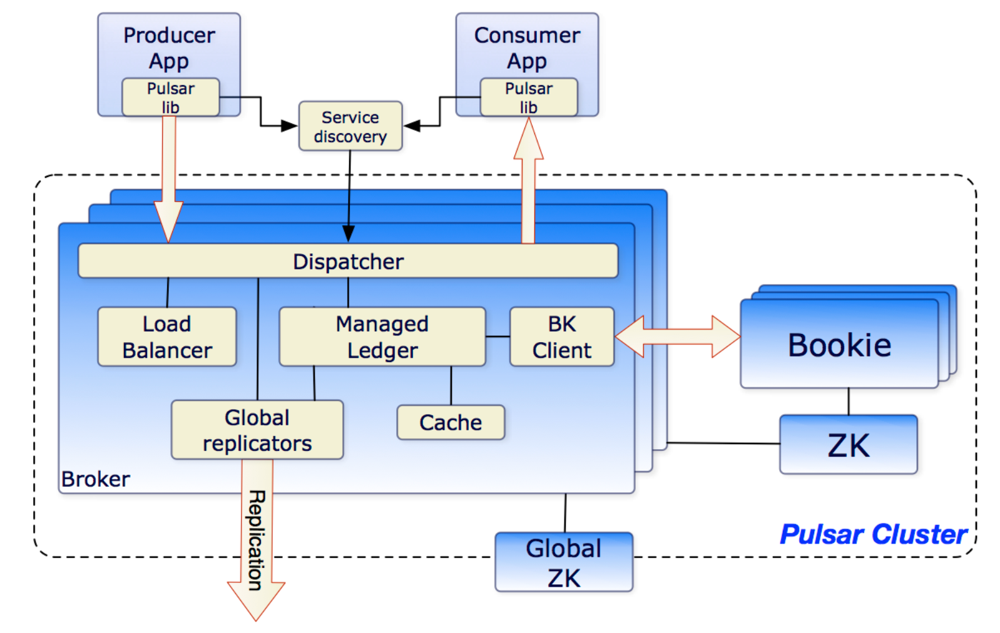

* [pulsar](#pulsar)
    * [broker](#broker)
    * [Apache BookKeeper](#apache-bookkeeper)
        * [组成](#组成)
    * [Apache ZooKeeper](#apache-zookeeper)
    * [特点](#特点)
        * [无限制的主题分区存储](#无限制的主题分区存储)
        * [即时扩展，无需数据迁移](#即时扩展无需数据迁移)
        * [跨机房复制](#跨机房复制)
        * [多租户](#多租户)
        * [计算-储存分离](#计算-储存分离)

# pulsar
## broker

broker是一个无状态组件

如果一个 Broker 失败，Pulsar 会自动将其拥有的主题分区移动到群集中剩余的某一个可用 Broker 中。这里要说的一件事是：由于 Broker 是无状态的，当发生 Topic 的迁移时，Pulsar 只是将所有权从一个 Broker 转移到另一个 Broker，在这个过程中，不会有任何数据复制发生。

组成
- `HTTP服务器` 公开 REST 接口管理和 topic 查询
- `调度器` 处理 Pulsar 传输的所有消息
## Apache BookKeeper
Apache Pulsar 的持久化存储层

### 组成
- `Bookie` Bookie是单个BookKeeper服务器的名称。 它实际上是Pulsar的存储服务器。
- `Ledger`  BookKeeper中的仅追加数据结构，用于将消息持久存储在Pulsar主题中。
## Apache ZooKeeper
处理多个Pulsar集群之间的协调任务
## 特点
### 无限制的主题分区存储
- 由于主题分区被分割成 Segment 并在 Apache BookKeeper 中以分布式方式存储，因此主题分区的容量不受任何单一节点容量的限制。 相反，主题分区可以扩展到整个 BookKeeper 集群的总容量，只需添加 Bookie 节点即可扩展集群容量。 这是 Apache Pulsar 支持存储无限大小的流数据，并能够以高效，分布式方式处理数据的关键。 使用 Apache BookKeeper 的分布式日志存储，对于统一消息服务和存储至关重要。

### 即时扩展，无需数据迁移
- 由于消息服务和消息存储分为两层，因此将主题分区从一个 Broker 移动到另一个 Broker 几乎可以瞬时内完成，而无需任何数据重新平衡（将数据从一个节点重新复制到另一个节点）。 这一特性对于高可用的许多方面至关重要，例如集群扩展；对 Broker 和 Bookie 失败的快速应对。 我将使用例子在下文更详细地进行解释。

### 跨机房复制

### 多租户

### 计算-储存分离
- borker提供计算，接收客户端请求，而实际的储存是交给bookkeeper去做