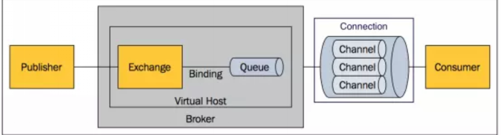
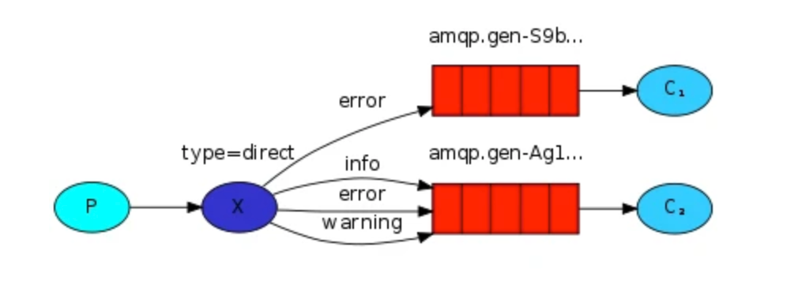
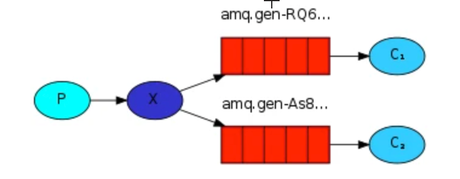
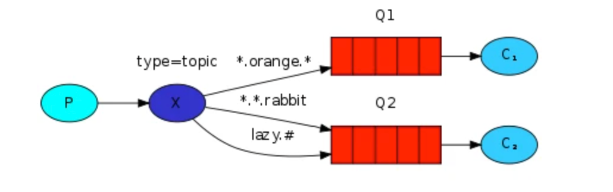

* [RabbitMQ](#rabbitmq)
    * [概念介绍](#概念介绍)
    * [架构图](#架构图)
    * [exchange类型](#exchange类型)
        * [Direct](#direct)
        * [Fanout](#fanout)
        * [Topic](#topic)
    * [RabbitMQ 消息持久化](#rabbitmq-消息持久化)
    * [集群](#集群)
    * [交换器无法根据自身类型和路由键找到符合条件队列时，会如何处理？](#交换器无法根据自身类型和路由键找到符合条件队列时会如何处理)
    * [RabbitMQ 的六种模式](#rabbitmq-的六种模式)
    * [死信队列应用场景](#死信队列应用场景)
* [参考文章](#参考文章)

# RabbitMQ
## 概念介绍
- Broker：简单来说就是消息队列服务器实体。
- Exchange：消息交换机，它指定消息按什么规则，路由到哪个队列。
- Queue：消息队列载体，每个消息都会被投入到一个或多个队列。
- Binding：绑定，它的作用就是把exchange和queue按照路由规则绑定起来。
- Routing Key：路由关键字，exchange根据这个关键字进行消息投递。
- vhost：虚拟主机，一个broker里可以开设多个vhost，用作不同用户的权限分离。
    - 出于多租户和安全因素设计的，把AMQP的基本组件划分到一个虚拟的分组中，类似于网络中的namespace概念。当多个不同的用户使用同一个RabbitMQ server提供的服务时，可以划分出多个vhost，每个用户在自己的vhost创建exchange／queue等
- producer：消息生产者，就是投递消息的程序。
    - 消息生产者，投递消息
    - 消息一般包含两个部分：消息体（payload)和标签(Label)
- consumer：消息消费者，就是接受消息的程序。
- channel：消息通道，在客户端的每个连接里，可建立多个channel，每个channel代表一个会话任务。
- connection
  (../img/消息队列/rabbitmq-connection.png)
    - 什么是
        - connection 是 生产者或消费者与 RabbitMQ Broker 建立的连接，是一个TCP连接
        - 一旦 TCP 连接建立起来，客户端紧接着可以创建一个 AMQP 信道（Channel），每个信道都会被指派一个唯一的 ID
        - 信道是建立在 Connection 之上的虚拟连接，多个信道复用一个TCP连接，可以减少性能开销，同时也便于管理
        - 因为一个应用需要向RabbitMQ 中生成或者消费消息的话，都要建一个TCP连接，TCP连接开销非常大，如果遇到使用高峰，性能瓶颈也随之显现
    - 信道复用连接优势
        - 复用TCP连接，减少性能开销，便于管理
        - RabbitMQ 保障每一个信道的私密性
    - 当每个信道的流量不是很大时，复用单一的 Connection 可以在产生性能瓶颈的情况下有效地节省 TCP 连接资源
        - 信道本身的流量很大时，这时候多个信道复用一个 Connection 就会产生性能瓶颈，进而使整体的流量被限制了，此时就需要开辟多个 Connection，将这些信道均摊到这些 Connection 中
## 架构图

## exchange类型
### Direct

  
点对点模式，根据route_key精确匹配
### Fanout

  
广播模式，将消息发送到与该exchange绑定的所有queue上
### Topic

- 模式匹配，根据route_key模式匹配
- 以上图中的配置为例，routingKey=”quick.orange.rabbit”的消息会同时路由到Q1与Q2，routingKey=”lazy.orange.fox”的消息会路由到Q1，routingKey=”lazy.brown.fox”的消息会路由到Q2，routingKey=”lazy.pink.rabbit”的消息会路由到Q2（只会投递给Q2一次，虽然这个routingKey与Q2的两个bindingKey都匹配）；routingKey=”quick.brown.fox”、routingKey=”orange”、routingKey=”quick.orange.male.rabbit”的消息将会被丢弃，因为它们没有匹配任何bindingKey。
## RabbitMQ 消息持久化
- 默认情况下重启服务器会导致消息丢失
- 持久化需要满足如下三个条件才可以恢复 RabbitMQ 的数据
    - 投递消息的时候 durable 设置为 true，消息持久化
    - 消息已经到达持久化交换器上
    - 消息已经到达持久化的队列上
- 持久化的工作原理
    - Rabbit 会将持久化消息写入磁盘上的持久化日志文件，等消息被消费之后，Rabbit 会把这条消息标识为等待垃圾回收
## 集群
- 普通集群模式
    - 意思就是在多台机器上启动多个 RabbitMQ 实例，每个机器启动一个。你创建的 queue，只会放在一个 RabbitMQ 实例上，但是每个实例都同步 queue 的元数据（元数据可以认为是 queue 的一些配置信息，通过元数据，可以找到 queue 所在实例）。你消费的时候，实际上如果连接到了另外一个实例，那么那个实例会从 queue 所在实例上拉取数据过来。这方案主要是提高吞吐量的，就是说让集群中多个节点来服务某个 queue 的读写操作
    - 缺点:一个服务节点宕机了，数据就丢失了
- 镜像集群模式
    - 这种模式，才是所谓的 RabbitMQ 的高可用模式。跟普通集群模式不一样的是，在镜像集群模式下，你创建的 queue，无论元数据还是 queue 里的消息都会存在于多个实例上，就是说，每个 RabbitMQ 节点都有这个 queue 的一个完整镜像，包含 queue 的全部数据的意思。然后每次你写消息到 queue 的时候，都会自动把消息同步到多个实例的 queue 上。RabbitMQ 有很好的管理控制台，就是在后台新增一个策略，这个策略是镜像集群模式的策略，指定的时候是可以要求数据同步到所有节点的，也可以要求同步到指定数量的节点，再次创建 queue 的时候，应用这个策略，就会自动将数据同步到其他的节点上去了。这样的话，好处在于，你任何一个机器宕机了，没事儿，其它机器（节点）还包含了这个 queue 的完整数据，别的 consumer 都可以到其它节点上去消费数据。
    - 坏处在于，第一，这个性能开销也太大了吧，消息需要同步到所有机器上，导致网络带宽压力和消耗很重！RabbitMQ 一个 queue 的数据都是放在一个节点里的，镜像集群下，也是每个节点都放这个 queue 的完整数据。
        - 性能开销大
        - 没有扩展可言
## 交换器无法根据自身类型和路由键找到符合条件队列时，会如何处理？
- 我们对交换机设置参数的时候，有一个标志叫做 mandatory
- 当mandatory标志位设置为true时
- 如果exchange根据自身类型和消息routingKey无法找到一个合适的queue存储消息，那么broker就会调用basic.return方法将消息返还给生产者
- 当mandatory设置为false时
- 前置条件和上述保持一致，此时 broker会直接将消息丢弃
## RabbitMQ 的六种模式
- `simple模式`（即最简单的收发模式） 简单的生产者生产消息，放入队列，消费者消费消息
- `work` 当生产者生产消息的速度大于消费者消费的速度，就要考虑用 work 工作模式，这样能提高处理速度提高负载
- `publish`
    - 1、每个消费者监听自己的队列；
    - 2、生产者将消息发给broker，由交换机将消息转发到绑定此交换机的每个队列，每个绑定交换机的队列都将接收到消息。
- `routing`
    - 消息生产者将消息发送给交换机按照路由判断,路由是字符串(info) 当前产生的消息携带路由字符(对象的方法),交换机根据路由的key
    - 只能匹配上路由key对应的消息队列,对应的消费者才能消费消息
- `topic` 话题模式，一个消息被多个消费者获取，消息的目标 queue 可用 BindingKey 以通配符

## 死信队列应用场景
一般用在较为重要的业务队列中，确保未被正确消费的消息不被丢弃，一般发生消费异常可能原因主要有由于消息信息本身存在错误导致处理异常，处理过程中参数校验异常，或者因网络波动导致的查询异常等等，当发生异常时，当然不能每次通过日志来获取原消息，然后让运维帮忙重新投递消息（没错，以前就是这么干的= =）。通过配置死信队列，可以让未正确处理的消息暂存到另一个队列中，待后续排查清楚问题后，编写相应的处理代码来处理死信消息，这样比手工恢复数据要好太多了。

# 参考文章
- https://mfrank2016.github.io/breeze-blog/2020/05/04/rabbitmq/rabbitmq-how-to-use-dead-letter-queue/