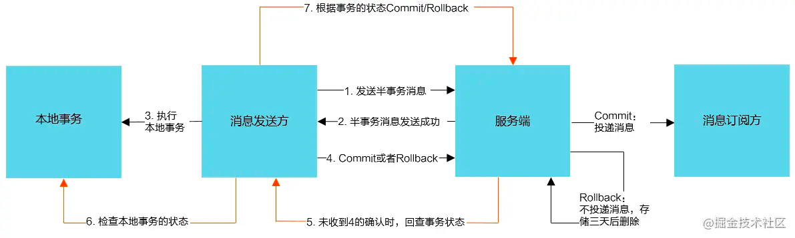

* [RocketMQ](#rocketmq)
  * [架构图](#架构图)
  * [组件](#组件)
  * [rocket的事务实现机制](#rocket的事务实现机制)
    * [概览](#概览)
    * [交互流程](#交互流程)
* [参考文章](#参考文章)

# RocketMQ
## 架构图

## 组件
- `NameServer` 主要用作注册中心，用于管理 Topic 信息和路由信息的管理
- `Broker` 负责存储、消息 tag 过滤和转发。需将自身信息上报给注册中心 NameServer
- `Producer` 生产者
- `Consumer` 消费者
## rocket的事务实现机制
RocketMQ提供了事务消息的功能，采用2PC(两段式协议)+补偿机制（事务回查）的分布式事务功能，通过消息队列 RocketMQ 版事务消息能达到分布式事务的最终一致。

### 概览
- `半事务消息`：
暂不能投递的消息，发送方已经成功地将消息发送到了消息队列 RocketMQ 版服务端，但是服务端未收到生产者对该消息的二次确认，此时该消息被标记成“暂不能投递”状态，处于该种状态下的消息即半事务消息。
- `消息回查`：
由于网络闪断、生产者应用重启等原因，导致某条事务消息的二次确认丢失，消息队列 RocketMQ 版服务端通过扫描发现某条消息长期处于“半事务消息”时，需要主动向消息生产者询问该消息的最终状态（Commit 或是 Rollback），该询问过程即消息回查。

### 交互流程

事务消息发送步骤如下：
1. 发送方将半事务消息发送至消息队列 RocketMQ 版服务端。
2. 消息队列 RocketMQ 版服务端将消息持久化成功之后，向发送方返回 Ack确认消息已经发送成功，此时消息为半事务消息。
3. 发送方开始执行本地事务逻辑。
4. 发送方根据本地事务执行结果向服务端提交二次确认（Commit 或是 Rollback），服务端收到 Commit 状态则将半事务消息标记为可投递，订阅方最终将收到该消息；服务端收到 Rollback 状态则删除半事务消息，订阅方将不会接受该消息。

事务消息回查步骤如下：
1. 在断网或者是应用重启的特殊情况下，上述步骤 4 提交的二次确认最终未到达服务端，经过固定时间后服务端将对该消息发起消息回查。
2. 发送方收到消息回查后，需要检查对应消息的本地事务执行的最终结果。
3. 发送方根据检查得到的本地事务的最终状态再次提交二次确认，服务端仍按照步骤 4 对半事务消息进行操作。

总体而言RocketMQ事务消息分为两条主线
- 发送流程：发送half message(半消息)，执行本地事务，发送事务执行结果
- 定时任务回查流程：MQ定时任务扫描半消息，回查本地事务，发送事务执行结果

# 参考文章
- https://juejin.cn/post/6844904193526857742