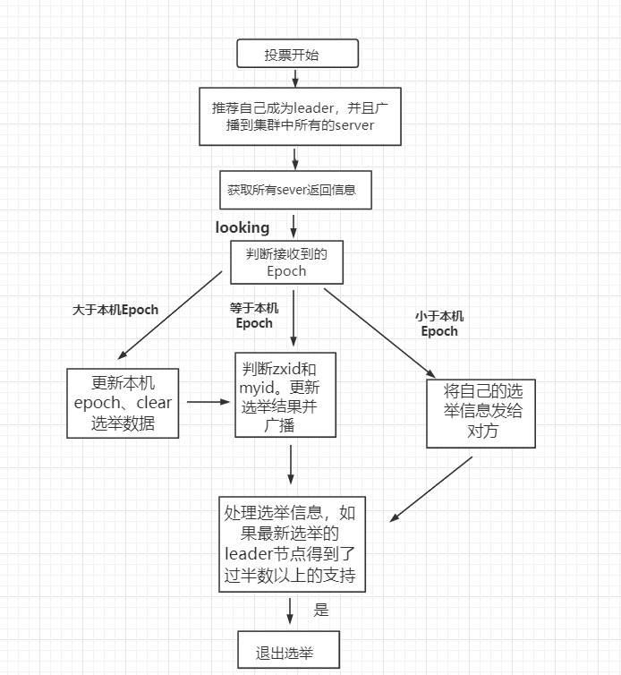

* [Zookeeper](#zookeeper)
* [概念](#概念)
* [数据结构](#数据结构)
    * [ZNode](#znode)
        * [ZNode的类型](#znode的类型)
        * [ZNode的状态信息](#znode的状态信息)
* [监听机制](#监听机制)
    * [Watcher注册监听器实例：基于Zookeeper实现简易版配置中心](#watcher注册监听器实例基于zookeeper实现简易版配置中心)
* [角色](#角色)
    * [leader](#leader)
    * [follower](#follower)
    * [Observer](#observer)
* [zab协议](#zab协议)
    * [Zxid](#zxid)
    * [模式](#模式)
    * [4阶段](#4阶段)
        * [选举阶段](#选举阶段)
        * [发现阶段](#发现阶段)
        * [同步阶段](#同步阶段)
        * [广播阶段](#广播阶段)
* [参考文章](#参考文章)

# Zookeeper
# 概念
- Zookeeper 是一个分布式协调服务，可用于服务发现，分布式锁，分布式领导选举，配置管理等。
- Zookeeper 提供了一个类似于 Linux 文件系统的树形结构（可认为是轻量级的内存文件系统，但 只适合存少量信息，完全不适合存储大量文件或者大文件），同时提供了对于每个节点的监控与通知机制。

# 用zookeeper可以干嘛
- 统一命令服务  域名和Ip的映射关系用zk储存，nginx也可以
- 统一配置管理，分布式环境下的配置文件同步，将配置文件写入一个znode，其他节点监听这个节点
- 统一集群管理，分布式环境下各个节点的状态同步，将节点状态写入一个znode，其他节点监听这个节点
# 数据结构
zookkeeper 提供的名称空间非常类似于标准文件系统，key-value 的形式存储。名称 key 由斜线 / 分割的一系列路径元素，zookeeper 名称空间中的每个节点都是由一个路径标识

## ZNode
ZooKeeper数据模型ZNode 在ZooKeeper中，数据信息被保存在一个个数据节点上，这些节点被称为ZNode。ZNode 是Zookeeper 中最小数据单位，在 ZNode 下面又可以再挂 ZNode，这样一层层下去就形成了一个层次化命名空间 ZNode 树，我们称为 ZNode Tree，它采用了类似文件系统的层级树状结构进行管理
- 可以储存少量数据（1MB）
### ZNode的类型
Zookeeper 节点类型可以分为三大类：
- 持久性节点（Persistent）
- 临时性节点（Ephemeral）-e
- 顺序性节点（Sequential）-s -es

在开发中在创建节点的时候通过组合可以生成以下四种节点类型：持久节点、持久顺序节点(-s)、临时节点、临时顺序节点(-es)。不同类型的节点则会有不同的生命周期：

**持久节点**：是Zookeeper中最常见的一种节点类型，所谓持久节点，就是指节点被创建后会一直存在服务器，直到删除操作主动清除
- create /node
- 默认类型

**持久顺序节点**：就是有顺序的持久节点，节点特性和持久节点是一样的，只是额外特性表现在顺序上。顺序特性实质是在创建节点的时候，会在节点名后面加上一个数字后缀，来表示其顺序。
- create -s /node


**临时节点**：就是会被自动清理掉的节点，它的生命周期和客户端会话绑在一起，客户端会话结束，节点会被删除掉。与持久性节点不同的是，临时节点不能创建子节点。
- create -e /node

**临时顺序节点**：就是有顺序的临时节点，和持久顺序节点相同，在其创建的时候会在名字后面加上数字后缀。
- create -es /node
### ZNode的状态信息
整个 ZNode 节点内容包括两部分：节点数据内容和节点状态信息。数据内容是空，其他的属于状态信息。这些节点的状态信息分别的含义如下所示：

```html
cZxid 就是 Create ZXID，表示节点被创建时的事务ID。
ctime 就是 Create Time，表示节点创建时间。
mZxid 就是 Modified ZXID，表示节点最后一次被修改时的事务ID。
mtime 就是 Modified Time，表示节点最后一次被修改的时间。
pZxid 表示该节点的子节点列表最后一次被修改时的事务 ID。只有子节点列表变更才会更新 pZxid，子节点内容变更不会更新。
cversion 表示子节点的版本号。
dataVersion 表示内容版本号。
aclVersion 标识acl版本
ephemeralOwner 表示创建该临时节点时的会话 sessionID，如果是持久性节点那么值为 0
dataLength 表示数据长度。
numChildren 表示直系子节点数。
```

#  监听机制
Zookeeper使用Watcher机制实现分布式数据的发布/订阅功能

一个典型的发布/订阅模型系统定义了一种 一对多的订阅关系，能够让多个订阅者同时监听某一个主题对象，当这个主题对象自身状态变化时，会通知所有订阅者，使它们能够做出相应的处理。

在 ZooKeeper 中，引入了 Watcher 机制来实现这种分布式的通知功能。ZooKeeper 允许客户端向服务端注册一个 Watcher 监听，当服务端的一些指定事件触发了这个 Watcher，那么Zk就会向指定客户端发送一个事件通知来实现分布式的通知功能。

整个Watcher注册与通知过程如图所示。


- Client向ZK注册监听器。监听某个目录 可以监听下面的子节点， 也可以监听下面的数据。
- 客户端在向Zookeeper服务器注册的同时，会将Watcher对象存储在客户端的WatcherManager当中。用来对各种监听器进行管理。
- 当Zookeeper服务器触发Watcher事件后，会向客户端发送通知。如果监听的目录中的数据或节点发生了改变，ZK就会发送一个通知到Client。这里的流程是把Watcher对象发送到WatchManager里，则之前存储的watcher对象里面的内容就会被更新。更新之后，Client就会从WatchManager中再次获取到watcher对象，然后调用接收到通知之后的执行逻辑，比如是要把变化后的监听数据拿回来还是去做其他事情

## Watcher注册监听器实例：基于Zookeeper实现简易版配置中心
创建一个Web项目，将数据库连接信息交给Zookeeper配置中心管理，即：当项目Web项目启动时，从Zookeeper进行MySQL配置参数的拉取 

要求项目通过数据库连接池访问MySQL（连接池可以自由选择熟悉的） 

当Zookeeper配置信息变化后Web项目自动感知，正确释放之前连接池，创建新的连接池

第一步：创建web工程，客户端连接ZK集群
```java
public class ZkServlet extends HttpServlet {

    ZkClient zkClient = null;
    Connection conn = null;
    DataSource dataSource = null;

    /*
     * init: servlet对象创建的，调用此方法完成初始化操作
     * */
    @Override
    public void init(ServletConfig servletConfig) throws ServletException {
        // 客户端连接ZK集群
        new ZkClient("linux121:2181, linux122:2181, linux123:2181");

        // 判断节点是否存在，不存在创建节点并赋值
        boolean exists = zkClient.exists("/mysql_configuration");
        if (!exists) {
            zkClient.createEphemeral("/mysql_configuration", "{'driverClassName':'com.mysql.jdbc.Driver', 'url':'jdbc:mysql://linux123:3306/zookeeper?characterEncoding=UTF-8', 'username':'root', 'password':'123'}");
        }
        // 设置自定义的序列化类型
        zkClient.setZkSerializer(new ZkStrSerializer());
    }
}
```
这里将Mysql的配置信息组织成Map的格式存储在ZK结群的某一节点上，方便后续客户端的读取和使用。

第二步：从ZK集群上拉取Mysql配置文件信息，并注册监听器

```java
@Override
protected void doGet(HttpServletRequest req, HttpServletResponse resp) throws ServletException, IOException {

    // 初始化zk的监听器
    registerListener();

    // 客户端从节点上读取数据
    String data = (String) zkClient.readData("/mysql_configuration");
    // 利用JSON将读取下的数据格式转为Map类型，方便后续创建数据库连接池对象
    Map<String, String> map = JSON.parseObject(data, new TypeReference<Map<String, String>>(){});
    System.out.println("MysqlConfiguration: " + map);
    try {
        // 根据拉取的Mysql配置信息获取数据库连接
        conn = getDruidConnection(map);
        // 根据连接池查询数据库数据
        queryMysqlData(conn);
        // 向前端返回Mysql的配置信息
        resp.getWriter().write(map.toString());

        // 休眠10s后向zookeeper中写入新的配置文件
        Thread.sleep(10000);
        // 休眠10s后，更新该节点的数据，观察监听器的功能
        zkClient.writeData("/mysql_configuration", "{'driverClassName':'com.mysql.jdbc.Driver', 'url':'jdbc:mysql://linux123:3306/zookeeper?characterEncoding=UTF-8', 'username':'root', 'password':'12345678'}");

        // 测试结束，关闭资源
        conn.close();

    } catch (Exception e) {
        e.printStackTrace();
    }
}
```
各自定义函数如下所示：
```java
// 注册监听器
public void registerListener(final HttpServletResponse resp)
{
    // 注册监听器，节点数据改变的类型，接收通知后的处理逻辑定义
    zkClient.subscribeDataChanges("/mysql_configuration", new IZkDataListener() {

        // path: 是监听的数据路径
        // data: 改变之后的新的数据
        public void handleDataChange(String path, Object data) throws Exception {
            // 定义接收通知之后的处理逻辑
            // 首先释放原先的连接池
            conn.close();

            // 根据新的配置信息，创建新的连接池
            // 获取新的配置信息
            Map<String, String> newMysqlConf = getMysqlConf((String) data);
            System.out.println("New Mysql Configuration: " + newMysqlConf);

            // 创建新的连接池连接数据
            conn = getDruidConnection(newMysqlConf);

            // 根据新连接查询数据
            queryMysqlData(conn);
            resp.getWriter().write("New Mysql Configuration: " + newMysqlConf);
        }

        // 处理数据的删除 -> 节点删除
        public void handleDataDeleted(String path) throws Exception {
            System.out.println(path + " is deleted!!");
        }
    });
}

public Map<String, String> getMysqlConf(String data)
{
    // 将字符串的data数据转换为Map类型
    Map<String, String> map = JSON.parseObject((String) data, new TypeReference<Map<String, String>>(){});
    return map;
}

// 通过连接池获取jdbc连接对象
public Connection getDruidConnection(Map map) throws Exception {
    dataSource = DruidDataSourceFactory.createDataSource(map);
    conn = dataSource.getConnection();
    return conn;
}

// 查询表中的数据并打印
public void queryMysqlData(Connection conn) throws SQLException {
    Statement statement = conn.createStatement();

    String sql = "select * from homework";
    ResultSet resultSet = statement.executeQuery(sql);
    while(resultSet.next())
    {
        System.out.println(resultSet.getInt("id"));
        System.out.println(resultSet.getString("name"));
        System.out.println(resultSet.getString("addr"));
    }
}
```
利用`subscribeDataChanges`函数来实现对节点数据变化的监听。这里要注意的就是`handleDataChange(String path, Object data)`方法里的data参数是改变之后的新的数据内容。因此通过代码的实际使用也可以重新理解最开始介绍的Watcher机制的过程。如果监听的目录中的数据或节点发生了改变，ZK就会发送一个通知到Client。就是把Watcher对象发送到WatchManager里，则之前存储的watcher对象里面的内容就会被更新。而Client从WatchManager中再次获取到watcher对象，此时的watcher对象的内容就是被更新后的数据信息（也就是参数data数据）
# 角色
## leader

- 一个 Zookeeper 集群同一时间只会有一个实际工作的 Leader，它会发起并维护与各 Follwer及 Observer 间的心跳。
- 所有的写操作必须要通过 Leader 完成再由 Leader 将写操作广播给其它服务器。只要有超过半数节点（不包括 observeer 节点）写入成功，该写请求就会被提交（类 2PC 协议）。

## follower
- 一个 Zookeeper 集群可能同时存在多个 Follower，它会响应 Leader 的心跳，
- Follower 可直接处理并返回客户端的读请求，同时会将写请求转发给 Leader 处理，
- 并且负责在 Leader 处理写请求时对请求进行投票。

## Observer
- 角色与 Follower 类似，但是无投票权。Zookeeper 需保证高可用和强一致性，为了支持更多的客 户端，需要增加更多 Server；Server 增多，投票阶段延迟增大，影响性能；引入 Observer，
- Observer 不参与投票； Observers 接受客户端的连接，并将写请求转发给 leader 节点； 加入更多 Observer 节点，提高伸缩性，同时不影响吞吐率。

# Zookeeper Leader 选举原理

zookeeper 的 leader 选举存在两个阶段，一个是服务器启动时 leader 选举，另一个是运行过程中 leader 服务器宕机。在分析选举原理前，先介绍几个重要的参数。

- 服务器 ID(myid)：编号越大在选举算法中权重越大
- 事务 ID(zxid)：值越大说明数据越新，权重越大
- 逻辑时钟(epoch-logicalclock)：同一轮投票过程中的逻辑时钟值是相同的，每投完一次值会增加

选举状态：

- LOOKING: 竞选状态
- FOLLOWING: 随从状态，同步 leader 状态，参与投票
- OBSERVING: 观察状态，同步 leader 状态，不参与投票
- LEADING: 领导者状态
## 1、服务器启动时的 leader 选举
每个节点启动的时候都 LOOKING 观望状态，接下来就开始进行选举主流程。这里选取三台机器组成的集群为例。第一台服务器 server1启动时，无法进行 leader 选举，当第二台服务器 server2 启动时，两台机器可以相互通信，进入 leader 选举过程。

（1）每台 server 发出一个投票，由于是初始情况，server1 和 server2 都将自己作为 leader 服务器进行投票，每次投票包含所推举的服务器myid、zxid、epoch，使用（myid，zxid）表示，此时 server1 投票为（1,0），server2 投票为（2,0），然后将各自投票发送给集群中其他机器。

（2）接收来自各个服务器的投票。集群中的每个服务器收到投票后，首先判断该投票的有效性，如检查是否是本轮投票（epoch）、是否来自 LOOKING 状态的服务器。

（3）分别处理投票。针对每一次投票，服务器都需要将其他服务器的投票和自己的投票进行对比，对比规则如下：

a. 优先比较 epoch
b. 检查 zxid，zxid 比较大的服务器优先作为 leader
c. 如果 zxid 相同，那么就比较 myid，myid 较大的服务器作为 leader 服务器

（4）统计投票。每次投票后，服务器统计投票信息，判断是都有过半机器接收到相同的投票信息。server1、server2 都统计出集群中有两台机器接受了（2,0）的投票信息，此时已经选出了 server2 为 leader 节点。

（5）改变服务器状态。一旦确定了 leader，每个服务器响应更新自己的状态，如果是 follower，那么就变更为 FOLLOWING，如果是 Leader，变更为 LEADING。此时 server3继续启动，直接加入变更自己为 FOLLOWING。


## 2、运行过程中的 leader 选举
当集群中 leader 服务器出现宕机或者不可用情况时，整个集群无法对外提供服务，进入新一轮的 leader 选举。

（1）变更状态。leader 挂后，其他非 Oberver服务器将自身服务器状态变更为 LOOKING。
（2）每个 server 发出一个投票。在运行期间，每个服务器上 zxid 可能不同。
（3）处理投票。规则同启动过程。
（4）统计投票。与启动过程相同。
（5）改变服务器状态。与启动过程相同。


# 参考文章
- https://zhuanlan.zhihu.com/p/363323489
- https://www.runoob.com/w3cnote/zookeeper-leader.html