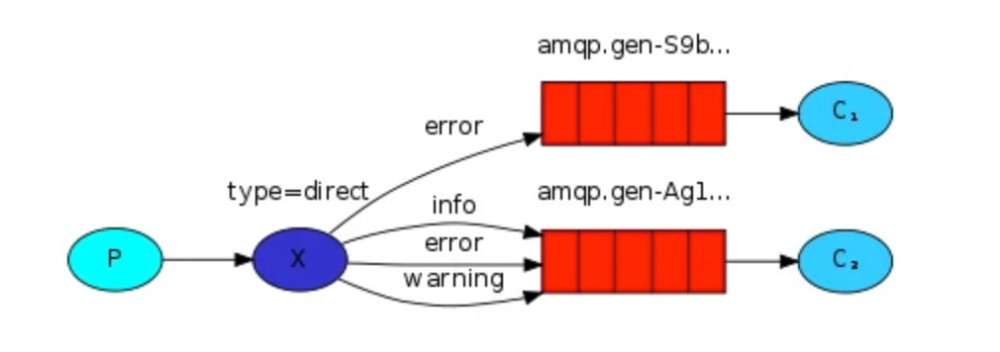
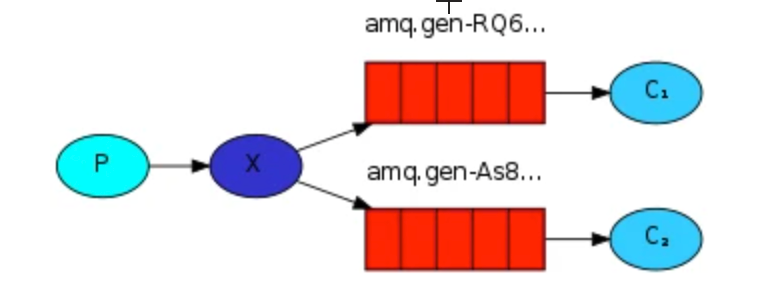
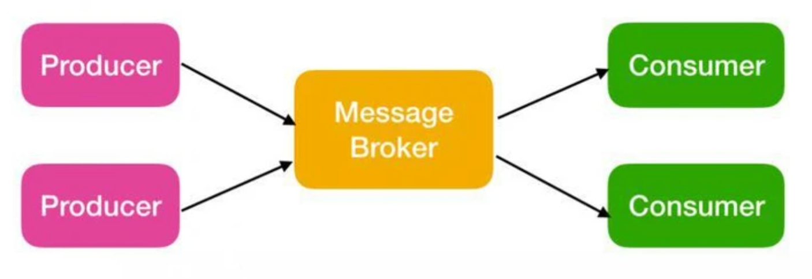
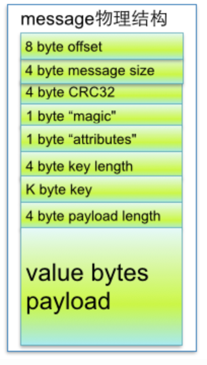
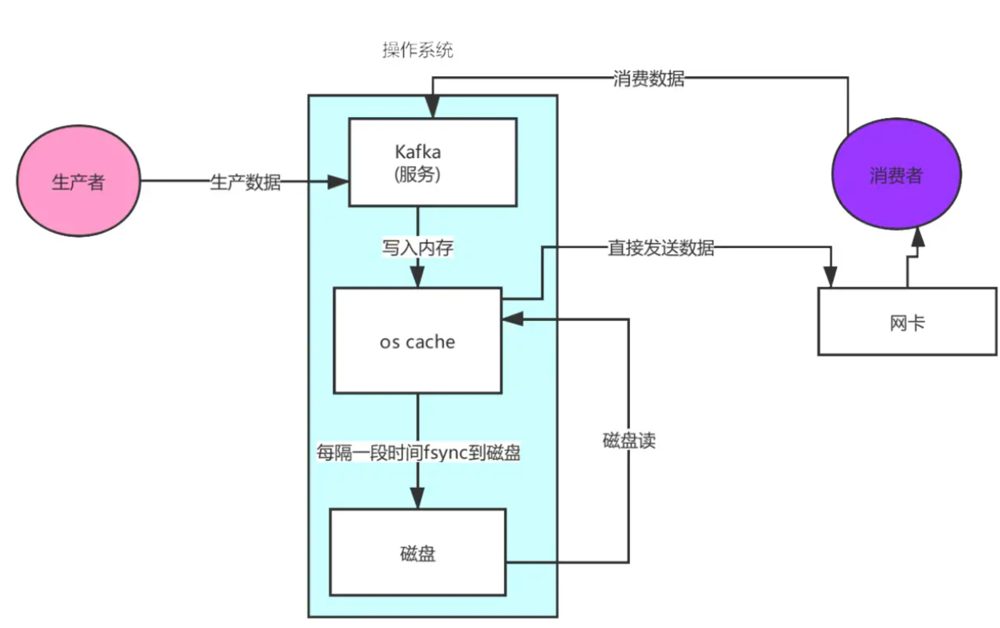

* [MQ](#mq)
  * [为什么使用消息队列](#为什么使用消息队列)
    * [系统解耦](#系统解耦)
    * [异步调用](#异步调用)
    * [流量削峰](#流量削峰)
  * [常见的消息队列](#常见的消息队列)
    * [Redis](#redis)
      * [Redis实现mq主要是依赖数据结构list](#redis实现mq主要是依赖数据结构list)
      * [不足](#不足)
    * [RabbitMQ](#rabbitmq)
      * [概念介绍](#概念介绍)
      * [架构图](#架构图)
      * [exchange类型](#exchange类型)
      * [RabbitMQ 消息持久化](#rabbitmq-消息持久化)
      * [集群](#集群)
      * [交换器无法根据自身类型和路由键找到符合条件队列时，会如何处理？](#交换器无法根据自身类型和路由键找到符合条件队列时会如何处理)
      * [RabbitMQ 的六种模式](#rabbitmq-的六种模式)
    * [RocketMQ](#rocketmq)
      * [架构图](#架构图-1)
      * [组件](#组件)
    * [Kafka](#kafka)
      * [架构图](#架构图-2)
      * [概念](#概念)
      * [Kafka零拷贝](#kafka零拷贝)
      * [常见问题](#常见问题)
      * [kafka中zookeeper的作用](#kafka中zookeeper的作用)
    * [Zookeeper](#zookeeper)
      * [概念](#概念-1)
      * [数据结构](#数据结构)
      * [角色](#角色)
      * [zab协议](#zab协议)
    * [pulsar](#pulsar)
      * [broker](#broker)
      * [Apache BookKeeper](#apache-bookkeeper)
      * [Apache ZooKeeper](#apache-zookeeper)
      * [特点](#特点)
# MQ
## 为什么使用消息队列
### 系统解耦
- 场景
  
  A系统需要向各个系统发送数据，如果再来一个C系统又得再写一份调C系统的代码
- 使用消息队列
  					
  A只用发送数据到MQ，剩下的由各个系统订阅MQ消费消息即可
### 异步调用
我们举个常见的电商下单例子：在没有异步化的步骤大致是用户提交订单->预扣库存->生成订单->消费成功消息推送->通知仓库发货->数据计入财务几个串行化步骤；在串行的模式下对于整条业务链路等待时间较长，而且浪费了接口的并发带来的性能提高。如果我们从[生成订单]后就直接返回主流程，使用消息中间件后续同时处理剩余流程。既不影响整个业务的体验，而且从性能跟响应速度上有了大幅提升
### 流量削峰
由MQ承接大部分的流量请求，由一台机器慢慢消费处理
## 常见的消息队列
### Redis
#### Redis实现mq主要是依赖数据结构list
lpush：从队列左边插入数据； rpop：从队列右边取出数据
#### 不足
- `消息持久化` redis是内存数据库，虽然有aof和rdb两种机制进行持久化，但这只是辅助手段，这两种手段都是不可靠的。当redis服务器宕机时一定会丢失一部分数据，这对于很多业务都是没法接受的
- `热key性能问题` 不论是用codis还是twemproxy这种集群方案，对某个队列的读写请求最终都会落到同一台redis实例上，并且无法通过扩容来解决问题。如果对某个list的并发读写非常高，就产生了无法解决的热key，严重可能导致系统崩溃
- `没有确认机制`
                    每当执行rpop消费一条数据，那条消息就被从list中永久删除了。如果消费者消费失败，这条消息也没法找回了。你可能说消费者可以在失败时把这条消息重新投递到进队列，但这太理想了，极端一点万一消费者进程直接崩了呢，比如被kill -9，panic，coredump…
- `不支持多订阅者`
                    一条消息只能被一个消费者消费，rpop之后就没了。如果队列中存储的是应用的日志，对于同一条消息，监控系统需要消费它来进行可能的报警，BI系统需要消费它来绘制报表，链路追踪需要消费它来绘制调用关系……这种场景redis list就没办法支持了
- `不支持二次消费`
                    一条消息rpop之后就没了。如果消费者程序运行到一半发现代码有bug，修复之后想从头再消费一次就不行了
### RabbitMQ
#### 概念介绍
- Broker：简单来说就是消息队列服务器实体。
- Exchange：消息交换机，它指定消息按什么规则，路由到哪个队列。
- Queue：消息队列载体，每个消息都会被投入到一个或多个队列。
- Binding：绑定，它的作用就是把exchange和queue按照路由规则绑定起来。
- Routing Key：路由关键字，exchange根据这个关键字进行消息投递。
- vhost：虚拟主机，一个broker里可以开设多个vhost，用作不同用户的权限分离。
  - 出于多租户和安全因素设计的，把AMQP的基本组件划分到一个虚拟的分组中，类似于网络中的namespace概念。当多个不同的用户使用同一个RabbitMQ server提供的服务时，可以划分出多个vhost，每个用户在自己的vhost创建exchange／queue等
- producer：消息生产者，就是投递消息的程序。
  - 消息生产者，投递消息
  - 消息一般包含两个部分：消息体（payload)和标签(Label)
- consumer：消息消费者，就是接受消息的程序。
- channel：消息通道，在客户端的每个连接里，可建立多个channel，每个channel代表一个会话任务。
- connection
  (../img/消息队列/rabbitmq-connection.png)					
  - 什么是
    - connection 是 生产者或消费者与 RabbitMQ Broker 建立的连接，是一个TCP连接
    - 一旦 TCP 连接建立起来，客户端紧接着可以创建一个 AMQP 信道（Channel），每个信道都会被指派一个唯一的 ID
    - 信道是建立在 Connection 之上的虚拟连接，多个信道复用一个TCP连接，可以减少性能开销，同时也便于管理
    - 因为一个应用需要向RabbitMQ 中生成或者消费消息的话，都要建一个TCP连接，TCP连接开销非常大，如果遇到使用高峰，性能瓶颈也随之显现
  - 信道复用连接优势
    - 复用TCP连接，减少性能开销，便于管理
    - RabbitMQ 保障每一个信道的私密性
  - 当每个信道的流量不是很大时，复用单一的 Connection 可以在产生性能瓶颈的情况下有效地节省 TCP 连接资源
    - 信道本身的流量很大时，这时候多个信道复用一个 Connection 就会产生性能瓶颈，进而使整体的流量被限制了，此时就需要开辟多个 Connection，将这些信道均摊到这些 Connection 中
#### 架构图

#### exchange类型
- Direct
  
  点对点模式，根据route_key精确匹配
- Fanout
  
  广播模式，将消息发送到与该exchange绑定的所有queue上
- Topic
  
  - 模式匹配，根据route_key模式匹配
  - 以上图中的配置为例，routingKey=”quick.orange.rabbit”的消息会同时路由到Q1与Q2，routingKey=”lazy.orange.fox”的消息会路由到Q1，routingKey=”lazy.brown.fox”的消息会路由到Q2，routingKey=”lazy.pink.rabbit”的消息会路由到Q2（只会投递给Q2一次，虽然这个routingKey与Q2的两个bindingKey都匹配）；routingKey=”quick.brown.fox”、routingKey=”orange”、routingKey=”quick.orange.male.rabbit”的消息将会被丢弃，因为它们没有匹配任何bindingKey。
#### RabbitMQ 消息持久化
- 默认情况下重启服务器会导致消息丢失
- 持久化需要满足如下三个条件才可以恢复 RabbitMQ 的数据
  - 投递消息的时候 durable 设置为 true，消息持久化
  - 消息已经到达持久化交换器上
  - 消息已经到达持久化的队列上
- 持久化的工作原理
  - Rabbit 会将持久化消息写入磁盘上的持久化日志文件，等消息被消费之后，Rabbit 会把这条消息标识为等待垃圾回收
#### 集群
- 普通集群模式
  - 意思就是在多台机器上启动多个 RabbitMQ 实例，每个机器启动一个。你创建的 queue，只会放在一个 RabbitMQ 实例上，但是每个实例都同步 queue 的元数据（元数据可以认为是 queue 的一些配置信息，通过元数据，可以找到 queue 所在实例）。你消费的时候，实际上如果连接到了另外一个实例，那么那个实例会从 queue 所在实例上拉取数据过来。这方案主要是提高吞吐量的，就是说让集群中多个节点来服务某个 queue 的读写操作
  - 缺点:一个服务节点宕机了，数据就丢失了
- 镜像集群模式
  - 这种模式，才是所谓的 RabbitMQ 的高可用模式。跟普通集群模式不一样的是，在镜像集群模式下，你创建的 queue，无论元数据还是 queue 里的消息都会存在于多个实例上，就是说，每个 RabbitMQ 节点都有这个 queue 的一个完整镜像，包含 queue 的全部数据的意思。然后每次你写消息到 queue 的时候，都会自动把消息同步到多个实例的 queue 上。RabbitMQ 有很好的管理控制台，就是在后台新增一个策略，这个策略是镜像集群模式的策略，指定的时候是可以要求数据同步到所有节点的，也可以要求同步到指定数量的节点，再次创建 queue 的时候，应用这个策略，就会自动将数据同步到其他的节点上去了。这样的话，好处在于，你任何一个机器宕机了，没事儿，其它机器（节点）还包含了这个 queue 的完整数据，别的 consumer 都可以到其它节点上去消费数据。
  - 坏处在于，第一，这个性能开销也太大了吧，消息需要同步到所有机器上，导致网络带宽压力和消耗很重！RabbitMQ 一个 queue 的数据都是放在一个节点里的，镜像集群下，也是每个节点都放这个 queue 的完整数据。
    - 性能开销大
    - 没有扩展可言
#### 交换器无法根据自身类型和路由键找到符合条件队列时，会如何处理？
- 我们对交换机设置参数的时候，有一个标志叫做 mandatory
- 当mandatory标志位设置为true时
- 如果exchange根据自身类型和消息routingKey无法找到一个合适的queue存储消息，那么broker就会调用basic.return方法将消息返还给生产者
- 当mandatory设置为false时
- 前置条件和上述保持一致，此时 broker会直接将消息丢弃
#### RabbitMQ 的六种模式
- `simple模式`（即最简单的收发模式） 简单的生产者生产消息，放入队列，消费者消费消息
- `work` 当生产者生产消息的速度大于消费者消费的速度，就要考虑用 work 工作模式，这样能提高处理速度提高负载
- `publish`
  - 1、每个消费者监听自己的队列；
  - 2、生产者将消息发给broker，由交换机将消息转发到绑定此交换机的每个队列，每个绑定交换机的队列都将接收到消息。
- `routing`
  - 消息生产者将消息发送给交换机按照路由判断,路由是字符串(info) 当前产生的消息携带路由字符(对象的方法),交换机根据路由的key
  - 只能匹配上路由key对应的消息队列,对应的消费者才能消费消息
- `topic` 话题模式，一个消息被多个消费者获取，消息的目标 queue 可用 BindingKey 以通配符
### RocketMQ
#### 架构图
				
#### 组件
- `NameServer` 主要用作注册中心，用于管理 Topic 信息和路由信息的管理
- `Broker` 负责存储、消息 tag 过滤和转发。需将自身信息上报给注册中心 NameServer
- `Producer` 生产者
- `Consumer` 消费者
### Kafka
#### 架构图
			
- Producer : 发布消息的客户端
- Broker：一个从生产者接受并存储消息的客户端
- Consumer : 消费者从 Broker 中读取消息
- ZooKeeper：Kafka 通过 ZooKeeper 来存储集群的 meta 信息等
#### 概念
- `topic` Topic 被称为主题，在 kafka 中，使用一个类别属性来划分消息的所属类，划分消息的这个类称为 topic。topic 相当于消息的分配标签，是一个逻辑概念。主题好比是数据库的表，或者文件系统中的文件夹。
- `partition` 
  - partition 译为分区，topic 中的消息被分割为一个或多个的 partition，它是一个物理概念，对应到系统上的就是一个或若干个目录，一个分区就是一个 提交日志。消息以追加的形式写入分区，先后以顺序的方式读取。
    - partiton命名规则
      - 为topic名称+有序序号，第一个partiton序号从0开始，序号最大值为partitions数量减1
      - 例如
        - topic：report_push
        - partitions数量都为partitions=4 
        ```shell
        |--report_push-0
        |--report_push-1
        |--report_push-2
        |--report_push-3
        ```
    - Kafka 为什么要将 Topic 进行分区？
      - 如果 Topic 不进行分区，而将 Topic 内的消息存储于一个 broker，那么关于该 Topic 的所有读写请求都将由这一个 broker 处理，吞吐量很容易陷入瓶颈，这显然是不符合高吞吐量应用场景的。有了 Partition 概念以后，假设一个 Topic 被分为 10 个 Partitions，Kafka 会根据一定的算法将 10 个 Partition 尽可能均匀的分布到不同的 broker（服务器）上，当 producer 发布消息时，producer 客户端可以采用 random、key-hash 及 轮询 等算法选定目标 partition，若不指定，Kafka 也将根据一定算法将其置于某一分区上。Partiton 机制可以极大的提高吞吐量，并且使得系统具备良好的水平扩展能力
        - 提高吞吐量
        - 水平扩展
        - 便于old segment快速删除，有效提高磁盘利用率
- `segment` Segment 被译为段，将 Partition 进一步细分为若干个 segment，每个 segment 文件的大小相等。
  - segment file组成：由2大部分组成，分别为index file和data file，此2个文件一一对应，成对出现，后缀”.index”和“.log”分别表示为segment索引文件、数据文件.
    - 图2
      
    - 索引文件存储大量元数据
      - 数据文件存储大量消息
      - 索引文件中元数据指向对应数据文件中message的物理偏移地址
    - index对应log关系
      - 图
      
      - 其中以索引文件中元数据3,497为例，依次在数据文件中表示第3个message(在全局partiton表示第368772个message)、以及该消息的物理偏移地址为497。
      - 稀疏索引 segment index file采取稀疏索引存储方式，它减少索引文件大小，通过mmap可以直接内存操作，稀疏索引为数据文件的每个对应message设置一个元数据指针,它比稠密索引节省了更多的存储空间，但查找起来需要消耗更多的时间
    - .log文件
      - 由很多的message组成
        	
        
										
      - 如果才能判断读取的这条消息读完了
      - 由上图message的物理结构定义，大致为message的size，定义了消息的长度
  - segment文件命名规则：partion全局的第一个segment从0开始，后续每个segment文件名为上一个segment文件最后一条消息的offset值。数值最大为64位long大小，19位数字字符长度，没有数字用0填充。
  - 在partition中如何通过offset查找message
    - 例如读取offset=368776的message
    - 第一步查找segment file 上述图2为例，其中00000000000000000000.index表示最开始的文件，起始偏移量(offset)为0.第二个文件00000000000000368769.index的消息量起始偏移量为368770 = 368769 + 1.同样，第三个文件00000000000000737337.index的起始偏移量为737338=737337 + 1，其他后续文件依次类推，以起始偏移量命名并排序这些文件，只要根据offset **二分查找**文件列表，就可以快速定位到具体文件。 当offset=368776时定位到00000000000000368769.index|log
    - 第二步通过segment file查找message 通过第一步定位到segment file，当offset=368776时，依次定位到00000000000000368769.index的元数据物理位置和00000000000000368769.log的物理偏移地址，然后再通过00000000000000368769.log顺序查找直到offset=368776为止。
    - 分段索引、稀疏存储
- `offset` 每个partition都由一系列有序的、不可变的消息组成，这些消息被连续的追加到partition中。partition中的每个消息都有一个连续的序列号叫做offset,用于partition唯一标识一条消息.
- `broker` 每个 Kafka 中服务器被称为 broker
  - broker 接收来自生产者的消息，为消息设置偏移量，并提交消息到磁盘保存。broker 为消费者提供服务，对读取分区的请求作出响应，返回已经提交到磁盘上的消息。
    
- `producer` 生产者，即消息的发布者，其会将某 topic 的消息发布到相应的 partition 中。生产者在默认情况下把消息均衡地分布到主题的所有分区上，而并不关心特定消息会被写到哪个分区。不过，在某些情况下，生产者会把消息直接写到指定的分区
- `consumer` 消费者，即消息的使用者，一个消费者可以消费多个 topic 的消息，对于某一个 topic 的消息，其只会消费同一个 partition 中的消息
#### Kafka零拷贝

第一次：将磁盘文件，读取到操作系统内核缓冲区；

第二次：将内核缓冲区的数据，copy到application应用程序的buffer；

第三步：将application应用程序buffer中的数据，copy到socket网络发送缓冲区(属于操作系统内核的缓冲区)；

第四次：将socket buffer的数据，copy到网卡，由网卡进行网络传输。

传统方式，读取磁盘文件并进行网络发送，经过的四次数据copy是非常繁琐的。实际IO读写，需要进行IO中断，需要CPU响应中断(带来上下文切换)，尽管后来引入DMA来接管CPU的中断请求，但四次copy是存在“不必要的拷贝”的。



Kafka使用的zero-copy的应用程序要求内核直接将数据从磁盘文件拷贝到套接字，而无需通过应用程序。零拷贝不仅大大地提高了应用程序的性能，而且还减少了内核与用户模式间的上下文切换。

#### 常见问题
多个partition对应一个消费者组，消费者的数量应小于等于partition的数量
#### kafka中zookeeper的作用
首先最新的提议表示将在未来取消依赖zookeeper，在2.8版本将使用self-managed quorum来取代

作用
- broker 注册
- topic 注册
- producer 和 consumer 负载均衡
- 维护 partition 与 consumer 的关系
- 记录消息消费的进度以及 consumer 注册

### Zookeeper
#### 概念
- Zookeeper 是一个分布式协调服务，可用于服务发现，分布式锁，分布式领导选举，配置管理等。
- Zookeeper 提供了一个类似于 Linux 文件系统的树形结构（可认为是轻量级的内存文件系统，但 只适合存少量信息，完全不适合存储大量文件或者大文件），同时提供了对于每个节点的监控与通知机制。
#### 数据结构
zookkeeper 提供的名称空间非常类似于标准文件系统，key-value 的形式存储。名称 key 由斜线 / 分割的一系列路径元素，zookeeper 名称空间中的每个节点都是由一个路径标识
#### 角色
leader

- 一个 Zookeeper 集群同一时间只会有一个实际工作的 Leader，它会发起并维护与各 Follwer及 Observer 间的心跳。
- 所有的写操作必须要通过 Leader 完成再由 Leader 将写操作广播给其它服务器。只要有超过半数节点（不包括 observeer 节点）写入成功，该写请求就会被提交（类 2PC 协议）。

follower
- 一个 Zookeeper 集群可能同时存在多个 Follower，它会响应 Leader 的心跳，
- Follower 可直接处理并返回客户端的读请求，同时会将写请求转发给 Leader 处理，
- 并且负责在 Leader 处理写请求时对请求进行投票。

Observer
- 角色与 Follower 类似，但是无投票权。Zookeeper 需保证高可用和强一致性，为了支持更多的客 户端，需要增加更多 Server；Server 增多，投票阶段延迟增大，影响性能；引入 Observer，
- Observer 不参与投票； Observers 接受客户端的连接，并将写请求转发给 leader 节点； 加入更多 Observer 节点，提高伸缩性，同时不影响吞吐率。
#### zab协议
Zxid

Zxid 是一个 64 位的数字其中低 32 位是一个简单的单调递增的计数器，针对客户端每 一个事务请求，计数器加 1；而高 32 位则代表 Leader 周期 epoch 的编号，每个当选产生一个新 的 Leader 服务器，就会从这个 Leader 服务器上取出其本地日志中最大事务的 ZXID，并从中读取epoch 值，然后加 1，以此作为新的 epoch，并将低 32 位从 0 开始计数
- epoch 可以理解为当前集群所处的年代或者周期，每个 leader 就像皇帝，都有自己的年号，所以每次改朝换代，leader 变更之后，都会在前一个年代的基础上加 1。这样就算旧的 leader 崩溃恢复之后，也没有人听他的了，因为 follower 只听从当前年代的 leader 的命令。

模式
- 恢复模式(选主) 当服务启动或者在领导者崩溃后，Zab 就进入了恢复模式，当领导者被选举出来，且大多数 Server 完成了和 leader 的状态同步以后，恢复模式就结束了
- 广播模式(同步)

4阶段
- `选举阶段` 节点在一开始都处于选举阶段，只要有一个节点得到超半数 节点的票数，它就可以当选准 leader。只有到达 广播阶段（broadcast） 准 leader 才会成 为真正的 leader。这一阶段的目的是就是为了选出一个准 leader，然后进入下一个阶段
- `发现阶段` 在这个阶段，followers 跟准 leader 进行通信，同步 followers 最近接收的事务提议。这个一阶段的主要目的是发现当前大多数节点接收的最新提议，并且 准 leader 生成新的 epoch，让 followers 接受，更新它们的 accepted Epoch 一个 follower 只会连接一个 leader，如果有一个节点 f 认为另一个 follower p 是 leader，f 在尝试连接 p 时会被拒绝，f 被拒绝之后，就会进入重新选举阶段。
- `同步阶段` 同步阶段主要是利用 leader 前一阶段获得的最新提议历史，同步集群中所有的副本。只有当 大多数节点都同步完成，准 leader 才会成为真正的 leader。follower 只会接收 zxid 比自己的 lastZxid 大的提议。
- `广播阶段` 到了这个阶段，Zookeeper 集群才能正式对外提供事务服务，并且 leader 可以进行消息广播。同时如果有新的节点加入，还需要对新节点进行同步
### pulsar
#### broker

broker是一个无状态组件

如果一个 Broker 失败，Pulsar 会自动将其拥有的主题分区移动到群集中剩余的某一个可用 Broker 中。这里要说的一件事是：由于 Broker 是无状态的，当发生 Topic 的迁移时，Pulsar 只是将所有权从一个 Broker 转移到另一个 Broker，在这个过程中，不会有任何数据复制发生。

组成
- `HTTP服务器` 公开 REST 接口管理和 topic 查询
- `调度器` 处理 Pulsar 传输的所有消息
#### Apache BookKeeper
Apache Pulsar 的持久化存储层

组成
- `Bookie` Bookie是单个BookKeeper服务器的名称。 它实际上是Pulsar的存储服务器。
- `Ledger`  BookKeeper中的仅追加数据结构，用于将消息持久存储在Pulsar主题中。
#### Apache ZooKeeper
处理多个Pulsar集群之间的协调任务
#### 特点
无限制的主题分区存储
- 由于主题分区被分割成 Segment 并在 Apache BookKeeper 中以分布式方式存储，因此主题分区的容量不受任何单一节点容量的限制。 相反，主题分区可以扩展到整个 BookKeeper 集群的总容量，只需添加 Bookie 节点即可扩展集群容量。 这是 Apache Pulsar 支持存储无限大小的流数据，并能够以高效，分布式方式处理数据的关键。 使用 Apache BookKeeper 的分布式日志存储，对于统一消息服务和存储至关重要。

即时扩展，无需数据迁移
- 由于消息服务和消息存储分为两层，因此将主题分区从一个 Broker 移动到另一个 Broker 几乎可以瞬时内完成，而无需任何数据重新平衡（将数据从一个节点重新复制到另一个节点）。 这一特性对于高可用的许多方面至关重要，例如集群扩展；对 Broker 和 Bookie 失败的快速应对。 我将使用例子在下文更详细地进行解释。

跨机房复制

多租户

计算-储存分离
- borker提供计算，接收客户端请求，而实际的储存是交给bookkeeper去做