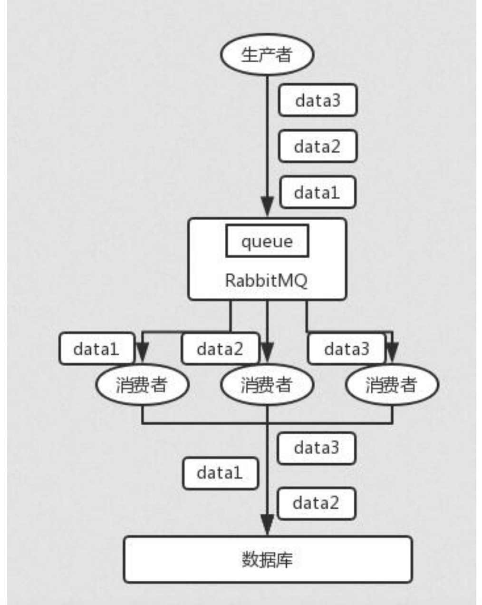
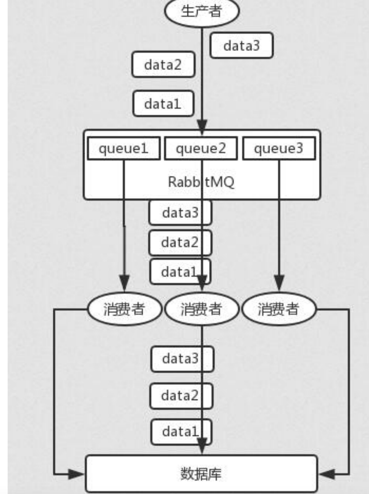

* [常见面试题](#常见面试题)
    * [什么是消息队列](#什么是消息队列)
    * [为什么要使用消息队列](#为什么要使用消息队列)
    * [如何保证消息队列高可用](#如何保证消息队列高可用)
    * [如何保证消息队列不被重复消费（幂等性）](#如何保证消息队列不被重复消费幂等性)
    * [如何保证消息的可靠传输](#如何保证消息的可靠传输)
        * [生产者丢数据](#生产者丢数据)
        * [MQ丢数据](#mq丢数据)
        * [消费者丢数据](#消费者丢数据)
    * [如何保证消息的顺序性](#如何保证消息的顺序性)
    * [如何处理消息堆积](#如何处理消息堆积)
        * [方法1](#方法1)
        * [方法2](#方法2)
    * [mq 中的消息过期失效了](#mq-中的消息过期失效了)
# 常见面试题
## 什么是消息队列
消息队列（Message Queue）是在消息的传输过程中保存消息的容器，是应用间的通信方式。消息发 送后可以立即返回，由消息系统保证消息的可靠传输，消息发布者只管把消息写到队列里面而不用考虑 谁需要消息，而消息的使用者也不需要知道谁发布的消息，只管到消息队列里面取，这样生产和消费便 可以做到分离。
## 为什么要使用消息队列
优点：
- 异步处理：例如短信通知、终端状态推送、App推送、用户注册等
- 数据同步：业务数据推送同步
- 重试补偿：记账失败重试
- 系统解耦：通讯上下行、终端异常监控、分布式事件中心
- 流量消峰：秒杀场景下的下单处理
- 发布订阅：HSF的服务状态变化通知、分布式事件中心
- 高并发缓冲：日志服务、监控上报

缺点：
- 系统可用性降低 系统引入的外部依赖越多，越容易挂掉？如何保证消息队列的高可用？
- 系统复杂度提高 怎么保证消息没有重复消费？怎么处理消息丢失的情况？怎么保证消息传递的顺序性？
- 一致性问题 A 系统处理完了直接返回成功了，人都以为你这个请求就成功了；但是问题是，要是BCD 三个系统那里，BD 两个系统写库成功了，结果 C 系统写库失败了，咋整？你这数据就不一致了。
## 如何保证消息队列高可用
mq的集群模式
## 如何保证消息队列不被重复消费（幂等性）
比如你拿个数据要写库，你先根据主键查一下，如果这数据都有了，你就别插入了，update 一下

比如你是写 Redis，那没问题了，反正每次都是 set，天然幂等性。

比如你不是上面两个场景，那做的稍微复杂一点，你需要让生产者发送每条数据的时候，里面加一 个全局唯一的 id，类似订单 id 之类的东西，然后你这里消费到了之后，先根据这个 id 去比如 Redis 里查一下，之前消费过吗？如果没有消费过，你就处理，然后这个 id 写 Redis。如果消费 过了，那你就别处理了，保证别重复处理相同的消息即可。

比如基于数据库的唯一键来保证重复数据不会重复插入多条。因为有唯一键约束了，重复数据插入只会报错，不会导致数据库中出现脏数据。

需要结合业务场景
## 如何保证消息的可靠传输
### 生产者丢数据
rabbitmq的confirm模式

在生产者那里设置开启 confirm 模式之后，你每次写的消息都会分配一个唯一的 id，然后如果写入了 RabbitMQ 中，RabbitMQ 会给你回传一个 ack 消息，告诉你说这个消息 ok 了。如果 RabbitMQ 没能处理这个消
息，会回调你的一个 nack 接口，告诉你这个消息接收失败，你可以重试。而且你可以结合这个机制自
己在内存里维护每个消息 id 的状态，如果超过一定时间还没接收到这个消息的回调，那么你可以重
发。

### MQ丢数据
设置持久化

就是 RabbitMQ 自己弄丢了数据，这个你必须开启 RabbitMQ 的持久化，就是消息写入之后会持久化
到磁盘，哪怕是 RabbitMQ 自己挂了，恢复之后会自动读取之前存储的数据，一般数据不会丢。除非极
其罕见的是，RabbitMQ 还没持久化，自己就挂了，可能导致少量数据丢失，但是这个概率较小。

设置持久化有两个步骤：
- 创建 queue 的时候将其设置为持久化 这样就可以保证 RabbitMQ 持久化 queue 的元数据，但是它是不会持久化 queue 里的数据的。
- 第二个是发送消息的时候将消息的 deliveryMode 设置为 2 就是将消息设置为持久化的，此时RabbitMQ 就会将消息持久化到磁盘上去。

必须要同时设置这两个持久化才行，RabbitMQ 哪怕是挂了，再次重启，也会从磁盘上重启恢复queue，恢复这个 queue 里的数据。

注意，哪怕是你给 RabbitMQ 开启了持久化机制，也有一种可能，就是这个消息写到了 RabbitMQ中，但是还没来得及持久化到磁盘上，结果不巧，此时 RabbitMQ 挂了，就会导致内存里的一点点数据丢失。

所以，持久化可以跟生产者那边的 confirm 机制配合起来，只有消息被持久化到磁盘之后，才会通知生产者 ack 了，所以哪怕是在持久化到磁盘之前，RabbitMQ 挂了，数据丢了，生产者收不到 ack ，你也是可以自己重发的。

### 消费者丢数据
关闭自动ack，手动ack
## 如何保证消息的顺序性

拆分多个 queue，每个 queue 一个 consumer，就是多一些 queue 而已，确实是麻烦点；或者就一个queue 但是对应一个 consumer，然后这个 consumer 内部用内存队列做排队，然后分发给底层不同的 worker 来处理。
## 如何处理消息堆积
### 方法1
先修复 consumer 的问题，确保其恢复消费速度，然后将现有 consumer 都停掉

新建一个 topic，partition 是原来的 10 倍，临时建立好原先 10 倍的 queue 数量

然后写一个临时的分发数据的 consumer 程序，这个程序部署上去消费积压的数据，消费之后不做耗时的处理，直接均匀轮询写入临时建立好的 10 倍数量的 queue

接着临时征用 10 倍的机器来部署 consumer，每一批 consumer 消费一个临时 queue 的数据。

这种做法相当于是临时将 queue 资源和 consumer 资源扩大 10 倍，以正常的 10 倍速度来消费数据。等快速消费完积压数据之后，得恢复原先部署的架构，重新用原先的 consumer 机器来消费消息。
### 方法2
方法1对于消息不会过期比较好用，但是如果消息过期会被清理，则需要先快速消费数据，比如先把积压的订单先全部消费，但是不处理后面的逻辑，单纯的从消息队列拿出来放在MySQL里，在另外一个时间在批量的读取出来消费处理后面的逻辑
## mq 中的消息过期失效了
假设你用的是 RabbitMQ，RabbtiMQ 是可以设置过期时间的，也就是 TTL。如果消息在 queue 中积压超过一定的时间就会被 RabbitMQ 给清理掉，这个数据就没了。那这就是第二个坑了。这就不是说数据会大量积压在 mq 里，而是大量的数据会直接搞丢。这个情况下，就不是说要增加 consumer 消费积压的消息，因为实际上没啥积压，而是丢了大量的消息。

我们可以采取一个方案，就是批量重导，这个我们之前线上也有类似的场景干过。就是大量积压的时候，我们当时就直接丢弃数据了，然后等过了高峰期以后，比如大家一起喝咖啡熬夜到晚上12点以后，用户都睡觉了。这个时候我们就开始写程序，将丢失的那批数据，写个临时程序，一点一点的查出来，然后重新灌入 mq 里面去，把白天丢的数据给他补回来。也只能是这样了。

假设 1 万个订单积压在 mq 里面，没有处理，其中 1000 个订单都丢了，你只能手动写程序把那 1000个订单给查出来，手动发到 mq 里去再补一次。