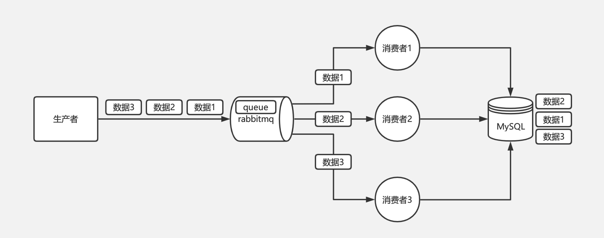
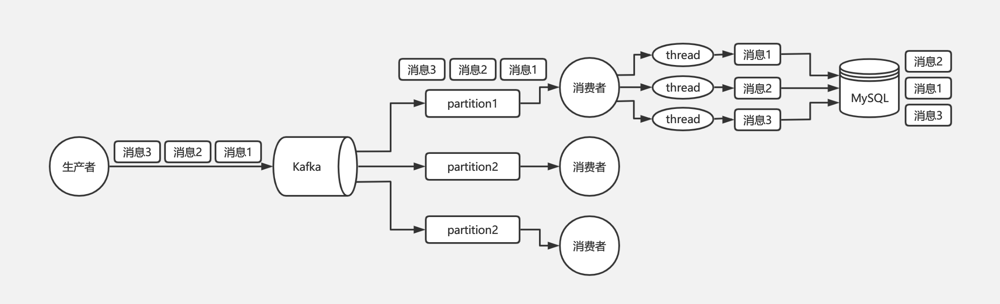
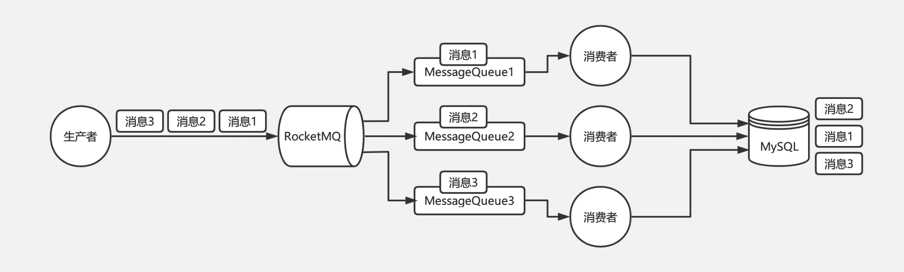
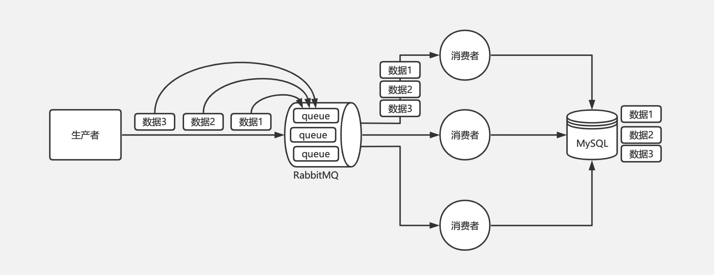
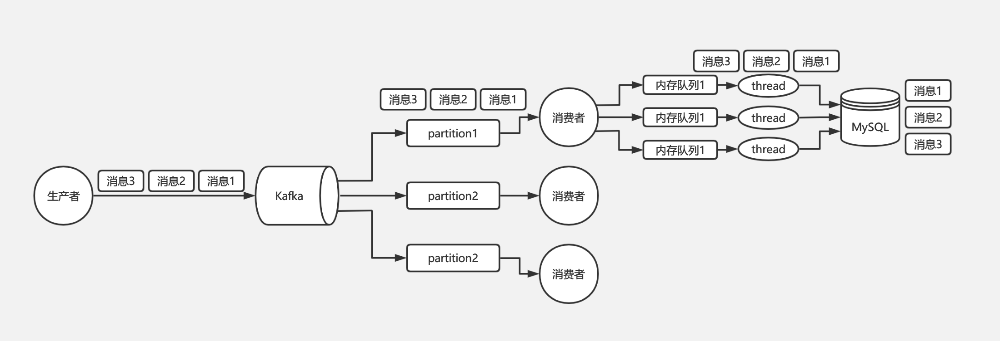
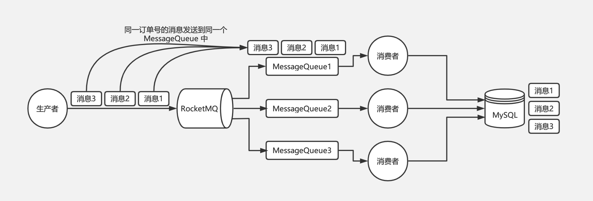

* [常见面试题](#常见面试题)
    * [什么是消息队列](#什么是消息队列)
    * [为什么要使用消息队列](#为什么要使用消息队列)
    * [如何保证消息队列高可用](#如何保证消息队列高可用)
    * [如何保证消息队列不被重复消费（幂等性）](#如何保证消息队列不被重复消费幂等性)
    * [如何保证消息的可靠传输](#如何保证消息的可靠传输)
        * [生产者丢数据](#生产者丢数据)
        * [MQ丢数据](#mq丢数据)
        * [消费者丢数据](#消费者丢数据)
    * [如何保证消息的顺序性](#如何保证消息的顺序性)
    * [如何处理消息堆积](#如何处理消息堆积)
        * [方法1](#方法1)
        * [方法2](#方法2)
    * [mq 中的消息过期失效了](#mq-中的消息过期失效了)

# 常见面试题
## 什么是消息队列
消息队列（Message Queue）是在消息的传输过程中保存消息的容器，是应用间的通信方式。消息发 送后可以立即返回，由消息系统保证消息的可靠传输，消息发布者只管把消息写到队列里面而不用考虑 谁需要消息，而消息的使用者也不需要知道谁发布的消息，只管到消息队列里面取，这样生产和消费便 可以做到分离。
## 为什么要使用消息队列
优点：
- 异步处理：例如短信通知、终端状态推送、App推送、用户注册等
- 数据同步：业务数据推送同步
- 重试补偿：记账失败重试
- 系统解耦：通讯上下行、终端异常监控、分布式事件中心
- 流量消峰：秒杀场景下的下单处理
- 发布订阅：HSF的服务状态变化通知、分布式事件中心
- 高并发缓冲：日志服务、监控上报

缺点：
- 系统可用性降低 系统引入的外部依赖越多，越容易挂掉？如何保证消息队列的高可用？
- 系统复杂度提高 怎么保证消息没有重复消费？怎么处理消息丢失的情况？怎么保证消息传递的顺序性？
- 一致性问题 A 系统处理完了直接返回成功了，人都以为你这个请求就成功了；但是问题是，要是BCD 三个系统那里，BD 两个系统写库成功了，结果 C 系统写库失败了，咋整？你这数据就不一致了。
## 如何保证消息队列高可用
mq的集群模式
## 如何保证消息队列不被重复消费（幂等性）
消息队列中，为了保证消息不被重复消费，需要考虑实现幂等性。下面是一些实现幂等性的方式：

1. 消费端在处理消息时，记录已处理的消息ID，防止重复消费。
2. 消费端在处理消息时，记录已处理的消息内容的Hash值，当重复消费时，判断Hash值是否相等。
3. 消费端使用唯一标识符作为消息处理的ID，保证同一个消息只被处理一次。
4. 生产者在发送消息时，给消息赋予全局唯一的ID，消费端在处理消息时，通过ID来判断是否已经消费。这个值可以放在Redis，或者使用数据库主键
5. 消费端使用分布式锁来控制并发消费，确保同一时刻只有一个消费者消费同一条消息。
6. 在消息的元数据中添加标记，标记消息是否已经被消费，消费端在消费时，首先判断元数据的标记是否为已消费。

需要注意的是，不同的幂等性实现方式适用于不同的业务场景，选择适合自己的方式需要考虑实际情况和业务需求。同时，在实现幂等性的同时，需要考虑性能和并发性的问题。
## 如何保证消息的可靠传输

在消息队列中，为了保证消息的可靠传输，需要考虑以下几点：

- 消息的持久化：将消息持久化到磁盘或数据库中，确保即使在服务异常或宕机的情况下，消息不会丢失。
- 消息的确认机制：生产者在发送消息后，需要等待消息被正确处理或持久化后，才能发送确认消息给生产者。这样可以确保消息被正确传输，避免消息丢失或重复消费。
- 消息的重试机制：当消息未能被正确处理时，可以根据错误原因和类型进行一定的重试机制，例如延迟重试或指数级退避等策略，确保消息最终被正确处理。
- 高可用性：消息队列需要考虑高可用性，使用主备、集群等机制，确保即使在节点宕机的情况下，消息队列仍然可以继续工作。
- 流量控制和负载均衡：在高并发场景下，需要进行流量控制和负载均衡，以避免过多的消息导致消息队列的性能下降。
- 监控和告警：需要对消息队列进行监控和告警，及时发现问题并进行处理，以保证消息队列的可靠性和稳定性。

综上所述，为了保证消息的可靠传输，需要综合考虑消息队列的多个方面，包括持久化、确认机制、重试机制、高可用性、流量控制和负载均衡、监控和告警等。

### 生产者丢数据
rabbitmq的confirm模式

在生产者那里设置开启 confirm 模式之后，你每次写的消息都会分配一个唯一的 id，然后如果写入了 RabbitMQ 中，RabbitMQ 会给你回传一个 ack 消息，告诉你说这个消息 ok 了。如果 RabbitMQ 没能处理这个消
息，会回调你的一个 nack 接口，告诉你这个消息接收失败，你可以重试。而且你可以结合这个机制自
己在内存里维护每个消息 id 的状态，如果超过一定时间还没接收到这个消息的回调，那么你可以重
发。

### MQ丢数据
设置持久化

就是 RabbitMQ 自己弄丢了数据，这个你必须开启 RabbitMQ 的持久化，就是消息写入之后会持久化
到磁盘，哪怕是 RabbitMQ 自己挂了，恢复之后会自动读取之前存储的数据，一般数据不会丢。除非极
其罕见的是，RabbitMQ 还没持久化，自己就挂了，可能导致少量数据丢失，但是这个概率较小。

设置持久化有两个步骤：
- 创建 queue 的时候将其设置为持久化 这样就可以保证 RabbitMQ 持久化 queue 的元数据，但是它是不会持久化 queue 里的数据的。
- 第二个是发送消息的时候将消息的 deliveryMode 设置为 2 就是将消息设置为持久化的，此时RabbitMQ 就会将消息持久化到磁盘上去。

必须要同时设置这两个持久化才行，RabbitMQ 哪怕是挂了，再次重启，也会从磁盘上重启恢复queue，恢复这个 queue 里的数据。

注意，哪怕是你给 RabbitMQ 开启了持久化机制，也有一种可能，就是这个消息写到了 RabbitMQ中，但是还没来得及持久化到磁盘上，结果不巧，此时 RabbitMQ 挂了，就会导致内存里的一点点数据丢失。

所以，持久化可以跟生产者那边的 confirm 机制配合起来，只有消息被持久化到磁盘之后，才会通知生产者 ack 了，所以哪怕是在持久化到磁盘之前，RabbitMQ 挂了，数据丢了，生产者收不到 ack ，你也是可以自己重发的。

### 消费者丢数据
关闭自动ack，手动ack
## 如何保证消息的顺序性
在生产中经常会有一些类似报表系统这样的系统，需要做 MySQL 的 binlog 同步。比如订单系统要同步订单表的数据到大数据部门的 MySQL 库中用于报表统计分析，通常的做法是基于 Canal 这样的中间件去监听订单数据库的 binlog，然后把这些 binlog 发送到 MQ 中，再由消费者从 MQ 中获取 binlog 落地到大数据部门的 MySQL 中。

在这个过程中，可能会有对某个订单的增删改操作，比如有三条 binlog 执行顺序是增加、修改、删除；消费者愣是换了顺序给执行成删除、修改、增加，这样能行吗？肯定是不行的

### RabbitMQ 消息顺序错乱
对于 RabbitMQ 来说，导致上面顺序错乱的原因通常是消费者是集群部署，不同的消费者消费到了同一订单的不同的消息，如消费者 A 执行了增加，消费者 B 执行了修改，消费者 C 执行了删除，但是消费者 C 执行比消费者 B 快，消费者 B 又比消费者 A 快，就会导致消费 binlog 执行到数据库的时候顺序错乱，本该顺序是增加、修改、删除，变成了删除、修改、增加。

如下图是 RabbitMQ 可能出现顺序错乱的问题示意图：

### Kafka 消息顺序错乱
对于 Kafka 来说，一个 topic 下同一个 partition 中的消息肯定是有序的，生产者在写的时候可以指定一个 key，通过我们会用订单号作为 key，这个 key 对应的消息都会发送到同一个 partition 中，所以消费者消费到的消息也一定是有序的。

那么为什么 Kafka 还会存在消息错乱的问题呢？问题就出在消费者身上。通常我们消费到同一个 key 的多条消息后，会使用多线程技术去并发处理来提高消息处理速度，否则一条消息的处理需要耗时几十 ms，1 秒也就只能处理几十条消息，吞吐量就太低了。而多线程并发处理的话，binlog 执行到数据库的时候就不一定还是原来的顺序了。

如下图是 Kafka 可能出现乱序现象的示意图：

### RocketMQ 消息顺序错乱
对于 RocketMQ 来说，每个 Topic 可以指定多个 MessageQueue，当我们写入消息的时候，会把消息均匀地分发到不同的 MessageQueue 中，比如同一个订单号的消息，增加 binlog 写入到 MessageQueue1 中，修改 binlog 写入到 MessageQueue2 中，删除 binlog 写入到 MessageQueue3 中。

但是当消费者有多台机器的时候，会组成一个 Consumer Group，Consumer Group 中的每台机器都会负责消费一部分 MessageQueue 的消息，所以可能消费者 A 消费了 MessageQueue1 的消息执行增加操作，消费者 B 消费了 MessageQueue2 的消息执行修改操作，消费者 C 消费了 MessageQueue3 的消息执行删除操作，但是此时消费 binlog 执行到数据库的时候就不一定是消费者 A 先执行了，有可能消费者 C 先执行删除操作，因为几台消费者是并行执行，是不能够保证他们之间的执行顺序的。

如下图是 RocketMQ 可能出现乱序现象的示意图：

### 如何保证消息的顺序性？
知道了为什么会出现顺序错乱之后，就要想办法保证消息的顺序性了。从前面可以知道，顺序错乱要么是由于多个消费者消费到了同一个订单号的不同消息，要么是由于同一个订单号的消息分发到了 MQ 中的不同机器中。不同的消息队列保证消息顺序性的方案也各不相同。

### RabbitMQ 保证消息的顺序性
RabbitMQ 的问题是由于不同的消息都发送到了同一个 queue 中，多个消费者都消费同一个 queue 的消息。解决这个问题，我们可以给 RabbitMQ 创建多个 queue，每个消费者固定消费一个 queue 的消息，生产者发送消息的时候，同一个订单号的消息发送到同一个 queue 中，由于同一个 queue 的消息是一定会保证有序的，那么同一个订单号的消息就只会被一个消费者顺序消费，从而保证了消息的顺序性。

如下图是 RabbitMQ 保证消息顺序性的方案：

### Kafka 保证消息的顺序性
Kafka 从生产者到消费者消费消息这一整个过程其实都是可以保证有序的，导致最终乱序是由于消费者端需要使用多线程并发处理消息来提高吞吐量，比如消费者消费到了消息以后，开启 32 个线程处理消息，每个线程线程处理消息的快慢是不一致的，所以才会导致最终消息有可能不一致。

所以对于 Kafka 的消息顺序性保证，其实我们只需要保证同一个订单号的消息只被同一个线程处理的就可以了。由此我们可以在线程处理前增加个内存队列，每个线程只负责处理其中一个内存队列的消息，同一个订单号的消息发送到同一个内存队列中即可。

如下图是 Kafka 保证消息顺序性的方案：

### RocketMQ 保证消息的顺序性
RocketMQ 的消息乱序是由于同一个订单号的 binlog 进入了不同的 MessageQueue，进而导致一个订单的 binlog 被不同机器上的 Consumer 处理。

要解决 RocketMQ 的乱序问题，我们只需要想办法让同一个订单的 binlog 进入到同一个 MessageQueue 中就可以了。因为同一个 MessageQueue 内的消息是一定有序的，一个 MessageQueue 中的消息只能交给一个 Consumer 来进行处理，所以 Consumer 消费的时候就一定会是有序的。

如下图是 RocketMQ 保证消息顺序性的方案：

## 如何处理消息堆积
### 方法1
先修复 consumer 的问题，确保其恢复消费速度，然后将现有 consumer 都停掉

新建一个 topic，partition 是原来的 10 倍，临时建立好原先 10 倍的 queue 数量

然后写一个临时的分发数据的 consumer 程序，这个程序部署上去消费积压的数据，消费之后不做耗时的处理，直接均匀轮询写入临时建立好的 10 倍数量的 queue

接着临时征用 10 倍的机器来部署 consumer，每一批 consumer 消费一个临时 queue 的数据。

这种做法相当于是临时将 queue 资源和 consumer 资源扩大 10 倍，以正常的 10 倍速度来消费数据。等快速消费完积压数据之后，得恢复原先部署的架构，重新用原先的 consumer 机器来消费消息。
### 方法2
方法1对于消息不会过期比较好用，但是如果消息过期会被清理，则需要先快速消费数据，比如先把积压的订单先全部消费，但是不处理后面的逻辑，单纯的从消息队列拿出来放在MySQL里，在另外一个时间在批量的读取出来消费处理后面的逻辑
## mq 中的消息过期失效了
假设你用的是 RabbitMQ，RabbtiMQ 是可以设置过期时间的，也就是 TTL。如果消息在 queue 中积压超过一定的时间就会被 RabbitMQ 给清理掉，这个数据就没了。那这就是第二个坑了。这就不是说数据会大量积压在 mq 里，而是大量的数据会直接搞丢。这个情况下，就不是说要增加 consumer 消费积压的消息，因为实际上没啥积压，而是丢了大量的消息。

我们可以采取一个方案，就是批量重导，这个我们之前线上也有类似的场景干过。就是大量积压的时候，我们当时就直接丢弃数据了，然后等过了高峰期以后，比如大家一起喝咖啡熬夜到晚上12点以后，用户都睡觉了。这个时候我们就开始写程序，将丢失的那批数据，写个临时程序，一点一点的查出来，然后重新灌入 mq 里面去，把白天丢的数据给他补回来。也只能是这样了。

假设 1 万个订单积压在 mq 里面，没有处理，其中 1000 个订单都丢了，你只能手动写程序把那 1000个订单给查出来，手动发到 mq 里去再补一次。

# 参考文章
- https://xie.infoq.cn/article/c84491a814f99c7b9965732b1