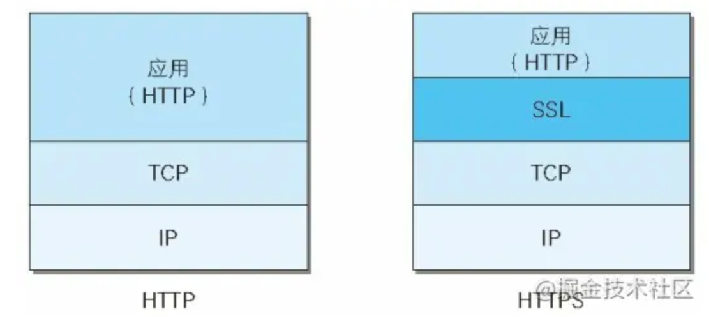
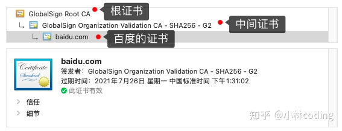

* [特点](#特点)
* [方法](#方法)
  * [get](#get)
  * [head](#head)
  * [post](#post)
  * [put](#put)
  * [patch](#patch)
  * [delete](#delete)
  * [options](#options)
  * [connect](#connect)
  * [trace](#trace)
* [状态码](#状态码)
  * [1XX](#1xx)
  * [2XX](#2xx)
  * [3XX](#3xx)
  * [4XX](#4xx)
  * [5XX](#5xx)
* [HTTPS](#https)
  * [什么是HTTPS](#什么是https)
  * [端口](#端口)
  * [https解决的问题](#https解决的问题)
    * [解决内容可能被窃听的问题——加密](#解决内容可能被窃听的问题加密)
    * [解决报文可能遭篡改问题——数字签名](#解决报文可能遭篡改问题数字签名)
    * [解决通信方身份可能被伪装的问题——数字证书](#解决通信方身份可能被伪装的问题数字证书)
  * [HTTPS加密过程](#https加密过程)
* [Https的CA证书放了什么，公钥放在CA里吗？](#https的ca证书放了什么公钥放在ca里吗)
* [CA证书是在客户端还是服务器](#ca证书是在客户端还是服务器)
* [HTTP1.1和HTTP1.0的主要区别](#http11和http10的主要区别)
* [HTTP2.0和HTTP1.x的区别](#http20和http1x的区别)
* [http的request和response格式](#http的request和response格式)
  * [request](#request)
  * [response](#response)
* [参考文章](#参考文章)

# 特点
无状态
# 方法
## get
获取资源 
## head
获取报文首部
## post
传输实体主体
## put
- 上传文件
- 修改资源完全替换
## patch
修改部分资源
## delete
删掉文件
## options
查询指定的URL支持的方法
- 返回 Allow: GET, POST, HEAD, OPTIONS 这样的内容
## connect
使用SSL、TLS把通讯内容加密后通过隧道传输
## trace
服务器会把通讯路径返回给客户端

# 状态码
## 1XX
信息性状态码
接收的请求正在处理
- 100 已经被部分接收
- 101 切换协议
## 2XX
成功状态码
- 200 请求的正常处理
## 3XX
重定向状态码
需要进行附加操作以完成处理
- 302
临时重定向
## 4XX
客户端错误码
- 400 bad request 语法错误
- 404 资源未找到
- 405 不允许使用该方法
## 5XX
服务端错误码
服务器处理发生错误
- 500 服务器错误
- 502 充当网关或代理的服务器，从远端服务器接收到了一个无效的请求
- 503 服务不可用
- 504 网关超时

# HTTPS
## 什么是HTTPS
- HTTP协议运行在TCP之上，所有传输的内容都是明文，客户端和服务器端都无法验证对方的身份。HTTPS是运行在SSL/TLS之上的HTTP协议，SSL/TLS 运行在TCP之上。所有传输的内容都经过加密，加密采用对称加密，但对称加密的密钥用服务器方的证书进行了非对称加密。所以说，HTTP 安全性没有 HTTPS高，但是 HTTPS 比HTTP耗费更多服务器资源。
- 所谓HTTPS，其实就是身披SSL协议这层外壳的HTTP
  - 			
  - 在采用SSL后，HTTP就拥有了HTTPS的加密、证书和完整性保护这些功能。也就是说HTTP加上加密处理和认证以及完整性保护后即是HTTPS。
## 端口
  - HTTP的URL由“http://”起始且默认使用端口80
  - HTTPS的URL由“https://”起始且默认使用端口443
## https解决的问题
### 解决内容可能被窃听的问题——加密
- 对称加密+非对称加密
  - 对称加密
    - 密钥只有一个，加密解密为同一个密码，且加解密速度快，典型的对称加密算法有DES、AES等；
      - 服务器和客户端拥有相同的密钥
      - 客户端使用密钥加密消息后传给服务器，服务器收到后用密钥解密
      - 但是需要先传递密钥，此时可能被截获
  - 非对称加密
    - 密钥成对出现（且根据公钥无法推知私钥，根据私钥也无法推知公钥），加密解密使用不同密钥（公钥加密需要私钥解密，私钥加密需要公钥解密），相对对称加密速度较慢，典型的非对称加密算法有RSA、DSA等。
      - 公钥加密私钥解密
- 使用对称密钥的好处是解密的效率比较快，使用非对称密钥的好处是可以使得传输的内容不能被破解，因为就算你拦截到了数据，但是没有对应的私钥，也是不能破解内容的。就比如说你抢到了一个保险柜，但是没有保险柜的钥匙也不能打开保险柜。那我们就将对称加密与非对称加密结合起来,充分利用两者各自的优势，在交换密钥环节使用非对称加密方式，之后的建立通信交换报文阶段则使用对称加密方式。
  - 具体做法是：发送密文的一方使用对方的公钥进行加密处理“对称的密钥”，然后对方用自己的私钥解密拿到“对称的密钥”，这样可以确保交换的密钥是安全的前提下，使用对称加密方式进行通信。所以，HTTPS采用对称加密和非对称加密两者并用的混合加密机制
### 解决报文可能遭篡改问题——数字签名
- 数字签名有两种功效：
  - 能确定消息确实是由发送方签名并发出来的，因为别人假冒不了发送方的签名。
  - 数字签名能确定消息的完整性,证明数据是否未被篡改过。
- 数字签名如何生成:
  - 将一段文本先用Hash函数生成消息摘要，然后用发送者的私钥加密生成数字签名，与原文文一起传送给接收者
    - 1、hash(文本)->消息摘要
    - 2、使用发送者的私钥加密->数字签名
  - 校验数字签名流程：
    - 接受者使用发送者的公钥解密数字签名->消息摘要
    - 用hash函数对原文再生成一个摘要信息->对比解密的消息摘要，判断是否相同
### 解决通信方身份可能被伪装的问题——数字证书
A----------->B
- A和B通信

A-------x--C--x------>B
- 如果消息被C截获，并且C用自己的私钥加密，再传递给B，并且也传递了自己的公钥，B验证后发现没问题回传了信息给C，但是消息已经被截获了 
##  HTTPS加密过程
1. 客户端首先请求服务器
2. 服务器返回CA证书，包含网站信息和公钥A
- 什么是CA证书
  - 由CA机构申领一份数字证书
    - 这种机构没几个而且要钱
    - 证书的内容
      - 电子签证机关的信息、公钥用户信息、公钥、权威机构的签字和有效期等等
  - CA机构生成数字签名
    - CA机构拥有非对称加密的私钥和公钥。
    - CA机构对证书明文数据T进行hash。
    - 对hash后的值用私钥加密，得到数字签名S。
  - 明文和数字签名共同组成了数字证书，这样一份数字证书就可以颁发给网站了。
3. 客户端解析证书判断是否合法
- 客户端如何拿到数字证书认证机构的公开密钥？
  - 多数浏览器开发商发布版本时，会事先在内部植入常用认证机关的公开密钥
- 怎么判断证书的合法性
  - 拿到证书，得到明文T，签名S。
  - 用CA机构的公钥对S解密（由于是浏览器信任的机构，所以浏览器保有它的公钥。详情见下文），得到S’。
  - 用证书里指明的hash算法对明文T进行hash得到T’。
  - 显然通过以上步骤，T’应当等于S‘，除非明文或签名被篡改。所以此时比较S’是否等于T’，等于则表明证书可信。
- 证书链
  - 但事实上，证书的验证过程中还存在一个证书信任链的问题，因为我们向 CA 申请的证书一般不是根证书签发的，而是由中间证书签发的
    - 比如百度的证书，从图你可以看到，证书的层级有三级
      
    - 对于这种三级层级关系的证书的验证过程如下：
      - 客户端收到 http://baidu.com 的证书后，发现这个证书的签发者不是根证书，就无法根据本地已有的根证书中的公钥去验证 http://baidu.com 证书是否可信。于是，客户端根据 http://baidu.com 证书中的签发者，找到该证书的颁发机构是 “GlobalSign Organization Validation CA - SHA256 - G2”，然后向 CA 请求该中间证书。
      - 请求到证书后发现 “GlobalSign Organization Validation CA - SHA256 - G2” 证书是由 “GlobalSign Root CA” 签发的，由于 “GlobalSign Root CA” 没有再上级签发机构，说明它是根证书，也就是自签证书。应用软件会检查此证书有否已预载于根证书清单上，如果有，则可以利用根证书中的公钥去验证 “GlobalSign Organization Validation CA - SHA256 - G2” 证书，如果发现验证通过，就认为该中间证书是可信的。
      - “GlobalSign Organization Validation CA - SHA256 - G2” 证书被信任后，可以使用 “GlobalSign Organization Validation CA - SHA256 - G2” 证书中的公钥去验证 http://baidu.com 证书的可信性，如果验证通过，就可以信任 http://baidu.com 证书。
    - 总括来说，由于用户信任 GlobalSign，所以由 GlobalSign 所担保的 http://baidu.com 可以被信任，另外由于用户信任操作系统或浏览器的软件商，所以由软件商预载了根证书的 GlobalSign 都可被信任。
  - 为什么需要证书链这么麻烦的流程？Root CA 为什么不直接颁发证书，而是要搞那么多中间层级呢？
    - 这是为了确保根证书的绝对安全性，将根证书隔离地越严格越好，不然根证书如果失守了，那么整个信任链都会有问题。
4. 取出公钥A生成随机码KEY
5. 传递给服务器
6. 服务器用私钥A解密得到随机码KEY
7. 之后使用KEY加密传输数据

# Https的CA证书放了什么，公钥放在CA里吗？
- CA证书放了什么？
    -  电子签证机关的信息、公钥用户信息、公钥、权威机构的签字和有效期等等
- 公钥放在CA里吗？
    - yes

# CA证书是在客户端还是服务器

客户端和服务器建立https通信的第一步是，客户端向服务器发起请求，服务器返回CA证书，所以证书是放在服务器，客户端也就是浏览器一般都会内置根证书列表，服务器返回的CA证书一般不会是根证书而是由中间商颁发的，但是可以寻到根证书机构，客户端先寻到根证书，和自己的信任列表对比，一层一层判断证书是否合法

# HTTP1.1和HTTP1.0的主要区别
HTTP1.0最早在网页中使用是在1996年，那个时候只是使用一些较为简单的网页上和网络请求上，而HTTP1.1则在1999年才开始广泛应用于现在的各大浏览器网络请求中，同时HTTP1.1也是当前使用最为广泛的HTTP协议。 主要区别主要体现在：
- 1、长连接
  - 在HTTP/1.0中，默认使用的是短连接，也就是说每次请求都要重新建立一次连接。HTTP 是基于TCP/IP协议的,每一次建立或者断开连接都需要三次握手四次挥手的开销，如果每次请求都要这样的话，开销会比较大。因此最好能维持一个长连接，可以用个长连接来发多个请求。HTTP 1.1起，默认使用长连接 ,默认开启Connection： keep-alive。 HTTP/1.1的持续连接有非流水线方式和流水线方式 。流水线方式是客户在收到HTTP的响应报文之前就能接着发送新的请求报文。与之相对应的非流水线方式是客户在收到前一个响应后才能发送下一个请求。
- 2、错误状态响应码
  - 在HTTP1.1中新增了24个错误状态响应码，如409（Conflict）表示请求的资源与资源的当前状态发生冲突；410（Gone）表示服务器上的某个资源被永久性的删除。
- 3、缓存处理
  - 在HTTP1.0中主要使用header里的If-Modified-Since,Expires来做为缓存判断的标准，HTTP1.1则引入了更多的缓存控制策略例如Entity tag，If-Unmodified-Since, If-Match, If-None-Match等更多可供选择的缓存头来控制缓存策略。
- 4、带宽优化及网络连接的使用
  - HTTP1.0中，存在一些浪费带宽的现象，例如客户端只是需要某个对象的一部分，而服务器却将整个对象送过来了，并且不支持断点续传功能，HTTP1.1则在请求头引入了range头域，它允许只请求资源的某个部分，即返回码是206（Partial Content），这样就方便了开发者自由的选择以便于充分利用带宽和连接。
- Host头处理
  - 在HTTP1.0中认为每台服务器都绑定一个唯一的IP地址，因此，请求消息中的URL并没有传递主机名（hostname）。但随着虚拟主机技术的发展，在一台物理服务器上可以存在多个虚拟主机（Multi-homed Web Servers），并且它们共享一个IP地址。HTTP1.1的请求消息和响应消息都应支持Host头域，且请求消息中如果没有Host头域会报告一个错误（400 Bad Request）

# HTTP2.0和HTTP1.x的区别
- 新的二进制格式
  - HTTP1.x的解析是基于文本。基于文本协议的格式解析存在天然缺陷，文本的表现形式有多样性，要做到健壮性考虑的场景必然很多，二进制则不同，只认0和1的组合。基于这种考虑HTTP2.0的协议解析决定采用二进制格式，实现方便且健壮。
- 多路复用
  - 即连接共享，即每一个request都是是用作连接共享机制的。一个request对应一个id，这样一个连接上可以有多个request，每个连接的request可以随机的混杂在一起，接收方可以根据request的 id将request再归属到各自不同的服务端请求里面。
    - 不用响应后再能发起请求
- header压缩
  - 如上文中所言，对前面提到过HTTP1.x的header带有大量信息，而且每次都要重复发送，HTTP2.0使用encoder来减少需要传输的header大小，通讯双方各自cache一份header fields表，既避免了重复header的传输，又减小了需要传输的大小
- 服务端推送
  - HTTP2.0也具有server push功能

# http的request和response格式
## request
Http Request包括三部分：请求行（request-line），请求头（headers）和请求体（request-body）

例如下面是一个POST请求：
```html
1. GET /search?hl=zh-CN&source=hp&q=domety&aq=f&oq= HTTP/1.1 
2. Accept: image/gif, image/x-xbitmap, image/jpeg, image/pjpeg, application/vnd.ms-excel, application/vnd.ms-powerpoint, 
3. application/msword, application/x-silverlight, application/x-shockwave-flash, */*  
4. Referer: <a href="http://www.google.cn/">http://www.google.cn/</a>  
5. Accept-Language: zh-cn  
6. Accept-Encoding: gzip, deflate  
7. User-Agent: Mozilla/4.0 (compatible; MSIE 6.0; Windows NT 5.1; SV1; .NET CLR 2.0.50727; TheWorld)  
8. Host: <a href="http://www.google.cn">www.google.cn</a>  
9. Connection: Keep-Alive  
10. Cookie: PREF=ID=80a06da87be9ae3c:U=f7167333e2c3b714:NW=1:TM=1261551909:LM=1261551917:S=ybYcq2wpfefs4V9g; 
11.  
12. NID=ojj8d-IygaEtSxLgaJmq&jid=jsaudu9hdha
```
- 第1行：请求行（request-line）
- 第2-10行：请求头（headers）
- 第11行：空行
- 第12行：请求体（request-body）

GET请求的参数数据不会放在请求体里，而是在url中,例如：
`http://www.google.cn/search?hl=zh-CN&source=hp&q=domety&aq=f&oq=`
## response
Http Response也包括三部分：响应状态行，响应头和响应体

例子：
```html
1. HTTP/1.1 200 OK
2. Date: Sat, 31 Dec 2005 23:59:59 GMT
3. Content-Type: text/html;charset=ISO-8859-1
4. Content-Length: 122
5.
6. ＜html＞
7. ＜head＞
8. ＜title＞Wrox Homepage＜/title＞
9. ＜/head＞
10. ＜body＞
11. ＜!-- body goes here --＞
12. ＜/body＞
13. ＜/html＞
```
- 第1行：响应状态行，http版本和状态码
- 第2-4行：键值对
- 第5行：空行
- 第6-13：响应体
# 参考文章
- https://www.cnblogs.com/biyeymyhjob/archive/2012/07/28/2612910.html
- https://www.jianshu.com/p/0e593400d85b
  


  