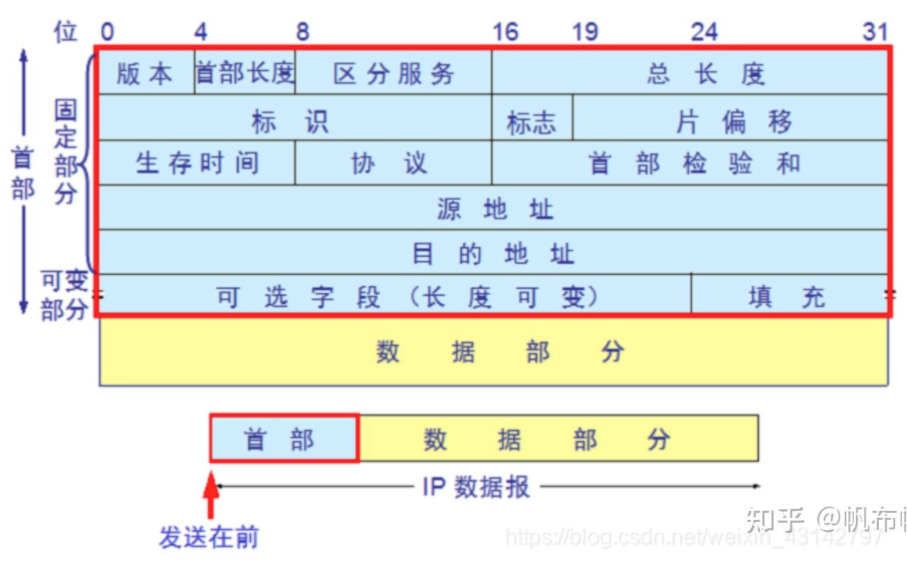

* [<a href="#">图</a>](#图)
* [<a href="#">组成</a>](#组成)
    * [<a href="#">首部</a>](#首部)
        * [<a href="#">版本号</a>](#版本号)
        * [<a href="#">IP首部长度</a>](#ip首部长度)
        * [<a href="#">区分服务</a>](#区分服务)
        * [<a href="#">总长度</a>](#总长度)
        * [<a href="#">标识</a>](#标识)
        * [<a href="#">标志</a>](#标志)
        * [<a href="#">片位移</a>](#片位移)
        * [<a href="#">生存时间</a>](#生存时间)
        * [<a href="#">协议</a>](#协议)
        * [<a href="#">首部校验和</a>](#首部校验和)
        * [<a href="#">源地址</a>](#源地址)
        * [<a href="#">目标地址</a>](#目标地址)
        * [<a href="#">可选字段</a>](#可选字段)
    * [<a href="#">数据部分</a>](#数据部分)

# [图](#)

# [组成](#)
## [首部](#)
### [版本号](#)
  - 指IP协议所使用的版本。4个位。版本号为0100，4，即IPv4，版本号为6，即IPv6
### [IP首部长度](#)
  - 表示IP包头长度，该字段用4位表示。最常见的报头长度是0101即20位，当IP报头长度不是4字节整数倍时，就需要对填充域填充
### [区分服务](#)
  - 前3位表示报文的优先级，后面的几位分别表示要求更低时延、更高的吞吐量、更高的可靠性、更低的路由代价等。对应位为1即有相应要求，为0则不要求
### [总长度](#)
  - IP报文的总长度。报头的长度和数据部分的长度之和。
### [标识](#)
  - 唯一的标识主机发送的每一分数据报。通常每发送一个报文，它的值加一。当IP报文长度超过传输网络的MTU（最大传输单元）时必须分片，这个标识字段的值被复制到所有数据分片的标识字段中，使得这些分片在达到最终目的地时可以依照标识字段的内容重新组成原先的数据。
### [标志](#)
  - 共3位。R、DF、MF三位。目前只有后两位有效，DF位：为1表示不分片，为0表示分片。MF：为1表示“更多的片”，为0表示这是最后一片
### [片位移](#)
  - 本分片在原先数据报文中相对首位的偏移位。（需要再乘以8）
### [生存时间](#)
  - IP报文所允许通过的路由器的最大数量。每经过一个路由器，TTL减1，当为0时，路由器将该数据报丢弃。TTL 字段是由发送端初始设置一个 8 bit字段.推荐的初始值由分配数字 RFC 指定，当前值为 64。发送 ICMP 回显应答时经常把 TTL 设为最大值 255。
### [协议](#)
  - 指出IP报文携带的数据使用的是哪种协议，以便目的主机的IP层能知道要将数据报上交到哪个进程（不同的协议有专门不同的进程处理）。和端口号类似，此处采用协议号，TCP的协议号为6，UDP的协议号为17。ICMP的协议号为1，IGMP的协议号为2.
### [首部校验和](#)
  - 计算IP头部的校验和，检查IP报头的完整性
  - 为了计算一份数据报的IP检验和，首先把检验和字段置为0。然后，对首部中每个16bit进行二进制反码求和（整个首部看成是由一串16bit的字组成），结果存在检验和字段中。当收到一份IP数据报后，同样对首部中每个16bit进行二进制反码的求和。由于接受方在计算过程中包含了发送方存在首部中的校验和。因此，如果首部在传输过程中没有发生任何差错，那么接受方计算的结果应该为全1。如果结果不是全1（即检验和错误），那么IP就丢弃收到的数据报。
### [源地址](#)
  - 标识IP数据报的源端设备
### [目标地址](#)
  - 标识IP数据报的目的地址
### [可选字段](#)
  - IP支持很多可选选项
## [数据部分](#)