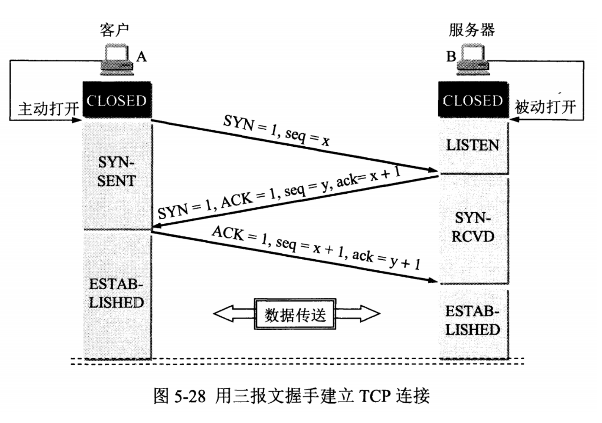
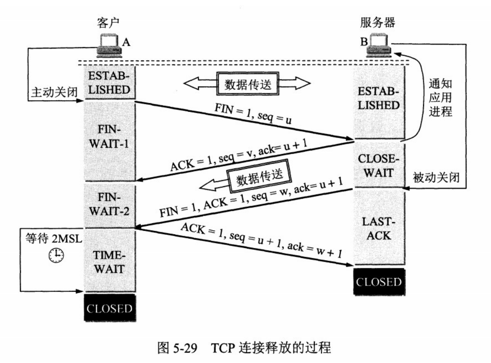

* [<a href="#">UDP 和 TCP 的特点</a>](#udp-和-tcp-的特点)
  * [<a href="#">UDP</a>](#udp)
  * [<a href="#">TCP</a>](#tcp)
* [<a href="#">三次握手</a>](#三次握手)
  * [<a href="#">流程</a>](#流程)
  * [<a href="#">为什么需要三次握手</a>](#为什么需要三次握手)
* [<a href="#">四次挥手</a>](#四次挥手)
  * [<a href="#">流程</a>](#流程-1)
* [<a href="#">TCP怎么保障可靠传输</a>](#tcp怎么保障可靠传输)
  * [<a href="#">数据合理分片和排序</a>](#数据合理分片和排序)
  * [<a href="#">数据校验：校验和</a>](#数据校验校验和)
  * [<a href="#">TCP 的接收端会丢弃重复的数据</a>](#tcp-的接收端会丢弃重复的数据)
  * [<a href="#">超时重传</a>](#超时重传)
  * [<a href="#">流量控制</a>](#流量控制)
  * [<a href="#">拥塞控制</a>](#拥塞控制)
  * [<a href="#">ARQ协议</a>](#arq协议)
* [HTTP长连接还是短连接？](#http长连接还是短连接)
* [参考文章](#参考文章)

## [UDP 和 TCP 的特点](#)
### [UDP](#)
是无连接的，尽最大可能交付，没有拥塞控制，面向报文 （对于应用程序传下来的报文不合并也不拆分，只是添加 UDP 首部），支持一对一、一对多、多对一和多对多 的交互通信。
### [TCP](#)
是面向连接的，提供可靠交付，有流量控制，拥塞控 制，提供全双工通信，面向字节流（把应用层传下来的报文看成字节流，把字节流组织成大小不等的数据 块），每一条 TCP 连接只能是点对点的（一对一）。
## [三次握手](#)
### [流程](#)

1. 客户端–发送带有 SYN 标志的数据包–一次握手–服务端
2. 服务端–发送带有 SYN/ACK 标志的数据包–二次握手–客户端
3. 客户端–发送带有带有 ACK 标志的数据包–三次握手–服务端

### [为什么需要三次握手](#)
- 三次握手的目的是建立可靠的通信信道，说到通讯，简单来说就是数据的发送与接收，而三次握手最主要的目的就是双方确认自己与对方的发送与接收是正常的。
1. 第一次握手：Client 什么都不能确认；Server 确认了对方发送正常，自己接收正常
2. 第二次握手：Client 确认了：自己发送、接收正常，对方发送、接收正常；Server 确认了：对方发送正常，自己接收正常
3. 第三次握手：Client 确认了：自己发送、接收正常，对方发送、接收正常；Server 确认了：自己发送、接收正常，对方发送、接收正常

- 第三次握手是为了防止失效的连接请求到达服务器，让服务器错误打开连接。客户端发送的连接请求如果在网络中滞留，那么就会隔很长一段时间才能收到服务器端发回的连接确认。客户端等待一个超时重传时间之后，就会重新请求连接。但是这个滞留的连接请求最后还是会到达服务器，如果不进行三次握手，那么服务器就会打开两个连接。如果有第三次握手，客户端会忽略服务器之后发送的对滞留连接请求的连接确认，不进行第三次握手，因此就不会再次打开连接。

## [四次挥手](#)
### [流程](#)

1. 客户端-发送一个 FIN，用来关闭客户端到服务器的数据传送
    - 任何一方都可以在数据传送结束后发出连接释放的通知，待对方确认后进入半关闭状态。当另一方也没有数据再发送的时候，则发出连接释放通知，对方确认后就完全关闭了TCP连接。
2. 服务器-收到这个 FIN，它发回一 个 ACK，确认序号为收到的序号加1 。和 SYN 一样，一个 FIN 将占用一个序号
3. 服务器-关闭与客户端的连接，发送一个FIN给客户端
   - 客户端发送了 FIN 连接释放报文之后，服务器收到了这个报文，就进入了 CLOSE-WAIT 状态。这个状态是为了让服务器端发送还未传送完毕的数据，传送完毕之后，服务器会发送 FIN 连接释放报文。
4. 客户端-发回 ACK 报文确认，并将确认序号设置为收到序号加1
   - 客户端接收到服务器端的 FIN 报文后进入此状态，此时并不是直接进入 CLOSED 状态，还需要等待一个时间计时器
   - 设置的时间 2MSL。这么做有两个理由：
     - 确保最后一个确认报文能够到达。如果 B 没收到 A 发送来的确认报文，那么就会重新发送连接释放请求报文，A 等待一段时间就是为了处理这种情况的发生。
     - 等待一段时间是为了让本连接持续时间内所产生的所有报文都从网络中消失，使得下一个新的连接不会出现旧的连接请求报文。

## [TCP怎么保障可靠传输](#)

### [数据合理分片和排序](#)
  - 应用数据被分割成 TCP 认为最适合发送的数据块。
    - UDP：IP数据报大于1500字节,大于MTU.这个时候发送方IP层就需要分片(fragmentation).把数据报分成若干片,使每一片都小于MTU（Maxitum Transmission Unit 最大传输单元）.而接收方IP层则需要进行数据报的重组.这样就会多做许多事情,而更严重的是,由于UDP的特性,当某一片数据传送中丢失时,接收方便无法重组数据报.将导致丢弃整个UDP数据报.
    - tcp会按MTU合理分片，接收方会缓存未按序到达的数据，重新排序后再交给应用层。
  - TCP 给发送的每一个包进行编号，接收方对数据包进行排序，把有序数据传送给应用层。
###  [数据校验：校验和](#)
  - TCP 将保持它首部和数据的检验和。这是一个端到端的检验和，目的是检测数据在传输过程中的任何变化。如果收到段的检验和有差错，TCP 将丢弃这个报文段和不确认收到此报文段。

### [TCP 的接收端会丢弃重复的数据](#)
### [超时重传](#)
  - 当 TCP 发出一个段后，它启动一个定时器，等待目的端确认收到这个报文段。如果不能及时收到一个确认，将重发这个报文段。
  - 超时时间应该设置为多少呢？
    - RTT和RTO
      - RTT
        - RTT 就是数据从网络一端传送到另一端所需的时间，也就是包的往返时间
      - RTO
        - 超时重传时间是以 RTO （Retransmission Timeout 超时重传时间）表示
    - RTO较长和较短会发生什么
      - 当超时时间 RTO 较大时，重发就慢，丢了老半天才重发，没有效率，性能差
      - 当超时时间 RTO 较小时，会导致可能并没有丢就重发，于是重发的就快，会增加网络拥塞，导致更多的超时，更多的超时导致更多的重发
    - 超时重传时间 RTO 的值应该略大于报文往返 RTT 的值
    - 每当遇到一次超时重传的时候，都会将下一次超时时间间隔设为先前值的两倍。两次超时，就说明网络环境差，不宜频繁反复发送 
### [流量控制](#)
  - TCP 连接的每一方都有固定大小的缓冲空间，TCP的接收端只允许发送端发送接收端缓冲区能接纳的数据。当接收方来不及处理发送方的数据，能提示发送方降低发送的速率，防止包丢失。TCP 使用的流量控制协议是可变大小的滑动窗口协议。 （TCP 利用滑动窗口实现流量控制）
    - 滑动窗口和流量控制
      - TCP 利用滑动窗口实现流量控制。流量控制是为了控制发送方发送速率，保证接收方来得及接收。 接收方发送的确认报文中的窗口字段可以用来控制发送方窗口大小，从而影响发送方的发送速率。将窗口字段设置为 0，则发送方不能发送数据。

### [拥塞控制](#)
  - 当网络拥塞时，减少数据的发送。
  - 如果网络出现拥塞，分组将会丢失，此时发送方会继续重传，从而导致网络拥塞程度更高。因此当出现拥塞时，应当控制发送方的速率。这一点和流量控制很像，但是出发点不同。流量控制是为了让接收方能来得及接收，而拥塞控制是为了降低整个网络的拥塞程度。
  - 为了进行拥塞控制，TCP 发送方要维持一个 拥塞窗口(cwnd) 的状态变量。拥塞控制窗口的大小取决于网络的拥塞程度，并且动态变化。发送方让自己的发送窗口取为拥塞窗口和接收方的接受窗口中较小的一个。
    - 注意拥塞窗口与发送方窗口的区别：拥塞窗口只是一个状态变量，实际决定发送方能发送多少数据的是发送方窗口。
    - TCP的拥塞控制采用了四种算法，即 慢开始 、 拥塞避免 、快重传 和 快恢复。在网络层也可以使路由器采用适当的分组丢弃策略（如主动队列管理 AQM），以减少网络拥塞的发生。
      - [慢开始](#)
        - 慢开始算法的思路是当主机开始发送数据时，如果立即把大量数据字节注入到网络，那么可能会引起网络阻塞，因为现在还不知道网络的符合情况。经验表明，较好的方法是先探测一下，即由小到大逐渐增大发送窗口，也就是由小到大逐渐增大拥塞窗口数值。cwnd初始值为1，每经过一个传播轮次，cwnd加倍
      - [拥塞避免](#)
        - 拥塞避免算法的思路是让拥塞窗口cwnd缓慢增大，即每经过一个往返时间RTT就把发送放的cwnd加1.
          - 注意到慢开始每个轮次都将 cwnd 加倍，这样会让 cwnd 增长速度非常快，从而使得发送方发送的速度增长速度过快，网络拥塞的可能性也就更高。设置一个慢开始门限 ssthresh，当 cwnd >= ssthresh 时，进入拥塞避免，每个轮次只将 cwnd 加 1。
          - 如果出现了超时，则令 ssthresh = cwnd / 2，然后重新执行慢开始。
      - [快重传与快恢复](#)
        - 在 TCP/IP 中，快速重传和恢复（fast retransmit and recovery，FRR）是一种拥塞控制算法，它能快速恢复丢失的数据包。没有 FRR，如果数据包丢失了，TCP 将会使用定时器来要求传输暂停。在暂停的这段时间内，没有新的或复制的数据包被发送。有了 FRR，如果接收机接收到一个不按顺序的数据段，它会立即给发送机发送一个重复确认。如果发送机接收到三个重复确认，它会假定确认件指出的数据段丢失了，并立即重传这些丢失的数据段。有了 FRR，就不会因为重传时要求的暂停被耽误。 　当有单独的数据包丢失时，快速重传和恢复（FRR）能最有效地工作。当有多个数据信息包在某一段很短的时间内丢失时，它则不能很有效地工作。
          - 在接收方，要求每次接收到报文段都应该对最后一个已收到的有序报文段进行确认。例如已经接收到 M1 和 M2，此时收到 M4，应当发送对 M2 的确认。
          - 在发送方，如果收到三个重复确认，那么可以知道下一个报文段丢失，此时执行快重传，立即重传下一个报文段。例如收到三个 M2，则 M3 丢失，立即重传 M3。
          - 在这种情况下，只是丢失个别报文段，而不是网络拥塞。因此执行快恢复，令 ssthresh = cwnd / 2 ，cwnd =ssthresh，注意到此时直接进入拥塞避免。
          - 慢开始和快恢复的快慢指的是 cwnd 的设定值，而不是 cwnd 的增长速率。慢开始 cwnd 设定为 1，而快恢复 cwnd设定为 ssthresh。
        - 重传方法
          - SACK
            - 这种方式需要在 TCP 头部「选项」字段里加一个 SACK 的东西，它可以将缓存的地图发送给发送方，这样发送方就可以知道哪些数据收到了，哪些数据没收到，知道了这些信息，就可以只重传丢失的数据
            - 如果要支持 SACK，必须双方都要支持。在 Linux 下，可以通过 net.ipv4.tcp_sack 参数打开这个功能（Linux 2.4 后默认打开）
          - Duplicate SACK
            - Duplicate SACK 又称 D-SACK，其主要使用了 SACK 来告诉「发送方」有哪些数据被重复接收了。
            - 情况
              - CK 丢包
                - 「接收方」发给「发送方」的两个 ACK 确认应答都丢失了，所以发送方超时后，重传第一个数据包（3000 ~ 3499）
                - 于是「接收方」发现数据是重复收到的，于是回了一个 SACK = 3000~3500，告诉「发送方」 3000~3500 的数据早已被接收了，因为 ACK 都到了 4000 了，已经意味着 4000 之前的所有数据都已收到，所以这个 SACK 就代表着 D-SACK。
                - 这样「发送方」就知道了，数据没有丢，是「接收方」的 ACK 确认报文丢了
              - 网络延时
                - 数据包（1000~1499） 被网络延迟了，导致「发送方」没有收到 Ack 1500 的确认报文。
                - 而后面报文到达的三个相同的 ACK 确认报文，就触发了快速重传机制，但是在重传后，被延迟的数据包（1000~1499）又到了「接收方」；
                - 所以「接收方」回了一个 SACK=1000~1500，因为 ACK 已经到了 3000，所以这个 SACK 是 D-SACK，表示收到了重复的包。
                - 这样发送方就知道快速重传触发的原因不是发出去的包丢了，也不是因为回应的 ACK 包丢了，而是因为网络延迟了。

### [ARQ协议](#)
  - 也是为了实现可靠传输的，它的基本原理就是每发完一个分组就停止发送，等待对方确认。在收到确认后再发下一个分组。
  - 自动重传请求（Automatic Repeat-reQuest，ARQ）是OSI模型中数据链路层和传输层的错误纠正协议之一。它通过使用确认和超时这两个机制，在不可靠服务的基础上实现可靠的信息传输。如果发送方在发送后一段时间之内没有收到确认帧，它通常会重新发送。ARQ包括停止等待ARQ协议和连续ARQ协议。
    - [停止等待ARQ协议](#)
      - 停止等待协议是为了实现可靠传输的，它的基本原理就是每发完一个分组就停止发送，等待对方确认（回复ACK）。如果过了一段时间（超时时间后），还是没有收到 ACK 确认，说明没有发送成功，需要重新发送，直到收到确认后再发下一个分组。在停止等待协议中，若接收方收到重复分组，就丢弃该分组，但同时还要发送确认。
      - 优缺点：
        - 优点： 简单
        - 缺点： 信道利用率低，等待时间长
      - 处理情况
        - 无差错情况:
          - 发送方发送分组,接收方在规定时间内收到,并且回复确认.发送方再次发送。
        - 出现差错情况（超时重传）:
          - 停止等待协议中超时重传是指只要超过一段时间仍然没有收到确认，就重传前面发送过的分组（认为刚才发送过的分组丢失了）。因此每发送完一个分组需要设置一个超时计时器，其重传时间应比数据在分组传输的平均往返时间更长一些。这种自动重传方式常称为 自动重传请求 ARQ 。另外在停止等待协议中若收到重复分组，就丢弃该分组，但同时还要发送确认。连续 ARQ 协议 可提高信道利用率。发送维持一个发送窗口，凡位于发送窗口内的分组可连续发送出去，而不需要等待对方确认。接收方一般采用累积确认，对按序到达的最后一个分组发送确认，表明到这个分组位置的所有分组都已经正确收到了。
        - 确认丢失和确认迟到
          - 确认丢失 ：确认消息在传输过程丢失。当A发送M1消息，B收到后，B向A发送了一个M1确认消息，但却在传输过程中丢失。而A并不知道，在超时计时过后，A重传M1消息，B再次收到该消息后采取以下两点措施：1. 丢弃这个重复的M1消息，不向上层交付。 2. 向A发送确认消息。（不会认为已经发送过了，就不再发送。A能重传，就证明B的确认消息丢失）。
          - 确认迟到 ：确认消息在传输过程中迟到。A发送M1消息，B收到并发送确认。在超时时间内没有收到确认消息，A重传M1消息，B仍然收到并继续发送确认消息（B收到了2份M1）。此时A收到了B第二次发送的确认消息。接着发送其他数据。过了一会，A收到了B第一次发送的对M1的确认消息（A也收到了2份确认消息）。处理如下：1. A收到重复的确认后，直接丢弃。2. B收到重复的M1后，也直接丢弃重复的M1。
    - [连续ARQ协议](#)
      - 连续 ARQ 协议可提高信道利用率。发送方维持一个发送窗口，凡位于发送窗口内的分组可以连续发送出去，而不需要等待对方确认。接收方一般采用累计确认，对按序到达的最后一个分组发送确认，表明到这个分组为止的所有分组都已经正确收到了。
      - 优缺点
        - 优点： 信道利用率高，容易实现，即使确认丢失，也不必重传。
        - 缺点： 不能向发送方反映出接收方已经正确收到的所有分组的信息。 比如：发送方发送了 5条 消息，中间第三条丢失（3号），这时接收方只能对前两个发送确认。发送方无法知道后三个分组的下落，而只好把后三个全部重传一次。这也叫 Go-Back-N（回退 N），表示需要退回来重传已经发送过的 N 个消息。

## HTTP长连接还是短连接？
在HTTP/1.0中，默认使用的是短连接
- 也就是说，浏览器和服务器每进行一次HTTP操作，就建立一次连接，但任务结束就中断连接。如果客户端浏览器访问的某个HTML或其他类型的 Web页中包含有其他的Web资源，如JavaScript文件、图像文件、CSS文件等；当浏览器每遇到这样一个Web资源，就会建立一个HTTP会话。

HTTP/1.1起，默认使用长连接，用以保持连接特性
- Connection:keep-alive
- 在使用长连接的情况下，当一个网页打开完成后，客户端和服务器之间用于传输HTTP数据的 TCP连接不会关闭，如果客户端再次访问这个服务器上的网页，会继续使用这一条已经建立的连接。Keep-Alive不会永久保持连接，它有一个保持时间，可以在不同的服务器软件（如Apache）中设定这个时间。实现长连接要客户端和服务端都支持长连接

# 参考文章
- https://www.cnblogs.com/0201zcr/p/4694945.html