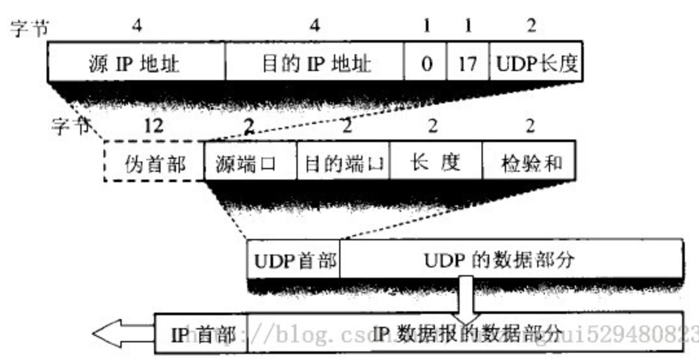

* [<a href="#">图</a>](#图)
* [<a href="#">组成</a>](#组成)
    * [<a href="#">首部</a>](#首部)
        * [<a href="#">伪首部</a>](#伪首部)
        * [<a href="#">源端口</a>](#源端口)
        * [<a href="#">目标端口</a>](#目标端口)
        * [<a href="#">长度</a>](#长度)
        * [<a href="#">校验和</a>](#校验和)
    * [<a href="#">数据部分</a>](#数据部分)

# [图](#)

# [组成](#)
## [首部](#)
### [伪首部](#)
### [源端口](#)
### [目标端口](#)
### [长度](#)
  - UDP报文的整个大小，最小为8个字节（仅为首部)
### [校验和](#)
  - 在进行检验和计算时，会添加一个伪首部一起进行运算。伪首部（占用12个字节）为：4个字节的源IP地址、4个字节的目的IP地址、1个字节的0、一个字节的数字17、以及占用2个字节UDP长度。这个伪首部不是报文的真正首部，只是引入为了计算校验和。相对于IP协议的只计算首部，UDP检验和会把首部和数据一起进行校验。接收端进行的校验和与UDP报文中的校验和相与，如果无差错应该全为1。如果有误，则将报文丢弃或者发给应用层、并附上差错警告
## [数据部分](#)