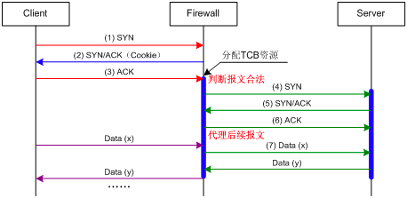

* [CSRF攻击](#csrf攻击)
  * [什么是CSRF攻击](#什么是csrf攻击)
  * [场景](#场景)
  * [怎么预防](#怎么预防)
    * [阻止不明外域的访问](#阻止不明外域的访问)
    * [提交时要求附加本域才能获取的信息](#提交时要求附加本域才能获取的信息)
* [XSS](#xss)
  * [什么是XSS](#什么是xss)
  * [分类](#分类)
  * [如何预防XSS](#如何预防xss)
* [SQL注入](#sql注入)
  * [什么是SQL注入](#什么是sql注入)
  * [怎么预防](#怎么预防-1)
* [DDOS](#ddos)
  * [什么是DDOS](#什么是ddos)
  * [怎么预防](#怎么预防-2)
* [SYN Flood攻击](#syn-flood攻击)
  * [SYN Flood攻击如何工作？](#syn-flood攻击如何工作)
  * [防范](#防范)
    * [连接限制技术：](#连接限制技术)
    * [连接代理技术：](#连接代理技术)
      * [SYN Cookie](#syn-cookie)
      * [Safe Reset](#safe-reset)
    * [半开连接数检测](#半开连接数检测)
* [参考文章](#参考文章)

# CSRF攻击
## 什么是CSRF攻击
CSRF（Cross-site request forgery）跨站请求伪造：攻击者诱导受害者进入第三方网站，在第三方网站中，向被攻击网站发送跨站请求。利用受害者在被攻击网站已经获取的注册凭证，绕过后台的用户验证，达到冒充用户对被攻击的网站执行某项操作的目的
## 场景
一个典型的CSRF攻击有着如下的流程：
- 受害者登录a.com，并保留了登录凭证（Cookie）。
- 攻击者引诱受害者访问了b.com。
- b.com 向 a.com 发送了一个请求：a.com/act=xx。浏览器会默认携带a.com的Cookie。
- a.com接收到请求后，对请求进行验证，并确认是受害者的凭证，误以为是受害者自己发送的请求。
- a.com以受害者的名义执行了act=xx。
攻击完成，攻击者在受害者不知情的情况下，冒充受害者，让a.com执行了自己定义的操作。
## 怎么预防
### 阻止不明外域的访问
- 在HTTP协议中，每一个异步请求都会携带两个Header，用于标记来源域名：
  - Origin Header
    - 使用Origin Header确定来源域名
  - Referer Header
- 这两个Header在浏览器发起请求时，大多数情况会自动带上，并且不能由前端自定义内容。 服务器可以通过解析这两个Header中的域名，确定请求的来源域。
### 提交时要求附加本域才能获取的信息
- CSRF Token
  - 将CSRF Token输出到页面中
  - 页面提交的请求携带这个Token
  - 服务器验证Token是否正确
- 双重Cookie验证
  - 在用户访问网站页面时，向请求域名注入一个Cookie，内容为随机字符串（例如csrfcookie=v8g9e4ksfhw）。
  - 在前端向后端发起请求时，取出Cookie，并添加到URL的参数中（接上例POST https://www.a.com/comment?csrfcookie=v8g9e4ksfhw）。
  - 后端接口验证Cookie中的字段与URL参数中的字段是否一致，不一致则拒绝。
- Samesite Cookie属性
  - Samesite 有两个属性值，分别是 Strict 和 Lax
    - Samesite=Strict
      - 这种称为严格模式，表明这个 Cookie 在任何情况下都不可能作为第三方 Cookie
    - Samesite=Lax
      - 这种称为宽松模式，比 Strict 放宽了点限制：假如这个请求是这种请求（改变了当前页面或者打开了新页面）且同时是个GET请求，则这个Cookie可以作为第三方Cookie
  - 不成熟

# XSS
## 什么是XSS
XSS是一种常见的web安全漏洞，它允许攻击者将恶意代码植入到提供给其它用户使用的页面中
## 分类
- 存储型XSS
  - 主要出现在让用户输入数据，供其他浏览此页的用户进行查看的地方，包括留言、评论、博客日志和各类表单等。应用程序从数据库中查询数据，在页面中显示出来，攻击者在相关页面输入恶意的脚本数据后，用户浏览此类页面时就可能受到攻击。这个流程简单可以描述为：恶意用户的Html输入Web程序->进入数据库->Web程序->用户浏览器
  - 比如说我写了一个网站，然后攻击者在上面发布了一个文章，内容是这样的 ``,如果我没有对他的内容进行处理，直接存储到数据库，那么下一次当其他用户访问他的这篇文章的时候，服务器从数据库读取后然后响应给客户端，浏览器执行了这段脚本，就会将cookie展现出来，这就是典型的存储型XSS
- 反射型XSS
  - 反射型XSS，主要做法是将脚本代码加入URL地址的请求参数里，请求参数进入程序后在页面直接输出，用户点击类似的恶意链接就可能受到攻击。
## 如何预防XSS
答案很简单，坚决不要相信用户的任何输入，并过滤掉输入中的所有特殊字符。这样就能消灭绝大部分的XSS攻击。
- 过滤特殊字符
  - 避免XSS的方法之一主要是将用户所提供的内容进行过滤(如上面的script标签)。
- 使用HTTP头指定类型
  - `w.Header().Set("Content-Type","text/javascript")`
  - 这样就可以让浏览器解析javascript代码，而不会是html输出。

# SQL注入
## 什么是SQL注入
- 击者成功的向服务器提交恶意的SQL查询代码，程序在接收后错误的将攻击者的输入作为查询语句的一部分执行，导致原始的查询逻辑被改变，额外的执行了攻击者精心构造的恶意代码
- 这是最常见的 SQL注入攻击，当我们输如用户名 admin ，然后密码输如`' OR '1'=1='1`的时候，我们在查询用户名和密码是否正确的时候，本来要执行的是`SELECT * FROM user WHERE username='' and password=''`,经过参数拼接后，会执行 SQL语句 SELECT * FROM user WHERE username='' and password='' OR '1'='1'，这个时候1=1是成立，自然就跳过验证了。
- 但是如果再严重一点，密码输如的是`';DROP TABLE user;--`，那么 SQL命令为`SELECT * FROM user WHERE username='admin' and password='';drop table user;--'` 这个时候我们就直接把这个表给删除了。
## 怎么预防
- 在Java中，我们可以使用预编译语句(PreparedStatement)，这样的话即使我们使用 SQL语句伪造成参数，到了服务端的时候，这个伪造 SQL语句的参数也只是简单的字符，并不能起到攻击的作用。
- 在应用发布之前建议使用专业的SQL注入检测工具进行检测，以及时修补被发现的SQL注入漏洞。网上有很多这方面的开源工具，例如sqlmap、SQLninja等。
- 避免网站打印出SQL错误信息，比如类型错误、字段不匹配等，把代码里的SQL语句暴露出来，以防止攻击者利用这些错误信息进行SQL注入。

# DDOS
## 什么是DDOS
分布式拒绝服务攻击（Distributed Denial of Service），简单说就是发送大量请求是使服务器瘫痪
- TCP的SYN攻击
  - 在三次握手过程中，服务器发送 SYN-ACK 之后，收到客户端的 ACK 之前的 TCP 连接称为半连接(half-open connect)。此时服务器处于 SYN_RCVD 状态。当收到 ACK 后，服务器才能转入 ESTABLISHED状态.
  - SYN攻击指的是，攻击客户端在短时间内伪造大量不存在的IP地址，向服务器不断地发送SYN包，服务器回复确认包，并等待客户的确认。由于源地址是不存在的，服务器需要不断的重发直至超时，这些伪造的SYN包将长时间占用未连接队列，正常的SYN请求被丢弃，导致目标系统运行缓慢，严重者会引起网络堵塞甚至系统瘫痪。
## 怎么预防
- 分析可疑流量过滤
  - 关键在于区分攻击流量与正常流量
- 速率限制
- 将攻击流量分散至分布式服务器网络，直到网络吸收流量为止

# SYN Flood攻击
SYN Flood（半开放攻击）是一种拒绝服务（DDoS）攻击，其目的是通过消耗所有可用的服务器资源使服务器不可用于合法流量。通过重复发送初始连接请求（SYN）数据包，攻击者能够压倒目标服务器机器上的所有可用端口，导致目标设备根本不响应合法流量。

## SYN Flood攻击如何工作？
通过利用TCP连接的握手过程，SYN Flood攻击工作。在正常情况下，TCP连接显示三个不同的进程以进行连接。

1.首先，客户端向服务器发送SYN数据包，以便启动连接。

2.服务器响应该初始包与SYN / ACK包，以确认通信。

3.最后，客户端返回ACK数据包以确认从服务器接收到的数据包。完成这个数据包发送和接收序列后，TCP连接打开并能发送和接收数据。

客户端发送一个 SYN包 给服务端后就退出，而服务端接收到 SYN包 后，会回复一个 SYN+ACK包 给客户端，然后等待客户端回复一个 ACK包。

但此时客户端并不会回复 ACK包，所以服务端只能一直等待直到超时。服务端超时后，会重发 SYN+ACK包 给客户端，默认会重试 5 次，而且每次等待的时间都会增加（可以参考 TCP 协议超时重传的实现）。

另外，当服务端接收到 SYN包 后，会建立一个半连接状态的 Socket。所以，当客户端一直发送 SYN包，但不回复 ACK包，那么将会耗尽服务端的资源，这就是 SYN Flood 攻击。

攻击者通常会伪造IP和更换端口

## 防范
### 连接限制技术：
采用SYN Flood攻击防范检测技术，对网络中的新建TCP半开连接数和新建TCP连接速率进行实时检测，通过设置检测阈值来有效地发现攻击流量，然后通过阻断新建连接或释放无效连接来抵御SYN Flood攻击。
### 连接代理技术：
采用SYN Cookie或Safe Reset技术对网络中的TCP连接进行代理，通过精确的验证来准确的发现攻击报文，实现为服务器过滤掉恶意连接报文的同时保证常规业务的正常运行。连接代理技术除了可以对已检测到攻击的服务器进行代理防范，也可以对可能的攻击对象事先配置，做到全部流量代理，而非攻击发生后再代理，这样可以避免攻击报文已经造成一定损失。

#### SYN Cookie
SYN Cookie借鉴了HTTP中Cookie的概念。SYN Cookie技术可理解为，防火墙对TCP新建连接的协商报文进行处理，使其携带认证信息（称之为Cookie），再通过验证客户端回应的协商报文中携带的信息来进行报文有效性确认的一种技术。如图7所示，该技术的实现机制是防火墙在客户端与服务器之间做连接代理，具体过程如下：

1. 客户端向服务器发送一个SYN消息。
2. SYN消息经过防火墙时，防火墙截取该消息，并模拟服务器向客户端回应SYN/ACK消息。其中，SYN/ACK消息中的序列号为防火墙计算的Cookie，此Cookie值是对加密索引与本次连接的客户端信息（如：IP地址、端口号）进行加密运算的结果。
3. 客户端收到SYN/ACK报文后向服务器发送ACK消息进行确认。防火墙截取这个消息后，提取该消息中的ACK序列号，并再次使用客户端信息与加密索引计算Cookie。如果计算结果与ACK序列号相符，就可以确认发起连接请求的是一个真实的客户端。如果客户端不回应ACK消息，就意味着现实中并不存在这个客户端，此连接是一个仿冒客户端的攻击连接；如果客户端回应的是一个无法通过检测的ACK消息，就意味着此客户端非法，它仅想通过模拟简单的TCP协议栈来耗费服务器的连接资源。来自仿冒客户端或非法客户端的后续报文都会被防火墙丢弃，而且防火墙也不会为此分配TCB资源。
4. 如果防火墙确认客户端的ACK消息合法，则模拟客户端向服务器发送一个SYN消息进行连接请求，同时分配TCB资源记录此连接的描述信息。此TCB记录了防火墙向服务器发起的连接请求的信息，同时记录了步骤（2）中客户端向服务器发起的连接请求的信息。
5. 服务器向防火墙回应SYN/ACK消息。
6. 防火墙收到服务器的SYN/ACK回应消息后，根据已有的连接描述信息，模拟客户端向服务器发送ACK消息进行确认。
7. 完成以上过程之后，客户端与防火墙之间建立了连接，防火墙与服务器之间也建立了连接，客户端与服务器间关于此次连接的后续数据报文都将通过防火墙进行代理转发。
防火墙的SYN Cookie技术利用SYN/ACK报文携带的认证信息，对握手协商的ACK报文进行了认证，从而避免了防火墙过早分配TCB资源。当客户端向服务器发送恶意SYN报文时，既不会造成服务器上TCB资源和带宽的消耗，也不会造成防火墙TCB资源的消耗，可以有效防范SYN Flood攻击。在防范SYN Flood攻击的过程中，防火墙作为虚拟的服务器与客户端交互，同时也作为虚拟的客户端与服务器交互，在为服务器过滤掉恶意连接报文的同时保证了常规业务的正常运行。

#### Safe Reset
Safe Reset技术是防火墙通过对正常TCP连接进行干预来识别合法客户端的一种技术。防火墙对TCP新建连接的协商报文进行处理，修改响应报文的序列号并使其携带认证信息（称之为Cookie），再通过验证客户端回应的协商报文中携带的信息来进行报文有效性确认。

防火墙在利用Safe Reset技术认证新建连接的过程中，对合法客户端的报文进行正常转发，对仿冒客户端以及简单模拟TCP协议栈的恶意客户端发起的新建连接报文进行丢弃，这样服务器就不会为仿冒客户端发起的SYN报文分配连接资源，从而避免了SYN Flood 攻击。如图8所示，Safe Reset技术的实现过程如下：

1. 客户端向服务器发送一个SYN消息。
2. SYN消息经过防火墙时，防火墙截取该消息，并模拟服务器向客户端回应SYN/ACK消息。其中，SYN/ACK消息中的ACK序列号与客户端期望的值不一致，同时携带Cookie值。此Cookie值是对加密索引与本次连接的客户端信息（包括：IP地址、端口号）进行加密运算的结果。
3. 客户端按照协议规定向服务器回应RST消息。防火墙中途截取这个消息后，提取消息中的序列号，并对该序列号进行Cookie校验。成功通过校验的连接被认为是可信的连接，防火墙会分配TCB资源记录此连接的描述信息，而不可信连接的后续报文会被防火墙丢弃。
4. 完成以上过程之后，客户端再次发起连接请求，防火墙根据已有的连接描述信息判断报文的合法性，对可信连接的所有合法报文直接放行。

由于防火墙仅通过对客户端向服务器首次发起连接的报文进行认证，就能够完成对客户端到服务器的连接检验，而服务器向客户端回应的报文即使不经过防火墙也不会影响正常的业务处理，因此Safe Reset技术也称为单向代理技术。

一般而言，应用服务器不会主动对客户端发起恶意连接，因此服务器响应客户端的报文可以不需要经过防火墙的检查。防火墙仅需要对客户端发往应用服务器的报文进行实时监控。服务器响应客户端的报文可以根据实际需要选择是否经过防火墙，因此Safe Reset能够支持更灵活的组网方式。
### 半开连接数检测
这类半开连接与正常的半开连接的区别在于，正常半开连接会随着客户端和服务器端握手报文的交互完成而转变成全连接，而仿冒源IP的半开连接永远不会完成握手报文的交互

监测和释放这类半开连接

# 参考文章
- https://zhuanlan.zhihu.com/p/29539671
- http://www.h3c.com/cn/d_200810/618230_30003_0.htm

  