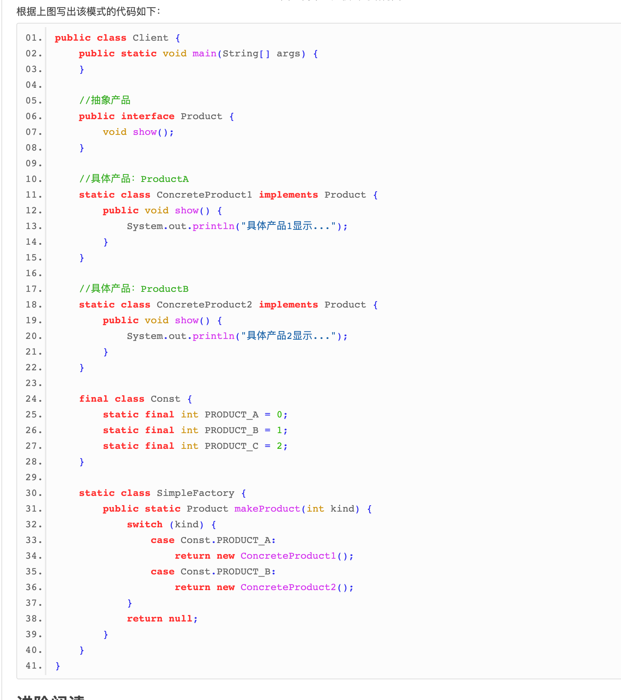
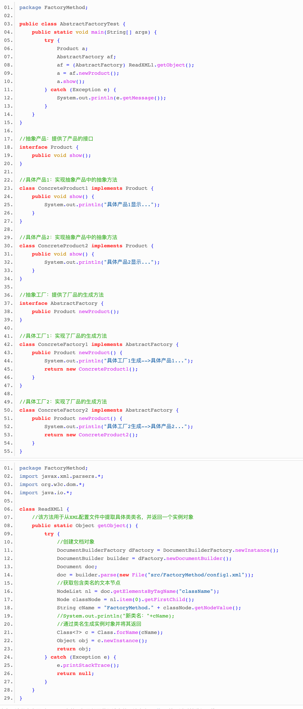
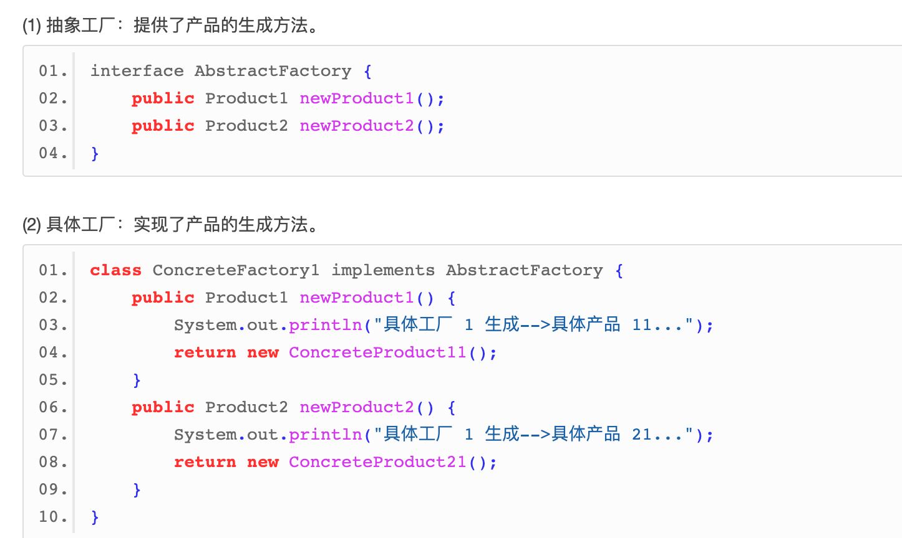
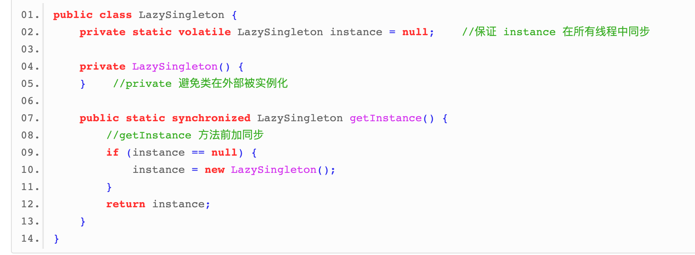
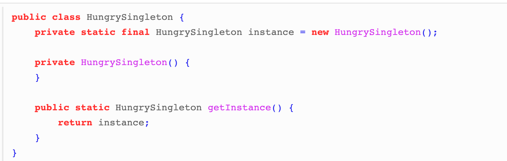
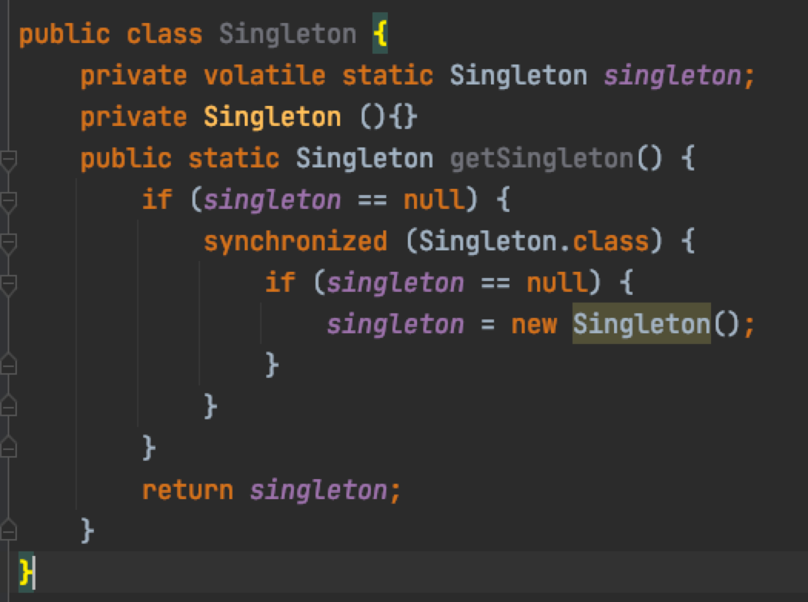
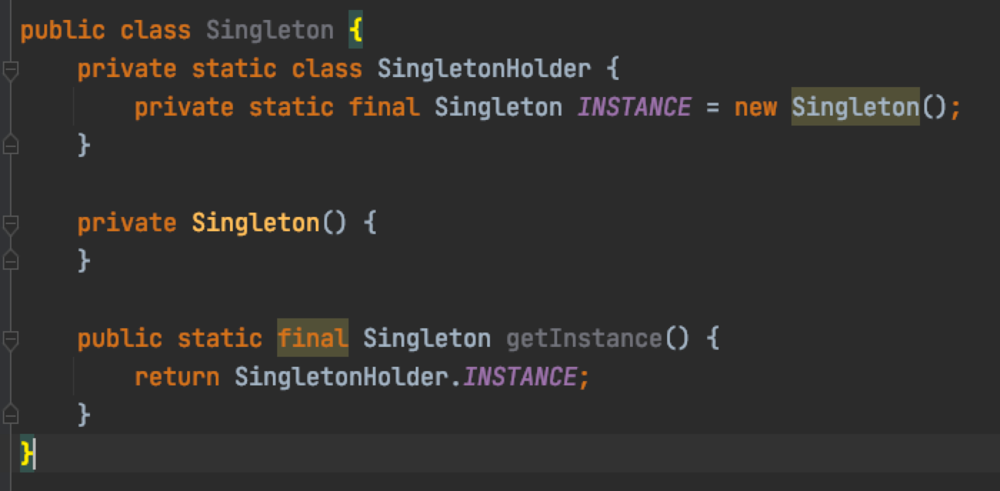

# 设计模式
## 简单工厂模式
定义一个创建产品对象的工厂接口，将产品对象的实际创建工作推迟到具体子工厂类当中

- 优缺点
  - 优点
    - 工厂类包含必要的逻辑判断，可以决定在什么时候创建哪一个产品的实例。客户端可以免除直接创建产品对象的职责，很方便的创建出相应的产品。工厂和产品的职责区分明确。
    - 客户端无需知道所创建具体产品的类名，只需知道参数即可。
    - 也可以引入配置文件，在不修改客户端代码的情况下更换和添加新的具体产品类。
  - 缺点
    - 简单工厂模式的工厂类单一，负责所有产品的创建，职责过重，一旦异常，整个系统将受影响。且工厂类代码会非常臃肿，违背高聚合原则。
    - 使用简单工厂模式会增加系统中类的个数（引入新的工厂类），增加系统的复杂度和理解难度
    - 系统扩展困难，一旦增加新产品不得不修改工厂逻辑，在产品类型较多时，可能造成逻辑过于复杂
    - 简单工厂模式使用了 static 工厂方法，造成工厂角色无法形成基于继承的等级结构。
## 工厂模式
			
- 优缺点
  - 优点
    - 用户只需要知道具体工厂的名称就可得到所要的产品，无须知道产品的具体创建过程。
    - 灵活性增强，对于新产品的创建，只需多写一个相应的工厂类。
    - 典型的解耦框架。高层模块只需要知道产品的抽象类，无须关心其他实现类，满足迪米特法则、依赖倒置原则和里氏替换原则。
  - 缺点
    - 类的个数容易过多，增加复杂度
    - 增加了系统的抽象性和理解难度
    - 抽象产品只能生产一种产品，此弊端可使用抽象工厂模式解决。
## 抽象工厂模式

是一种为访问类提供一个创建一组相关或相互依赖对象的接口，且访问类无须指定所要产品的具体类就能得到同族的不同等级的产品的模式结构
- 优缺点
  - 优点
    - 可以在类的内部对产品族中相关联的多等级产品共同管理，而不必专门引入多个新的类来进行管理。
    - 当需要产品族时，抽象工厂可以保证客户端始终只使用同一个产品的产品组。
    - 抽象工厂增强了程序的可扩展性，当增加一个新的产品族时，不需要修改原代码，满足开闭原则。
  - 缺点
    - 当产品族中需要增加一个新的产品时，所有的工厂类都需要进行修改。增加了系统的抽象性和理解难度。
## 单例模式
类只有一个实例，且该类能自行创建这个实例的一种模式
### 懒汉式单例

该模式的特点是类加载时没有生成单例，只有当第一次调用 getlnstance 方法时才去创建这个单例
### 饿汉式单例
				
该模式的特点是类一旦加载就创建一个单例，保证在调用 getInstance 方法之前单例已经存在了。
### 双检锁/双重校验锁（DCL，即 double-checked locking）

### 登记式/静态内部类

## 建造者模式
## 原型模式
## 适配器模式
## 装饰器模式
		装饰器模式（Decorator Pattern）允许向一个现有的对象添加新的功能，同时又不改变其结构
		代码
			
			
			
			
			
## 代理模式
## 外观模式
## 桥接模式
## 组合模式
## 享元模式
## 策略模式
		在策略模式（Strategy Pattern）中，一个类的行为或其算法可以在运行时更改
		代码
			
			
			
			
## 模板方法模式
## 观察者模式
## 迭代子模式
## 责任链模式
## 备忘录模式
## 状态模式
## 访问者模式
## 中介者模式
## 解释器模式